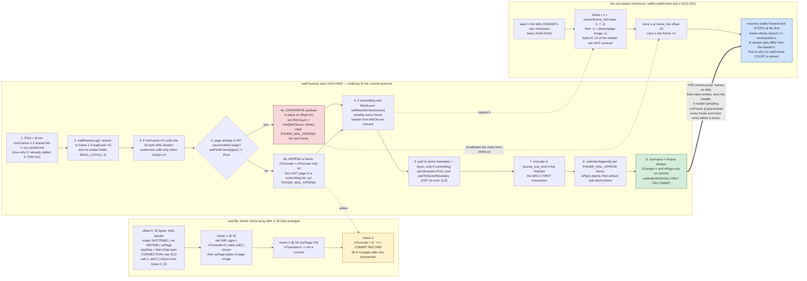
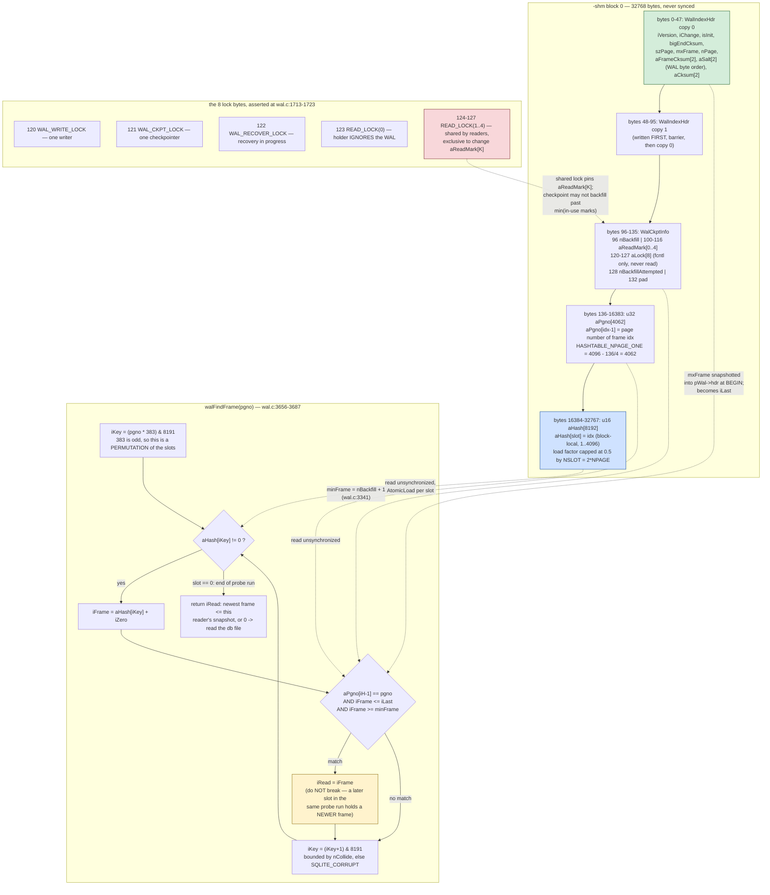

<!--
entry-meta
date: 2026-10-04
type: lesson
track: SQLite
lesson: 19
category: Database Internals
title: The WAL and Its Index — Frame Append, a Hash That Is a Permutation, and Five Read Marks
slug: sqlite-wal-frames-walindex-readmarks
-->

# The WAL and Its Index — Frame Append, a Hash That Is a Permutation, and Five Read Marks

**2026-10-04 · SQLite Track · Lesson 19 of 33**

## Where This Fits

- **Previous lesson:** [Lesson 18](../2026-10-03-sqlite-vfs-locking-styles-inode-emulation/README.md) opened the two dispatch tables and established the `xShmMap`/`xShmLock`/`xShmBarrier`/`xShmUnmap` slots, which VFSes leave them null, and the exact line ordering inside `sqlite3PagerWalSupported()`. It deliberately did **not** touch the `-shm` file's contents. This lesson is that content.
- **Lessons 15–17** established the five lock levels and their byte offsets, the rollback-journal commit sequence, and the `aMJNeeded[]` matrix that silently disables cross-file atomicity in WAL mode. **This lesson does not re-teach those.** It takes as given that in WAL mode the database file never rises above `SHARED` and that write exclusion has moved into the `-shm` file.
- **What this lesson adds:** the 32-byte WAL header and 24-byte frame header with the running checksum chain that links every frame to the one before it; `walFrames()` end to end, including the in-place frame overwrite and the `iReCksum`/`walRewriteChecksums()` repair that follows it; the wal-index's 32 KiB page layout, `HASHTABLE_NPAGE_ONE`, and the two header copies; why `walHash()` is a *permutation* of the 8192 slots rather than a hash in any useful sense, and what therefore actually collides; `walIndexAppend()` and `walCleanupHash()`; why `walFindFrame()` keeps scanning after it finds a match; the five `aReadMark[]` slots and the `WAL_READ_LOCK(i)` bytes that protect them; `walTryBeginRead()`'s mark selection, the `aReadMark[0]` shortcut and its two re-validation `memcmp`s; the one `memcmp` in `sqlite3WalBeginWriteTransaction()` that *is* `SQLITE_BUSY_SNAPSHOT`; and `walRestartHdr()`, which rewinds the WAL and increments a checkpoint counter that turns out not to be global.
- **Next:** [Lesson 20](../../../TRACK.md) takes checkpointing — `walCheckpoint()`, the `WalIterator` and its two algorithms, `wal_autocheckpoint`, and the `FULL`/`RESTART`/`TRUNCATE` modes. This lesson supplies `nBackfill`, `nBackfillAttempted` and the read-mark floor that bounds how far a checkpoint may go; it measures that floor from the outside but does not open `walCheckpoint()`.

Source read by file and line through a code index during this run, at commit `9696acb0` and re-read at `ccbdec84` (identical line numbering for every region cited). Measurements are against the **system `libsqlite3` 3.45.1** on x86-64 Linux 6.18, ext4, `page_size=1024` unless stated. Where source and measurement disagree, §13 says so.

---

## 1. Two Files, and Only One of Them Is Durable

WAL mode adds two files beside the database. They are not two halves of one thing; they have opposite durability contracts.

| | `-wal` | `-shm` |
|---|---|---|
| Holds | page images, as frames | an index over those frames, plus lock bytes |
| Written by | `xWrite` on `Wal.pWalFd` | stores into a shared memory mapping |
| Synced | yes, at commit when `synchronous=FULL` | **never** |
| Survives a crash | yes | treated as garbage; rebuilt by `walIndexRecover()` |
| Size | `32 + mxFrame × (szPage + 24)` bytes | a multiple of `WALINDEX_PGSZ` = 32768 |
| Can be absent | no | **yes** — see §14 |

The `-shm` file is a cache with a lock table embedded in it. Nothing in it is authoritative: every number it holds can be recomputed by reading the `-wal` file from the front. That is what makes the next section's checksum chain load-bearing — it is the only thing standing between a torn write and a recovery that accepts garbage.

## 2. The WAL File: Two Headers and One Chain

`WAL_HDRSIZE` is 32 and `WAL_FRAME_HDRSIZE` is 24 (`wal.c:477-480`). Frame *i* (1-based) begins at

```c
#define walFrameOffset(iFrame, szPage) (                               \
  WAL_HDRSIZE + ((iFrame)-1)*(i64)((szPage)+WAL_FRAME_HDRSIZE)         \
)
```
— `wal.c:498-500`. There is no padding and no alignment slack: the file is a dense array of frames after a 32-byte prologue, so the frame count is a pure function of the file size.

**WAL header, 32 bytes, all big-endian:**

| Off | Size | Field | Notes |
|----:|-----:|-------|-------|
| 0 | 4 | magic | `0x377f0682` (little-endian frame checksums) or `0x377f0683` (big-endian). `#define WAL_MAGIC 0x377f0682`, `wal.c:491`; the LSB is `SQLITE_BIGENDIAN`, set at `wal.c:4178` |
| 4 | 4 | format version | `3007000` |
| 8 | 4 | page size | |
| 12 | 4 | checkpoint sequence | `pWal->nCkpt` — see §12, it is not what it looks like |
| 16 | 4 | salt-1 | incremented by 1 on every WAL reset |
| 20 | 4 | salt-2 | re-randomized on every WAL reset |
| 24 | 8 | checksum | over bytes 0–23, computed with `nativeCksum=1` (`wal.c:4184`) |

**Frame header, 24 bytes, all big-endian** (`walEncodeFrame`, `wal.c:1001-1025`):

| Off | Size | Field | Notes |
|----:|-----:|-------|-------|
| 0 | 4 | page number | |
| 4 | 4 | `nTruncate` | **non-zero means this frame commits a transaction**, and the value is the database size in pages after that commit. Zero otherwise. This single field is the commit record |
| 8 | 8 | salt-1, salt-2 | copied verbatim from the WAL header |
| 16 | 8 | checksum | cumulative, see below |

### The chain

`walChecksumBytes()` (`wal.c:888-944`) is a two-word Fibonacci-weighted sum over 32-bit words:

```
s1 += x[i]   + s2;
s2 += x[i+1] + s1;
```

Two things make it a *chain* rather than a per-frame checksum. First, `walEncodeFrame` seeds it with `pWal->hdr.aFrameCksum` — the previous frame's output — and runs it over two disjoint regions in order:

```c
walChecksumBytes(nativeCksum, aFrame, 8, aCksum, aCksum);          /* frame hdr bytes 0..7  */
walChecksumBytes(nativeCksum, aData, pWal->szPage, aCksum, aCksum); /* then the page image   */
```
— `wal.c:1017-1018`. Only the first 8 bytes of the frame header are covered: page number and `nTruncate`. The salts and the checksum itself are not. Second, the chain's initial value is the *WAL header's own* checksum (`wal.c:4190-4191`), so frame 1 is cryptographically — well, arithmetically — bound to the header that declares the page size and salts.

The consequence is the one that matters for recovery: a frame is valid only if every frame before it is valid. Recovery stops at the first frame whose checksum does not continue the chain, and that is the end of the WAL. There is no need for a "valid frames" count on disk, which is exactly why there is no such field in the header.

The salts are the second line of defence, and they catch a different failure: a WAL that was reset and partially overwritten. Old frames past the new write point still carry the *old* salts, so `walDecodeFrame` rejects them on a salt mismatch before the checksum is even consulted.

**Measured** (Hands-On A): the 32-byte header checksum, and the full 383-frame chain of a spilling transaction, recomputed from the file bytes in Python with no reference to SQLite's own code, matched at every frame.

## 3. `walFrames()`: the Append Path

`sqlite3WalFrames()` (`wal.c:4361`) is a thin SEH wrapper around `walFrames()` (`wal.c:4124`). The caller is the pager, with a dirty-page list, and `isCommit` set only when this frame set finishes a transaction. The sequence:

1. **Snapshot the live header** (`wal.c:4157-4160`). If the shared wal-index header differs from this connection's cached copy, set `iFirst = pLive->mxFrame + 1`. Since this connection holds the WRITE lock, the only way the two can differ is that *this* connection already spilled frames in this transaction — `walIndexWriteHdr()` runs only on commit. So `iFirst` means "the first frame belonging to my own uncommitted transaction".
2. **Maybe rewind** — `walRestartLog()` (§12).
3. **Write the WAL header if `mxFrame == 0`** (`wal.c:4174-4211`). Salts are randomized only when `pWal->nCkpt == 0` (`wal.c:4182`); otherwise the salts already in `pWal->hdr.aSalt` are reused, which is how `walRestartHdr()`'s increment survives into the file. `truncateOnCommit` is set here, and the header is `fsync`ed if `syncHeader` (§13).
4. **Write each dirty page as a frame**, in dirty-list order (`wal.c:4226-4259`). `nDbSize` is `nTruncate` only for the *last* page of a committing list (`wal.c:4253`) — one commit record per transaction, on the final frame.
5. **Repair checksums** if anything was overwritten in place (§4).
6. **Pad and sync** if committing and `synchronous=FULL` (§13).
7. **Truncate** to `journal_size_limit` if this completed the WAL's first transaction (`wal.c:4306-4313`).
8. **Append to the wal-index** (`wal.c:4320-4331`), one `walIndexAppend()` per frame that actually got appended — marked by the `PGHDR_WAL_APPEND` flag set in step 4.
9. **Publish** (`wal.c:4333-4348`). `pWal->hdr.mxFrame = iFrame` always; `iChange++` and `nPage = nTruncate` only on commit; and `walIndexWriteHdr()` — the step that makes the frames visible to every other connection — **only on commit**.

Step 8 is worth dwelling on. The comment at `wal.c:4315-4318` justifies doing it without any extra lock: the WRITE lock excludes other writers, and appending only ever writes to `aPgno[]`/`aHash[]` entries above every reader's `mxFrame`. Readers are reading the same memory concurrently, unsynchronized, and that is deliberate — §8 explains what `walFindFrame()` does about it.



The ordering of steps 8 and 9 is the commit point. Frames are on disk, then the index entries, then the header. A reader that samples the header gets a value of `mxFrame` for which all index entries and all frames already exist.

## 4. Overwriting a Frame, and the Checksum Debt It Creates

A long transaction that spills, then dirties the same page again, does **not** append a second frame for it. `walFrames()` looks the page up in its own uncommitted range and overwrites the existing frame's payload in place:

```c
if( iFirst && (p->pDirty || isCommit==0) ){
  u32 iWrite = 0;
  VVA_ONLY(rc =) walFindFrame(pWal, p->pgno, &iWrite);
  if( iWrite>=iFirst ){
    i64 iOff = walFrameOffset(iWrite, szPage) + WAL_FRAME_HDRSIZE;
    if( pWal->iReCksum==0 || iWrite<pWal->iReCksum ) pWal->iReCksum = iWrite;
    rc = sqlite3OsWrite(pWal->pWalFd, pData, szPage, iOff);
    p->flags &= ~PGHDR_WAL_APPEND;
    continue;
  }
}
```
— `wal.c:4233-4249`. Note the offset: `+ WAL_FRAME_HDRSIZE`. Only the page image is rewritten; the 24-byte header is left alone. The frame keeps its page number and its `nTruncate`, both of which are still correct.

But its checksum is now wrong, and so is every checksum after it, because the chain is cumulative. That debt is recorded as `pWal->iReCksum` — the lowest overwritten frame — and paid at commit by `walRewriteChecksums()` (`wal.c:4075`), which re-reads and rewrites frame headers from `iReCksum` through the last frame. While the debt is outstanding, `walEncodeFrame` stops even pretending: `if (pWal->iReCksum == 0) { ...compute... } else { memset(&aFrame[8], 0, 16); }` (`wal.c:1013-1024`). Frames written during a transaction that has already overwritten something get **zeroed salts and zeroed checksums** — unmistakably invalid, so a crash mid-transaction leaves a WAL that recovery truncates at exactly the right place rather than one with plausible-looking garbage.

**Measured** (Hands-On C), `cache_size=10`, one transaction inserting 1499 rows then updating 59 of them:

```
mxFrame = 383
file size = 401416    expected 32 + 383*1048 = 401416
frames in file: 383   chain failures: 0   commit frames: 2
24-byte pwrite64 to -wal : 764      (383 appends + 381 checksum rewrites)
1024-byte pwrite64 to -wal: 407     (383 appends + 24 in-place overwrites)
integrity_check: ok
```

407 page writes for 383 frames: 24 pages were rewritten in place rather than appended. 764 frame-header writes for 383 frames: `walRewriteChecksums()` rebuilt 381 of them at commit. And **2** commit frames for the whole run — `CREATE TABLE` and the one big transaction — confirming that `nTruncate` marks transactions, not frames.

## 5. The Wal-Index Layout

The `-shm` file is a sequence of `WALINDEX_PGSZ` blocks:

```c
#define HASHTABLE_NPAGE      4096                 /* Must be power of 2 */
#define HASHTABLE_HASH_1     383                  /* Should be prime */
#define HASHTABLE_NSLOT      (HASHTABLE_NPAGE*2)  /* Must be a power of 2 */
#define HASHTABLE_NPAGE_ONE  (HASHTABLE_NPAGE - (WALINDEX_HDR_SIZE/sizeof(u32)))
#define WALINDEX_PGSZ   (                                         \
    sizeof(ht_slot)*HASHTABLE_NSLOT + HASHTABLE_NPAGE*sizeof(u32) \
)
```
— `wal.c:647-661`. With `WALINDEX_HDR_SIZE` = 136 (`wal.c:474`), `HASHTABLE_NPAGE_ONE` = 4096 − 34 = **4062**, and `WALINDEX_PGSZ` = 2×8192 + 4×4096 = **32768**. The whole point of the odd 4062 is in the comment at `wal.c:651-655`: shrinking the first block's page-number array by exactly the header size keeps every hash table on an aligned 32 KiB boundary.

Note the naming discrepancy: the published format document calls this constant `HASHTABLE_NPAGE_FIRST`; the source calls it `HASHTABLE_NPAGE_ONE`. Same 4062.

Block 0:

```
   0 .. 47    WalIndexHdr   copy 0
  48 .. 95    WalIndexHdr   copy 1
  96 .. 135   WalCkptInfo   (nBackfill, 5 read marks, 8 lock bytes, nBackfillAttempted, pad)
 136 .. 16383 u32 aPgno[4062]      frame -> page number
16384 .. 32767 u16 aHash[8192]     slot  -> frame index within this block
```

Blocks 1, 2, …: `u32 aPgno[4096]` then `u16 aHash[8192]`.

**`WalIndexHdr`** (`wal.c:321-333`) is 48 bytes: `iVersion`, unused padding, `iChange`, `isInit`, `bigEndCksum`, `szPage` (a `u16`, with 1 standing in for 65536), `mxFrame`, `nPage`, `aFrameCksum[2]`, `aSalt[2]`, `aCksum[2]`.

It is stored **twice**, and `walIndexWriteHdr()` (`wal.c:974-986`) writes the copies in a specific order:

```c
memcpy((void*)&aHdr[1], &pWal->hdr, sizeof(WalIndexHdr));   /* copy 1 first  */
walShmBarrier(pWal);
memcpy((void*)&aHdr[0], &pWal->hdr, sizeof(WalIndexHdr));   /* copy 0 second */
```

A reader compares the two and accepts only if they agree and the internal `aCksum` validates. Copy 1 is written first so that a reader seeing a valid copy 0 knows copy 1 was already complete — the pair is a torn-write detector for a region that is never synced and has no locking.

One detail that is visible from outside and easy to get wrong: `aSalt[2]` is `memcpy`'d from the WAL file bytes (`wal.c:1489`), so it stays in **WAL byte order** — big-endian — inside a structure every other field of which is native-endian. **Measured**: the same salt read as `0x26ee4254` from the WAL header appears as `0x5442ee26` when the `-shm` field is read little-endian. Those are the same four bytes.

**`WalCkptInfo`** (`wal.c:394-400`) is the mutable part:

| Off | Field | Who may write it |
|----:|-------|------------------|
| 96 | `nBackfill` | increased only under `WAL_CKPT_LOCK`; reset to 0 by a WRITE-lock holder on reset (`wal.c:343-346`) |
| 100 | `aReadMark[0]` | never used; a placeholder so indexes need no ±1 (`wal.c:361-363`). Its value is always 0 |
| 104–116 | `aReadMark[1..4]` | only by a holder of an **exclusive** `WAL_READ_LOCK(K)` (`wal.c:367-370`) |
| 120–127 | `aLock[8]` | **never read or written** — `fcntl` targets only (`wal.c:355-356`) |
| 128 | `nBackfillAttempted` | set *before* backfilling; may exceed `nBackfill` after a checkpoint crash |
| 132 | unused | |

The eight lock bytes are asserted into place, not merely documented (`wal.c:1713-1723`):

```c
assert(     5 ==  WAL_NREADER          );
assert(   123 ==  WALINDEX_LOCK_OFFSET + WAL_READ_LOCK(0) );
...
assert(   127 ==  WALINDEX_LOCK_OFFSET + WAL_READ_LOCK(4) );
```

So: byte 120 WRITE, 121 CKPT, 122 RECOVER, 123–127 the five read locks, with `WAL_READ_LOCK(I) = 3+I` and `WAL_NREADER = SQLITE_SHM_NLOCK - 3 = 5` (`wal.c:294-299`).

## 6. `walHash()` Is a Permutation, Not a Hash

```c
static int walHash(u32 iPage){
  assert( iPage>0 );
  assert( (HASHTABLE_NSLOT & (HASHTABLE_NSLOT-1))==0 );
  return (iPage*HASHTABLE_HASH_1) & (HASHTABLE_NSLOT-1);
}
static int walNextHash(int iPriorHash){
  return (iPriorHash+1)&(HASHTABLE_NSLOT-1);
}
```
— `wal.c:1170-1177`. Multiply by 383, mask to 13 bits, linear probing forward.

383 is odd, so multiplication by 383 is **invertible modulo 2^13**. That is not a detail about hash quality; it changes what the function is. `p1*383 ≡ p2*383 (mod 8192)` holds if and only if `p1 ≡ p2 (mod 8192)`. The map is a bijection on residues, so:

- **Distinct page numbers never share a slot** unless they differ by a multiple of 8192.
- The table's load factor is capped at exactly **0.5** by construction, because `HASHTABLE_NSLOT = 2 × HASHTABLE_NPAGE` and one table indexes at most `HASHTABLE_NPAGE` frames.
- Therefore the probe sequences that actually occur come from one of two sources: the **same page appearing in several frames** (the common case, and the whole reason the WAL exists), or pages exactly 8192 apart landing together.

**Measured** (Hands-On B): `383^-1 mod 8192 = 7807`; pages 0..8191 hit 8192 distinct slots with zero collisions; distinct pages 1..4096 in one table give a maximum slot occupancy of 1 at load factor 0.5.

It follows that this is not a hash function trying to spread arbitrary keys. It is an indexing scheme for a dense, small, integer key space, where the designer knows the load factor in advance and uses the cheapest injective scramble available. §Where This Breaks Down returns to what that costs.

`walHashGet()` (`wal.c:1205-1230`) resolves a block index to pointers and a frame offset:

```c
pLoc->aHash = (volatile ht_slot *)&pLoc->aPgno[HASHTABLE_NPAGE];
if( iHash==0 ){
  pLoc->aPgno = &pLoc->aPgno[WALINDEX_HDR_SIZE/sizeof(u32)];
  pLoc->iZero = 0;
}else{
  pLoc->iZero = HASHTABLE_NPAGE_ONE + (iHash-1)*HASHTABLE_NPAGE;
}
```

`iZero` is the frame number just before this block's first frame, so `idx = iFrame - iZero` is a block-local 1-based index — and that `idx`, not the frame number, is what goes in a `u16` hash slot. That is why `ht_slot` can be 16 bits at all: it only ever has to hold 1..4096.

`walFramePage()` (`wal.c:1235-1248`) inverts it: `iHash = (iFrame + HASHTABLE_NPAGE - HASHTABLE_NPAGE_ONE - 1) / HASHTABLE_NPAGE`, followed by five `assert`s pinning the boundary cases.

## 7. `walIndexAppend()`

```c
idx = iFrame - sLoc.iZero;
if( idx==1 ){                      /* first entry in this block: zero it all */
  int nByte = (int)((u8*)&sLoc.aHash[HASHTABLE_NSLOT] - (u8*)sLoc.aPgno);
  memset((void*)sLoc.aPgno, 0, nByte);
}
if( sLoc.aPgno[idx-1] ){           /* a previous writer died mid-transaction */
  walCleanupHash(pWal);
}
nCollide = idx;
for(iKey=walHash(iPage); sLoc.aHash[iKey]; iKey=walNextHash(iKey)){
  if( (nCollide--)==0 ) return SQLITE_CORRUPT_BKPT;
}
sLoc.aPgno[(idx-1)&(HASHTABLE_NPAGE-1)] = iPage;
AtomicStore(&sLoc.aHash[iKey], (ht_slot)idx);
```
— `wal.c:1347-1376`. Four things are doing real work here.

- **Lazy zeroing.** A 32 KiB block is zeroed only when its first frame arrives. Nothing pre-initializes the `-shm` file beyond its header.
- **`aPgno[idx-1]` being non-zero is a diagnosis, not an error.** It means a previous writer appended frames and then vanished without committing. The index entries are still there; `walCleanupHash()` (`wal.c:1271-1326`) removes every `aHash[]` slot whose value exceeds `mxFrame - iZero` and `memset`s the tail of `aPgno[]`. Because `mxFrame` only ever advances past those frames when they are legitimately rewritten, at most one block needs cleaning (`wal.c:1266-1269`).
- **`nCollide = idx` bounds the probe by the number of entries already in the block.** A full-table scan is impossible by construction, and a probe run longer than the population is proof of corruption, not bad luck.
- **Write order: `aPgno[]` plainly, then `aHash[]` with `AtomicStore`.** A reader that sees the hash slot is guaranteed to see the page number behind it. The reverse order would hand readers a slot pointing at an unwritten `aPgno[]` entry.

## 8. `walFindFrame()`: Why the Reader Does Not Stop at the First Match

```c
iMinHash = walFramePage(pWal->minFrame);
for(iHash=walFramePage(iLast); iHash>=iMinHash; iHash--){
  nCollide = HASHTABLE_NSLOT;
  iKey = walHash(pgno);
  while( (iH = AtomicLoad(&sLoc.aHash[iKey]))!=0 ){
    u32 iFrame = iH + sLoc.iZero;
    if( iFrame<=iLast
     && iFrame>=pWal->minFrame
     && sLoc.aPgno[(iH-1)&(HASHTABLE_NPAGE-1)]==pgno
    ){
      assert( iFrame>iRead || CORRUPT_DB );
      iRead = iFrame;
    }
    if( (nCollide--)==0 ){ *piRead = 0; return SQLITE_CORRUPT_BKPT; }
    iKey = walNextHash(iKey);
  }
  if( iRead ) break;
}
```
— `wal.c:3656-3687`. Three predicates, each for a different reason, and they are documented as being *deliberately stricter than necessary* (`wal.c:3645-3655`):

- `aPgno[...] == pgno` filters ordinary probe collisions.
- `iFrame <= iLast` discards frames appended **after this reader's snapshot was taken**. This is the snapshot isolation. The reader's `mxFrame` is a private copy; the index it is reading is live and growing underneath it.
- `iFrame >= pWal->minFrame` discards frames already backfilled into the database, which the reader can get more cheaply from the database file itself. `minFrame` is set to `nBackfill+1` in `walTryBeginRead()` (`wal.c:3341`).

The loop does **not** break on a match. It keeps walking the probe run, overwriting `iRead` each time, because `walIndexAppend()` appends later frames to *later* slots in the same run — so the last match in the run is the newest version of the page. The `assert( iFrame>iRead )` states that invariant. Blocks are searched newest-first and the loop exits on the first block that yields anything.

Why unsynchronized reads of a concurrently-mutated hash table are safe: every slot a reader can legitimately accept was written before its snapshot was taken, and the two frame-range predicates reject exactly the slots that might be mid-write. A garbage slot is not merely unlikely — it is rejected by `iFrame <= iLast`.

**Measured** (Hands-On B), a 14-frame WAL in which page 1 appears in frames 1 and 3 and page 2 in frames 2 and 4:

```
aPgno[0..7] (frame -> pgno): [(1,1),(2,2),(3,1),(4,2),(5,3),(6,4),(7,5),(8,6)]
non-zero aHash slots (14): [(383,1),(384,3),(766,2),(767,4),(1149,5),(1532,6),(1915,7),(2298,8)]
  frame 1 pgno 1: walHash=383, aHash[383]=1
  frame 3 pgno 1: walHash=383, aHash[384]=3
```

Slot 383 holds frame 1; the probe lands frame 3 in slot 384. A reader looking for page 1 at `iLast=14` walks 383 → 384, matches both, and returns **3**. A reader whose snapshot is `iLast=2` matches only slot 383 and returns 1. The two readers get different versions of page 1 out of the same live table with no locking between them. That is the whole concurrency story in two slots.

The count also confirms the invariant `walIndexAppend()` asserts under `SQLITE_ENABLE_EXPENSIVE_ASSERT`: 14 non-zero hash slots for `mxFrame = 14`.

## 9. Five Read Marks, and What a Mark Actually Is

A read mark is a published promise: *some reader may be using frames up to this number, so do not overwrite them.* Its enforcement is the pairing of two things — the `u32` value in `aReadMark[K]` and a shared `fcntl` lock on byte `120 + 3 + K`.

The rules (`wal.c:358-382`):

- `aReadMark[K]` may be modified only while holding `WAL_READ_LOCK(K)` **exclusively**. A reader using mark *K* holds it **shared**. So the value cannot change under a reader — the lock mode is the whole synchronization mechanism, and no separate mutex exists.
- `aReadMark[0]` is a placeholder whose value is always 0. A reader holding `WAL_READ_LOCK(0)` ignores the WAL entirely and reads everything from the database file.
- `READMARK_NOT_USED` is `0xffffffff`.
- A checkpointer may backfill only up to the **minimum** `aReadMark[j]` over all *in-use* marks. "In use" means a reader holds `WAL_READ_LOCK(j)`, which the checkpointer discovers by trying to take it exclusively.
- 32-bit loads are assumed atomic, so reading a mark needs no lock (`wal.c:391-392`).

Five marks means **at most four distinct snapshots** can pin the WAL at once (mark 0 pins nothing). A fifth concurrent reader does not fail; it shares the nearest existing mark, which simply gives it a slightly older snapshot than it could have had.

## 10. `walTryBeginRead()`: Picking a Mark

`wal.c:3102-3354`. After header validation and possible recovery, the body is three stages.

**Stage 1 — the shortcut** (`wal.c:3216-3249`). If `nBackfill == pWal->hdr.mxFrame`, the entire WAL is already in the database file, so take `WAL_READ_LOCK(0)` and read nothing from the WAL. Then immediately re-check:

```c
if( memcmp((void *)walIndexHdr(pWal), &pWal->hdr, sizeof(WalIndexHdr)) ){
  walUnlockShared(pWal, WAL_READ_LOCK(0));
  return WAL_RETRY;
}
```

The comment (`wal.c:3228-3240`) gives the precise hazard: holding `READ_LOCK(0)` asserts the *database file* is a trustworthy snapshot. If frames were appended before the lock was acquired, a checkpointer could have started backfilling them and crashed, leaving a torn image in the file. Taking the lock prevents future checkpoints; it says nothing about one already in flight.

**Stage 2 — select or allocate** (`wal.c:3256-3291`):

```c
for(i=1; i<WAL_NREADER; i++){
  u32 thisMark = AtomicLoad(pInfo->aReadMark+i);
  if( mxReadMark<=thisMark && thisMark<=mxFrame ){ mxReadMark = thisMark; mxI = i; }
}
if( (pWal->readOnly & WAL_SHM_RDONLY)==0 && (mxReadMark<mxFrame || mxI==0) ){
  for(i=1; i<WAL_NREADER; i++){
    rc = walLockExclusive(pWal, WAL_READ_LOCK(i), 1);
    if( rc==SQLITE_OK ){
      AtomicStore(pInfo->aReadMark+i, mxFrame);
      mxReadMark = mxFrame; mxI = i;
      walUnlockExclusive(pWal, WAL_READ_LOCK(i), 1);
      break;
    }else if( rc!=SQLITE_BUSY ) return rc;
  }
}
if( mxI==0 ) return rc==SQLITE_BUSY ? WAL_RETRY : SQLITE_READONLY_CANTINIT;
```

The best existing mark not exceeding this reader's `mxFrame` wins. If none equals `mxFrame`, try to claim a *free* mark and set it — "free" being decided by whether the exclusive lock succeeds, since an in-use mark is held shared by its reader. Failure to claim one is not an error; the reader proceeds with the best mark it found. A read-only connection on a read-only `-shm` cannot write marks at all, which is where `SQLITE_READONLY_CANTINIT` comes from.

**Stage 3 — lock, then verify twice** (`wal.c:3293-3351`):

```c
pWal->minFrame = AtomicLoad(&pInfo->nBackfill)+1;
walShmBarrier(pWal);
if( AtomicLoad(pInfo->aReadMark+mxI)!=mxReadMark
 || memcmp((void *)walIndexHdr(pWal), &pWal->hdr, sizeof(WalIndexHdr))
){
  walUnlockShared(pWal, WAL_READ_LOCK(mxI));
  return WAL_RETRY;
}
```

Two checks because there are two ways the ground can move between reading the header and locking the mark: a writer may have wrapped the log, or a checkpointer may have backfilled past `pWal->hdr.mxFrame`. Either makes the cached header describe a WAL that no longer exists. `WAL_RETRY` goes back to the top; `WAL_RETRY_PROTOCOL_LIMIT` (`wal.c:3033-3037`) eventually converts persistent retries into `SQLITE_PROTOCOL` rather than spinning forever.

The barrier between sampling `nBackfill` and the `memcmp` is load-bearing, and `wal.c:3327-3339` spells out the race it closes: it guarantees the checkpointer that set `nBackfill` could not have been working from a header newer than the one cached here, which is what makes "frames below `minFrame` are safe to read from the database file" sound.

**Measured** (Hands-On D), four readers opened at four successive commits, `wal_autocheckpoint=0`:

```
reader 1 open   mxFrame=3  nBackfill=0  aReadMark=['0','3','NOT_USED','NOT_USED','NOT_USED']
reader 2 open   mxFrame=4  nBackfill=0  aReadMark=['0','3','4','NOT_USED','NOT_USED']
reader 3 open   mxFrame=5  nBackfill=0  aReadMark=['0','3','4','5','NOT_USED']
reader 4 open   mxFrame=6  nBackfill=0  aReadMark=['0','3','4','5','6']
reader 5 open   mxFrame=7  nBackfill=0  aReadMark=['0','3','4','5','6']
```

Marks fill 1→4 with distinct snapshots. Reader 5 arrives at `mxFrame=7`, finds no free mark, and shares mark 4 at frame 6 — one commit stale, by design, silently.

And the floor on backfill, measured directly (Hands-On E):

```
old reader pinned                  mxFrame=3   nBackfill=0   aReadMark=['0','3','NU','NU','NU']
4 more commits                     mxFrame=10  nBackfill=0   aReadMark=['0','3','6','NU','NU']
  pragma wal_checkpoint(PASSIVE) -> (0, 10, 3)
after PASSIVE ckpt WITH old reader mxFrame=10  nBackfill=3   nBackfillAttempted=3
  old reader still sees count = 1
  pragma wal_checkpoint(PASSIVE) -> (0, 10, 10)
after PASSIVE ckpt, reader gone    mxFrame=10  nBackfill=10  nBackfillAttempted=10
```

`PASSIVE` returned `(busy=0, nLog=10, nCkpt=3)`: not busy, 10 frames in the log, **3 backfilled**. The checkpoint stopped exactly at `aReadMark[1] = 3`. One reader holding a seven-frame-old snapshot capped the checkpoint at 30% completion — and reported success while doing it. Releasing the reader let the next identical call reach 10.

After the checkpoint the marks collapse to `['0','10','NU','NU','NU']`, and a reader arriving when `nBackfill == mxFrame` takes mark 0:

```
after TRUNCATE checkpoint         mxFrame=0  nBackfill=0  aReadMark=['0','0','NOT_USED',...]
new reader, WAL fully backfilled  mxFrame=0  nBackfill=0  aReadMark=['0','0','NOT_USED',...]
```

No new mark appears, because stage 1 short-circuited.



## 11. The One `memcmp` That Is `SQLITE_BUSY_SNAPSHOT`

`sqlite3WalBeginWriteTransaction()` (`wal.c:3785-3832`) is short, and almost all of it is one test:

```c
rc = walLockExclusive(pWal, WAL_WRITE_LOCK, 1);
if( rc ) return rc;                      /* -> SQLITE_BUSY: another writer      */
pWal->writeLock = 1;
if( memcmp(&pWal->hdr, (void *)walIndexHdr(pWal), sizeof(WalIndexHdr))!=0 ){
  rc = SQLITE_BUSY_SNAPSHOT;             /* someone committed since my BEGIN     */
}
```

Two distinct failures with two distinct codes, and the difference matters operationally. `SQLITE_BUSY` on the lock means *a writer is active now* — retrying later can succeed. `SQLITE_BUSY_SNAPSHOT` means *this connection's read snapshot is stale* — retrying is futile until the read transaction is ended, because the snapshot is pinned to the one the connection already observed. A busy handler cannot resolve it; only `ROLLBACK` can. This is WAL mode's entire concurrency control for writes: no row locks, no predicate locks, just "has the wal-index header changed since I started reading".

Note also the precondition `assert( pWal->readLock>=0 )` (`wal.c:3800`): a write transaction is always nested inside a read transaction. There is no path that takes the WRITE lock without a snapshot first.

**Measured** (Hands-On E): a connection that opened a read transaction, then had another connection commit, then tried to insert:

```
stale reader upgrading to writer -> OperationalError 'database is locked'
                                    sqlite_errorname= SQLITE_BUSY_SNAPSHOT
```

The extended code is the only way to tell this apart from ordinary contention; the primary code and message are identical to plain `SQLITE_BUSY`. An application that retries on `"database is locked"` without checking the extended code will spin forever on this one.

## 12. WAL Reset — and a Checkpoint Counter That Is Not Global

`walRestartLog()` (`wal.c:3961-4001`) runs at the top of every `walFrames()` call. It does nothing unless `pWal->readLock == 0`, i.e. this writer's own read transaction took mark 0, which (per §10 stage 1) can only happen when `nBackfill == mxFrame`. So: everything is backfilled. If additionally no reader holds marks 1–4 — tested by grabbing all four exclusively in one call, `walLockExclusive(pWal, WAL_READ_LOCK(1), WAL_NREADER-1)` — the log is rewound.

```c
static void walRestartHdr(Wal *pWal, u32 salt1){
  u32 *aSalt = pWal->hdr.aSalt;
  pWal->nCkpt++;
  pWal->hdr.mxFrame = 0;
  sqlite3Put4byte((u8*)&aSalt[0], 1 + sqlite3Get4byte((u8*)&aSalt[0]));
  memcpy(&pWal->hdr.aSalt[1], &salt1, 4);
  walIndexWriteHdr(pWal);
  AtomicStore(&pInfo->nBackfill, 0);
  pInfo->nBackfillAttempted = 0;
  pInfo->aReadMark[1] = 0;
  for(i=2; i<WAL_NREADER; i++) pInfo->aReadMark[i] = READMARK_NOT_USED;
}
```
— `wal.c:2234-2248`. Salt-1 is **incremented by one** in big-endian; salt-2 is replaced with four fresh random bytes, which the caller generated (`sqlite3_randomness(4, &salt1)`, `wal.c:3970` — the local is called `salt1` but lands in `aSalt[1]`, which is salt-**2** on disk). Together they guarantee stale frames past the new write point can never be mistaken for live ones. The WAL file itself is **not truncated**; writing restarts at offset 32.

Then comes the part that is not obvious. `pWal->nCkpt` is assigned in exactly one place outside `walRestartHdr()`: `wal.c:1488`, inside `walIndexRecover()`, from the WAL header's bytes 12–15. A connection that opened a healthy WAL and never ran recovery therefore keeps a **private** counter starting at whatever it read once. `walFrames()` writes that private value into the file header on every restart (`wal.c:4181`).

**Measured** (Hands-On E): two different connections each triggered a reset. Salt-1 advanced `0xcec8a878 → 0xcec8a879` and salt-2 changed completely (`0xcaff79c3 → 0x620da983`), the file size stayed at 10512 bytes — rewound, not truncated — and `nBackfill` and `aReadMark[1]` reset to 0. But the on-disk checkpoint sequence stayed at **1** across both resets, because the second reset was performed by a connection whose own `nCkpt` was still 0.

So bytes 12–15 of the WAL header are not a global generation count and should not be read as one. Their only consumer is savepoint bookkeeping: `sqlite3WalSavepoint()` stores `pWal->nCkpt` in `aWalData[3]` (`wal.c:3909`) and `sqlite3WalSavepointUndo()` compares it to detect "the log wrapped after this savepoint was opened", in which case it rolls the savepoint's frame position back to 0 (`wal.c:3924-3931`). For that purpose a per-connection counter is sufficient, because only that connection's savepoints are being compared. It is adequate for its one job and misleading for any other.

## 13. Padding, Header Syncs, and Two Flags That Are Off Here

`sqlite3WalOpen()` initializes both flags optimistically and then clears them from the device characteristics (`wal.c:1752-1772`):

```c
pRet->syncHeader = 1;
pRet->padToSectorBoundary = 1;
...
int iDC = sqlite3OsDeviceCharacteristics(pDbFd);
if( iDC & SQLITE_IOCAP_SEQUENTIAL ){ pRet->syncHeader = 0; }
if( iDC & SQLITE_IOCAP_POWERSAFE_OVERWRITE ){ pRet->padToSectorBoundary = 0; }
```

[Lesson 16](../2026-10-01-sqlite-rollback-journal-atomic-commit/README.md) established what these two flags are, and [lesson 18](../2026-10-03-sqlite-vfs-locking-styles-inode-emulation/README.md) measured that on ordinary Linux ext4 `POWERSAFE_OVERWRITE` is **set** and `SEQUENTIAL` is **not**. Applying those facts here: `padToSectorBoundary` is 0 and `syncHeader` is 1 on this system. So the padding block at `wal.c:4283-4295` — which repeats the final commit frame until the next sector boundary so that only whole sectors are synced — is dead code on an ordinary Linux filesystem. It exists for devices that can scramble a partially-overwritten sector.

**Measured** (Hands-On F), four commits at `page_size=1024`, `strace -e trace=openat,fdatasync`:

| | frames in `-wal` | `fdatasync` on the `-wal` fd |
|---|---:|---:|
| `synchronous=NORMAL` | 5 | 4 |
| `synchronous=FULL` | 5 | 8 |

Two readings. **The frame count is identical** — five frames for four commits (one page-1 frame plus four commit frames on page 2), with no duplicated tail frames in either mode. That is `padToSectorBoundary == 0` confirmed from outside. And **`FULL` costs exactly one extra `fdatasync` of the `-wal` file per commit**: four commits, four extra syncs, nothing else different. That is `WAL_SYNC_FLAGS(sync_flags)` being zero at `NORMAL`, so the sync at `wal.c:4298` is skipped while everything else in `walFrames()` runs unchanged.

This is the concrete content of the WAL durability tradeoff. At `synchronous=NORMAL` a commit is `pwrite`s with no barrier: atomic and visible, but a power cut can lose recent transactions. The remaining four syncs in both columns belong to the one-time journal-mode conversion and the WAL header write.

## 14. The Wal-Index Without a File

The `-shm` file is not required. `walIndexPage()` (`wal.c:810-818`) has two paths:

```c
if( pWal->exclusiveMode==WAL_HEAPMEMORY_MODE ){
  pWal->apWiData[iPage] = (u32 volatile *)sqlite3MallocZero(WALINDEX_PGSZ);
}else{
  rc = sqlite3OsShmMap(pWal->pDbFd, iPage, WALINDEX_PGSZ, ...);
}
```

`WAL_HEAPMEMORY_MODE` is selected at open when `bNoShm` (`wal.c:1754`), and in that mode `walShmBarrier()` becomes a no-op (`wal.c:950-953`) and `walIndexClose()` frees the pages instead of unmapping them (`wal.c:1651-1661`). The wal-index becomes ordinary heap memory: identical layout, identical hash tables, zero sharing. The lock bytes are never touched because there is nobody to exclude.

This is the mechanism behind the `sqlite3PagerWalSupported()` short-circuit [lesson 18 measured](../2026-10-03-sqlite-vfs-locking-styles-inode-emulation/README.md): `locking_mode=EXCLUSIVE` makes WAL work on a VFS with no `xShmMap` at all.

**Measured** (Hands-On G), `file:h.db?vfs=unix-dotfile` with `locking_mode=EXCLUSIVE`:

```
locking_mode -> ('exclusive',)
journal_mode -> ('wal',)
files present: ['h.db', 'h.db-wal', 'h.db.lock']
7 frame slots of 4120 bytes ... all chain_ok=True
```

WAL mode, five committed transactions, a fully valid checksum chain — and **no `-shm` file in the directory at all**. (`h.db.lock` is the dotfile VFS's lock *directory*, nothing to do with the wal-index.) Every number the wal-index would have held existed only in this process's heap and vanished with it.

## Hands-On

Everything below ran against system `libsqlite3` 3.45.1 via Python's `sqlite3` module (same library version), x86-64 Linux 6.18, ext4. No `sqlite3` CLI is needed. Two helper decoders do all the work; neither calls into SQLite.

**One trap to know first:** closing the last connection to a WAL database checkpoints and deletes the `-wal` and `-shm` files. Every inspection below therefore happens **while a connection is still open**, from inside the same process. A script that writes, closes, and then looks at the files will find nothing.

### Helper 1 — `waldump.py`: decode the WAL and re-verify the whole chain

```python
import struct, sys

def cksum(data, native_be, s0=0, s1=0):
    n = len(data)//4
    fmt = ('>' if native_be else '<') + 'I'*n
    x = struct.unpack(fmt, data[:n*4])
    for i in range(0, n, 2):
        s0 = (s0 + x[i]   + s1) & 0xffffffff
        s1 = (s1 + x[i+1] + s0) & 0xffffffff
    return s0, s1

def dump(path, nmax=12):
    b = open(path,'rb').read()
    magic, ver, pgsz, nckpt, salt1, salt2, c1, c2 = struct.unpack('>8I', b[:32])
    be = (magic & 1) == 1
    print(f"-- {path}: {len(b)} bytes")
    print(f"WAL header: magic=0x{magic:08x} ({'big' if be else 'little'}-endian cksums) "
          f"version={ver} pgsz={pgsz} ckptSeq={nckpt} "
          f"salt1=0x{salt1:08x} salt2=0x{salt2:08x} cksum=({c1:#x},{c2:#x})")
    s0, s1 = cksum(b[:24], be)
    print(f"  header cksum recomputed over bytes 0..23: ({s0:#x},{s1:#x})  match={s0==c1 and s1==c2}")
    frame_sz = 24 + pgsz
    n = (len(b) - 32)//frame_sz
    run0, run1 = c1, c2                      # chain seeds on the HEADER's checksum
    for i in range(1, min(n, nmax)+1):
        off = 32 + (i-1)*frame_sz
        pgno, ntrunc, fs1, fs2, fc1, fc2 = struct.unpack('>6I', b[off:off+24])
        run0, run1 = cksum(b[off:off+8],        be, run0, run1)   # frame hdr bytes 0..7 only
        run0, run1 = cksum(b[off+24:off+24+pgsz], be, run0, run1) # then the page image
        print(f"  frame {i:3d} @0x{off:06x}: pgno={pgno:5d} nTrunc={ntrunc:5d} "
              f"salt_ok={fs1==salt1 and fs2==salt2} cksum=({fc1:#010x},{fc2:#010x}) "
              f"chain_ok={run0==fc1 and run1==fc2}"
              + ("  <-- COMMIT" if ntrunc else ""))
        if run0!=fc1 or run1!=fc2: run0, run1 = fc1, fc2
```

**What to look for:** `chain_ok=True` on every frame. That is the proof that the checksum is cumulative and seeded from the WAL header — if it were per-frame, seeding from zero would also work, and it does not. Also note which frames carry `nTruncate != 0`: exactly one per committed transaction, on its last frame.

### Helper 2 — `shmdump.py`: decode the wal-index

```python
import struct, sys
HDR=136; NPAGE=4096; NSLOT=8192
NPAGE_ONE = NPAGE - HDR//4          # 4062
PGSZ = 2*NSLOT + 4*NPAGE            # 32768

def hdr(b, off):
    iVersion, unused, iChange = struct.unpack('<3I', b[off:off+12])
    isInit, bigEnd, szPage    = struct.unpack('<2BH', b[off+12:off+16])
    mxFrame, nPage            = struct.unpack('<2I', b[off+16:off+24])
    return dict(iVersion=iVersion, iChange=iChange, isInit=isInit, bigEndCksum=bigEnd,
                szPage=szPage, mxFrame=mxFrame, nPage=nPage,
                aFrameCksum=struct.unpack('<2I', b[off+24:off+32]),
                aSalt=tuple(f"0x{s:08x}" for s in struct.unpack('<2I', b[off+32:off+40])),
                aCksum=struct.unpack('<2I', b[off+40:off+48]))

def dump(path, show_map=0):
    b=open(path,'rb').read()
    print(f"-- {path}: {len(b)} bytes  (WALINDEX_PGSZ={PGSZ}, HASHTABLE_NPAGE_ONE={NPAGE_ONE})")
    h0=hdr(b,0)
    print("  copy0:", h0); print("  copy1:", hdr(b,48))
    print("  two copies identical:", b[0:48]==b[48:96])
    nBackfill, = struct.unpack('<I', b[96:100])
    marks      = struct.unpack('<5I', b[100:120])
    nBfA, _    = struct.unpack('<2I', b[128:136])
    print(f"  nBackfill={nBackfill}  nBackfillAttempted={nBfA}")
    print(f"  aLock[120..127]={b[120:128].hex()}")
    for i,m in enumerate(marks):
        print(f"  aReadMark[{i}] @ offset {100+4*i:3d} = "
              f"{'NOT_USED' if m==0xffffffff else m}")
    if show_map:
        mx=h0['mxFrame']
        apgno=struct.unpack('<%dI'%NPAGE_ONE, b[HDR:HDR+4*NPAGE_ONE])
        ahash=struct.unpack('<%dH'%NSLOT, b[HDR+4*NPAGE_ONE:HDR+4*NPAGE_ONE+2*NSLOT])
        print("  aPgno (frame -> pgno):", [(i+1, apgno[i]) for i in range(min(mx, show_map))])
        nz=[(k,ahash[k]) for k in range(NSLOT) if ahash[k]]
        print(f"  non-zero aHash slots ({len(nz)}): {nz[:show_map]}")
        for i in range(min(mx, show_map)):
            p=apgno[i]; k=(p*383)%NSLOT
            print(f"    frame {i+1} pgno {p}: walHash={k}, aHash[{k}]={ahash[k]}")
```

**What to look for:** `two copies identical: True` (the torn-write detector agrees), `aLock[120..127]` all zero forever (SQLite never writes those bytes — they exist only as `fcntl` targets), and the `aSalt` values appearing **byte-swapped** relative to the WAL header, because that one field keeps WAL byte order inside an otherwise native-endian struct.

### A. The frame format and the checksum chain

```python
import sqlite3, subprocess
c=sqlite3.connect('t.db', isolation_level=None)
c.execute('pragma page_size=1024')
print('journal_mode ->', c.execute('pragma journal_mode=wal').fetchone())
c.execute('pragma synchronous=NORMAL')
c.execute('create table t(a integer primary key, b text)')
c.execute('begin'); c.execute("insert into t values(1,'alpha')"); c.execute('commit')
c.execute('begin'); c.execute("insert into t values(2,'beta')");  c.execute('commit')
c.execute('begin')
for i in range(3,40): c.execute("insert into t values(?,?)",(i,'x'*200))
c.execute('commit')
subprocess.run(['python3','waldump.py','t.db-wal'])     # connection still open
subprocess.run(['python3','shmdump.py','t.db-shm'])
```

Measured:

```
-- t.db-wal: 16800 bytes
WAL header: magic=0x377f0682 (little-endian cksums) version=3007000 pgsz=1024
            ckptSeq=0 salt1=0x26ee4254 salt2=0xbc50021c cksum=(0x2911f139,0xfcf0199a)
  header cksum recomputed over bytes 0..23: (0x2911f139,0xfcf0199a)  match=True
  16 frame slots of 1048 bytes
  frame   1 @0x000020: pgno=    1 nTrunc=    0 ... chain_ok=True
  frame   2 @0x000438: pgno=    2 nTrunc=    2 ... chain_ok=True  <-- COMMIT
  frame   3 @0x000850: pgno=    2 nTrunc=    2 ... chain_ok=True  <-- COMMIT
  frame   4 @0x000c68: pgno=    2 nTrunc=    2 ... chain_ok=True  <-- COMMIT
  frame   5 @0x001080: pgno=    1 nTrunc=    0 ... chain_ok=True
  ...
-- t.db-shm: 32768 bytes  (WALINDEX_PGSZ=32768, HASHTABLE_NPAGE_ONE=4062)
  copy0: {... 'szPage': 1024, 'mxFrame': 16, 'nPage': 12,
          'aSalt': ('0x5442ee26', '0x1c0250bc') ...}
  two copies identical: True
  nBackfill=0  nBackfillAttempted=0
  aLock[120..127]=0000000000000000
```

16800 = 32 + 16×1048 exactly. `0x26ee4254` in the WAL header is `0x5442ee26` in the `-shm` — the same four bytes, read with opposite endianness.

### B. `walHash()` is a permutation, and real collisions

First the arithmetic, with no database involved:

```python
NSLOT=8192; H=383
seen={}; coll=0
for p in range(NSLOT):
    k=(p*H)&(NSLOT-1)
    if k in seen: coll+=1
    seen[k]=p
print("distinct slots hit by p=0..8191:", len(seen), " collisions:", coll)
print("383^-1 mod 8192 =", pow(H,-1,NSLOT))
print("pages 1 and 8193 ->", (1*H)&8191, (8193*H)&8191)
import collections
c=collections.Counter(((p*H)&8191) for p in range(1,4097))
print("distinct pages 1..4096 in one table: max occupancy =", max(c.values()),
      " load factor =", 4096/NSLOT)
```

```
distinct slots hit by p=0..8191: 8192  collisions: 0
383^-1 mod 8192 = 7807
pages 1 and 8193 -> 383 383
distinct pages 1..4096 in one table: max occupancy = 1  load factor = 0.5
```

Then the live table. Create a database whose WAL contains page 1 twice and page 2 twice, and dump the mapping with `show_map`:

```python
c.execute('begin')
for i in range(1,40): c.execute("insert into t values(?,?)",(i,'x'*200))
c.execute('commit')
subprocess.run(['python3','shmdump.py','8','t.db-shm'])
```

```
  aPgno[0..7] (frame -> pgno): [(1,1),(2,2),(3,1),(4,2),(5,3),(6,4),(7,5),(8,6)]
  non-zero aHash slots (14): [(383,1),(384,3),(766,2),(767,4),(1149,5),(1532,6),(1915,7),(2298,8)]
    frame 1 pgno 1: walHash=383, aHash[383]=1
    frame 3 pgno 1: walHash=383, aHash[384]=3
```

**What to look for:** the 14 non-zero hash slots exactly equal `mxFrame=14`. Pages 1 and 2 each occupy *two* slots — 383/384 and 766/767 — and the probe run is in frame order, so the **second** slot in each run holds the newer frame. This is the picture of why `walFindFrame()` must not break on its first match, and it is why a `(p*383)&8191` "hash" is adequate: the only collisions that occur are the intentional ones.

### C. In-place frame overwrite and `walRewriteChecksums()`

```python
import sqlite3, struct, io, contextlib, os, sys
sys.path.insert(0,'.'); import waldump
c=sqlite3.connect('o.db', isolation_level=None)
c.execute('pragma page_size=1024'); c.execute('pragma journal_mode=wal')
c.execute('pragma synchronous=NORMAL'); c.execute('pragma wal_autocheckpoint=0')
c.execute('pragma cache_size=10')                       # force spills
c.execute('create table t(a integer primary key, b text)')
c.execute('begin')
for i in range(1,1500): c.execute("insert into t values(?,?)",(i,'z'*200))
for i in range(1,60):   c.execute("update t set b='W' where a=?", (i,))
c.execute('commit')
mx,=struct.unpack('<I',open('o.db-shm','rb').read()[16:20])
buf=io.StringIO()
with contextlib.redirect_stdout(buf): waldump.dump('o.db-wal', 2000)
lines=[l for l in buf.getvalue().split('\n') if 'chain_ok=' in l]
print("mxFrame =", mx, " file size =", os.path.getsize('o.db-wal'),
      " expected 32+mx*1048 =", 32+mx*1048)
print("frames:", len(lines), " chain failures:", sum('chain_ok=False' in l for l in lines),
      " commit frames:", sum('COMMIT' in l for l in lines),
      " salt mismatches:", sum('salt_ok=False' in l for l in lines))
print("integrity_check:", c.execute('pragma integrity_check').fetchone())
```

Run it under `strace -f -e trace=openat,pwrite64 -o ov.txt`, then map the `-wal` fd from the `openat` lines and count:

```bash
grep 'openat.*o\.db' ov.txt            # the LAST o.db-wal openat gives the right fd (4 here;
                                       # fd 4 is reused from the -journal of the mode conversion)
grep -c "pwrite64(4, .*, 24,"   ov.txt   # 764
grep -c "pwrite64(4, .*, 1024," ov.txt   # 407
```

Measured:

```
mxFrame = 383   file size = 401416   expected 32+mx*1048 = 401416
frames: 383   chain failures: 0   commit frames: 2   salt mismatches: 0
integrity_check: ('ok',)
24-byte pwrite64 to -wal : 764
1024-byte pwrite64 to -wal: 407
```

**What to look for:** the two arithmetic gaps. `407 − 383 = 24` page writes that produced no frame — those are the in-place overwrites at `wal.c:4244`, writing only the payload at `walFrameOffset(iWrite) + 24`. And `764 − 383 = 381` frame-header writes beyond the appends — `walRewriteChecksums()` repairing the chain from `iReCksum` to the end at commit. The chain verifies on all 383 frames afterwards, which is the proof the repair is complete rather than best-effort.

### D. Read-mark allocation

```python
import sqlite3, os, struct
NAMES={120:'WRITE',121:'CKPT',122:'RCVR',123:'Rd0',124:'Rd1',125:'Rd2',126:'Rd3',127:'Rd4',128:'DMS'}
def state(tag):
    b=open('t.db-shm','rb').read()
    mx,=struct.unpack('<I',b[16:20]); nb,=struct.unpack('<I',b[96:100])
    m=struct.unpack('<5I',b[100:120])
    f=lambda v:'NOT_USED' if v==0xffffffff else str(v)
    print("%-33s mxFrame=%-3d nBackfill=%-3d aReadMark=%s"%(tag,mx,nb,[f(x) for x in m]))

w=sqlite3.connect('t.db', isolation_level=None)
w.execute('pragma page_size=1024'); w.execute('pragma journal_mode=wal')
w.execute('pragma synchronous=NORMAL'); w.execute('pragma wal_autocheckpoint=0')
w.execute('create table t(a integer primary key, b text)')
R=[]
for k in range(5):
    w.execute('begin'); w.execute("insert into t values(?,?)",(k+1,'y'*100)); w.execute('commit')
    r=sqlite3.connect('t.db', isolation_level=None)
    r.execute('begin'); r.execute('select count(*) from t').fetchone()   # pins a snapshot
    R.append(r)
    state("reader %d open"%(k+1))
```

```
reader 1 open    mxFrame=3  nBackfill=0  aReadMark=['0','3','NOT_USED','NOT_USED','NOT_USED']
reader 2 open    mxFrame=4  nBackfill=0  aReadMark=['0','3','4','NOT_USED','NOT_USED']
reader 3 open    mxFrame=5  nBackfill=0  aReadMark=['0','3','4','5','NOT_USED']
reader 4 open    mxFrame=6  nBackfill=0  aReadMark=['0','3','4','5','6']
reader 5 open    mxFrame=7  nBackfill=0  aReadMark=['0','3','4','5','6']
```

**What to look for:** four distinct snapshots and no more. Reader 5 commits nothing and changes nothing — it quietly shares mark 4 at frame 6 and reads a snapshot one commit older than it could have. `wal_autocheckpoint=0` matters: with the default 1000, a checkpoint fires mid-run and collapses the marks.

To see the lock bytes rather than the values, read `/proc/locks` and filter on the `-shm` inode:

```python
ino=str(os.stat('t.db-shm').st_ino)
for line in open('/proc/locks'):
    fl=line.split()
    if len(fl)>=8 and fl[5].rsplit(':',1)[-1]==ino: print(line.rstrip())
```

With one reader this gave `POSIX ADVISORY READ <pid> fe:00:<ino> 124 124` (that is `WAL_READ_LOCK(1)`) plus a second record at byte **128** — which is not a WAL lock at all but the unix VFS's DMS byte, immediately past the eight. With three readers the kernel reported a single coalesced record `124 126`.

**Honest caveat on this one sub-measurement.** The `/proc/locks` view was *not reliably reproducible* here: structurally identical scripts sometimes showed the expected records and sometimes showed none for the `-shm` inode, while the database file's `SHARED` lock was always visible. The byte offsets the records did show agree with `wal.c:1713-1723`, and the read-mark **values** were reproducible every time. So treat the byte-offset observation as corroborating and the values and effects (D, E) as the real evidence. The cause of the flakiness was not isolated; it may be lock coalescing interacting with the single-process lock emulation [lesson 18](../2026-10-03-sqlite-vfs-locking-styles-inode-emulation/README.md) covered, since all connections here are in one process and the unix VFS keeps one process-level `fcntl` lock per byte with per-connection counts tracked internally. That is a hypothesis, not a finding.

### E. The backfill floor, `BUSY_SNAPSHOT`, and a WAL reset — all from one script

```python
w.execute('begin'); w.execute("insert into t values(1,'a')"); w.execute('commit')
old=sqlite3.connect('t.db', isolation_level=None)
old.execute('begin'); old.execute('select count(*) from t').fetchone()   # pin mxFrame=3
for k in range(2,6):
    w.execute('begin'); w.execute("insert into t values(?,?)",(k,'b'*300)); w.execute('commit')
print("PASSIVE ->", w.execute('pragma wal_checkpoint(PASSIVE)').fetchone())
old.execute('rollback')
print("PASSIVE ->", w.execute('pragma wal_checkpoint(PASSIVE)').fetchone())

a=sqlite3.connect('t.db', isolation_level=None); b_=sqlite3.connect('t.db', isolation_level=None)
a.execute('begin'); a.execute('select count(*) from t').fetchone()        # snapshot S
b_.execute('begin'); b_.execute("insert into t values(99,'z')"); b_.execute('commit')
try:
    a.execute("insert into t values(100,'y')")
except sqlite3.Error as e:
    print("stale reader -> ", type(e).__name__, repr(str(e)), e.sqlite_errorname)
```

```
  PASSIVE checkpoint -> (0, 10, 3)      # busy=0, nLog=10, nCkpt=3  <-- stopped at aReadMark[1]
after PASSIVE ckpt WITH old reader   mxFrame=10 nBackfill=3  nBackfillAttempted=3
  old reader still sees count = 1
  PASSIVE checkpoint -> (0, 10, 10)
after PASSIVE ckpt, reader gone      mxFrame=10 nBackfill=10 nBackfillAttempted=10

stale reader ->  OperationalError 'database is locked' SQLITE_BUSY_SNAPSHOT

WAL before full checkpoint   size=10512  ckptSeq=1  salt1=0xcec8a878 salt2=0xcaff79c3
  FULL checkpoint -> (0, 1, 1)
WAL after next write         size=10512  ckptSeq=1  salt1=0xcec8a879 salt2=0x620da983
after the post-reset commit  mxFrame=1   nBackfill=0  aReadMark=['0','0','NOT_USED',...]
```

**What to look for — four separate findings in one run:**

1. `(0, 10, 3)` is the backfill floor. The first argument is `busy`, and it is **0** — the checkpoint did not fail, it succeeded partially and said so only through the third value. Code that treats `PRAGMA wal_checkpoint` as done-or-busy will believe a 30%-complete checkpoint finished.
2. `nBackfillAttempted == nBackfill == 3`, so this checkpoint did not crash mid-backfill. A gap between those two numbers is the signature that one did.
3. `SQLITE_BUSY_SNAPSHOT` arrives with the message `database is locked` and primary code `SQLITE_BUSY`. Only `sqlite_errorname` (or `sqlite3_extended_errcode()`) distinguishes "retry me" from "roll back first, retrying is pointless".
4. The reset: salt-1 **+1** (`...78 → ...79`), salt-2 entirely new, **size unchanged at 10512** — the file was rewound, not truncated — and `nBackfill`/`aReadMark[1]` zeroed. Meanwhile `ckptSeq` stayed **1** across two resets by two different connections, because `Wal.nCkpt` is private per connection (§12).

### F. What `synchronous=FULL` actually buys

```bash
for m in NORMAL FULL; do
  rm -f s.db*
  strace -f -e trace=openat,fsync,fdatasync -o st.$m.txt python3 sync2.py $m
  grep 'openat.*s\.db-wal' st.$m.txt        # -> fd 4
  echo "$m: fdatasync(4) = $(grep -c 'fdatasync(4)' st.$m.txt)"
done
```

where `sync2.py` sets `page_size=1024`, `journal_mode=wal`, `wal_autocheckpoint=0`, `synchronous=$1`, creates one table and commits three inserts (four commits counting the `CREATE TABLE`), then dumps the WAL from inside the process.

```
NORMAL: fdatasync(4) = 4     5 frames in -wal
FULL:   fdatasync(4) = 8     5 frames in -wal
```

**What to look for:** the frame counts are **equal**. No padding frames appear in `FULL`, because `padToSectorBoundary` was cleared at open by `SQLITE_IOCAP_POWERSAFE_OVERWRITE` — so the `wal.c:4283-4295` padding loop never runs on this filesystem. The only difference is exactly four extra `fdatasync` calls for four commits: one per commit, the sync at `wal.c:4298`.

### G. WAL mode with no `-shm` file at all

```python
c=sqlite3.connect('file:h.db?vfs=unix-dotfile', uri=True, isolation_level=None)
print("locking_mode ->", c.execute('pragma locking_mode=EXCLUSIVE').fetchone())
print("journal_mode ->", c.execute('pragma journal_mode=wal').fetchone())
c.execute('create table t(a integer primary key, b text)')
for k in range(1,6):
    c.execute('begin'); c.execute("insert into t values(?,?)",(k,'h'*80)); c.execute('commit')
print("files present:", sorted(f for f in os.listdir('.') if f.startswith('h.db')))
subprocess.run(['python3','waldump.py','h.db-wal'])
```

```
locking_mode -> ('exclusive',)
journal_mode -> ('wal',)
files present: ['h.db', 'h.db-wal', 'h.db.lock']
-- h.db-wal: 28872 bytes ... 7 frame slots of 4120 bytes, all chain_ok=True
```

**What to look for:** `journal_mode` returned `wal` on a VFS with **no `xShmMap` at all**, and no `h.db-shm` exists. (`h.db.lock` is the dotfile VFS's lock directory.) The wal-index is identical in layout but lives in `sqlite3MallocZero(32768)` blocks (`wal.c:813`). Drop `locking_mode=EXCLUSIVE` and `journal_mode=wal` silently returns `delete` instead — the short-circuit [lesson 18](../2026-10-03-sqlite-vfs-locking-styles-inode-emulation/README.md) measured.

## Where This Breaks Down

**Four snapshots, hard-coded.** `WAL_NREADER = SQLITE_SHM_NLOCK - 3 = 5`, and `SQLITE_SHM_NLOCK` is 8 because the lock bytes must fit in the 8 reserved bytes of a 136-byte header that cannot change without breaking the wal-index format. So four distinct pinned snapshots, maximum, forever. Beyond that, readers silently fall back to an older snapshot — measured in Hands-On D. Nothing errors; a workload with many long readers at staggered times just quietly gets staler data than it asked for.

**One reader can stall a checkpoint indefinitely, and the API hides it.** Measured: `(0, 10, 3)`. The `busy` flag is 0, so the checkpoint "succeeded". A single long-lived read transaction holds `nBackfill` down, the WAL grows without bound, every subsequent read pays a longer probe, and `wal_autocheckpoint` keeps firing checkpoints that keep succeeding at doing almost nothing. The only signal is the third return value, which most code ignores. This is the single most common WAL operational failure and its cause is exactly the read-mark floor.

**The hash is unseeded and fully public.** `(pgno * 383) & 8191`, no seed, identical in every database. Within one block it is a permutation, so this costs nothing *for page numbers* — the keys are dense small integers the application does not choose directly. But it is worth being precise about why it is safe: not because the function is good, but because the key space is controlled, the load factor is bounded at 0.5 by construction, and `nCollide` caps every probe. Change any one of those three and the function becomes indefensible. (Today's [Daily Diff digest](daily-diff.md) takes this up against a survey of adversarial attacks on exactly this family of multiply-mask hashes.)

**The wal-index has no deletion.** Entries are only ever added, or wiped wholesale by `walCleanupHash()`/the `idx==1` `memset`. There is no tombstone and no way to remove one page's entries. That is what makes lock-free concurrent reads work, and it means the index can only be reclaimed by resetting the whole WAL.

**A WAL reset requires a coincidence that may never happen.** `walRestartLog()` fires only when `nBackfill == mxFrame` *and* no reader holds marks 1–4 *and* a write arrives. Under continuous read load the WAL never rewinds, and because a checkpoint does not truncate by default, the file stays at its high-water mark. `journal_size_limit` is the lever, and it applies only on the commit that completes the WAL's first transaction (`wal.c:4306-4313`).

**Shared memory is the constraint that rules out network filesystems.** The wal-index must be the same bytes in every process, which means a real shared mapping, which means a local filesystem. This is not a conservative recommendation; it is structural. The heap-memory mode of §14 is the escape hatch and it costs all concurrency.

**Reader cost grows with WAL length, not database size.** `walFindFrame()` searches blocks from `walFramePage(iLast)` down to `walFramePage(minFrame)`. A 400 MB WAL at 4 KiB pages is 100000 frames across 25 blocks, and a page present only near the front is found after walking most of them. Checkpointing frequently makes reads fast and writes slow; the 1000-page default is a guess about a workstation.

**`synchronous=NORMAL` is not durable, and nothing says so.** Measured: zero `fdatasync` of the `-wal` per commit. Commits are atomic and immediately visible to other connections, and a power cut loses the most recent ones. The database is not corrupt — the checksum chain truncates it cleanly — which is precisely what makes the loss easy to miss.

**The padding path is unreachable on ordinary Linux.** `padToSectorBoundary` is cleared by `POWERSAFE_OVERWRITE`, which is set on ext4 here. Any claim about sector-aligned WAL commits is about hardware this measurement cannot reach, and §13 reports the measurement rather than the code path.

## Further Study

- [How SQLite Scales Read Concurrency](https://fly.io/blog/sqlite-internals-wal/) — a walkthrough of WAL read concurrency from the outside; useful as a cross-check on the read-mark model built here from source
- [Configure an auto-checkpoint — `sqlite3_wal_autocheckpoint()`](https://www.sqlite.org/c3ref/wal_autocheckpoint.html) — the C-level interface behind `PRAGMA wal_autocheckpoint`, and the right starting point for lesson 20
- [Pragma statements supported by SQLite](https://www.sqlite.org/pragma.html) — `wal_checkpoint`, `journal_size_limit`, `locking_mode`, `synchronous`, all with their return-value semantics; the `(busy, nLog, nCkpt)` triple that §Where This Breaks Down leans on is specified here
- [SQLite User Forum: WAL journal file-size keeps on growing…](https://sqlite.org/forum/forumpost/6c571ebbae) — the read-mark floor as it actually presents to users, in their words rather than in `nBackfill`'s
- [SQLite: Vacuuming the WALs](https://www.theunterminatedstring.com/sqlite-vacuuming/) — WAL growth and reclamation in practice; relevant again at lesson 33

## Next Steps

1. Extend `waldump.py` to walk a WAL the way `walIndexRecover()` does: stop at the first frame whose checksum breaks the chain *or* whose salts mismatch, and report the recovered `mxFrame`. Then `SIGKILL` a writer mid-transaction and confirm the recovered value is the last commit frame, not the last written frame.
2. Reproduce the `walCleanupHash()` path deliberately: `SIGKILL` a writer that has spilled but not committed, then have a new writer append to the same block, and dump `aPgno[]`/`aHash[]` before and after to see the stale tail wiped.
3. Force a second wal-index block. At `page_size=1024` that needs `mxFrame > 4062`, so a transaction touching ~4100 distinct pages. Verify `iZero == 4062` for block 1 and that `aHash[]` slot values restart at 1 — i.e. that a `u16` slot really is block-local.
4. Build the probe-length histogram for a real workload: for each frame, count the probes `walFindFrame()` would take for its page. Compare a WAL of many distinct pages against one of few pages rewritten repeatedly; the second should show the long runs and the first essentially none.
5. Measure read cost against WAL length directly: fix the database, grow the WAL to 1000 / 10000 / 100000 frames with `wal_autocheckpoint=0`, and time a point lookup of a page that lives near the *front* of the WAL. That isolates the block-walk cost from everything else.
6. Determine whether `/proc/locks` flakiness in Hands-On D is process-local lock emulation or kernel coalescing, by running the readers in **separate processes** and re-checking. If the records become stable, the single-process emulation is the cause.
7. Confirm the §12 finding about `Wal.nCkpt` the other way round: open a connection *after* several resets so `walIndexRecover()` sets its counter from the file, and check that its next reset writes a larger value than a long-lived connection's would.

## Sources

- [WAL-mode File Format](https://www.sqlite.org/walformat.html) — the wal-index header field table with byte offsets, `WalCkptInfo`, the five read marks, the eight lock bytes with their `xShmLock` indexes and file offsets, the 32 KiB block layout, and the hash lookup algorithm. Note this document names the constant `HASHTABLE_NPAGE_FIRST`; the source calls it `HASHTABLE_NPAGE_ONE`
- [Write-Ahead Logging](https://www.sqlite.org/wal.html) — the end mark and snapshot isolation, the wal-index's purpose and its ~32 KiB size, writer-initiated WAL reset, the `SQLITE_DEFAULT_WAL_AUTOCHECKPOINT = 1000` default, `PASSIVE`/`FULL`/`RESTART`, and the stated limitations including the shared-memory requirement and per-database (not cross-database) atomicity
- [Database File Format](https://www.sqlite.org/fileformat2.html) — the 32-byte WAL header and 24-byte frame header tables with offsets and the magic numbers `0x377f0682`/`0x377f0683`, and the `s0`/`s1` Fibonacci-weighted checksum pseudocode
- [Pragma statements supported by SQLite](https://www.sqlite.org/pragma.html) — `wal_checkpoint` return triple, `wal_autocheckpoint`, `journal_size_limit`, `locking_mode`, `synchronous`
- `sqlite/sqlite` read by file and line range through a code index during this run, at commit `9696acb0` and re-read at `ccbdec84` with identical line numbering for every region cited: `src/wal.c` (160-210, 258, 278-300, 303-333, 335-400, 420-466, 468-501, 502-561, 563-575, 576-636, 639-661, 663-680, 772-818, 837-890, 888-944, 946-954, 969-986, 988-1025, 1027-1035, 1117-1177, 1182-1230, 1235-1256, 1260-1326, 1328-1409, 1412-1420, 1486-1490, 1649-1661, 1679-1773, 1796-1800, 2000, 2108-2149, 2213-2248, 2250-2282, 2317-2345, 2420-2470, 2483-2527, 2552-2573, 2725, 2742, 2762-2767, 2874-2912, 3022-3041, 3082-3102, 3195-3354, 3360-3380, 3456, 3575, 3607-3733, 3740, 3785-3846, 3848-3860, 3900-3931, 3961-4001, 4003-4065, 4067-4075, 4124-4352, 4354-4375, 4377-4398, 4480-4490, 4525, 4558-4604, 4611, 4683, 4719, 4739)
- Measurements taken during this run: system `libsqlite3` 3.45.1 (`libsqlite3-dev` 3.45.1-1ubuntu2.8) via Python 3 `sqlite3` (reporting `sqlite_version` 3.45.1), x86-64 Linux 6.18, ext4, `page_size=1024` unless stated, `strace -f`, `/proc/locks`, and the seven scripts reproduced in full in Hands-On A–G

## Takeaways

- **The commit record is one 4-byte field.** `nTruncate` at frame-header offset 4 is non-zero on exactly the last frame of each committed transaction and zero everywhere else. Measured: 383 frames, 2 commit frames. There is no separate commit marker and no transaction count on disk.
- **The frame checksum is a chain seeded on the WAL header's own checksum, and it covers only 8 of the 24 header bytes** plus the page image. That is what makes recovery "stop at the first bad frame" correct without any valid-frame count in the file, and it is why an in-place overwrite incurs a `walRewriteChecksums()` debt over every later frame. Measured: 381 frame headers rewritten to repair 24 overwrites.
- **`walHash()` is not a hash, it is a permutation.** 383 is odd, so `(p*383) & 8191` is invertible mod 2^13: distinct page numbers *never* share a slot unless they differ by 8192, and the load factor is capped at 0.5 because `NSLOT = 2*NPAGE`. Measured: 8192 distinct slots for 8192 keys, max occupancy 1 at load factor 0.5, `383^-1 = 7807`. Every collision that actually occurs is the intentional kind — one page in several frames.
- **`walFindFrame()` deliberately does not stop at its first match**, because `walIndexAppend()` places later frames at later slots in the same probe run. Measured: page 1 at slots 383 and 384 → a reader at `iLast=14` gets frame 3, one at `iLast=2` gets frame 1, with no locking between them. Snapshot isolation is two range predicates in a probe loop.
- **Nothing in the `-shm` file is authoritative and nothing in it is synced.** The two header copies, written copy-1-first with a barrier, are a torn-write detector for a region with no locking; the eight lock bytes are never read or written as data. Measured: `aLock[120..127]` stays `0000000000000000` always, and the `aSalt` field stays in WAL byte order inside an otherwise native-endian struct.
- **Four snapshots, and one of them can stall a checkpoint while reporting success.** Measured: `PRAGMA wal_checkpoint(PASSIVE)` returned `(0, 10, 3)` — not busy, 3 of 10 frames moved — because one reader held `aReadMark[1] = 3`. If you monitor one number about a WAL database, monitor the third return value, not the first.
- **WAL mode's write conflict detection is a single `memcmp` of a 48-byte header**, and it produces `SQLITE_BUSY_SNAPSHOT`, which no busy handler can resolve. Measured: it surfaces as `database is locked` with primary code `SQLITE_BUSY`; only the extended code distinguishes "retry" from "roll back first".
- **A WAL reset rewinds, it does not truncate**, and the checkpoint-sequence number it writes is per-connection, not global. Measured: salt-1 +1, salt-2 re-randomized, file size unchanged at 10512 bytes, and `ckptSeq` stuck at 1 across two resets by two connections. Its only consumer is savepoint bookkeeping, for which private is sufficient.
- **The `-shm` file is optional.** Measured: WAL mode with five commits, a valid chain, and no `-shm` in the directory, on `unix-dotfile` with `locking_mode=EXCLUSIVE`. Same layout, `malloc` instead of `mmap`, no sharing — which is the honest summary of what shared memory buys WAL mode: all of the concurrency and none of the format.
