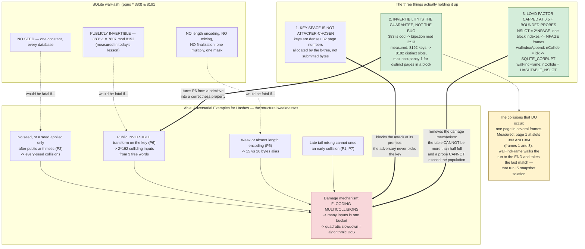

<!--
entry-meta
date: 2026-10-04
type: daily-diff
category: Daily Diff
title: Daily Diff — 2026-10-04
slug: sqlite-wal-frames-walindex-readmarks
edition: 2026-10-02 (Edition 070, 68 stories) — the edition https://tdd.cat/ serves today; no 2026-10-04 edition exists
-->

# Daily Diff — 2026-10-04

**2026-10-04 · Daily Diff Digest**

## Edition status

**There is no 2026-10-04 edition, and there cannot be one.** Verified this run (03:50 UTC / 09:20 IST):

- https://tdd.cat/2026-10-04/ returns **HTTP 404**.
- https://tdd.cat/ serves **Friday, October 2, 2026** — Edition **070**, 68 stories. That is the edition covered here.
- https://tdd.cat/archive restates the cadence: *"Editions are published with a 2-day settling window so the highest-signal discussions and insights surface."* Oct 4 is structurally two days from being publishable.

**A numbering correction worth recording.** The archive now reads: 071 → Oct 3 (22 stories), 070 → Oct 2 (68), 069 → Oct 1 (64), 068 → Sep 30 (70), 067 → Sep 29 (59). [Yesterday's digest](../2026-10-03-sqlite-vfs-locking-styles-inode-emulation/daily-diff.md) recorded 068 → Oct 1 and 067 → Sep 30 — **off by one** against today's archive. Either the archive renumbered, or yesterday's reading was wrong. Dates are the stable identifier, so this log should key on dates and treat edition numbers as advisory. By date, coverage so far is Sep 30 and Oct 1; today adds **Oct 2**, leaving no gap.

Edition 071 (Oct 3, 22 stories) is newer and uncovered, flagged here for tomorrow. Its headline list was retrieved this run and it is unusually small — 22 stories against Oct 2's 68.

---

## Edition 070 (Friday 2026-10-02), point-wise

68 stories. Overwhelmingly inference and agents; the database-internals cluster is small but good.

**Storage, query engines, data structures** — the part this log cares about

- **MultiTable claims 0.9999 physical load factors with triple SwissTable lookup throughput** (arXiv). The single most relevant item to today's lesson and the one I wanted for the deep dive — **arXiv rate-limited the fetch (HTTP 429) and the instructions forbid retrying**, so I could not read it and make no claims about it beyond the edition's own one-line description. Flagged as unfinished business.
- **Popular fast hash functions fail under adversarial inputs.** Deep-dive below. Picked because it interrogates the exact mechanism today's lesson spent a section on.
- **ClickHouse's query-optimisation guide** — columnar storage plus primary-key filters. Useful background for lesson 26 (`WhereLoop` and the path solver), not for today.
- **Postgres `work_mem` leaves databases vulnerable to one bad query** (ClickHouse blog): the limit is *per operation*, so a plan with many sorts and hashes multiplies it into unbounded RAM. The structural point generalizes — a per-unit resource limit is not a limit — and it is a useful contrast with SQLite's `cache_size`, which today's Hands-On C set to 10 pages specifically to force the spills that produce the `iReCksum` path.
- **Minimizing query-router overhead by decoding data lazily** (PlanetScale, on Neki): a proxy that avoids full wire-protocol deserialization. Same shape as today's `walFindFrame()` reading `aPgno[]`/`aHash[]` in place in a shared mapping rather than deserializing an index.
- **Integrated vector search in Postgres beats dedicated external engines** (Databricks Lakebase Search) — hierarchical IVF plus quantization, native indexing.
- **Finding and fixing slow queries with `pg_stat_statements`** — normalized statement tracking.
- **A classical RDBMS with every component rewritten** for multi-core CPUs and NVMe (Mechlove Blueprint).
- **Offloading database queues to Kafka to reduce FoundationDB transaction load** — already covered in [the 2026-10-03 digest](../2026-10-03-sqlite-vfs-locking-styles-inode-emulation/daily-diff.md); it reappears here, so Oct 2 and the previously-covered editions overlap.
- **Resolving excessive gcache page-file accumulation in MySQL/Galera clusters** (Percona): a lagging node prevents GCache cleanup. This is *precisely* today's lesson's failure mode in another system — one slow participant pins a log's reclamation floor and the log grows without bound. Worth reading directly against Hands-On E's `(0, 10, 3)`.
- **Kafka Share Groups give queue semantics over a log** — broker coordination cost against client-side parallelism.
- **Cloudflare Basin: serverless analytics on Apache Iceberg**, and **`s3-accelerator`**, which caches hot S3 objects on local NVMe using second-read admission — an admission policy that refuses to cache anything until it has been asked for twice, which is a cheap and good idea.
- **Vector databases alone cannot provide time-aware agent memory** — bi-temporal tracking to avoid retrieving stale facts.

**Runtimes, compilers, systems**

Rust into CPython to reduce crash bugs (python.org language-summit writeup), and separately Python GC moving to incremental collection — tens of milliseconds of peak pause at the cost of memory pressure. Lightpanda 1.0, a Zig headless browser with no rendering. Enki, JIT-compiling ordinary Rust functions to GPU kernels on stable toolchains. Pyronaut, Python on GraalVM claiming 2.6× FastAPI throughput. Truffle's partial-evaluation docs on eliminating interpreter overhead. Green threads from scratch in Rust. Hidden design compromises of Docker layers — tar's constraints forcing whiteout markers and opaque directories to express deletion across layers. New hand-tuned matmul kernels in llamafile claiming 30–500% on CPU. Homa versus TCP for datacenter RPC. Custom fuzzers finding regex bugs that hand-written suites miss (matklad).

**Security**

Azure API connections: shared multi-tenant proxy layers and weak tenancy isolation permitting cross-tenant backend access. A containment playbook for secrets leaked by autonomous coding agents.

**Agents and inference** — the bulk

Four separate items on "decision models" (single-forward-pass option scoring in llama.cpp; typed decision models cutting latency 1.97s → 0.46s; gating tool execution at 193–642 ms; and a dissent, *"a decision model taking ten seconds is not System 1"*). Suffix KV-cache reuse for non-append-only context edits. Frontier models with `grep` matching dedicated retrieval pipelines. MoE models on consumer hardware via disk-cached KV. PTXBench for LLM-generated NVIDIA assembly. Activation checkpointing trading compute for memory (Jane Street). Roofline analysis of DeepSeek-V3 on Hopper. Several papers on RL credit assignment, loop/sparsity scaling laws, and language drift under RLVR. Broken RL environments poisoning training. Most agent failures in production evading automated detection.

---

## Deep dive: unseeded multiply-mask hashes, and why SQLite gets away with one

**Picked** because today's lesson established that SQLite's wal-index hash is `(pgno * 383) & 8191` — a single odd multiply, masked, **with no seed at all** — and this item is a systematic attack survey on exactly that family of functions. The right question is not "is SQLite's hash good" (it plainly is not, by any standard the survey applies) but "what exactly is holding it up, and what would have to change for it to fall over". The survey turns out to answer that precisely, because its taxonomy is organized by *which structural property* a hash lacks.

**Source:** Thomas Ahle, [*Adversarial Examples for Hashes*](https://thomasahle.com/blog/adversarial-examples-for-hashes/), the item's own link.

### What the work actually is

A systematic collision analysis of **43+ hash implementations** from the SMhasher corpus — xxHash3/64, wyhash, rapidhash, MurmurHash2/3, CityHash64, FarmHash64, komihash, SpookyHash V2, aHash, HighwayHash, gxhash, MuseAir, t1ha2, a5hash and more. Not a single clever break; a catalogue of seven recurring structural patterns, each with found inputs.

The seven patterns, as the work names them:

| | Pattern | Effect |
|---|---|---|
| P1 | folded multiply forgets complement differences through carry/borrow | ~2^-27 collision rates |
| P2 | **public arithmetic before the seed is applied** | identical intermediates *regardless of key* — ~0 bits of security for some pairs |
| P3 | zero operands absorb other values under specific seed conditions | density 2^-32 to 2^-46 |
| P4 | related parallel lanes repeat identical products when public offsets compensate | 91% seed success rate for komihash |
| P5 | length-encoding aliases | 15 vs 16 zero bytes become identical |
| P6 | **public inverses generate whole collision families** | 2^192 colliding inputs from three free words |
| P7 | top-bit differences survive rotations and cancel against addition carries | |

Concrete results, as reported:

- **CityHash64 / FarmHash64 NA**: 8-byte pairs that collide **for every seed**; 65,536 sixteen-byte inputs flooding one bucket.
- **MurmurHash3**: 24-byte pairs colliding universally; 65,536 inputs at 144 bytes; **all 2^32 API seeds affected**.
- **komihash**: a 64-byte pair colliding at ~91% of seeds — 3.91 billion collisions in 2^32 trials — plus a 73-byte every-seed pair.
- **XXH3-64**: weak-key multicollisions above 240 bytes under one 2^-32 seed condition.
- **SpookyHash V2**: 286-byte pairs succeeding for ~25% of seeds via tail cancellation.
- **wyhash / rapidhash**: ~2^-27 folded-multiply pairs, plus every-seed pairs with the shipped constants.
- **gxhash**: 15-vs-16-byte cross-length collisions; 65,536 eighteen-byte inputs per seed.

The structural weaknesses it distils: seeds that enter only through **bijections of public values**; public **invertible** transformations on message data; parallel lanes correlated from public constants; length encoding too weak to separate messages; and tail mixing applied too late to undo an early collision.

And the finding that makes the piece more than a complaint: **"Provable hashes are just as fast as heuristic hashes. On Intel Xeon and AMD EPYC the fastest hash measured has a proof."** UMASH at 56.18 and 83.99 bits, Lean-proved; ChainHash at a 63-bit guarantee and 28.25 B/cycle on Xeon; ChainHash-128 at 127 bits and 14.90 B/cycle — against xxHash3 at roughly 60 GB/s on 256 KiB bulk. The recommendation is **not** "switch to SHA or AES"; it is that verified universal hashes already match heuristic speed, so the speed argument for unproven functions has expired. There is also a scoping note the author got from maintainers: *multicollision* resistance (many fixed inputs colliding with high probability) matters more operationally than isolated pairs or universal-hashing theorems.

The threat-model argument is worth stating because it is the actual thesis: *"If you can get provably correct software, take it"* — because AI makes reverse-engineering a shipped hash cheap enough that "nobody will bother analysing this" stops being a defence.

### Now apply the taxonomy to `walHash()`

```c
#define HASHTABLE_NPAGE  4096
#define HASHTABLE_HASH_1 383
#define HASHTABLE_NSLOT  (HASHTABLE_NPAGE*2)

static int walHash(u32 iPage){
  return (iPage*HASHTABLE_HASH_1) & (HASHTABLE_NSLOT-1);
}
```

Scored against the survey's structural weaknesses, this is as bad as a hash can be:

- **No seed at all.** P2 asks whether public arithmetic happens before the seed is applied; here there is no seed to apply. Every SQLite database on earth uses the same function with the same constant. Every collision is an every-seed collision, trivially.
- **Public and invertible.** P6 is about public inverses generating collision families. Today's lesson [measured the inverse](README.md): `383^-1 ≡ 7807 (mod 8192)`. Given a target slot you can compute a page number that lands there in one multiply.
- **No mixing, no finalization, no length encoding.** One multiply and a mask. There is nothing for P1, P5 or P7 to attack because there is nothing there.

And yet it is fine, for three specific reasons — and it is worth being exact, because each one is a load-bearing assumption rather than a happy accident:

1. **The key space is not attacker-chosen.** Keys are `u32` database page numbers, dense from 1, allocated by the b-tree layer. An attacker who can insert rows influences *how many* pages exist, and to a degree which pages get written, but cannot submit arbitrary 32-bit values as keys. The survey's flooding attacks all assume the adversary chooses the bytes being hashed.
2. **Invertibility, which is a fatal flaw for a hash, is a guarantee here.** 383 is odd, so multiplication by 383 is a bijection mod 2^13. Today's lesson measured the consequence: pages 0..8191 hit 8192 distinct slots with **zero** collisions, and distinct pages 1..4096 in one block give a maximum slot occupancy of **1**. The survey's P6 treats a public inverse as an attack primitive; in a controlled dense key space the same property is exactly the one you want, because it makes the function a permutation and collisions structurally impossible for distinct keys within one block.
3. **The load factor is capped at 0.5 by construction and probes are bounded.** `HASHTABLE_NSLOT = 2 × HASHTABLE_NPAGE`, and one block indexes at most `HASHTABLE_NPAGE` frames. On insert, `walIndexAppend()` sets `nCollide = idx` — the number of entries already present — and returns `SQLITE_CORRUPT_BKPT` if the probe exceeds it; on lookup, `walFindFrame()` caps at `HASHTABLE_NSLOT`. The survey's concluding damage mechanism is *"quadratic slowdowns in hash-based data structures when arbitrarily many inputs concentrate in a single bucket"*. Here the table cannot be more than half full and the probe cannot run past the population, so the quadratic blowup has nowhere to happen.

The collisions that *do* occur in SQLite's table are not hash collisions at all. They are **the same page number appearing in multiple frames** — the point of a WAL. Today's lesson measured page 1 at slots 383 and 384 with frames 1 and 3, and that probe run is load-bearing rather than incidental: `walFindFrame()` walks it to the end and returns the last match, which is how snapshot isolation is implemented.



### The transferable lesson, and where it stops

The survey's own framing is "stop shipping unproven hashes, the proven ones are just as fast", and for any hash exposed to attacker-chosen input that conclusion looks right and cheap to act on. But reading it against `walHash()` sharpens something the survey does not claim and that is easy to get backwards: **hash quality is not a property of a function, it is a property of a function plus a key space plus a load factor plus a probe bound.** SQLite's hash fails every structural test in the survey and is nonetheless the correct choice for its three constraints — and it is correct *because* of the property (invertibility) that the survey counts as an attack primitive.

The practical rule that falls out: before reaching for a provable hash, establish which of the three defences you actually have. Lose any one of them and the survey's conclusion applies immediately and in full.

- Keys become attacker-chosen (user strings, request paths, serialized identifiers) → you have no defence 1, and P2/P6 are live.
- Load factor allowed above ~0.7, or growth that keeps a table near-full → defence 3 is gone and flooding becomes quadratic.
- Unbounded probing, or chaining with no cap → defence 3 is gone in a different way; the bound is what converts "bad luck" into "detected corruption", which is exactly what `nCollide` does.

Two caveats on applying any of this.

- **I could not read the MultiTable paper** (arXiv 429, not retried). It is the item in this same edition that bears most directly on the load-factor half of the argument — 0.9999 claimed physical load factors — and defence 3 above rests on SQLite's 0.5 cap. If high load factors are genuinely cheap now, the *design* reason for `NSLOT = 2*NPAGE` weakens even though the format cannot change. Unresolved.
- **The survey's numbers are reported, not reproduced here.** No collision-finding was run this run. The parts I verified independently are the SQLite-side claims — the inverse, the permutation property, the occupancy, the probe bounds — all measured in today's lesson. Treat the 43-implementation catalogue as the author's result, not a confirmed one.

---

## Sources

Edition and archive, all fetched this run:

- [The Daily Diff](https://tdd.cat/) — serving **Friday, October 2, 2026** (Edition 070, 68 stories); the edition covered here
- [The Daily Diff — archive](https://tdd.cat/archive) — 071 (Oct 3, 22), 070 (Oct 2, 68), 069 (Oct 1, 64), 068 (Sep 30, 70), 067 (Sep 29, 59); states the 2-day settling window
- https://tdd.cat/2026-10-04/ — **HTTP 404**; no edition exists for today
- [Edition 071, Saturday 2026-10-03](https://tdd.cat/2026-10-03/) — 22 stories; newer than the homepage and not yet covered by this log

Deep-dive source:

- [Adversarial Examples for Hashes — Thomas Ahle](https://thomasahle.com/blog/adversarial-examples-for-hashes/) — the seven collision patterns P1–P7, the 43+ implementation results, the proven-vs-heuristic speed comparison (UMASH, ChainHash), and the multicollision scoping note

Not retrievable this run:

- `arxiv.org/abs/2609.39233` (MultiTable, the edition's hash-table item) — the fetch returned **HTTP 429 (rate limited)** and was not retried. No claims are made about its contents beyond the edition's own one-line description, and no link is given since the page was never read

Other Edition 070 items referenced above, as linked by the edition:

- [ClickHouse query optimisation — the definitive guide](https://clickhouse.com/resources/engineering/clickhouse-query-optimisation-definitive-guide)
- [Can your Postgres survive a bad query?](https://clickhouse.com/blog/can-your-postgres-survive-a-bad-query) — `work_mem` is per operation
- [Designing Neki for performance](https://planetscale.com/blog/designing-neki-for-performance) — lazy wire-protocol decoding in a query router
- [Too many gcache page files in the MySQL data directory](https://www.percona.com/blog/too-many-gcache-page-files-in-mysql-data-directory/) — a lagging node pinning GCache cleanup
- [Lakebase Search — full-text and vector search in Postgres](https://www.databricks.com/blog/lakebase-search-state-art-full-text-and-vector-search-postgres)
- [Finding and fixing slow queries with pg_stat_statements](https://pginsights.dev/guides/pg-stat-statements-slow-queries)
- [Mechlove Blueprint — a classical RDBMS with every component rewritten](https://6it.dev/blog/mechlove-blueprint---17-general-pretty-much-classical-rdbms-at-heart-with-each-and-every-component-rewritten-80739)
- [Share groups primarily provide queue semantics over logs](https://jack-vanlightly.com/blog/2026/6/3/broker-visible-vs-client-local-parallelism)
- [Cloudflare Basin](https://blog.cloudflare.com/cloudflare-basin/) and [s3-accelerator](https://github.com/danthegoodman1/s3-accelerator)
- [Offloading database queues to Kafka to reduce FoundationDB load](https://www.tigrisdata.com/blog/quick-fdb-kafka/)
- [Hidden design compromises of Docker layers](https://loige.co/hidden-design-compromises-of-docker-layers/)
- [Rust for CPython — language summit 2026](https://blog.python.org/2026/09/language-summit-2026-rust-for-cpython/) and [generational vs incremental GC](https://blog.python.org/2026/09/language-summit-2026-garbage-collection-generational-incremental-both/)
- [Partial evaluation in Truffle](https://github.com/oracle/graal/blob/master/truffle/docs/PartialEvaluation.md)
- [Finding bugs with custom fuzzers — matklad](https://matklad.github.io/2026/09/19/finding-bugs.html)
- [New matmul kernels in llamafile](http://justine.lol/matmul/)
- [Trading off compute for memory with activation checkpointing](https://blog.janestreet.com/trading-off-compute-for-memory-with-activation-checkpointing/)
- [Azure API connections — one root case](https://binsec.no/posts/2026/10/one-root-case)
- [A decision model taking ten seconds is not System 1](https://anth.us/blog/glide-decision-model-ten-seconds/)
- Measurements referenced from today's lesson: system `libsqlite3` 3.45.1, x86-64 Linux 6.18, ext4 — `383^-1 mod 8192 = 7807`, 8192 keys to 8192 distinct slots, max occupancy 1 at load factor 0.5, page 1 at hash slots 383 and 384. Reproducible from [Hands-On B](README.md)
