<!--
entry-meta
date: 2026-10-05
type: lesson
track: SQLite
lesson: 20
category: Database Internals
title: The Checkpoint — mxSafeFrame, the WAL Iterator, and SQLITE_BUSY With All the Work Done
slug: sqlite-wal-checkpoint-algorithm
-->

# The Checkpoint — mxSafeFrame, the WAL Iterator, and SQLITE_BUSY With All the Work Done

**2026-10-05 · SQLite Track · Lesson 20 of 33**

## Where This Fits

- [Lesson 19](../2026-10-04-sqlite-wal-frames-walindex-readmarks/README.md) established the append side of WAL: the `-wal` frame format and its cumulative checksum chain, the `-shm` wal-index with its 32 KiB hash-table blocks, the five `aReadMark[]` slots, and `walRestartLog()` — the rewind that `walFrames()` performs *before* appending. It measured the backfill floor from the outside (`PRAGMA wal_checkpoint(PASSIVE)` returning `(0, 10, 3)` with a reader pinned at `aReadMark[1]=3`) without opening the algorithm that respects it.
- This lesson is that algorithm: `walCheckpoint()` — how `mxSafeFrame` is computed and how the checkpointer *rewrites* the read-mark slots it manages to grab, the salt re-check that guards against a WAL wrapped underneath it, the two `WalIterator` algorithms that turn frame order into page order, the exactly-two fsyncs, and the four modes layered on top by `sqlite3WalCheckpoint()`. Plus the two size controls nobody reads the source for: `wal_autocheckpoint` and `journal_size_limit`.
- One correction to the intuition lesson 19 left: `SQLITE_CHECKPOINT_RESTART` does **not** reset the wal-index header. Only `TRUNCATE` calls `walRestartHdr()` from inside the checkpointer. Measured below.
- This closes Part III. Lesson 21 starts Part IV at the other end of the stack: `tokenize.c` and the Lemon-generated `parse.y`.

All source line numbers are `src/wal.c` at commit `ccbdec84` (4789 lines) unless another file is named. Measurements are against system SQLite **3.45.1** via Python's `sqlite3` module — the same build lesson 19 used, which matters in exactly one place noted below.

---

## 1. The Four Numbers a Checkpoint Moves

Everything in `walCheckpoint()` is bookkeeping around four counters, three of which live in the `-shm` file's `WalCkptInfo` struct (`wal.c:394-400`) and one in the wal-index header:

| Name | Where | Meaning |
|---|---|---|
| `hdr.mxFrame` | wal-index header, `-shm` byte 16 | Last valid frame in the `-wal`. The commit frontier. |
| `nBackfill` | `WalCkptInfo`, `-shm` byte 96 | Frames already copied into the database file. `walCheckpoint()` is "the only routine that will increase the value of nBackfill" (`wal.c:2273`). |
| `aReadMark[0..4]` | `-shm` bytes 100–119 | Snapshot each reader slot is pinned to. `aReadMark[0]` is always 0 (read straight from the db file). |
| `nBackfillAttempted` | `-shm` byte 128 | "the largest value of nBackfill that a checkpoint has attempted to achieve" (`wal.c:348`). Set *before* the copy, `nBackfill` *after*, so `nBackfillAttempted > nBackfill` means a checkpointer died mid-copy. |

A checkpoint is complete when `nBackfill == mxFrame`. It is *not* a reset: the `-wal` file still holds all its frames, and the next writer rewinds it via `walRestartLog()`.

## 2. Who May Run: the CKPT Lock and the Silent Mode Downgrade

`sqlite3WalCheckpoint()` (`wal.c:4388-4518`) is the entry point, and the first two things it does decide most of the observable behaviour:

- **`WAL_CKPT_LOCK`, exclusive, no busy handler** (`4428`). One checkpointer per database, period. A second one gets `SQLITE_BUSY` immediately — the docs are explicit that "Even if there is a busy-handler configured, it will not be invoked in this case."
- **For FULL/RESTART/TRUNCATE, `WAL_WRITE_LOCK` too** (`4443-4452`). This is the part worth internalizing:

```c
if( eMode!=SQLITE_CHECKPOINT_PASSIVE ){
  rc = walBusyLock(pWal, xBusy2, pBusyArg, WAL_WRITE_LOCK, 1);
  if( rc==SQLITE_OK ){
    pWal->writeLock = 1;
  }else if( rc==SQLITE_BUSY ){
    eMode2 = SQLITE_CHECKPOINT_PASSIVE;   /* silent downgrade */
    xBusy2 = 0;
    rc = SQLITE_OK;
  }
}
```

If the writer lock cannot be had, the mode is *downgraded to PASSIVE* and the checkpoint proceeds anyway. The caller learns about it only through the last line of the function:

```c
return (rc==SQLITE_OK && eMode!=eMode2 ? SQLITE_BUSY : rc);   /* wal.c:4517 */
```

So `SQLITE_BUSY` from a FULL checkpoint does not mean "nothing happened". Measured against a concurrent writer holding WRITER:

```
FULL while another conn holds WRITER -> (1, 29, 29)
```

Busy flag set, and all 29 frames backfilled. **`SQLITE_BUSY` here means "you did not get the mode you asked for", not "no work was done."** Any retry loop that treats it as failure-with-no-progress will do redundant work.

- **Blocking locks are deliberately disabled for the wal-index header read** (`4462-4469`): "A passive checkpoint should not block or invoke the busy handler. The only lock such a checkpoint may attempt to obtain is a lock on a read-slot, and it should give up immediately and do a partial checkpoint if it cannot obtain it."

## 3. Computing `mxSafeFrame`: the Checkpointer Rewrites the Read Marks

This is the heart of it (`wal.c:2310-2333`). `mxSafeFrame` starts at `hdr.mxFrame` and is pulled down by any reader pinned below it:

```c
mxSafeFrame = pWal->hdr.mxFrame;
mxPage = pWal->hdr.nPage;
for(i=1; i<WAL_NREADER; i++){
  u32 y = AtomicLoad(pInfo->aReadMark+i);
  if( mxSafeFrame>y ){
    rc = walBusyLock(pWal, xBusy, pBusyArg, WAL_READ_LOCK(i), 1);
    if( rc==SQLITE_OK ){
      u32 iMark = (i==1 ? mxSafeFrame : READMARK_NOT_USED);
      AtomicStore(pInfo->aReadMark+i, iMark);
      walUnlockExclusive(pWal, WAL_READ_LOCK(i), 1);
    }else if( rc==SQLITE_BUSY ){
      mxSafeFrame = y;
      xBusy = 0;
    }else{ goto walcheckpoint_out; }
  }
}
```

Three non-obvious things:

1. **A slot the checkpointer *can* lock is a slot with no reader, and the checkpointer repurposes it.** Slot 1 is set to `mxSafeFrame`; slots 2–4 are set to `READMARK_NOT_USED` (`0xffffffff`). This is why a healthy database converges on exactly one usable read mark after every checkpoint: slot 1 becomes "the newest snapshot", and new readers that want an older one have to claim a free slot themselves.
2. **A slot it cannot lock lowers the ceiling** — `mxSafeFrame = y` — and then sets `xBusy = 0`, so the busy handler is not invoked again for the remaining slots. Having already decided to do a partial checkpoint, there is nothing left to wait for.
3. The floor is the *minimum* occupied read mark below `mxFrame`, not the minimum read mark: slot 0 is always 0 and is never considered (`i` starts at 1), because an `aReadMark[0]` reader reads the database file directly and by definition sees only backfilled content.

Measured, with one reader pinned at frame 21 and the WAL at frame 32:

```
B shm      {'mxFrame': 32, 'nBackfill': 0,  'readmarks': [0, 21, 29, 4294967295, 4294967295]}
B passive   (0, 32, 21)
B shm      {'mxFrame': 32, 'nBackfill': 21, 'readmarks': [0, 21, 29, 4294967295, 4294967295], 'nBackfillAttempted': 21}
```

`nBackfill` stopped at exactly the pinned mark, and both marks were left alone — slot 1 was locked by the reader, and slot 2 (at 29) was *not* lower than the already-lowered `mxSafeFrame` of 21, so the loop never touched it. After the reader committed:

```
C passive   (0, 32, 32)
C shm      {'mxFrame': 32, 'nBackfill': 32, 'readmarks': [0, 32, 4294967295, 4294967295, 4294967295]}
```

Slot 1 rewritten to `mxSafeFrame`, slot 2 wiped to `READMARK_NOT_USED`. The source predicts the exact bytes.

## 4. The Salt Re-Check Under Read-Lock 0

Before copying anything, the checkpointer grabs `WAL_READ_LOCK(0)` (`2342`) — which excludes readers that would read the *database file* while it is being modified — and then re-reads the live header to compare salts (`2344-2355`):

```c
int bChg = memcmp(pLive->aSalt, pWal->hdr.aSalt, sizeof(pWal->hdr.aSalt));
if( 0==bChg ){ ... }
```

The comment explains the race precisely: the outer `pInfo->nBackfill < pWal->hdr.mxFrame` test may have passed only because *a writer that wrapped the WAL* had just zeroed `nBackfill`. Proceeding would copy frames from a WAL whose salt — and therefore whose contents — belong to a different generation. Lesson 19's salt-1 increment in `walRestartHdr()` is what makes this test work.

## 5. Frame Order to Page Order: the WalIterator

The `-wal` is in commit order; the database file wants page order, and a page may appear in many frames. `WalIterator` (`wal.c:576-636`) exists to hand out "the newest frame for each page, pages ascending". Since SQLite 3.54.0 there are two algorithms:

| | WALITER-1 | WALITER-2 |
|---|---|---|
| Structure | One sorted index per 32 KiB wal-index block, merged on the fly | One array of `nPage` entries: `aPgno[PGNO]` = newest frame for that page |
| Built by | `walMergesort()` per block (`1920-1978`) | A single pass stamping `aPagemap[pgno] = iZero+j+1` (`2068-2075`) |
| `walIteratorNext` cost | Scan all segments, take the global minimum `> iPrior` (`1820-1833`) | Walk the map upward, skip zeros (`1805-1812`) |
| Better when | Database larger than WAL | WAL larger than database |
| Since | always | 3.54.0 |

The selection is one line (`wal.c:2023`):

```c
if( (iLast-iZero)*sizeof(ht_slot) > pWal->hdr.nPage*sizeof(u32) ){ /* WALITER-2 */ }
```

i.e. compare "2 bytes per unbackfilled frame" against "4 bytes per database page" and pick the smaller allocation. Two details worth noticing:

- `walMergesort()` dedups while merging, and the rule is in `walMerge()` (`1861`): "When that happens, omit the aLeft[X] and use the aRight[Y] index" — i.e. keep the *larger* frame index for a duplicated page. That one line is the entire "last writer wins" semantics of the WAL.
- WALITER-2 aliases `aSegment[0].aPgno[0]` onto `aSegment[0].iZero` (`2046-2048`, tagged `tag-20260903-1` in the source) so that 1-based SQLite page numbers index a 0-based C array with no `±1` arithmetic. There is no page 0 in a well-formed database, so the slot is free.
- The iterator's start point is an optimization only: "Frames nBackfill or earlier may be included - excluding them is an optimization only" (`1989-1991`). The copy loop re-checks anyway (`2394`).

My measurements are on 3.45.1, which **has only WALITER-1**. Nothing below depends on which algorithm ran.

## 6. The Copy Loop, and Exactly Two Fsyncs

```c
rc = sqlite3OsSync(pWal->pWalFd, CKPT_SYNC_FLAGS(sync_flags));        /* 2359 */
... SQLITE_FCNTL_CKPT_START, FileSize, SQLITE_FCNTL_SIZE_HINT ...     /* 2367-2379 */
while( rc==SQLITE_OK && 0==walIteratorNext(pIter, &iDbpage, &iFrame) ){
  if( iFrame<=nBackfill || iFrame>mxSafeFrame || iDbpage>mxPage ) continue;   /* 2394 */
  sqlite3OsRead (pWal->pWalFd, zBuf, szPage, walFrameOffset(iFrame,szPage)+WAL_FRAME_HDRSIZE);
  sqlite3OsWrite(pWal->pDbFd, zBuf, szPage, (iDbpage-1)*(i64)szPage);
}
sqlite3OsFileControl(pWal->pDbFd, SQLITE_FCNTL_CKPT_DONE, 0);          /* 2406 */
if( mxSafeFrame==walIndexHdr(pWal)->mxFrame ){
  sqlite3OsTruncate(pWal->pDbFd, szDb);                                /* 2413 */
  sqlite3OsSync(pWal->pDbFd, CKPT_SYNC_FLAGS(sync_flags));             /* 2415 */
}
AtomicStore(&pInfo->nBackfill, mxSafeFrame);                           /* 2419 */
```

- **Sync 1, on the `-wal`, before any copying.** "This ensures that if the new content is persistent in the WAL and can be recovered following a power-loss or hard reset" (`2263-2265`).
- **Sync 2, on the database, only if the whole WAL was copied.** "This second fsync makes it safe to delete the WAL" (`2267-2270`). A partial checkpoint does *not* sync the database — correct, because the `-wal` remains the authority for those pages.
- The database file is **truncated down** to `hdr.nPage * szPage` on a complete checkpoint. This is how a WAL-mode database shrinks after a `DELETE`; a partial checkpoint never shrinks it.
- A size sanity check doubles as corruption detection (`2370-2375`): if the target size exceeds current size + WAL bytes + 64 KiB (the max pending-byte page), that is `SQLITE_CORRUPT_BKPT`.
- One page = one `pread` + one `pwrite`, in page order. Measured on a 50-frame WAL with `TRUNCATE`:

```
52 pread64   52 pwrite64   2 fdatasync   2 ftruncate
```

Two extra reads over 50 frames (header/bootstrap), the two syncs above, and two truncates: the database down to `szDb`, and the `-wal` to zero for TRUNCATE mode.
- `db->u1.isInterrupted` is checked every page (`2390`), so `sqlite3_interrupt()` can abort a checkpoint mid-copy. The partial result is safe precisely because `nBackfill` is only stored at the end.

## 7. The Four Modes, as the Source Implements Them

| Mode | CKPT lock | WRITER lock | Blocks until | Extra |
|---|---|---|---|---|
| PASSIVE | yes | no | nothing; never invokes the busy handler | backfill up to `mxSafeFrame` |
| FULL | yes | yes | no writer, all readers on newest snapshot | — |
| RESTART | yes | yes | FULL, then all readers off the WAL (`WAL_READ_LOCK(1..4)` exclusive, `2449`) | next writer will rewind the WAL |
| TRUNCATE | yes | yes | same as RESTART | `walRestartHdr()` + `ftruncate(-wal, 0)` (`2465-2466`) |

The post-copy block (`2440-2471`) is where FULL/RESTART/TRUNCATE differ. Note what it does *not* do:

```
D restart   (0, 32, 32) db=40960 wal=131872
D shm      {'mxFrame': 32, 'nBackfill': 32, 'readmarks': [0, 32, ...]}
E truncate  (0, 0, 0)   db=40960 wal=0
E shm      {'mxFrame': 0,  'nBackfill': 0,  'readmarks': [0, 0, 4294967295, 4294967295, 4294967295]}
```

**RESTART leaves `mxFrame` and `nBackfill` exactly as they were and leaves the 131 KB `-wal` file in place.** It only *guarantees no reader is still using the WAL*, so that the next writer's `walRestartLog()` (lesson 19) can rewind. TRUNCATE is the only mode that calls `walRestartHdr()` from the checkpointer, and the source says why it bothers (`2457-2464`): truncating the file without updating the header "would leave the system in a state where the contents of the wal-index header do not match the contents of the file-system."

The reset is visible in the `-shm` bytes and matches `walRestartHdr()` (`2234-2248`) line for line: `mxFrame=0`, `nBackfill=0`, `nBackfillAttempted=0`, `aReadMark[1]=0`, slots 2–4 `0xffffffff`.

### A documentation discrepancy, verified both ways

`pragma.html` states: *"By default, the checkpoint is RESTART."* The source disagrees (`src/pragma.c:2398-2408`): `int eMode = SQLITE_CHECKPOINT_PASSIVE;` and only an explicit `full`/`restart`/`truncate`/`noop` argument changes it. Measured with a reader pinned, where PASSIVE succeeds partially and RESTART reports busy:

```
plain  pragma wal_checkpoint       -> (0, 29, 21)
explicit            (restart)      -> (1, 29, 21)
```

Plain `PRAGMA wal_checkpoint` is PASSIVE. Also note the first column: `pragma.html` documents `-1` for busy, and 3.45.1 returns **`1`**. Treat "nonzero" as busy, not "`-1`".

## 8. Automatic Checkpointing Is a Four-Line Hook

There is no checkpoint thread. Auto-checkpointing is a WAL hook, registered at connection open (`src/main.c:3721`):

```c
sqlite3_wal_autocheckpoint(db, SQLITE_DEFAULT_WAL_AUTOCHECKPOINT);   /* 1000 */
```

and the hook itself is (`src/main.c:2505-2511`):

```c
int sqlite3WalDefaultHook(void *pClientData, sqlite3 *db, const char *zDb, int nFrame){
  if( nFrame>=SQLITE_PTR_TO_INT(pClientData) ){ ... }
```

Consequences that follow directly from that shape:

- It runs **on the committing connection, in the commit path**, synchronously. "All I/O barrier operations (a.k.a fsyncs) occur in this routine when SQLite is in WAL-mode in synchronous=NORMAL" (`wal.c:2258-2261`) — so a COMMIT that trips the threshold pays for the fsyncs of every commit since the last checkpoint.
- It is **PASSIVE only**, per the API docs: "Checkpoints initiated by this mechanism are PASSIVE."
- `nFrame` is `Wal.iCallback`, set to the commit's last frame at `4346` and consumed-and-zeroed by `sqlite3WalCallback()` (`4525-4532`). So the trigger is the WAL's frame count, not its byte size, despite being documented in "pages".
- **`sqlite3_wal_hook()` and `sqlite3_wal_autocheckpoint()` are the same slot.** Registering your own hook silently disables auto-checkpointing; `PRAGMA wal_autocheckpoint` reports 0 whenever `db->xWalCallback != sqlite3WalDefaultHook` (`src/pragma.c:2430-2432`). That is the usual cause of an unbounded WAL in applications that installed a hook for metrics.

Measured with the threshold lowered to 4 frames (default confirmed as 1000):

```
G default wal_autocheckpoint: (1000,)
   commit 0: wal= 12392 mxFrame,nBackfill=(3, 0)
   commit 1: wal= 16512 mxFrame,nBackfill=(4, 4)
   commit 2: wal= 16512 mxFrame,nBackfill=(4, 4)
   commit 3: wal= 16512 mxFrame,nBackfill=(1, 0)
   commit 4: wal= 16512 mxFrame,nBackfill=(4, 4)
   commit 5: wal= 16512 mxFrame,nBackfill=(1, 0)
```

The sawtooth is the autocheckpoint and `walRestartLog()` alternating: commit 1 crosses the threshold and backfills to 4/4; commit 3 finds `nBackfill == mxFrame`, rewinds, and starts again at frame 1. **The file size never goes down** — 16512 bytes forever. That is the whole point of the next section.

## 9. Why the `-wal` Never Shrinks, and the Two Ways to Make It

`journal_size_limit` reaches the WAL layer through one setter (`src/pager.c:7550-7553` → `wal.c:1782-1784`), landing in `Wal.mxWalSize` (`wal.c:516`, "Truncate WAL to this size upon reset"). It is consumed in exactly two places, and both are *resets*, not checkpoints:

- **First commit after a WAL restart** (`4306-4313`). `Wal.truncateOnCommit` is set when a fresh WAL header is written (`4192`), i.e. by `walRestartLog()`; then:

```c
if( isCommit && pWal->truncateOnCommit && pWal->mxWalSize>=0 ){
  i64 sz = pWal->mxWalSize;
  if( walFrameOffset(iFrame+nExtra+1, szPage)>pWal->mxWalSize ) sz = walFrameOffset(...);
  walLimitSize(pWal, sz);
  pWal->truncateOnCommit = 0;
}
```

so the limit is a floor-of-the-current-transaction, never a hard cap mid-transaction. `walLimitSize()` (`2483-2491`) is a benign-malloc-wrapped `ftruncate` that **ignores errors by design**.
- **Connection close in persistent-WAL mode** (`2629-2637`), truncating to zero rather than to the limit, because "truncating to the journal_size_limit might leave a corrupt WAL file on disk."

Measured — limit 32 KiB, WAL grown to 2.4 MB, then a RESTART checkpoint:

```
F journal_size_limit default: (-1,)
F wal grown to 2476152  mxFrame,nBackfill= (601, 0)
F set limit   (32768,)
F restart     (0, 601, 601)  wal= 2476152     <- checkpoint truncates nothing
F after 1 small commit post-restart: wal= 32768  mxFrame,nBackfill=(1, 0)
F after 2nd commit:                  wal= 32768
F after close:                       wal= None (deleted)
```

The checkpoint left 2.4 MB on disk; the *next commit* cut it to exactly 32768 bytes. So `journal_size_limit` in WAL mode is lazy: it takes effect one commit after a reset.

## 10. The Mechanism, Drawn

```mermaid
flowchart TD
    A["sqlite3WalCheckpoint(eMode)"] --> B{"walLockExclusive(WAL_CKPT_LOCK)"}
    B -- "BUSY (another checkpointer)" --> Z1["return SQLITE_BUSY<br/>busy handler never called"]
    B -- "ok" --> C{"eMode != PASSIVE ?"}
    C -- "no" --> E
    C -- "yes" --> D{"walBusyLock(WAL_WRITE_LOCK)"}
    D -- "BUSY" --> D2["eMode2 = PASSIVE<br/>xBusy2 = 0<br/>rc = SQLITE_OK"]
    D -- "ok" --> D3["writeLock = 1"]
    D2 --> E
    D3 --> E
    E["walIndexReadHdr()"] --> F["mxSafeFrame = hdr.mxFrame"]
    F --> G["for i in 1..4: inspect aReadMark[i]"]
    G -- "slot lockable (no reader)" --> G1["aReadMark[1] = mxSafeFrame<br/>aReadMark[2..4] = READMARK_NOT_USED"]
    G -- "slot locked by a reader" --> G2["mxSafeFrame = aReadMark[i]<br/>xBusy = 0  (partial from here on)"]
    G1 --> H
    G2 --> H
    H{"nBackfill below mxSafeFrame ?"}
    H -- "no" --> M
    H -- "yes" --> I["walIteratorInit(): WALITER-1 or WALITER-2"]
    I --> J{"walBusyLock(WAL_READ_LOCK(0))"}
    J -- "BUSY" --> M
    J -- "ok" --> K{"live aSalt == hdr.aSalt ?"}
    K -- "no (WAL was wrapped)" --> M
    K -- "yes" --> L1["nBackfillAttempted = mxSafeFrame"]
    L1 --> L2["fsync(-wal)"]
    L2 --> L3["copy loop: pread a -wal frame, pwrite the db page<br/>pages ascending, newest frame per page"]
    L3 --> L4{"mxSafeFrame == mxFrame ?"}
    L4 -- "yes" --> L5["ftruncate(db, nPage*szPage)<br/>fsync(db)"]
    L4 -- "no" --> L6["no db sync: -wal still authoritative"]
    L5 --> L7["nBackfill = mxSafeFrame"]
    L6 --> L7
    L7 --> M
    M{"eMode2 is RESTART or TRUNCATE, and nBackfill equals mxFrame ?"}
    M -- "no" --> N
    M -- "yes" --> M1["walBusyLock(WAL_READ_LOCK(1..4)) - drain readers off the WAL"]
    M1 --> M2{"eMode2 == TRUNCATE ?"}
    M2 -- "yes" --> M3["walRestartHdr(): mxFrame=0, nBackfill=0, salt-1++<br/>ftruncate(-wal, 0)"]
    M2 -- "no" --> M4["header untouched; next writer rewinds via walRestartLog()"]
    M3 --> N
    M4 --> N
    N["release WRITER, release CKPT_LOCK"] --> O{"eMode != eMode2 ?"}
    O -- "yes" --> Z2["return SQLITE_BUSY<br/>(work may be fully done)"]
    O -- "no" --> Z3["return rc"]
```



And the bytes the whole dance manipulates, in the `-shm` file (offsets from `wal.c:404-466`):

```
offset  0 .. 47   WalIndexHdr, copy 1
offset 48 .. 95   WalIndexHdr, copy 2   (the two copies must agree)
       ---------------- WalCkptInfo starts here ----------------
offset  96 .. 99  nBackfill
offset 100 ..103  aReadMark[0]   always 0  -> reader reads the db file only
offset 104 ..107  aReadMark[1]   rewritten to mxSafeFrame by the checkpointer
offset 108 ..111  aReadMark[2]   -> READMARK_NOT_USED (0xffffffff) when lockable
offset 112 ..115  aReadMark[3]
offset 116 ..119  aReadMark[4]
offset 120 ..127  8 lock bytes   Write | Ckpt | Rcvr | Rd0 | Rd1..Rd4
offset 128 ..131  nBackfillAttempted
offset 132 ..135  unused padding
```

## Hands-On

No `sqlite3` CLI needed; Python's `sqlite3` module is enough, and reading the `-shm` bytes directly is what makes the algorithm visible.

### A. Watch the checkpointer rewrite the read marks

```python
import os, sqlite3, struct
D = os.path.abspath("t.db")
for s in ("", "-wal", "-shm"):
    try: os.remove(D+s)
    except FileNotFoundError: pass

def shm():
    with open(D+"-shm", "rb") as f: b = f.read(144)
    return dict(mxFrame=struct.unpack("<I", b[16:20])[0],
                nBackfill=struct.unpack("<I", b[96:100])[0],
                readmarks=[struct.unpack("<I", b[100+4*i:104+4*i])[0] for i in range(5)],
                nBackfillAttempted=struct.unpack("<I", b[128:132])[0])

w = sqlite3.connect(D, isolation_level=None)
w.execute("pragma page_size=4096"); w.execute("pragma journal_mode=wal")
w.execute("pragma wal_autocheckpoint=0")          # take the hook out of the picture
w.execute("create table t(a integer primary key, b blob)")
for i in range(10): w.execute("insert into t values(?,?)", (i, os.urandom(2000)))

r = sqlite3.connect(D, isolation_level=None)      # pin a reader to this snapshot
r.execute("begin"); r.execute("select count(*) from t").fetchone()
for i in range(10, 15): w.execute("insert into t values(?,?)", (i, os.urandom(2000)))

print(shm())
print("passive:", w.execute("pragma wal_checkpoint(passive)").fetchone())
print(shm())
print("restart:", w.execute("pragma wal_checkpoint(restart)").fetchone())
r.execute("commit")
print("passive:", w.execute("pragma wal_checkpoint(passive)").fetchone())
print(shm())
print("restart:", w.execute("pragma wal_checkpoint(restart)").fetchone(),
      "wal bytes:", os.path.getsize(D+"-wal"))
print(shm())
print("truncate:", w.execute("pragma wal_checkpoint(truncate)").fetchone(),
      "wal bytes:", os.path.getsize(D+"-wal"))
print(shm())
```

**What to look for:**

- `nBackfill` after the first PASSIVE equals the pinned reader's `aReadMark` value, not `mxFrame`. That is `mxSafeFrame` being pulled down by `walBusyLock()` failing on that slot — proof the floor is per-slot, not global.
- RESTART while the reader is open returns **`1`** in column 1 (busy). PASSIVE in the same situation returns `0`. Same partial result, different verdict.
- After the reader commits and PASSIVE completes, `aReadMark[1]` has been **overwritten with `mxSafeFrame`** and slots 2–4 are `4294967295`. Nobody asked for that; the checkpointer did it at `wal.c:2323-2324`.
- RESTART with no readers changes **nothing** in `shm()` and does not shrink the `-wal`. If you expected the WAL to reset here, that expectation came from the name, not the code.
- TRUNCATE zeroes `mxFrame`, `nBackfill`, `nBackfillAttempted` and `aReadMark[1]`, sets slots 2–4 to `NOT_USED`, and takes the file to 0 bytes — `walRestartHdr()` exactly.

### B. Count the I/O a checkpoint actually does

```bash
strace -f -e trace=pwrite64,pread64,fdatasync,fsync,ftruncate -o tr.txt python3 ckpt.py
grep -cE 'fdatasync|ftruncate' tr.txt
```

Wrap the `pragma wal_checkpoint(truncate)` call in markers (`os.write(2, b"--MARK--\n")`) and count only between them. **What to look for:** exactly two `fdatasync` calls regardless of WAL size (the `-wal` before the copy, the db after a complete copy), one `pread`+`pwrite` pair per distinct page, and two `ftruncate`s. If you see only one `fdatasync`, the checkpoint was partial — the database sync is conditional on `mxSafeFrame == mxFrame`.

### C. Prove `journal_size_limit` is lazy

```python
w.execute("pragma journal_size_limit=32768")
# ... grow the WAL to a few MB ...
w.execute("pragma wal_checkpoint(restart)")        # file size unchanged
w.execute("insert into t values(99999, x'00')")    # <- THIS truncates it
```

**What to look for:** the file stays large across the checkpoint and collapses to exactly the limit on the next commit. The truncation lives in `walFrames()`, gated on `truncateOnCommit`, not in `walCheckpoint()`.

## Where This Breaks Down

- **Unbounded WAL growth under continuous readers.** The floor is a hard correctness requirement, not a tunable: "if a database has many concurrent overlapping readers and there is always at least one active reader, then no checkpoints will be able to complete and hence the WAL file will grow without bound." SQLite's own prescription is operational, not algorithmic — arrange for "reader gaps". There is no `max_wal_size` that can override a reader's snapshot.
- **Autocheckpointing charges the wrong transaction.** The connection that happens to cross frame 1000 pays for up to 1000 pages of random-ordered writes plus two fsyncs inside its COMMIT. Latency percentiles get a cliff that has nothing to do with the size of the committing transaction. The documented fix — run checkpoints from a background thread — means giving up the default hook, and then nothing checkpoints if your thread dies.
- **`SQLITE_BUSY` conflates three outcomes:** another checkpointer held CKPT_LOCK (nothing happened), the mode was downgraded (possibly everything happened), or RESTART/TRUNCATE could not drain readers (backfill complete, reset did not happen). Only inspecting `(nLog, nCkpt)` distinguishes them.
- **Checkpoint I/O is random by construction.** The iterator sorts by *page* number, so the `-wal` is read out of order; sequentiality is handed to the database file instead. On spinning media and on some flash FTLs this is the opposite trade from the append-only write path WAL exists to provide. wal.html is blunt: "Checkpoint also requires more seeking."
- **A partial checkpoint never shrinks the database and never syncs it.** Space from deleted content is only returned on a complete checkpoint's `ftruncate`, which a single long reader can defer indefinitely.
- **`nBackfillAttempted` is the scar tissue.** If a checkpointer dies after the copy began but before `nBackfill` was stored, `nBackfillAttempted > nBackfill` is left behind, and the database pages in that window may hold newer content than any reader's snapshot expects. Recovery of *older* snapshots then requires `sqlite3WalSnapshotRecover()` (`3368-3403`) to walk frames backwards comparing WAL content against the db file — explicitly "only really safe if the file-system is such that any page writes made by earlier checkpointers were atomic operations, which is not always true."
- **`walLimitSize()` discards its errors.** A failed `ftruncate` leaves an over-limit WAL with no diagnostic. The setting is best-effort.
- **Documentation drift is real here.** Two checkable disagreements in one page: the default `PRAGMA wal_checkpoint` mode, and the busy sentinel value. Read the source when the number matters.

## Further Study

- [hctree: Wal2 Mode Notes](https://sqlite.org/hctree/doc/wal2/doc/wal2.md) — the experimental two-WAL design whose entire purpose is to remove the starvation window this lesson ends on: writers alternate files so one can be checkpointed while the other is appended to.
- [The 20GB WAL File That Shouldn't Exist](https://loke.dev/blog/sqlite-checkpoint-starvation-wal-growth) — checkpoint starvation as encountered in production rather than in a test harness; useful as a sanity check on the reader-gap advice.
- [better-sqlite3 performance notes](https://github.com/WiseLibs/better-sqlite3/blob/master/docs/performance.md) — how a widely used binding chooses its WAL and checkpoint defaults.

## Next Steps

1. Reproduce starvation deliberately: two processes with overlapping read transactions that never both close, autocheckpoint at its default, and a writer loop. Plot `-wal` size and `nBackfill` over time; confirm `nBackfill` tracks the lower read mark exactly.
2. Build SQLite 3.54.0+ and instrument `walIteratorInit()` to log which algorithm it selects, then find the crossover empirically (`(iLast-iZero)*2` vs `nPage*4`) for a fat-WAL and a fat-database workload.
3. Move checkpointing off the commit path: `sqlite3_wal_hook()` that only signals a condition variable, plus a thread running `sqlite3_wal_checkpoint_v2(..., TRUNCATE, ...)`. Measure COMMIT p99 against the default hook.
4. Crash a checkpointer mid-copy (SIGKILL between markers in the strace harness) and read `nBackfillAttempted` vs `nBackfill` out of the `-shm`. Then check whether `PRAGMA integrity_check` notices anything — worth settling before lesson 32.
5. Read `sqlite3WalSnapshotRecover()` (`wal.c:3368-3403`) alongside `sqlite3_snapshot_open()`; it is the only consumer of `nBackfillAttempted` that tries to *lower* it.

## Sources

- [src/wal.c @ ccbdec84, sqlite/sqlite](https://github.com/sqlite/sqlite/blob/ccbdec84/src/wal.c) — 4789 lines; `WalCkptInfo` (394-400), the `-shm` header schematic (404-466), `Wal` struct (511-535), `WalIterator` and the WALITER-1/WALITER-2 notes (576-636), `walIteratorNext` (1796-1838), `walMerge` (1863-1901), `walMergesort` (1920-1978), `walIteratorInit` (2000-2085), `walBusyLock` (2189-2207), `walRestartHdr` (2234-2248), `walCheckpoint` (2250-2477), `walLimitSize` (2483-2491), the close-path truncate (2627-2637), `sqlite3WalLimit` (1782-1784), `sqlite3WalSnapshotRecover` (3368-3403), `truncateOnCommit` sites (4192, 4306-4313), `iCallback` (4346, 4525-4532), `sqlite3WalCheckpoint` (4388-4518). `src/pager.c` (7550-7553), `src/main.c` (2498-2539, 3721) and `src/pragma.c` (2398-2435) were read at the same commit.
- [Write-Ahead Logging](https://www.sqlite.org/wal.html) — the 1000-page default, the reader/checkpointer stop rule, starvation and reader gaps, and the "does not normally truncate the WAL file" statement.
- [sqlite3_wal_checkpoint_v2()](https://www.sqlite.org/c3ref/wal_checkpoint_v2.html) — mode-by-mode semantics, which locks each takes, `pnLog`/`pnCkpt`, and the rule that PASSIVE never invokes the busy handler.
- [PRAGMA statements](https://www.sqlite.org/pragma.html) — `wal_checkpoint`'s three result columns, `wal_autocheckpoint` (default 1000), and `journal_size_limit` (default -1, compared and applied at each checkpoint per the docs — see §9 for what actually happens).

Measurements: system SQLite 3.45.1 via Python's `sqlite3`, ext4, `page_size=4096`, `synchronous=NORMAL` unless stated. 3.45.1 predates WALITER-2 (3.54.0).

## Takeaways

- A checkpoint is bounded by the lowest occupied read mark, and the checkpointer **rewrites the read-mark slots it can lock** — slot 1 to `mxSafeFrame`, the rest to `READMARK_NOT_USED`. Read marks are shared state the checkpointer edits, not just reader state it observes.
- `SQLITE_BUSY` from a non-PASSIVE checkpoint usually means "downgraded to PASSIVE", and the backfill may be 100% complete. Check `(nLog, nCkpt)`; don't retry blindly.
- RESTART does not reset anything on disk. It only drains readers off the WAL so the *next writer* can rewind. TRUNCATE is the only mode that resets the header from the checkpointer.
- Exactly two fsyncs: the `-wal` before copying, the database after a *complete* copy. A partial checkpoint syncs nothing, shrinks nothing.
- The `-wal` file never shrinks on its own. `journal_size_limit` truncates it on the first commit *after* a reset, and the close path truncates to zero — neither is the checkpoint.
- Auto-checkpointing is a hook on the committing connection, sharing its slot with `sqlite3_wal_hook()`. Installing your own hook silently turns it off.
