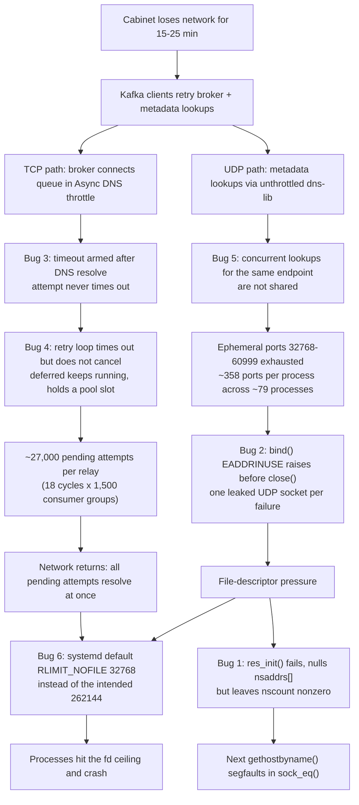

<!--
entry-meta
date: 2026-10-05
type: daily-diff
category: Daily Diff
title: Daily Diff — 2026-10-05
slug: sqlite-wal-checkpoint-algorithm
-->

# Daily Diff — 2026-10-05

**2026-10-05 · Daily Diff Digest**

Edition covered: **2026-10-03** (Saturday), 22 stories — the newest edition published on [tdd.cat](https://tdd.cat/) and the first not yet covered here (the 2026-10-02 edition was covered in [lesson 19's digest](../2026-10-04-sqlite-wal-frames-walindex-readmarks/daily-diff.md)).

## The Edition, Point-Wise

**Databases and storage**

- **PostgreSQL 19 enables lock contention visibility by default** — lock waits get logged automatically rather than requiring deliberate instrumentation. Source: clickhouse.com/blog/postgres-19-monitoring-whats-new
- **Building a dedicated query matching engine for Firestore** — why a purpose-built matcher beat reusing a search engine for reverse query matching. Source: rockwotj.com/blog/firestore-query-matching/
- **Fair PostgreSQL job queue scheduling prevents noisy neighbour delays** — FIFO queues starve tenants under multi-tenant load; round-robin selection fixes it. Source: now-next.nl/en/insights/postgresql-job-queue-per-tenant-noisy-neighbour/
- **Safely integrating C++ memory management with Postgres extensions** — the collision between Postgres's `longjmp`-based error handling and C++ RAII. Source: clickhouse.com/blog/memory-safety-postgres-extensions-c-cpp

**Systems, languages, runtimes**

- **Go expands architecture-specific SIMD support to arm64 and wasm** — ergonomic intrinsics across architectures. Source: go.dev/blog/archsimd
- **Heterogeneous memory boundaries belong in the compile-time type system** — Vx encodes accelerator memory topology in types to catch device-memory errors at compile time. Source: vxlang.org/
- **Fusing Python with GraalVM** — Pyronaut, Python syntax on JVM optimizations. Source: pyronaut.io/2026/10/02/introducing-pyronaut/
- **How recurring network maintenance exposed six cascading bugs** — the deep dive below. Source: blog.janestreet.com/how-recurring-network-maintenance-exposed-6-bugs/

**Isolation and agent infrastructure**

- **Micro-VM sandbox for agentic workloads** (Microsoft NVX), **open-source DeepSeek Elastic Compute sandboxes** (Fireagent), **system-wide agent profiling with eBPF** (AgentSight), **durable agent harnesses as statecharts that checkpoint each step**, **declarative event-driven workflow automation on Kubernetes CRs** (KubeZap).

**ML systems**

- **Long-context decode shifts the memory bottleneck from weights to KV cache**, **llama.cpp decision models score fixed option sets in one forward pass**, **disposable overfit inference engines beat general runtimes on fixed hardware**, **predicting model memory and boot feasibility before renting GPUs** (Apron), **roofline analysis for DeepSeek-V3 parallelism on Hopper**, **pipelining local inference between Mac and iPhone** (Backburner).

**Models and methods**

- **Aleph Alpha's Kolibri**, a 78B-parameter MoE open-weight model for regulated environments, and a companion piece on **bounding hallucinations with Merlin-Arthur protocols** (formal mutual-information bounds on whether a model used the source document). Plus **adversarial co-evolution for finding agent vulnerabilities pre-deployment**.

## Deep Dive — Six Bugs, One Network Partition

Source followed and read in full: [How recurring network maintenance exposed 6 bugs](https://blog.janestreet.com/how-recurring-network-maintenance-exposed-6-bugs/) (Jane Street).

**The trigger.** Routine weekend network maintenance takes individual cabinets offline for 15–25 minutes. Kafka relays and consumer-group monitors are supposed to ride that out. Instead processes segfaulted, leaked sockets by the tens of thousands, and died from connection surges at *recovery* time. Nothing in the partition itself was novel; what the partition did was hold six latent defects open at once until they lined up.

**The bugs, by component:**

1. **glibc resolver corruption (11 years latent).** When `res_init()` fails partway through — e.g. it cannot open `/etc/resolv.conf` under file-descriptor exhaustion — it tears down `statp->_u._ext.nsaddrs[]` via `__res_iclose(free_addr=true)`, nulling the pointers, but never resets `statp->_u._ext.nscount`. The next `gethostbyname()` walks a nonzero count over null pointers and segfaults in `sock_eq()` at `res_send.c:1453`. The post traces it to a 2015 commit that moved the cache-valid flag from `nsinit` to `nscount` and dropped the corresponding cleanup. Reproduced in a few lines: `setrlimit(RLIMIT_NOFILE)` to 3, call `res_init()`, then `gethostbyname()`. Fixed upstream in **glibc 2.44**.
2. **UDP socket leak on failed bind (their socket library).** `socket(SOCK_DGRAM)` then `bind()` to `0.0.0.0:0`; if `bind()` raises `EADDRINUSE` the exception escapes without closing the fd. `lsof` showed 30,000+ UDP sockets as bare `sock` entries — created, never bound. Ephemeral range `32768-60999` (~28k ports) shared across ~79 processes on one host leaves ~358 ports each, and parallel resolution against three nameservers drains that fast.
3. **`Tcp.connect_sock` timeout did not cover DNS (14 years latent).** The timeout is armed *after* `remote_address()` resolves. During the partition, lookups queue behind Async's DNS throttle (capped at half a ~50-thread pool), so a lookup stuck in the throttle never times out and the connection attempt lives forever. Logs showed attempts outstanding 20+ minutes against an ~80s retry timeout.
4. **Kafka client retry loop never cancelled the expired attempt.** `Timeout.with_timeout` returns `` `Timeout `` and the loop retries, but the underlying deferred keeps running and keeps its slot in the connection pool. ~18 retry cycles × ~1,500 consumer groups per relay ≈ 27,000 pending attempts; the logs recorded 27,898 and 27,786 on two relays. At recovery they all resolved at once — a self-inflicted thundering herd.
5. **Bootstrap duplicated concurrent endpoint lookups.** Simultaneous requests for the same broker endpoint each ran their own metadata lookup instead of sharing one. A `CR-someday` comment in the code had already named the fix years earlier: cache in-flight requests.
6. **A migration silently cut the fd limit 8×.** Kafka support processes had a soft `RLIMIT_NOFILE` of 262,144 via `/etc/security/limits.d`. Moving to systemd user services stopped applying those overrides, so jobs inherited systemd's default of 32,768 — large enough in isolation that nobody noticed, rolled to 10% of production in March and everywhere by May.

**Why this is the item worth reading.** Each bug in isolation is survivable and most are individually boring — a missing `close`, a timeout armed one line too late, a config override dropped during a migration. The failure is entirely in the *composition*: #5 multiplies DNS load, which exhausts ephemeral ports, which makes `bind()` fail, which leaks fds via #2, which makes `res_init()` fail, which corrupts the resolver via #1, which segfaults the process. In parallel, #3 and #4 convert every retry into a permanently pending connection, and #6 lowers the ceiling those pending connections then hit on recovery. Two independent chains, one shared root cause (fd pressure), and a fault that only appears when the network is down long enough for both chains to run to completion.

The reusable lessons are about *bounding*, and they rhyme with today's lesson on checkpointing more than they should:

- A timeout that does not cover every blocking step in an operation is not a bound on that operation. (#3 — the DNS resolution outside the deadline.)
- A timeout that fires without cancelling the work is a leak generator, not a safety valve. (#4 — exactly the shape of a checkpoint retry loop that treats `SQLITE_BUSY` as "nothing happened" and starts another.)
- Resource limits that are set *somewhere else* are one migration away from silently changing. (#6.)
- Error paths that allocate must also release; the failure path is where fd leaks live. (#2.)
- A library that reports failure must leave its own state consistent, or the *next* caller takes the crash. (#1 — and that caller has no way to know why.)

## Sources

- [The Daily Diff](https://tdd.cat/) — edition of 2026-10-03, 22 stories; headlines, descriptions and source links as listed there.
- [How recurring network maintenance exposed 6 bugs](https://blog.janestreet.com/how-recurring-network-maintenance-exposed-6-bugs/) — the deep-dive item, read in full for the mechanism of each bug.
