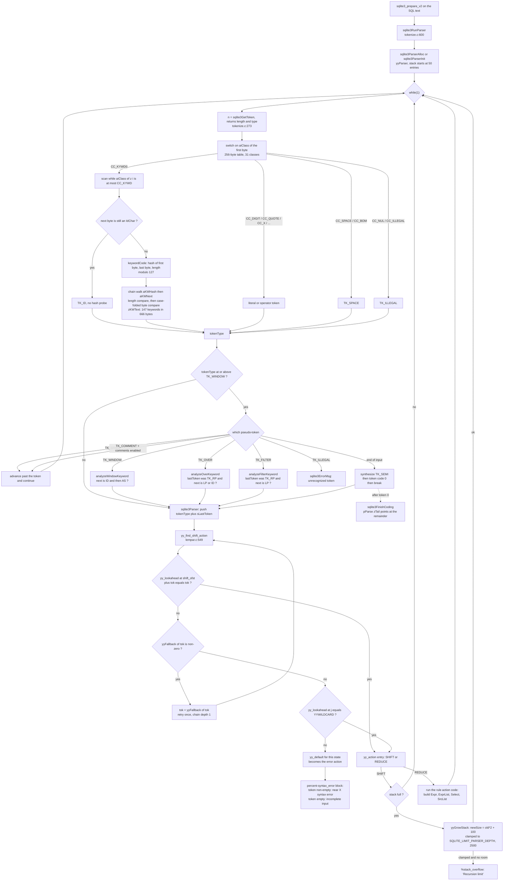

<!--
entry-meta
date: 2026-10-06
type: lesson
track: SQLite
lesson: 21
category: Database Internals
title: From SQL Text to Parse Tree — aiClass, a 666-Byte Keyword Table, and the Three Keywords %fallback Could Not Fix
slug: sqlite-tokenizer-and-lemon-parser
-->

# From SQL Text to Parse Tree — `aiClass`, a 666-Byte Keyword Table, and the Three Keywords `%fallback` Could Not Fix

**2026-10-06 · SQLite Track · Lesson 21 of 33**

## Where This Fits

- Part III closed with [lesson 20](../2026-10-05-sqlite-wal-checkpoint-algorithm/README.md): `walCheckpoint()`, `mxSafeFrame`, the `WalIterator`, the exactly-two fsyncs, and the four checkpoint modes. Everything in lessons 01–20 sat **below** the SQL language: pages, cells, cursors, journals, locks, frames. None of it knew what a `SELECT` was.
- This lesson starts Part IV at the opposite end of the stack — the first 899 lines of code any statement touches. Two files: `src/tokenize.c`, a hand-written scanner driven by a 256-byte character-class table, and `src/parse.y`, a 2169-line Lemon grammar compiled to an LALR(1) automaton. The interesting part is not that SQLite has a parser; it is the **three places where the clean separation between scanner and grammar is deliberately broken**, and what each one buys.
- Three mechanisms carry the lesson: `keywordCode()`, a perfect-ish hash over 147 keywords packed into 666 overlapping bytes; `%fallback`, the Lemon directive that lets 88 of those 147 keywords still be used as bare identifiers; and `analyzeWindowKeyword()` / `analyzeOverKeyword()` / `analyzeFilterKeyword()`, the tokenizer-level lookahead hacks for the three keywords `%fallback` provably cannot handle.
- What it sets up: `sqlite3RunParser()` hands reduced grammar rules to action code that builds `Expr`, `ExprList`, `Select` and `SrcList` objects. Lesson 22 takes those trees and resolves the names in them. This lesson stops at the point where a token becomes a grammar symbol — it does not touch what the reduce actions build.

**Version caveat, stated up front** (same discipline as lessons 18–20): source is read at trunk commit `466e0851`; every measurement is on the system `libsqlite3.so.0` version **3.45.1**. For this lesson the two disagree in one load-bearing place — the parser stack — and section 9 reports both rather than reconciling them.

---

## 1. The Shape of the Front End: Two Files, One Loop

`sqlite3_prepare_v2()` reaches the front end through `sqlite3RunParser()` (`tokenize.c:600`). The control flow is the inverse of yacc's:

| | yacc / bison | Lemon (SQLite) |
|---|---|---|
| Who is in charge | the parser calls `yylex()` | the **tokenizer** calls the parser |
| State | global variables | all state inside `yyParser`, passed by pointer |
| Reentrancy | not reentrant | reentrant, threadsafe |
| Error recovery | the `error` pseudo-token | `%syntax_error` block, no error symbol |
| Memory on abort | leaks non-terminals | `%destructor` per non-terminal |

`sqlite3RunParser()` is therefore a plain `while(1)` loop (`tokenize.c:646`) that calls `sqlite3GetToken()` for the next token and `sqlite3Parser()` to push it in. There is no token buffer, no lexer state machine object, and no tokenizer-side error recovery — `sqlite3GetToken()` is a pure function of the bytes at `z[0]`:

```c
i64 sqlite3GetToken(const unsigned char *z, int *tokenType);
```

It returns a **length** and writes a **type**. It never allocates, never looks backwards, and never reports an error; it returns `TK_ILLEGAL` and lets the caller decide. Every piece of context-sensitivity in the scanner therefore has to be passed in from `sqlite3RunParser()` by hand — which is exactly what section 8 is about.

The pipeline, as code:

| Stage | Entry point | File:line (trunk `466e0851`) |
|---|---|---|
| Byte → character class | `aiClass[]` | `tokenize.c:61` |
| Character class → token | `sqlite3GetToken()` | `tokenize.c:273` |
| Identifier → keyword code | `keywordCode()` | generated into `keywordhash.h`, from `tool/mkkeywordhash.c` |
| Context fixups | `analyzeWindowKeyword()` etc. | `tokenize.c:246`, `254`, `261` |
| Token → grammar action | `sqlite3Parser()` | generated from `parse.y` via `tool/lempar.c` |
| Shift-action lookup + fallback | `yy_find_shift_action()` | `lempar.c:549` |

---

## 2. `aiClass[]`: a 256-Byte Table That Replaces a Binary Search

`sqlite3GetToken()` does not switch on the character. It switches on `aiClass[*z]`. The source comment states the reason plainly (`tokenize.c:21-27`):

> In the `sqlite3GetToken()` function, a `switch()` on `aiClass[c]` is implemented using a lookup table, whereas a `switch()` directly on `c` uses a binary search. The lookup table is much faster. To maximize speed, and to ensure that a lookup table is used, all of the classes need to be small integers and **all of them need to be used within the switch**.

That last clause is a real constraint, not a wish: a `switch` with sparse or unused case labels is what makes gcc emit a comparison tree instead of a jump table. The 31 classes are `CC_X`=0 through `CC_BOM`=30, and the table maps all 256 byte values.

Measured, by transcribing the `SQLITE_ASCII` arm of `aiClass[]` and counting:

| Class | Bytes | Members |
|---|---|---|
| `CC_X` | 2 | `X x` — start of a possible BLOB literal |
| `CC_KYWD0` | 46 | the alphabetics that can begin a keyword (`A`–`X`, `a`–`x`, excluding `x`/`X`) plus `@`-adjacent oddities |
| `CC_KYWD` | 5 | `Y Z _ y z` — legal **in** a keyword, never first |
| `CC_DIGIT` | 10 | `0`–`9` |
| `CC_DOLLAR` | 1 | `$` |
| `CC_VARALPHA` | 3 | `# : @` |
| `CC_VARNUM` | 1 | `?` |
| `CC_SPACE` | 5 | `0x09 0x0a 0x0c 0x0d 0x20` |
| `CC_QUOTE` | 3 | `"`, `'`, backtick |
| `CC_QUOTE2` | 1 | `[` |
| `CC_ID` | 127 | `0x80`–`0xFF` except `0xEF` |
| `CC_ILLEGAL` | 33 | control bytes, plus `\ ] ^ { } 0x7f` |
| `CC_NUL` | 1 | `0x00` |
| `CC_BOM` | 1 | `0xEF` |
| 17 single-character operator classes | 1 each | `|` `-` `<` `>` `=` `!` `/` `(` `)` `;` `+` `*` `%` `,` `&` `~` `.` |

Three things fall out of the table that are easy to miss when reading the switch:

- **`Y`, `Z` and `_` are `CC_KYWD`, not `CC_KYWD0`.** No SQL keyword starts with Y, Z or underscore, so a token starting with one of them can skip the hash lookup entirely — it falls to the shared `i = 1; break;` tail at `tokenize.c:570-573` and returns `TK_ID`.
- **`x` and `X` get their own class** purely because of `x'...'` BLOB literals. The comment at `tokenize.c:565-566` notes that if it is *not* a BLOB literal it must be an ID, "since no SQL keywords start with the letter 'x'" — so `CC_X` falls through into `CC_KYWD`/`CC_ID`.
- **`0xEF` is its own class** so that a leading UTF-8 BOM (`EF BB BF`) can be swallowed as `TK_SPACE` (`tokenize.c:575-581`).

Measured: all 31 defined classes appear in the table, and all 256 byte values are mapped. The source comment's invariant holds.

---

## 3. `sqlite3GetToken()`: One Switch, Thirty-One Arms

The arms worth knowing, with their observable consequences. Every outcome in the right-hand column was measured on 3.45.1.

| Arm | Rule in the source | Observable |
|---|---|---|
| `CC_MINUS` (`:289`) | `--` → `TK_COMMENT` to end of line; `->` → `TK_PTR`, `return 2 + (z[2]=='>')` | `->` and `->>` are **one** token each, length 2 and 3 |
| `CC_SLASH` (`:321`) | `/*` scans for the closing delimiter; `if( c ) i++;` — an **unterminated** comment is still `TK_COMMENT` | `SELECT 1 /* unterminated` → **OK**, returns 1 |
| `CC_SLASH`, subtle | the loop starts at `z[2]` with `i=3`, so the same `/` cannot serve as both opener and closer | `SELECT 1 /*/ + 1` → **1**, not 2. The `+ 1` is inside the comment |
| `CC_QUOTE` (`:396`) | doubled delimiters handled; closing `'` → `TK_STRING`, `"` or backtick → `TK_ID`, EOF → `TK_ILLEGAL` | `'a'` is a string; `"a"` and backtick-`a` are identifiers; `'a FROM t` → `unrecognized token: "'a FROM t"` |
| `CC_QUOTE2` (`:499`) | `[` scans to `]`, no doubling, no escape | `[a FROM t` → `unrecognized token: "[a FROM t"` — the whole remainder is the token |
| `CC_DIGIT` (`:433`) | hex, decimal, fraction, exponent — then `while( IdChar(z[i]) ){ *tokenType = TK_ILLEGAL; i++; }` | `1x` → `unrecognized token: "1x"`; `1.5e` → illegal; `0xg` → illegal; `.5` → OK |
| `CC_VARNUM` / `CC_VARALPHA` / `CC_DOLLAR` (`:504-538`) | `?`, `?NNN`, `:a`, `@b`, `#c`, `$d`; `if( n==0 ) *tokenType = TK_ILLEGAL` | `SELECT :a, @b, $c, ?1, ?` → 4 bound parameters. A bare `SELECT :` → `unrecognized token: ":"` |
| `CC_VARALPHA`, TCL arm | `$name(...)` is one variable token when `SQLITE_OMIT_TCL_VARIABLE` is off | `SELECT $tcl(x)` → 1 parameter |
| `CC_BANG` (`:366`) | `!` alone is `TK_ILLEGAL`; only `!=` is a token | `SELECT 1 ! 2` → `unrecognized token: "!"` |
| `CC_KYWD0` (`:539`) | scan while the class is at most `CC_KYWD`; if the next byte is still an `IdChar` it **cannot** be a keyword → `break` to the ID tail; else `keywordCode()` | `abort` is `TK_ABORT`; `abort$` is `TK_ID` without a hash probe |
| `CC_NUL` (`:583`) | `*tokenType = TK_ILLEGAL; return 0;` | length **0** — the only arm that returns 0, and the reason the caller tests `zSql[0]==0` separately |

Measured BOM handling, since the `CC_BOM` arm is easy to get wrong:

```
"SELECT 1"        -> OK            (BOM consumed as TK_SPACE)
"SELECT 1"  -> OK            (TK_SPACE is consumed in a loop, so two BOMs are fine)
"SELECT1"         -> near "SELECT": syntax error
```

The third line is the interesting one. A BOM in the *middle* is still `TK_SPACE`, so it should separate tokens — but `SELECT` was scanned by the `CC_KYWD0` arm, whose scan loop runs while the class is at most `CC_KYWD` and then checks `IdChar(z[i])`. `0xEF` is an `IdChar` (any high-bit byte is), so the token becomes `SELECT` plus the BOM bytes plus `1` — a single identifier. `CC_BOM` only fires when `0xEF` is the **first** byte of a token.

---

## 4. The Keyword Hash: 147 Keywords in 666 Bytes

`keywordCode()` is not written by hand. `tool/mkkeywordhash.c` is a standalone program, run at build time, whose output is `keywordhash.h`, included at `tokenize.c:148`. It builds:

| Generated array | Purpose |
|---|---|
| `zKWText[]` | all keyword text, **overlapped**, no NUL terminators |
| `aKWHash[]` | hash bucket → index of first keyword in the chain |
| `aKWNext[]` | collision chain |
| `aKWLen[]`, `aKWOffset[]` | length and offset into `zKWText[]` for each keyword |
| `aKWCode[]` | the `TK_*` parser symbol for each keyword |

The hash is three multiplies and two XORs on **first byte, last byte and length** (`mkkeywordhash.c`, `HASH_C0/C1/C2` = 4/3/1, `charMap(X)` = `0x20|X`):

```c
i = ((charMap(z[0])*4) ^ (charMap(z[n-1])*3) ^ n*1) % bestSize;
```

`charMap(X) = 0x20|X` is an uppercase-to-lowercase fold that works only for alphabetics — which is why the generator's comment warns the hash "cannot be on a keyword position that might be an `_`". It then does a case-insensitive compare with `(z[j]&~0x20)==zKW[j]`, so the keyword match is ASCII-case-folded without a function call.

`bestSize` is not a constant in the source. The generator **searches** for it: for every table size from `nKeyword/2` to `2*nKeyword`, it scores the resulting bucket distribution with `aKWHash[h] = aKWHash[h]*2 + 1` (i.e. a chain of length *k* costs 2^*k*−1) and keeps the minimum.

### What the shipped library actually contains

`sqlite3_keyword_name(N, &z, &n)` hands out a pointer **into `zKWText[]`** and a length, and the documentation is explicit that "the string that `*Z` points to is **not** zero-terminated". That makes the packing directly observable: collect all 147 pointers, take the minimum as the base, and read the span.

Measured against the system 3.45.1 `libsqlite3.so.0`:

| Quantity | Value |
|---|---|
| `sqlite3_keyword_count()` | **147** (matches the documented count) |
| Sum of all keyword lengths | 860 bytes |
| Actual `zKWText[]` span | **666 bytes** |
| Naive storage (length + NUL each) | 1007 bytes |
| Saved | **341 bytes**, 34% |

The first 120 bytes of the real `zKWText[]`, read out of the loaded `.so`:

```
REINDEXEDESCAPEACHECKEYBEFOREIGNOREGEXPLAINSTEADDATABASELECTABLEFTHENDEFERRABLELSEXCLUDELETEMPORARYISNULLSAVEPOINTERSECT
```

And the first few entries, with their offsets:

| offset | len | keyword | slice |
|---|---|---|---|
| 0 | 7 | `REINDEX` | `zKWText[0:7]` |
| 2 | 7 | `INDEXED` | `zKWText[2:9]` — shares `INDEX` with `REINDEX`, extends past it |
| 2 | 5 | `INDEX` | `zKWText[2:7]` — a pure substring of both |
| 8 | 4 | `DESC` | `zKWText[8:12]` — its `D` is the `D` of `INDEXED` |
| 9 | 6 | `ESCAPE` | `zKWText[9:15]` — `ESC` overlaps `DESC` |
| 14 | 4 | `EACH` | `zKWText[14:18]` |
| 16 | 5 | `CHECK` | `zKWText[16:21]` |
| 20 | 3 | `KEY` | `zKWText[20:23]` — the `K` of `CHECK` |
| 23 | 6 | `BEFORE` | |
| 25 | 7 | `FOREIGN` | `FORE` from `BEFORE` |
| 25 | 3 | `FOR` | inside `FOREIGN` |

Every one of the 147 entries matched the slice at its reported offset. The generator achieves this with two passes: first "look for short keywords embedded in longer keywords" (`substrId`/`substrOffset`), then a `longestSuffix` pass that chains words whose suffix is another word's prefix — `REINDEX` → `INDEXED`, `DESC` → `ESCAPE`, `CHECK` → `KEY`, `BEFORE` → `FOREIGN`.

### Reproducing the table-size search

Reimplementing `mkkeywordhash.c`'s hash and its `bestSize` search over exactly the 147 keywords the shipped library reports:

| | |
|---|---|
| `bestSize` | **127** |
| hash score (`bestCount`) | **231** |
| Buckets with 1 keyword | 47 |
| Buckets with 2 | 33 |
| Buckets with 3 | 10 |
| Buckets with 4 | 1 — `LIKE REFERENCES VIRTUAL UNION` |
| Empty buckets | 36 of 127 |

So a keyword lookup is: one multiply-XOR hash, then on average 231/147 ≈ 1.6 chain steps, each gated by a length compare (`if( aKWLen[i]!=n ) continue;`) before any byte comparison. The worst case in the whole language is four.

**Stated as what it is:** `bestSize = 127` and the score of 231 are a *reimplementation* of the generator over the measured keyword set, not a read of the shipped `keywordhash.h` — that header is produced at build time and is not recoverable from the `.so`. The 666-byte packing and the per-keyword offsets above *are* read from the shipped library.

---

## 5. `sqlite3RunParser()`: the Loop, the Synthetic Semicolon, and `zTail`

The loop body (`tokenize.c:646` onward) is short, and almost all of it is special cases. The structure turns on one comparison:

```c
n = sqlite3GetToken((u8*)zSql, &tokenType);
...
if( tokenType>=TK_WINDOW ){     /* i.e. one of the "not a real token" codes */
```

`parse.y` assigns token numbers in a deliberate order (`parse.y:255-266`, `309-321`) precisely so that the pseudo-tokens sort above every real one. The `assert` immediately after that `if` enumerates them: `TK_SPACE`, `TK_OVER`, `TK_FILTER`, `TK_ILLEGAL`, `TK_WINDOW`, `TK_QNUMBER`, `TK_COMMENT`. Everything else goes straight to `sqlite3Parser()` with no further inspection. The slow path then handles, in order:

1. **Interrupt check** — `AtomicLoad(&db->u1.isInterrupted)`. This is the only interrupt poll in the front end, so it only fires on whitespace, comments and the three context-sensitive keywords. A pathological statement that is one enormous unbroken token cannot be interrupted during tokenization.
2. **`TK_SPACE`** — advance and `continue`.
3. **End of input** — `if( zSql[0]==0 )`, and then the piece of the design worth internalizing:

```c
/* Upon reaching the end of input, call the parser two more times
** with tokens TK_SEMI and 0, in that order. */
if( lastTokenParsed==TK_SEMI ){      tokenType = 0;
}else if( lastTokenParsed==0 ){      break;
}else{                               tokenType = TK_SEMI; }
n = 0;
```

The grammar's top rule requires a terminating `SEMI`. Rather than make the semicolon optional in the grammar — which would have introduced conflicts everywhere — the tokenizer **fabricates** one at EOF, then feeds token code `0` to signal real end-of-input. This is why `SELECT 1` with no semicolon parses, and it costs exactly two extra `sqlite3Parser()` calls and zero grammar rules.

4. **`TK_WINDOW` / `TK_OVER` / `TK_FILTER`** → the three `analyze*Keyword()` calls (section 8).
5. **`TK_COMMENT`** → skipped only `if( db->init.busy || (db->flags & SQLITE_Comments)!=0 )`, i.e. when reparsing the schema or when `SQLITE_DBCONFIG_ENABLE_COMMENTS` is on (the default). Otherwise a comment falls through to the error path. Comments are therefore *tokens* in SQLite, not a pre-pass — which is what makes the unterminated-comment behaviour in section 3 a parser-visible fact rather than a lexer curiosity.
6. **Everything else above `TK_WINDOW`** → `sqlite3ErrorMsg(pParse, "unrecognized token: \"%T\"", &x)`.

### Where `pzTail` and `sqlite3_error_offset()` actually land

`pParse->sLastToken` is set to `{z = zSql, n}` on every iteration, and `pParse->zTail = zSql` at the end. Both are directly observable through `sqlite3_prepare_v2()`'s `pzTail` out-parameter and `sqlite3_error_offset()`. Measured on 3.45.1 (offsets in bytes from the start of the statement):

| input | rc | `pzTail` | `error_offset` | message |
|---|---|---|---|---|
| `SELECT 1; SELECT 2;` | OK | 9 | −1 | — |
| `SELECT 1` | OK | 8 | −1 | — |
| `SELECT 1 -- trailing` | OK | **20** | −1 | tail is at EOF: the comment was consumed |
| `SELECT 1; -- trailing` | OK | **9** | −1 | tail is `" -- trailing"`: the real `;` stopped the prepare first |
| `   ;SELECT 1` | OK | **12** | −1 | a leading bare `;` does **not** stop the prepare |
| `-- only a comment` | OK | 17 | −1 | `rc=OK`, statement handle NULL |
| `SELECT 1x` | ERR | 7 | **7** | `unrecognized token: "1x"` |
| `SELECT a, 1x FROM t` | ERR | 10 | **10** | `unrecognized token: "1x"` |
| `SELECT a FROM t WHERE b = 1y` | ERR | 26 | **26** | `unrecognized token: "1y"` |
| `SELECT 1 FRM t` | ERR | 14 | **13** | `near "t": syntax error` |
| `SELECT * FROM nosuch` | ERR | 20 | **−1** | `no such table: nosuch` |

Three findings here:

- **`error_offset` is exactly `sLastToken.z - zSql`.** On a tokenizer error it points at the first byte of the offending token; on a *syntax* error it points at the lookahead token that had no action. It is −1 for errors raised after parsing (`no such table`), which is a clean way to tell a front-end error from a name-resolution error from the outside.
- **`   ;SELECT 1` consumes the whole string in one prepare.** `prepare` stops when a statement finishes *coding*; `ecmd ::= SEMI` is an empty command that generates no VDBE program, so the loop keeps going and `SELECT 1` is compiled by the same call. A bare `;` is not a statement boundary — a completed statement is.
- **`SELECT 1 FRM t` reports `near "t"`, not `near "FRM"`.** This is the first visible consequence of the next section.

---

## 6. Lemon, and Why `%fallback` Exists

`parse.y`'s header block is 59 lines of directives, and four of them define the whole error and resource story:

```
%stack_size        50                        // Initial stack size
%stack_size_limit  parserStackSizeLimit      // Function returning max stack size
%realloc           parserStackRealloc        // realloc() for the stack
%free              parserStackFree           // free() for the stack
%token_prefix TK_
%token_type {Token}
%default_type {Token}
%extra_context {Parse *pParse}
%syntax_error { ... parserSyntaxError(pParse, &TOKEN); ... }
%stack_overflow { if( pParse->nErr==0 ) sqlite3ErrorMsg(pParse, "Recursion limit"); }
%name sqlite3Parser
```

`%syntax_error` is three lines (`parse.y:45-52`) and produces the only two front-end grammar errors in the language:

```c
if( TOKEN.z[0] ){ parserSyntaxError(pParse, &TOKEN); }   /* near "%T": syntax error */
else            { sqlite3ErrorMsg(pParse, "incomplete input"); }
```

`TOKEN.z[0]==0` happens exactly when the synthetic EOF token from section 5 is the one with no action — which is why `SELECT` and `SELECT * FROM` both report `incomplete input` rather than `near "": syntax error`.

The generated automaton's action lookup is `yy_find_shift_action()` (`lempar.c:549-608`). The important part is what happens on a **miss**:

```c
i = yy_shift_ofst[stateno] + iLookAhead;
if( yy_lookahead[i]!=iLookAhead ){
#ifdef YYFALLBACK
    iFallback = yyFallback[iLookAhead];
    if( iFallback!=0 ){
      assert( yyFallback[iFallback]==0 );   /* Fallback loop must terminate */
      iLookAhead = iFallback;
      continue;                             /* retry the whole lookup */
    }
#endif
#ifdef YYWILDCARD
    ... if( yy_lookahead[j]==YYWILDCARD && iLookAhead>0 ) return yy_action[j];
#endif
    return yy_default[stateno];
}
```

So `%fallback` is **not** a grammar rule and **not** a tokenizer feature. It is a retry in the action-table lookup: *if this token has no action in this state, substitute a different token code and look again*. The `assert( yyFallback[iFallback]==0 )` enforces that the chain is exactly one hop deep, so the surrounding `do{...}while(1)` cannot loop forever. `%wildcard ANY.` (`parse.y:296`) is the same trick one level down — a per-state catch-all column consulted after fallback fails.

This is what makes `parse.y` small. Without it, every place the grammar accepts a name would need an `id` non-terminal with ~80 alternative productions, and every such production would be a shift/reduce conflict generator.

---

## 7. `%fallback`: 88 of 147 Keywords Are Still Usable as Names

`parse.y:272-295` lists the fallback set. Counting token names in a default build (the `SQLITE_OMIT_COMPOUND_SELECT` and `SQLITE_ENABLE_ORDERED_SET_AGGREGATES` arms are excluded): **73 token names**. Four of those cover more than one spelling:

| Token | Spellings |
|---|---|
| `COLUMNKW` | `COLUMN` |
| `LIKE_KW` | `LIKE`, `GLOB`, `REGEXP` |
| `CTIME_KW` | `CURRENT_DATE`, `CURRENT_TIME`, `CURRENT_TIMESTAMP` |
| `TEMP` | `TEMP`, `TEMPORARY` |

73 token names → **78 keyword spellings**. A table or column name is `nm ::= idj | STRING`, where `%token_class idj  ID|INDEXED|JOIN_KW.` (`parse.y:334`, `338-340`) — so `INDEXED` and the seven `JOIN_KW` spellings (`CROSS FULL INNER LEFT NATURAL OUTER RIGHT`) are accepted by the grammar directly, without fallback.

**Prediction: 78 + 7 + 1 = 86 of the 147 keywords should work as a bare table name.**

Measured: for all 147 keywords reported by `sqlite3_keyword_name()`, `CREATE TABLE <kw>(x)` on 3.45.1 —

| | |
|---|---|
| Measured usable as a bare table name | **88** |
| Predicted from `%fallback` ∪ `JOIN_KW` ∪ `INDEXED` | **86** |
| Predicted but **not** measured | `IF` |
| Measured but **not** predicted | `FILTER`, `OVER`, `WINDOW` |

86 − 1 + 3 = 88. The prediction is exact, and both discrepancies are informative:

- **`IF`** is in the fallback list and works as a column name and as a result alias, but `CREATE TABLE IF(x)` fails — because `ifnotexists(A) ::= IF NOT EXISTS` (`parse.y:215-217`) means the parser state right after `CREATE TABLE` *does* have an action for `TK_IF`. Fallback only fires when the token has **no** action in the current state. A keyword in the fallback list is still a keyword wherever the grammar wants it.
- **`FILTER`, `OVER` and `WINDOW`** are usable as names despite being absent from the fallback list. They are handled one layer lower, in the tokenizer. That is section 8.

The 59 keywords that cannot be a bare table name, measured:

```
ADD ALL ALTER AND AS AUTOINCREMENT BETWEEN CASE CHECK COLLATE COMMIT CONSTRAINT
CREATE DEFAULT DEFERRABLE DELETE DISTINCT DROP ELSE ESCAPE EXCEPT EXISTS FOREIGN
FROM GROUP HAVING IF IN INDEX INSERT INTERSECT INTO IS ISNULL JOIN LIMIT NOT
NOTHING NOTNULL NULL ON OR ORDER PRIMARY REFERENCES RETURNING SELECT SET TABLE
THEN TO TRANSACTION UNION UNIQUE UPDATE USING VALUES WHEN WHERE
```

### Why `SELECT 1 FRM t` blames `t`

`as(X) ::= AS nm(Y).` and `as(X) ::= ids(X).` (`parse.y:734-736`) — a result alias may be written with *no* `AS`. So in `SELECT 1 FRM t`, `FRM` is a perfectly good bare alias; the parser accepts `SELECT 1 AS FRM` and then finds `t` where it expected `FROM`, `WHERE` or end-of-statement. The error offset of 13 measured in section 5 points at `t`, and the diagnostic is correct from the parser's point of view and useless from the user's. This is the standing cost of optional-`AS` plus a large fallback set: **typos in keyword position become aliases, and the error surfaces one token late.**

The same mechanism produces the quirks the documentation itself warns about — `CREATE TRIGGER AFTER INSERT ON ...` silently names the trigger `AFTER` and makes it a `BEFORE` trigger, and `CREATE TABLE tableZ(INTEGER PRIMARY KEY)` creates a column *named* `INTEGER` with no declared type.

---

## 8. WINDOW, OVER and FILTER: Three Keywords `%fallback` Could Not Fix

`tokenize.c:206-244` carries an unusually long comment, and it is the clearest statement of a real limitation in the whole file:

> This cannot be handled by the usual lemon `%fallback` method, due to the ambiguity in some constructions. e.g.
> `SELECT sum(x) OVER ...`
> In the above, "OVER" might be a keyword, or it might be an alias for the `sum(x)` expression. If a `%fallback ID OVER` directive were added to grammar, then SQLite would always treat "OVER" as an alias, making it impossible to call a window-function without a FILTER clause.

The failure mode is specific: `%fallback` is tried only when the token has **no** action. After `sum(x)` the parser *does* have an action for `TK_ID` — reduce to an alias. So `OVER` would never reach the fallback path and window functions would be unparseable. The fix is to decide in the tokenizer, using lookahead and one byte of history, and pass the decision in as the token code.

The three rules, from the source:

| Keyword | Treated as a keyword when | Function | Lookahead cost |
|---|---|---|---|
| `WINDOW` | next token is an ID (or a keyword that falls back to ID) **and** the one after it is `AS` | `analyzeWindowKeyword()` `:246` | 2 tokens |
| `OVER` | previous token was `TK_RP` **and** next is `TK_LP` or an ID | `analyzeOverKeyword()` `:254` | 1 token + 1 of history |
| `FILTER` | previous token was `TK_RP` **and** next is `TK_LP` | `analyzeFilterKeyword()` `:261` | 1 token + 1 of history |

The history comes from `lastTokenParsed`, threaded through the `sqlite3RunParser()` loop. The lookahead uses a private `getToken()` (`tokenize.c:197-205`) that skips `TK_SPACE`/`TK_COMMENT` and — note — itself calls `sqlite3ParserFallback(t)` to collapse fallback-eligible keywords to `TK_ID`. So the tokenizer reaches **into the generated parser's `yyFallback[]` table** (`lempar.c:1090-1092`) to make a lexical decision. The layering is broken in both directions, deliberately.

Measured on 3.45.1 — all sixteen cases:

| what | result |
|---|---|
| `CREATE TABLE window(x)` / `over(x)` / `filter(x)` | all OK |
| `SELECT 1 AS window` | OK |
| `SELECT a AS window FROM t` | OK |
| `SELECT a FROM t AS window` / `AS over` / `AS filter` | all OK |
| `SELECT count(*) OVER () FROM t` | OK — `RP` then `LP` |
| `SELECT count(*) OVER w FROM t WINDOW w AS ()` | OK — `RP` then ID; then `w` then `AS` |
| `SELECT count(*) FILTER (WHERE a>0) FROM t` | OK |
| `SELECT 1 FROM t WINDOW w AS (PARTITION BY a)` | OK |
| `SELECT filter(1)` / `over(1)` | reach the planner: `no such function: filter` / `over` |
| **`SELECT t.a FROM t window AS w`** | **`near "AS": syntax error`** |

The last line is the rough edge, and it is exactly what the rules predict. After `FROM t`, the tokenizer sees `window` and looks ahead: the next token is `AS`, not an ID, so `analyzeWindowKeyword()` returns `TK_ID`. `window` then becomes the table's alias via `as(X) ::= ids(X)`, and `AS w` is a *second* alias — syntax error. `FROM t AS window` works; `FROM t window AS w` cannot. Two spellings that mean the same thing in every other alias position diverge here, and the divergence lives in a 5-line function in the scanner.

---

## 9. The Stack: `%stack_size 50`, Doubling, and the Recursion Limit

This is the one place where trunk and the measured 3.45.1 genuinely disagree, so take them separately.

### Trunk (`466e0851`)

`%stack_size 50` sets the initial on-object stack. `yyGrowStack()` (`lempar.c:292-333`) is compiled in when `YYGROWABLESTACK`:

```c
newSize = oldSize*2 + 100;
#ifdef YYSIZELIMIT
  int nLimit = YYSIZELIMIT(ParseCTX(p));
  if( newSize>nLimit ){ newSize = nLimit; if( newSize<=oldSize ) return 1; }
#endif
```

`YYSIZELIMIT` is `%stack_size_limit parserStackSizeLimit`, and that function is three lines (`parse.y:602-605`):

```c
static int parserStackSizeLimit(Parse *pParse){
  return pParse->db->aLimit[SQLITE_LIMIT_PARSER_DEPTH];
}
```

`SQLITE_MAX_PARSER_DEPTH` defaults to **2500** (`sqliteLimit.h:116-118`). So the growth sequence is 50 → 200 → 500 → 1100 → 2300 → clamped to 2500 → next attempt returns 1 → `yyStackOverflow()` → `%stack_overflow` → `sqlite3ErrorMsg(pParse, "Recursion limit")`. The first allocation copies out of `yystk0` with `memcpy`; later ones are a plain `realloc` through `parserStackRealloc`, which routes OOM to `sqlite3OomFault()`.

`sqliteLimit.h:112-114` dates the change:

> Prior to version 3.45.0 (2024-01-15), the parser stack was hard-coded to 100 entries, and that worked fine for almost all applications. So the upper bound on this limit need not be large.

### Measured, 3.45.1

The system library does **not** behave like that, and the gap is worth recording rather than smoothing over:

- `sqlite3_limit(db, 12, -1)` returns **−1** — i.e. `SQLITE_N_LIMIT` is 12 on 3.45.1 and there is no settable `SQLITE_LIMIT_PARSER_DEPTH`. All twelve limits that *do* exist read: `LENGTH` 1000000000, `SQL_LENGTH` 1000000000, `COLUMN` 2000, `EXPR_DEPTH` 1000, `COMPOUND_SELECT` 500, `VDBE_OP` 250000000, `FUNCTION_ARG` 127, `ATTACHED` 10, `LIKE_PATTERN_LENGTH` 50000, `VARIABLE_NUMBER` 250000, `TRIGGER_DEPTH` 1000, `WORKER_THREADS` 0.
- 3.45.1's `parse.y` has no `%stack_size` directive at all, and its `%stack_overflow` block reads `sqlite3ErrorMsg(pParse, "parser stack overflow")` — the older message.
- The measured error text is `parser stack overflow`, and the measured depth is ~100, not 2500.

So the `sqliteLimit.h` comment's attribution of the change to 3.45.0 does not match the behaviour of 3.45.1. **Reported, not resolved.** The source mechanism above is trunk's; the numbers below are 3.45.1's.

### The boundaries, by binary search

| construct | last depth that works | first that fails | failure |
|---|---|---|---|
| `SELECT ((( 1 )))` | **93** | 94 | `parser stack overflow` |
| `SELECT 1 FROM t WHERE ((( 1 )))` | **92** | 93 | `parser stack overflow` |
| `SELECT NOT NOT ... 1` | **94** | 95 | `parser stack overflow` |
| `SELECT 1+1+1+...` (*n* terms) | **1000** | 1001 | `Expression tree is too large (maximum depth 1000)` |
| `SELECT 1,1,1,...` (*n* terms) | **2000** | 2001 | `too many columns in result set` |
| `SELECT 1 UNION ALL ...` (*n* arms) | **500** | 501 | `too many terms in compound SELECT` |

Four things this pins down:

1. **93, 92 and 94 are the same limit** seen through different amounts of enclosing context. The budget is ~100 total stack entries, and the `SELECT`/`distinct`/`sclp` prefix plus `FROM t WHERE` consume a handful of them. The limit is on the **parser stack**, not on expression nesting.
2. **`1+1+1+...` reaches 1000, not 94.** `expr ::= expr PLUS expr` is left-recursive, so each `+` reduces immediately and the stack stays constant. What grows is the `Expr` tree's `nHeight`, caught by `sqlite3ExprCheckHeight()` against `SQLITE_LIMIT_EXPR_DEPTH` (1000). The two limits guard two different resources and only one of them is reachable per construct.
3. **`NOT NOT NOT ... 1` dies at 95, not 1000**, even though it builds the same height of tree — because `expr ::= NOT expr` is right-recursive and every `NOT` must sit on the stack until the operand arrives. Recursion *direction* in the grammar decides which limit you hit.
4. **The three list limits are not parser limits at all.** 2000 columns and 500 compound terms are checked in the reduce actions, not by the automaton.

---

## 10. The Mechanism, Drawn



---

## Hands-On

Everything below runs against a stock `libsqlite3` — no debug build. `PRAGMA parser_trace=ON` and `PRAGMA vdbe_trace` require `-DSQLITE_DEBUG`, which the system library is not built with; where a measurement needs the debug build it is called out.

### 1. Read the real `zKWText[]` out of the loaded library

```python
import ctypes
L = ctypes.CDLL("libsqlite3.so.0")
n = L.sqlite3_keyword_count()
zp, ln = ctypes.c_char_p(), ctypes.c_int()
ent = []
for i in range(n):
    L.sqlite3_keyword_name(i, ctypes.byref(zp), ctypes.byref(ln))
    ent.append((ctypes.cast(zp, ctypes.c_void_p).value, ln.value, zp.value[:ln.value].decode()))
base = min(p for p, _, _ in ent)
span = max(p + l for p, l, _ in ent) - base
raw  = ctypes.string_at(base, span)

print(n, "keywords;", sum(l for _, l, _ in ent), "bytes of text in", span, "bytes of table")
print(raw[:120].decode())
for p, l, name in ent[:12]:
    print(f"{p-base:4d} {l:3d} {name:18s} {raw[p-base:p-base+l].decode()}")
```

**What to look for.** 147 keywords, 860 bytes of keyword text, a 666-byte table — and `REINDEXEDESCAPEACHECKEYBEFOREIGN...` as the first 32 bytes. Every entry must equal its own slice. That the pointers all land inside one contiguous span is the proof that `sqlite3_keyword_name()` is handing out interior pointers into a packed blob, which is why the API returns a length and the docs say the result is not NUL-terminated. This is `tool/mkkeywordhash.c`'s suffix-chaining visible at runtime.

### 2. Derive the `%fallback` set from the outside

```python
import sqlite3
kws = [...]  # from step 1
def ok(sql):
    try: sqlite3.connect(":memory:").execute(sql); return True
    except sqlite3.Error: return False
tbl = [k for k in kws if ok(f"CREATE TABLE {k}(x)")]
col = [k for k in kws if ok(f"CREATE TABLE t({k} INT)")]
print(len(tbl), len(col))
print("table-no, column-yes:", sorted(set(col) - set(tbl)))
```

**What to look for.** 88 and 89. The single keyword in the difference is `IF` — and that one name proves the mechanism: `%fallback` is a *per-state* retry, not a property of the token, so `IF` is an identifier everywhere except the one state where `ifnotexists ::= IF NOT EXISTS` gives `TK_IF` an action. Then diff your 88 against the 86 names you can read straight out of `parse.y:272-295` plus `%token_class idj`: the three extras are `WINDOW`, `OVER`, `FILTER`, which is the tokenizer hack showing up as a measurement.

### 3. Make the tokenizer's position reporting visible

```python
import ctypes
L = ctypes.CDLL("libsqlite3.so.0")
L.sqlite3_errmsg.restype = ctypes.c_char_p
PCHAR = ctypes.POINTER(ctypes.c_char)
L.sqlite3_prepare_v2.argtypes = [ctypes.c_void_p, ctypes.c_char_p, ctypes.c_int,
                                 ctypes.POINTER(ctypes.c_void_p), ctypes.POINTER(PCHAR)]
db = ctypes.c_void_p(); L.sqlite3_open(b":memory:", ctypes.byref(db))
for sql in [b"SELECT 1; SELECT 2;", b"   ;SELECT 1", b"SELECT 1 -- c",
            b"SELECT a FROM t WHERE b = 1y", b"SELECT 1 FRM t"]:
    buf = ctypes.create_string_buffer(sql)
    base = ctypes.cast(buf, ctypes.c_void_p).value
    stmt, tail = ctypes.c_void_p(), PCHAR()
    rc = L.sqlite3_prepare_v2(db, buf, -1, ctypes.byref(stmt), ctypes.byref(tail))
    off = ctypes.cast(tail, ctypes.c_void_p).value - base
    print(f"{sql!r:32} rc={rc} tail={off} errOff={L.sqlite3_error_offset(db)} "
          f"{L.sqlite3_errmsg(db).decode()}")
```

**What to look for.** `error_offset` lands on byte 26 for `1y` — the exact first byte of the bad token, because it is `pParse->sLastToken.z - zSql` and nothing more. Then compare `   ;SELECT 1`, whose tail is at the **end** of the string, with `SELECT 1; SELECT 2;`, whose tail is at byte 9. A bare `;` reduces `ecmd ::= SEMI`, emits no program, and the loop keeps going — so `prepare` stops at a *statement*, not at a semicolon. Finally, `SELECT 1 FRM t` blames `t`: optional-`AS` turned the typo into an alias.

### 4. Separate the parser stack from the expression-height limit

```python
import sqlite3
db = sqlite3.connect(":memory:"); db.execute("CREATE TABLE t(a,b)")
def first_fail(mk, hi):
    lo = 1
    while lo < hi:
        mid = (lo + hi) // 2
        try: db.execute(mk(mid)); lo = mid + 1
        except sqlite3.Error: hi = mid
    return lo
print("((1))     ", first_fail(lambda n: "SELECT "+"("*n+"1"+")"*n, 5000))
print("NOT NOT 1 ", first_fail(lambda n: "SELECT "+"NOT "*n+"1", 5000))
print("1+1+1     ", first_fail(lambda n: "SELECT "+"+".join(["1"]*n), 20000))
```

**What to look for.** Two different error strings from three superficially similar constructs. `((1))` and `NOT NOT 1` fail at 94/95 with `parser stack overflow`; `1+1+1` survives to 1001 and then fails with `Expression tree is too large (maximum depth 1000)`. The difference is purely grammatical: `expr ::= expr PLUS expr` reduces immediately and keeps the stack flat, while `expr ::= NOT expr` and `LP expr RP` must hold state. Then re-run `((1))` inside `FROM t WHERE` and watch the limit drop to 92 — the budget is shared with the enclosing statement, which is the signature of a stack limit rather than a nesting limit.

### 5. Three tokenizer edges that will bite you

```python
db.execute("SELECT 1 /*/ + 1").fetchall()          # -> [(1,)]   /*/ does NOT close a comment
db.execute("SELECT 1 /* never closed").fetchall()  # -> [(1,)]   unterminated comment is legal
db.execute('CREATE TABLE q(e)')
db.execute('SELECT "zzz" FROM q').fetchall()       # -> [('zzz',)]  DQS: identifier -> string literal
```

**What to look for.** The first proves the `CC_SLASH` loop starts at `z[2]` with `i=3`, so `/*/` cannot be seen as both opener and closer — your `+ 1` is silently inside the comment and the statement returns 1. The second proves `if( c ) i++;` is conditional: EOF inside a comment is not an error. The third is the double-quoted-string misfeature: the tokenizer returns `TK_ID`, and only later, when name resolution finds no such column, does it reinterpret the token as a string literal. Build with `-DSQLITE_DQS=0`, or call `sqlite3_db_config(db, SQLITE_DBCONFIG_DQS_DML, 0, 0)`, and the same statement errors instead.

---

## Where This Breaks Down

- **`%fallback` turns typos into aliases.** `SELECT 1 FRM t` reports `near "t"`, one token past the actual mistake, and a mistyped keyword in any optional-`AS` position is accepted silently. This is not a bug in the error reporting; it is the price of a grammar where 88 of 147 keywords are legal names and `AS` is optional. A language with reserved words gets a better diagnostic and a worse compatibility story.
- **The three `analyze*Keyword()` functions are not a general solution.** They encode one specific amount of lookahead each, and `SELECT t.a FROM t window AS w` is the resulting hole: a table alias spelled `window` works with `AS` and fails without it. Any future keyword with the same shape of ambiguity needs its own hand-written function and its own hole.
- **The scanner reaches into the parser's tables.** `getToken()` calls `sqlite3ParserFallback()`, so a lexical decision depends on a generated grammar table. Changing `%fallback` changes tokenization. There is no clean seam to test either layer in isolation.
- **`aiClass[]` is byte-oriented, so identifier rules are not really Unicode rules.** Every byte `0x80`–`0xFF` is `CC_ID` and `IdChar`, which means SQLite accepts any UTF-8 sequence in an identifier, performs no normalization, and will happily treat two different normalizations of the same name as different identifiers. It also means a BOM mid-token is absorbed into the identifier rather than separating tokens.
- **Comments are tokens, not a pre-pass**, so an unterminated `/*` is legal and swallows the rest of the input. For generated SQL or concatenated statements that is a silent-truncation hazard, not a syntax error. `sqlite3_complete()` does return false for `SELECT 1 /* x` — but `prepare()` will compile it.
- **The parser depth limit is cheap to hit and its error text is unhelpful.** A machine-generated `WHERE` clause with ~90 levels of parentheses fails with `parser stack overflow` (3.45.1) or `Recursion limit` (trunk), neither of which says "reduce nesting" or names a limit. `SQLITE_LIMIT_EXPR_DEPTH`, by contrast, reports its own maximum in the message. The two limits also guard different constructs in ways that are not predictable without knowing the recursion direction of the grammar rule involved.
- **Nothing above the scanner can be measured from a release build.** `PRAGMA parser_trace` and lemon's `FALLBACK`/`WILDCARD`/`Stack grows` trace lines all live behind `SQLITE_DEBUG` and `yyTraceFILE`. Every claim in this lesson about the automaton's internal behaviour is read from source; only the externally visible consequences are measured.

---

## Further Study

- [SQLite Keywords](https://www.sqlite.org/lang_keywords.html) — the canonical 147, the four quoting styles, and the two documented places where SQLite deliberately bends the quoting rules for backward compatibility.
- [Quirks, Caveats, and Gotchas In SQLite](https://www.sqlite.org/quirks.html) — the double-quoted-string misfeature with the exact mitigations (`-DSQLITE_DQS=0`, `SQLITE_DBCONFIG_DQS_DDL`/`DQS_DML`), the `CREATE TRIGGER AFTER` and `CREATE TABLE tableZ(INTEGER PRIMARY KEY)` examples, and the join-precedence quirk.
- [The Lemon Parser Generator](https://www.sqlite.org/lemon.html) — why the tokenizer calls the parser, and what non-terminal destructors are for.
- [Limits In SQLite](https://www.sqlite.org/limits.html) — `SQLITE_MAX_SQL_LENGTH`, `SQLITE_MAX_EXPR_DEPTH`, and the note that a runtime limit can only be *lowered*, never raised past the compile-time value.
- [sqlite3_keyword_count / _name / _check](https://www.sqlite.org/c3ref/keyword_check.html) — the API that makes `zKWText[]` observable, including the warning that the returned string is not zero-terminated.
- [sqlite3_errcode / sqlite3_error_offset](https://sqlite.org/c3ref/errcode.html) — the byte-offset reporting used in Hands-On 3.

---

## Next Steps

1. Build `sqlite3` from source with `-DSQLITE_DEBUG` and re-run Hands-On 4 with `PRAGMA parser_trace=ON`. Confirm from the trace that `FALLBACK ID => ...` lines appear exactly where section 7's measurement predicts, and that `Stack grows from 50 to 200 entries` appears on a deeply parenthesized statement — which also settles whether trunk's growable stack is reachable from SQL.
2. Compile `tool/mkkeywordhash.c` directly (`gcc -o mkkw tool/mkkeywordhash.c && ./mkkw > keywordhash.h`) and compare the emitted `/* Hash score: N */` and `aKWHash[]` size against the reimplementation in section 4. That turns `bestSize = 127` / score 231 from a derivation into a verified fact, and the emitted "Hash table decoded" comment gives the real collision chains.
3. Settle the 3.45.0-versus-3.45.1 discrepancy in section 9 by bisecting the Fossil/Git history for the commit that introduced `%stack_size`, `%stack_size_limit` and `SQLITE_MAX_PARSER_DEPTH`, and record the actual release. If the `sqliteLimit.h` comment is wrong, that is worth a report upstream.
4. Instrument `sqlite3GetToken()` with a per-`CC_*` counter and run it over a real application's statement log. The `aiClass[]` design is justified on jump-table grounds; measure which arms actually dominate, and whether `keywordCode()` or the `CC_KYWD0` scan is the hot one.
5. Write a fuzzer that emits every pair of adjacent keywords from the 147 and records which pairs parse. The three `analyze*Keyword()` holes were found by reading the source; a pair-wise sweep would show whether `%fallback` has similar context-dependent holes nobody has catalogued.

---

## Sources

- [src/tokenize.c @ 466e0851, sqlite/sqlite](https://github.com/sqlite/sqlite/blob/466e0851d9159ca355faa1ba63eb8cf6d11884e6/src/tokenize.c) — 899 lines; `aiClass[]` 61, the `keywordhash.h` include 148, `sqlite3IsIdChar` 190, `getToken` 197, the `analyze*Keyword` trio 246/254/261, `sqlite3GetToken` 273 with its switch arms at 279–589, the shared ID tail 592–594, and `sqlite3RunParser` 600.
- [src/parse.y @ 466e0851, sqlite/sqlite](https://github.com/sqlite/sqlite/blob/466e0851d9159ca355faa1ba63eb8cf6d11884e6/src/parse.y) — 2169 lines; the directive header 1–59 (`%stack_size` 25, `%stack_size_limit` 26, `%syntax_error` 45–52, `%stack_overflow` 53–55), `parserSyntaxError` 124–126, `%token` ordering 263–266, `%fallback` 272–295, `%wildcard` 296, precedence 309–321, `%token_class id/ids/idj` 326/330/334, `nm` 338–340, `parserStackRealloc`/`parserStackFree`/`parserStackSizeLimit` 588–605, `as ::= AS nm | ids` 734–736, `ifnotexists ::= IF NOT EXISTS` 215–217.
- [tool/lempar.c @ 466e0851, sqlite/sqlite](https://github.com/sqlite/sqlite/blob/466e0851d9159ca355faa1ba63eb8cf6d11884e6/tool/lempar.c) — 1097 lines; `yyFallback[]` 193–197, `yyGrowStack` 292–333, `yy_find_shift_action` 549–608 (fallback retry 570–585, wildcard 586–601, `yy_default` 602), `yyStackOverflow` 643, the shift-side grow calls 701 and 951, and `ParserFallback` 1090–1092.
- [tool/mkkeywordhash.c @ 466e0851, sqlite/sqlite](https://github.com/sqlite/sqlite/blob/466e0851d9159ca355faa1ba63eb8cf6d11884e6/tool/mkkeywordhash.c) — 722 lines; the `Keyword` struct and its `substrId`/`longestSuffix`/`prefix` fields, `aKeywordTable[]` with the per-keyword `OMIT_*` masks and priorities, `HASH_C0/C1/C2` = 4/3/1 with `charMap(X) = 0x20|X`, the substring and longest-suffix passes, the `bestSize` search, and the emitted `keywordCode()`/`sqlite3_keyword_*` bodies.
- [src/sqliteLimit.h @ 466e0851, sqlite/sqlite](https://github.com/sqlite/sqlite/blob/466e0851d9159ca355faa1ba63eb8cf6d11884e6/src/sqliteLimit.h) — `SQLITE_MAX_SQL_LENGTH` 1000000000 at 88–90, `SQLITE_MAX_EXPR_DEPTH` 1000 at 101–103, and `SQLITE_MAX_PARSER_DEPTH` 2500 at 116–118 with the 3.45.0 attribution at 112–114.
- [The Lemon Parser Generator](https://www.sqlite.org/lemon.html) — LALR(1); the tokenizer-calls-parser inversion and its reentrancy consequence; symbolic rather than positional semantic values; non-terminal destructors.
- [SQLite Keywords](https://www.sqlite.org/lang_keywords.html) — the documented count of 147; single quotes for a string literal, double quotes / square brackets / grave accents for an identifier; the two backward-compatibility exceptions.
- [Quirks, Caveats, and Gotchas In SQLite](https://www.sqlite.org/quirks.html) — the DQS misfeature and its mitigations; `CREATE TABLE union(true INT, with BOOLEAN)`; the `CREATE TRIGGER AFTER` and `INTEGER PRIMARY KEY`-as-column-name examples.
- [Limits In SQLite](https://www.sqlite.org/limits.html) — `SQLITE_LIMIT_SQL_LENGTH` and `SQLITE_LIMIT_EXPR_DEPTH` semantics, and the lower-only rule for runtime limits.
- [sqlite3_keyword_count(), sqlite3_keyword_name(), sqlite3_keyword_check()](https://www.sqlite.org/c3ref/keyword_check.html) — the not-zero-terminated guarantee that makes `zKWText[]` readable, and the note that the count depends on compile-time options.
- [Error Codes And Messages (sqlite3_error_offset)](https://sqlite.org/c3ref/errcode.html) — the byte-offset API used for the table in section 5.

All measurements in this lesson were taken against the system `libsqlite3.so.0` reporting `sqlite3_libversion() = 3.45.1`, via `ctypes` and Python's `sqlite3` module, on x86-64 Linux. Source line numbers are from trunk `466e0851`; see section 9 for the one place the two disagree.

---

## Takeaways

- **The scanner is a 256-byte table and one `switch`.** `aiClass[]` exists so the compiler emits a jump table instead of a comparison tree, and the source comment's requirement that *all 31 classes be used* is a real constraint — verified: all 31 appear, and all 256 byte values are mapped.
- **`keywordCode()` is generated, not written.** `tool/mkkeywordhash.c` packs 147 keywords totalling 860 bytes of text into a measured 666 bytes by chaining suffixes into prefixes, and searches for the hash table size that minimises collisions. A keyword lookup costs one multiply-XOR hash and ~1.6 chain steps, worst case 4.
- **`%fallback` is an action-table retry, not a grammar rule.** It fires only when a token has no action in the current state, which is exactly why 88 of 147 keywords work as bare names, and exactly why `IF` is the one fallback keyword that still fails as a table name. The arithmetic closes: 78 fallback spellings + 7 `JOIN_KW` + `INDEXED` = 86 predicted, 88 measured, difference fully explained.
- **Three keywords were beyond `%fallback`, and the fix was lookahead in the scanner.** `WINDOW`, `OVER` and `FILTER` are decided by `analyze*Keyword()` using 1–2 tokens of lookahead and one token of history. The decision function even consults the generated parser's `yyFallback[]`. The hole this leaves is measurable: `FROM t AS window` parses, `FROM t window AS w` does not.
- **The tokenizer fabricates a semicolon at EOF**, then feeds token code `0`. Two extra parser calls buy a grammar that can require a terminator without making the terminator mandatory in the input.
- **Two depth limits guard two different resources, and the grammar's recursion direction decides which one you hit.** Left-recursive `1+1+1+...` reaches `SQLITE_LIMIT_EXPR_DEPTH` at 1000; right-recursive `NOT NOT ... 1` and nested `(...)` hit the parser stack at ~94 on 3.45.1. Neither error message mentions the other limit.
- **Trunk and 3.45.1 disagree about the parser stack**, and the `sqliteLimit.h` comment dating the growable-stack rework to 3.45.0 does not match 3.45.1's measured behaviour (`parser stack overflow` at ~94, no settable `SQLITE_LIMIT_PARSER_DEPTH`). Recorded as a discrepancy rather than reconciled.
