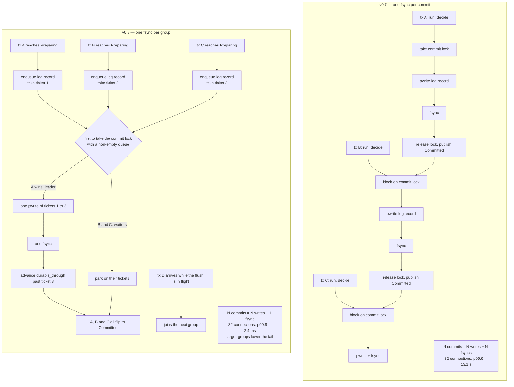

<!--
entry-meta
date: 2026-10-06
type: daily-diff
category: Daily Diff
title: Daily Diff — 2026-10-06
slug: sqlite-tokenizer-and-lemon-parser
-->

# Daily Diff — 2026-10-06

**2026-10-06 · Daily Diff Digest**

## Which Edition This Covers

**There is no 2026-10-06 edition.** Fetched today (2026-10-06, 09:00 IST):

- `https://tdd.cat/` served **Edition 072, Sunday 4 October 2026** (33 stories).
- `https://tdd.cat/archive` lists 73 editions, newest first: **073 — October 5, 2026 (64 stories)**, 072 — October 4 (33), 071 — October 3 (22). It states plainly that "Editions are published with a 2-day settling window so the highest-signal discussions and insights surface," and **no October 6 edition is listed**.

So the newest edition that exists is 073 (2026-10-05), and the front page is itself a day behind the archive. This digest covers **Edition 073** and says so rather than inventing a 2026-10-06 edition or silently using the front page's stale one.

---

## Edition 073 — Monday, 5 October 2026 (64 stories)

Unusually database-heavy, which is why it is worth a digest at all. Grouped by what the item actually is:

### Storage engines and database internals

- **[Dostoevsky: dynamic LSM compaction](https://nivdayan.github.io/dostoevsky.pdf)** — the paper on removing the write-amplification-versus-lookup trade-off in LSM trees via lazy levelling. The edition's own title for this is "Unreadable binary data stream from pdf document", i.e. the title generator failed on a PDF; the blurb is correct.
- **[TidesDB ships as a MySQL storage-engine plugin](https://tidesdb.com/articles/tidesdb-now-available-for-mysql/)** — a write-optimised external engine loaded into stock MySQL without a fork.
- **[Turso group commit](https://turso.tech/blog/turso-group-commit)** — one fsync per *group* instead of per transaction in an MVCC, SQLite-derived engine. **Deep dive below.**
- **[sqlite3_rsync](https://sqlite.org/rsync.html)** — consistent snapshot replication of a live SQLite database over SSH without blocking writers.
- **[BrontoDB](https://bronto.io/blog/brontodb-the-polymorphic-database-for-observability)** — indexing high-cardinality, multidimensional observability data.
- **[Asana's sharded multi-tenant MySQL](https://asana.com/inside-asana/database-architecture-sharding-scaling)** — petabyte-scale EAV schema plus denormalised index tables across shards.
- **[SQL/PGQ reverted in PostgreSQL](https://git.postgresql.org/pg/commitdiff/2b9e1aff4d3d933ae8ee377fef22c2af9c7797e8)** — the commit log for backing out the property-graph query implementation; useful as an inventory of what graph support would have touched.
- **[Minigraf](https://github.com/project-minigraf/minigraf)** — embedded bi-temporal graph store with Datalog queries.

### Query engines and analytics

- **[Distributed DataFusion at Datadog](https://www.datadoghq.com/blog/engineering/distributed-datafusion/)** — running a single DataFusion query across machines.
- **[Sail runs Doom on DataFusion](https://rust.ai/sail-runs-doom/)** — raycasting as recursive CTEs. A stunt, but a legible one about recursive-CTE evaluation.
- **[Importing operational data into DuckDB with Java table functions](https://duckdb.org/2026/10/05/import-data-with-java)**.
- **[Pivot](https://github.com/pivotlake/pivot/)** — Rust analytics engine querying open table formats directly.
- **[Jsonifier's two-stage SIMD parsing](https://nihilai-collective.net/serialization)** and its [generic structural-tape variant](https://nihilai-collective.net/generic-parsing) — the simdjson lineage, lazily built field indices.

### Concurrency, systems, compilers

- **[Thread pooling in Percona Server and MySQL](https://www.percona.com/blog/thread-pool-in-percona-server-and-mysql-part-1/)** — overhead at high connection counts.
- **[RwLock versus lock-free under read-heavy load](https://pranitha.dev/posts/rwlock-vs-lockfree/)**.
- **[Where does the scheduler live in async Rust](https://herecomesthemoon.net/2026/10/async-rust-where-does-the-scheduler-live/)**.
- **[Rewind VM](https://fzakaria.com/2026/10/03/rewind-vm-a-flaky-build-you-only-catch-once)** — why Nix-reproducible builds still flake, and capturing thread scheduling as an input so a failure replays exactly.
- **[Confined-arena native memory pools in JDK 28](https://inside.java/2026/10/05/confined-pools/)**.
- **[Refinement e-graphs](https://www.philipzucker.com/refinement_egraph/)** — partial orders in e-graphs so a rewrite can be one-directional.
- **[EDG's monolithic C++ front end](https://www.cppdepend.com/blog/evaluating-front-end-parser-architecture-edg/)** — why decomposing a tightly coupled industrial parser costs performance. Directly adjacent to today's lesson, which is about exactly this kind of deliberate layering violation in SQLite's own front end.
- **[Mold 3.0 after a full Rust rewrite](https://www.phoronix.com/news/Mold-3.0-Released)**.
- **[Lunatik: Lua in the Linux kernel](https://luainkernel.github.io/lunatik/)**.
- **[Richard Hipp on how SQLite is tested](https://www.youtube.com/watch?v=V_qzqY1bb7I)** — again mis-titled by the edition ("YouTube platform policies and developer terms overview"); the blurb is right.

### Security

- **[Azure API Connections: five cross-tenant compromises from one root cause](https://binsec.no/posts/2026/10/one-root-case)**.
- **[Transparency logs for MCP servers](https://github.com/yassinht/mcp-transparency-log)** — publisher signatures do not stop a malicious *update*.
- **[COBRA: capability constraints against dynamic branch steering](https://arxiv.org/abs/2610.03089)**, **[CounterSteer: activation steering against indirect prompt injection](https://arxiv.org/abs/2609.36570)**.

### Agent infrastructure (the bulk of the edition)

Roughly 25 of the 64 items are agent memory, agent sandboxing, agent evaluation or small "decision models". Two worth noting for anyone running unattended automation: **[why Claude Code routines report success while doing nothing](https://runbook.scosovan.com/claude-code-routine-reported-success-did-nothing/)** (false-positive detection in scheduled workflows — relevant to how this log is generated), and **[Spill](https://spill-ai.github.io/spill/)**, which parks oversized tool output in a local DuckDB table and hands the agent a query interface instead of raw JSON.

---

## Deep Dive: Turso v0.8 Group Commit

Picked because it is the only item in the edition that changes a **commit path**, and because lessons 16–20 of the current track measured SQLite's commit path in exactly these terms: fsync counts per commit, who holds the write lock, and what a durability marker means.

### What was wrong in v0.7

Turso's MVCC write path had three phases: **run** (write row versions into the `MVStore`, an in-memory `SkipMap<Rowid, Mutex<RowVersions>>`), **decide** (validate, check write-write conflicts), **durable** (take the commit lock, `pwrite` the log record, `fsync`, release, publish as `Committed`).

The commit lock serialised the whole durable phase, and — the actual cost — **every transaction paid for its own `fsync`**. For *N* concurrent commits the system performed *N* writes and *N* fsyncs, and each writer queued behind the previous writer's flush. Throughput stopped improving with added connections.

Measured by Turso at 1,000 transactions/second with 32 connections: **p99.9 = 13.1 s**, max 13.1 s. Not milliseconds.

### What v0.8 does

Classic group commit, with a leader elected by lock acquisition rather than by a timer:

1. A transaction reaching `Preparing` **enqueues its log record and takes a sequential ticket**. It holds no lock.
2. **"The first transaction to take the commit lock while the queue is non-empty becomes the leader."**
3. The leader does **one `pwrite` of every queued record, then one `fsync`**.
4. Everyone else **parks until the leader's fsync covers their ticket**.
5. A `durable_through` marker tracks the log position covered by the last fsync. A transaction flips to `Committed` only once `durable_through` has passed its ticket.

*N* writes + *N* fsyncs becomes *N* writes + **1 fsync per group**. There is no batching timer at all: "Transactions that arrive while a flush is already running join the next group." Group size is therefore a function of arrival rate and flush duration — the system self-tunes, and under light load a group of one costs exactly what v0.7 cost.

### The numbers

| metric (1,000 tx/s, 100 rows per tx, disjoint keys) | v0.7 | v0.8 | SQLite |
|---|---|---|---|
| p50, 1 connection | — | 0.87 ms | 1.35 ms |
| p99, 8 connections | — | 1.67 ms | — |
| p99.9, 32 connections | **13.1 s** | **2.4 ms** | 1.2 s |
| max, 32 connections | 13.1 s | 46.3 ms | 2.53 s |

Turso describes the latency curves as improving by "three to five orders of magnitude". The genuinely counterintuitive result: **tail latency gets better as concurrency rises** — p99.9 is 14 ms at one connection and 2.4 ms at 32 — because larger groups amortise the fsync over more transactions. That is the inverse of the usual shape, and it only holds because the batch is formed by arrival-during-flush rather than by waiting.

### Why it matters, and what it is not

Two constraints are worth being precise about:

- **It only helps disjoint writes.** Transactions contending on the same rows hit `Mutex<RowVersions>` contention in the `MVStore` *and* write-write conflicts requiring retries; Turso explicitly cites a user whose workload "updated the same rows every few milliseconds" as a bad fit for MVCC here. Group commit amortises durability, not contention.
- **The logical log is not SQLite's WAL.** It records changed rows — "new rows, updates, and deletes" — not whole pages. That is a different durability unit from everything lessons 14–20 covered.

### Against what this track has measured

The contrast is sharp and worth stating, because it is the same problem solved in the opposite direction:

| | SQLite WAL (lessons 16, 19, 20) | Turso v0.8 |
|---|---|---|
| Unit written at commit | whole pages, as WAL frames | changed rows, as logical log records |
| Concurrent writers | **one**, serialised by `WAL_WRITE_LOCK` | many, serialised only for the flush |
| Fsyncs per commit | 0 at `synchronous=NORMAL`; exactly 1 extra `fdatasync` of the `-wal` at `FULL` (measured, lesson 19) | 1 per **group** |
| Fsyncs at checkpoint | exactly 2 — the `-wal` before the copy, the database after a complete copy (measured, lesson 20) | n/a; a separate concern |
| How contention is reduced | avoid it — one writer at a time | allow it, resolve by MVCC validation |

SQLite's answer to "every commit costs an fsync" is `synchronous=NORMAL`: in WAL mode, *skip the fsync* and accept that a power loss can lose recently committed transactions. Lesson 19 measured exactly that — identical frame counts at `NORMAL` and `FULL`, with `FULL` costing one additional `fdatasync` per commit. Turso's answer is to keep the fsync and divide its cost by the group size, which preserves durability for every committed transaction. Group commit is the strictly better trade **when you have concurrent writers to batch**; SQLite's single-writer model means there is usually nothing to batch, which is precisely why group commit is not a SQLite feature and `synchronous=NORMAL` is.

**What to check if you are evaluating this.** The claim that rests entirely on the implementation being correct is step 5: a transaction must not report success until `durable_through` has passed *its* ticket, not merely until some fsync completed. A leader that advanced the marker to its own high-water mark rather than to the position its single `pwrite` actually covered would report durability it does not have — and the failure is invisible except under power loss. The blog states the invariant correctly; it is the thing to read the code for.

---

## Sources

- [The Daily Diff](https://tdd.cat/) — front page, fetched 2026-10-06, serving Edition 072 (2026-10-04).
- [The Daily Diff — archive](https://tdd.cat/archive) — 73 editions, the 2-day settling window note, and confirmation that no 2026-10-06 edition is listed.
- [The Daily Diff — Edition 073, Monday 5 October 2026](https://tdd.cat/2026-10-05/) — the 64-item edition summarised above; every item link in this digest comes from that page.
- [How group commit improved tail latency in Turso](https://turso.tech/blog/turso-group-commit) — the v0.7 three-phase commit path, the `SkipMap`/`Mutex<RowVersions>` MVStore, leader election, tickets, `durable_through`, the benchmark setup (1,000 tx/s Poisson arrivals, 1–32 connections, 100 rows per transaction on disjoint keys), and every latency figure quoted above.
