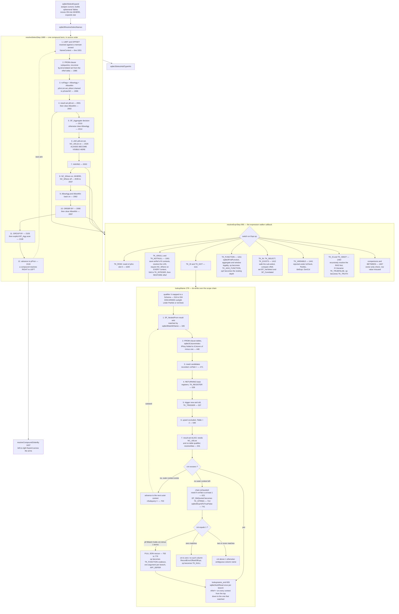

<!--
entry-meta
date: 2026-10-07
type: lesson
track: SQLite
lesson: 22
category: Database Internals
title: Name Resolution — the Outward Walk, Seven Candidate Sources, and a NOT NULL Optimization That Returns a Wrong Answer on 3.45.1
slug: sqlite-name-resolution-expr-select-trees
-->

# Name Resolution — the Outward Walk, Seven Candidate Sources, and a `NOT NULL` Optimization That Returns a Wrong Answer on 3.45.1

**2026-10-07 · SQLite Track · Lesson 22 of 33**

## Where This Fits

- [Lesson 21](../2026-10-06-sqlite-tokenizer-and-lemon-parser/README.md) stopped at the grammar-symbol boundary: `sqlite3GetToken()` → `keywordCode()` → `%fallback` → a shift or reduce action. It deliberately did not open a single reduce action's body, and it measured the double-quoted-string misfeature only at the **tokenizer** level (`"zzz"` comes out of `sqlite3GetToken()` as `TK_ID`).
- This lesson picks up one layer later. The reduce actions have run and produced a tree of `Expr`, `ExprList`, `Select` and `SrcList` objects in which every identifier is still just a **string**. `src/resolve.c` (2367 lines) turns those strings into `(cursor, column)` pairs. Where lesson 21's interesting content was three deliberate scanner/grammar layering violations, this lesson's is a single 595-line function, `lookupName()`, that searches **seven** different candidate sources in a fixed priority order, and the externally visible consequences of that order.
- Three mechanisms carry it: the **outward `NameContext` walk** with its `nRef` counter (which is also how SQLite decides a subquery is correlated); **`resolveAlias()`**, which physically swaps a result-set expression into the referencing node and is why `WHERE x<10` can see `SELECT a+b AS x`; and **`areDoubleQuotedStringsEnabled()`**, where lesson 21's tokenizer-level DQS measurement finally gets resolved into either a column or a string.
- What it sets up: at the end of resolution every `TK_ID`/`TK_DOT` node has become `TK_COLUMN` with `iTable` = a cursor number and `iColumn` = a column index, or `TK_TRIGGER`/`TK_REGISTER` for trigger and `RETURNING` references. Lesson 23 takes those nodes into the VDBE, where `iTable`/`iColumn` become `OP_Column` operands and the register allocator takes over. This lesson does not emit a single bytecode instruction.

**Version caveat, stated up front** (same discipline as lessons 18–21): source is read at trunk commit **`9f05c6e6`** (not lesson 21's `466e0851` — trunk moved); every measurement is on the system `libsqlite3.so.0` reporting **3.45.1** (`sourceid 2024-01-30 16:01:20 e876e51a0ed5...`). For this lesson the two disagree in two places, and **one of them is a wrong answer, not a cosmetic difference** — see sections 8 and 9. Both are reported rather than reconciled.

---

## 1. The Objects Resolution Operates On

Lesson 21 named these four and stopped. Here is what resolution actually reads and writes in each. Line numbers are `src/sqliteInt.h` at `9f05c6e6`.

### `Expr` (3071–3133) — one node, several union-tagged meanings

The fields resolution touches, and nothing else:

| Field | Before resolution | After resolution (success) |
|---|---|---|
| `op` | `TK_ID`, `TK_DOT`, `TK_FUNCTION`, `TK_STRING`… | `TK_COLUMN`, `TK_AGG_FUNCTION`, `TK_TRIGGER`, `TK_REGISTER`, `TK_TRUTH`, `TK_STRING`, `TK_INTEGER`, `TK_NULL` |
| `u.zToken` | the identifier text, dequoted | still the text; meaningless for `TK_COLUMN` |
| `iTable` | — | **VDBE cursor number** of the source table (or a register number for `TK_REGISTER`, or `1`/`0` for trigger `new`/`old`) |
| `iColumn` | — | column index; **`-1` means the rowid** |
| `y.pTab` | — | the `Table` object |
| `affExpr` | — | `SQLITE_AFF_INTEGER` for a rowid; `SQLITE_AFF_DEFER` for a synthesized `coalesce()` |
| `flags` | `EP_DblQuoted` if the token came from `"…"` | `+ EP_CanBeNull`, `EP_Leaf`, `EP_Agg`, `EP_Win`, `EP_VarSelect`, `EP_FromDDL` |
| `w.iOfst` | byte offset of the token in the statement | read back by `sqlite3RecordErrorOffsetOfExpr()` — **this is section 6** |
| `op2` | — | `TK_AGG_FUNCTION`: **aggregate nesting depth** |

Two structural facts matter later. First, `Expr` is **truncatable**: `EP_TokenOnly` means everything from `pLeft` down does not exist, `EP_Reduced` means everything from `nHeight` down does not exist (3086–3101). Resolution asserts against both before writing (`assert( !ExprHasProperty(pExpr, EP_TokenOnly|EP_Reduced) )`, `resolve.c:296`). Second, `op` is rewritten **in place** — resolution is a destructive mutation of the parse tree, not a lowering into a new IR. The same `Expr` node is a `TK_ID` holding a string one moment and a `TK_COLUMN` holding a cursor number the next.

### `ExprList_item` (3274–3298) — where the result set carries its names

```c
Expr *pExpr;        /* the parse tree for this expression */
char *zEName;       /* token associated with this expression */
struct { u8 sortFlags; unsigned eEName:2; unsigned done:1; ...
         unsigned bUsed:1; unsigned bUsingTerm:1; ... } fg;
union { struct { u16 iOrderByCol; u16 iAlias; } x; ... } u;
```

`eEName` is a **two-bit tag on what `zEName` means** (3308–3311):

| `eEName` | Value | `zEName` holds | Set when |
|---|---|---|---|
| `ENAME_NAME` | 0 | the `AS` name | there is an explicit alias |
| `ENAME_SPAN` | 1 | the original result-set text | otherwise |
| `ENAME_TAB` | 2 | `"DATABASE.TABLE.COLUMN"` | `SF_NestedFrom` subqueries |
| `ENAME_ROWID` | 3 | `"DATABASE.TABLE.<rowid-alias>"` | the implicit rowid of a nested-FROM subquery |

Only `ENAME_NAME` participates in alias lookup (`resolveAsName`, `resolve.c:1529-1540`; the alias branch of `lookupName`, `656-658`). Only `ENAME_TAB`/`ENAME_ROWID` participate in `sqlite3MatchEName()` (`125-158`), which is the string-splitting matcher used for parenthesized FROM-clause subsets. `ENAME_SPAN` is never matched against anything — it exists for `sqlite3_column_name()`. This is why `SELECT a+b FROM t ORDER BY "a+b"` does not work while `SELECT a+b AS x FROM t ORDER BY x` does.

`u.x.iOrderByCol` is the channel between the two halves of `ORDER BY`/`GROUP BY` resolution, and section 5 is entirely about it.

### `SrcItem` (3393–3445) and `NameContext` (3538–3552)

`SrcItem` is one FROM-clause term. Resolution reads `zName`, `zAlias`, `pSTab`, `fg.jointype`, `fg.isUsing`, `u3.pUsing`, `fg.isNestedFrom`, `iCursor`; it writes `colUsed`, `fg.rowidUsed`, and `fg.isCorrelated`.

`NameContext` is the scope:

```c
struct NameContext {
  Parse *pParse;
  SrcList *pSrcList;          /* the tables visible at this level */
  union { ExprList *pEList; AggInfo *pAggInfo;
          Upsert *pUpsert; int iBaseReg; } uNC;
  NameContext *pNext;         /* next OUTER context; NULL = outermost */
  int nRef;                   /* names resolved by this context */
  int nNcErr;
  int ncFlags;                /* NC_* */
  u32 nNestedSelect;
  Select *pWinSelect;
};
```

The `uNC` union is four-way and **which member is live is encoded in `ncFlags`**, not in a separate tag: `NC_UEList` (0x80), `NC_UAggInfo` (0x100), `NC_UUpsert` (0x200), `NC_UBaseReg` (0x400). The asserts enforce it (`resolve.c:2025`).

The `NC_*` flags, which are the whole control surface of resolution (sqliteInt.h:3565–3586):

| Flag | Value | Meaning | Who sets it |
|---|---|---|---|
| `NC_AllowAgg` | 0x000001 | aggregates legal here | `resolveSelectStep:1996`, cleared at `2014` |
| `NC_PartIdx` | 0x000002 | resolving a partial-index `WHERE` | `sqlite3ResolveSelfReference` |
| `NC_IsCheck` | 0x000004 | resolving a `CHECK` constraint | ditto |
| `NC_GenCol` | 0x000008 | resolving `GENERATED ALWAYS AS` | ditto |
| `NC_HasAgg` | 0x000010 | an aggregate was **seen** | `resolveExprStep:1396` |
| `NC_IdxExpr` | 0x000020 | resolving `CREATE INDEX` expressions | `sqlite3ResolveSelfReference` |
| **`NC_SelfRef`** | **0x00002e** | **combo: PartIdx\|IsCheck\|GenCol\|IdxExpr** | — |
| `NC_Subquery` | 0x000040 | a subquery was seen | `resolveExprStep:1438` |
| `NC_UEList` | 0x000080 | `uNC.pEList` is live | `resolveSelectStep:2027` |
| `NC_MinMaxAgg` | 0x001000 | `min()`/`max()` seen | `resolveExprStep` |
| `NC_AllowWin` | 0x004000 | window functions legal here | `1996`, cleared at `2002`, `2097` |
| `NC_IsDDL` | 0x010000 | inside a `CREATE` statement | `sqlite3ResolveSelfReference:2360` |
| `NC_FromDDL` | 0x040000 | SQL text came from `sqlite_schema` | `2350` |
| `NC_NoSelect` | 0x080000 | do **not** descend into sub-selects | `resolveOrderByTermToExprList:1581` |
| `NC_Where` | 0x100000 | processing a `WHERE` clause | `2035`, cleared at `2037` |

`NC_SelfRef == 0x2e` is not a flag, it is a **precomputed mask of four flags** — the set of contexts in which the expression may reference exactly one table and nothing else. `lookupName` tests subsets of it in four separate places with different error texts. Note also the deliberate aliasing asserted in the header comment: `NC_HasAgg == SF_HasAgg == EP_Agg`, `NC_HasWin == EP_Win`, `NC_MinMaxAgg == SF_MinMaxAgg == SQLITE_FUNC_MINMAX`, `NC_OrderAgg == SF_OrderByReqd == SQLITE_FUNC_ANYORDER`. That is what lets `resolveExprStep:1393-1398` OR a `FuncDef.funcFlags` value straight into `ncFlags`, and `sqlite3ResolveExprNames:2217` copy `ncFlags` bits straight into `Expr.flags`, with no translation table.

---

## 2. The Four Entry Points, and Where Resolution Sits in `prepare()`

```c
int  sqlite3ResolveExprNames(NameContext*, Expr*);              /* 2196 */
int  sqlite3ResolveExprListNames(NameContext*, ExprList*);      /* 2239 */
void sqlite3ResolveSelectNames(Parse*, Select*, NameContext*);  /* 2295 */
int  sqlite3ResolveSelfReference(Parse*, Table*, int type,
                                 Expr*, ExprList*);             /* 2329 */
```

All four are thin wrappers that fill in a `Walker` and call `sqlite3WalkExpr`/`sqlite3WalkSelect` with two callbacks: `resolveExprStep` (995) and `resolveSelectStep` (1889). The whole of resolution is those two callbacks plus `lookupName`.

For a `SELECT`, the containing phase order is in `sqlite3SelectPrep()` (`select.c:6578-6592`):

```c
if( p->selFlags & SF_HasTypeInfo ) return;
sqlite3SelectExpand(pParse, p);       /* cursors, ephemeral Tables, ON->WHERE, "*" */
if( pParse->nErr ) return;
sqlite3ResolveSelectNames(pParse, p, pOuterNC);
if( pParse->nErr ) return;
sqlite3SelectAddTypeInfo(pParse, p);
```

Three consequences:

- **Cursor numbers already exist** when resolution runs. `SrcItem.iCursor` is assigned by expand, which is why `lookupName` can just copy it (`resolve.c:505`) and why there is an `#ifndef NDEBUG` block at `resolveExprStep:1005-1011` asserting every `iCursor` is in `[0, pParse->nTab)`.
- **`*` is already expanded**, so resolution never sees a `TK_ASTERISK` in a result set. It does see the `ENAME_TAB` spans that expansion left behind.
- **`ON` has already been rewritten into `WHERE`** for outer joins, with `EP_OuterON`/`EP_InnerON` recording where each term came from. Hence the `SF_OnToWhere` post-check at `2127`.

`resolveSelectStep` guards both directions of this: `SF_Resolved` short-circuits re-entry (`1901`), and if a `Select` arrives **not** expanded — which happens when a subquery is reached through `sqlite3ResolveExprNames` with no prior `SelectPrep` — it calls `sqlite3SelectPrep` itself and prunes (`1916-1919`). The ordering is maintained by the callee, not the caller.

`sqlite3ResolveSelfReference` is the odd one out: it builds a **fake single-entry `SrcList` on the stack** (`union { SrcList sSrc; u8 srcSpace[SZ_SRCLIST_1]; } uSrc;`, `2334-2337`) with `iCursor = -1`, and sets `ncFlags = type | NC_IsDDL`. Its five callers are enumerated in its own header comment: `CHECK` constraints, partial-index `WHERE`, index-on-expression, `VACUUM INTO` arguments (type `0`, so `TK_COLUMN` is an error), and `GENERATED ALWAYS AS`.

---

## 3. `resolveSelectStep`: the Clause Order Is the Scoping Rules

This is the part worth memorising, because every surprising scoping behaviour in SQLite falls out of it mechanically. One iteration of the loop in `resolveSelectStep` (`1923-2135`), in source order:

| # | Line | Action | `ncFlags` state | Observable consequence |
|---|---|---|---|---|
| 1 | 1928 | `selFlags |= SF_Resolved` | — | re-entry is a no-op |
| 2 | 1931–1938 | **LIMIT / OFFSET**, with a `memset`-zeroed `NameContext` | **all clear**, no `pSrcList` | `LIMIT` can reference no column at all, not even by alias |
| 3 | 1946–1958 | if `SF_Converted`, move `pOrderBy` **down** into the single subquery | — | a compound rewritten by `convertCompoundSelectToSubquery()` resolves its `ORDER BY` as the child's |
| 4 | 1960–1991 | recurse into FROM-clause subqueries; set `fg.isCorrelated` from the `nRef` delta | outer NC's `nNestedSelect` bumped | **section 7** |
| 5 | 1996–1998 | `ncFlags = NC_AllowAgg\|NC_AllowWin`; `pSrcList = p->pSrc`; `pNext = pOuterNC` | agg ✓ win ✓ alias ✗ | the scope chain is linked here |
| 6 | 2001 | **result set** (`pEList`) | agg ✓ win ✓ alias ✗ | a result-set term cannot reference another result-set alias |
| 7 | 2002 | `ncFlags &= ~NC_AllowWin` | agg ✓ **win ✗** | — |
| 8 | 2010–2015 | if `pGroupBy \|\| NC_HasAgg` → `selFlags \|= SF_Aggregate`; **else** `ncFlags &= ~NC_AllowAgg` | — | `misuse of aggregate` in a non-aggregate query |
| 9 | 2026–2027 | `uNC.pEList = p->pEList`; `ncFlags \|= NC_UEList` | **alias ✓** from here on | aliases become visible to everything below |
| 10 | 2028–2034 | **HAVING** — errors first if `(selFlags & SF_Aggregate)==0` | agg ✓ win ✗ alias ✓ | `HAVING clause on a non-aggregate query` |
| 11 | 2035–2037 | `NC_Where` on → **WHERE** → `NC_Where` off | agg ? win ✗ alias ✓ **where ✓** | the `NC_Where` window is **three lines wide**; section 8 lives inside it |
| 12 | 2041–2049 | table-valued-function arguments | as above, `NC_Where` off | `FROM f(x)` arguments see the FROM clause and the aliases |
| 13 | 2062 | `ncFlags \|= NC_AllowAgg\|NC_AllowWin` | agg ✓ **win ✓** | window functions legal again |
| 14 | 2065–2073 | if `SF_Converted`, move `pOrderBy` back **up** | — | by now its terms are integers |
| 15 | 2083–2091 | **ORDER BY**, unless this is the right-most term of a compound (`isCompound<=nCompound`) | agg ✓ win ✓ alias ✓ | — |
| 16 | 2097 | `ncFlags &= ~NC_AllowWin` | agg ✓ **win ✗** | a window function in `GROUP BY` is `misuse of window function` |
| 17 | 2102–2115 | **GROUP BY**, then an explicit `EP_Agg` scan over its terms | agg ✓ win ✗ alias ✓ | `aggregate functions are not allowed in the GROUP BY clause` |
| 18 | 2118–2122 | compound arity check | — | `SELECTs to the left and right of %s do not have the same number of result columns` |
| 19 | 2127–2130 | `SF_OnToWhere` → `sqlite3SelectCheckOnClauses` | — | an `ON` term may not reference a table to its right |
| 20 | 2134 | `p = p->pPrior` | — | **a compound is resolved right-to-left** |
| 21 | 2141 | after the loop: `resolveCompoundOrderBy(pLeftmost)` | — | **section 5** |

Four things to pull out of that table:

- **`LIMIT` is resolved against a zeroed `NameContext`.** Not a restricted one — an empty one. The `memset` at `1931` is the entire mechanism, and it happens *first*, before the FROM clause has even been walked.
- **Aliases become visible exactly at step 9**, which is after the result set and before `HAVING`. So `HAVING` and `WHERE` see aliases; the result set does not. Measured: `SELECT count(*) AS c FROM t HAVING c>0` → `3`.
- **`NC_Where` is on for three lines.** Whatever depends on it is a `WHERE`-clause-only behaviour by construction, and it is impossible to reach from `HAVING`, `ORDER BY` or a result set. On trunk, the `NOT NULL` strength reduction depends on it. On 3.45.1 it does not exist — section 8.
- **`NC_AllowWin` is turned off twice and back on once.** The off/on/off pattern across steps 7, 13 and 16 is why the window-function diagnostics are position-sensitive in a way the aggregate ones are not.

---

## 4. `lookupName()`: Seven Candidate Sources in a Fixed Order

`lookupName` (`resolve.c:278-872`) is 595 lines and resolves `Z`, `Y.Z` or `X.Y.Z`. Its header comment lists what it writes; the body is a `do { … } while(pNC)` loop over the scope chain starting at `339` and advancing at `703`.

Two counters drive everything:

- **`cnt`** — number of real column matches. `cnt==1` is success; `cnt==0` is `no such column`; `cnt>1` is `ambiguous column name` **unless** `pFJMatch` rescues it (section 6).
- **`cntTab`** — number of tables that are *rowid candidates*. Only consulted if `cnt` is still 0.

Inside one scope level, candidates are tried in this order:

| Order | Source | Lines | Notes |
|---|---|---|---|
| 1 | `SF_NestedFrom` subquery result sets, via `sqlite3MatchEName` | 345–404 | parenthesized FROM subsets: `FROM t1 LEFT JOIN (t2 RIGHT JOIN t3 USING(x)) USING(y)` |
| 2 | ordinary FROM-clause tables, via `sqlite3ColumnIndex` | 406–470 | `iPKey` is folded to `iColumn = -1` here (`458`) |
| 3 | rowid candidates recorded for later | 471–502 | `VisibleRowid(pTab)` gate; `cntTab++` only |
| 4 | `RETURNING` base registers | 528–536 | needs `NC_UBaseReg`; yields `TK_REGISTER` with `op2 = TK_COLUMN` |
| 5 | trigger `new.*` / `old.*` | 537–544 | yields `TK_TRIGGER`, `iTable = 1`/`0`; sets `pParse->newmask`/`oldmask` |
| 6 | upsert `excluded.*` | 548–556 | `iTable = EXCLUDED_TABLE_NUMBER` (**2**, `resolve.c:22`), then rewritten to `TK_REGISTER` |
| 7 | result-set **alias** | 641–694 | needs `NC_UEList` **and** `zTab==0`; calls `resolveAlias` and `goto lookupname_end` |

Then, between levels: `if( cnt ) break; pNC = pNC->pNext; nSubquery++;` (`702-705`). After the loop falls off the end, two last resorts that are **not** per-level:

- **`rowid`/`_rowid_`/`oid`** (`621-639`) — fires only if `cnt==0 && cntTab>=1 && pMatch`, and is forbidden under `NC_IdxExpr|NC_GenCol`.
- **the double-quoted string** (`710-740`) and `true`/`false` (`741-743`) — section 9.

Three details of the mechanism that are easy to miss:

**`nSubquery` is a repair counter, not a loop index.** It counts how many levels outward the alias travelled, and is passed to `resolveAlias` → `incrAggFunctionDepth(pDup, nSubquery)` (`resolve.c:39-46`), which walks the duplicated tree bumping `Expr.op2` on every `TK_AGG_FUNCTION`. Copying an aggregate inward would otherwise mis-record its nesting depth.

**`colUsed` is set from the resolved node, not the name** (`816-823`). `sqlite3ExprColUsed` (`179-200`) returns `1<<n` for column *n*, clamped at `BMS-1`, **except** that a reference to a generated column returns `ALLBITS` — a generated column could read anything in the row, so the covering-index optimization has to assume the worst. `iColumn < 0` sets `fg.rowidUsed` instead.

**The qualifier `X` can be the magic string `"*"`.** At `431` the test is `if( pSchema==0 && strcmp(zDb,"*")!=0 ) continue;` — i.e. an unresolvable schema name normally kills the match, but `"*"` is allowed through with `pSchema==0`, matching any schema. This is used by `ALTER TABLE` processing, not by anything a user can type.

**Database qualifiers are silently *discarded*, not rejected, inside `CHECK` constraints and partial indexes** (`313-319`): `if( (pNC->ncFlags & (NC_PartIdx|NC_IsCheck))!=0 ) zDb = 0;` with the comment *"Do not raise errors because that might break legacy and because it does not hurt anything to just ignore the database name."*

### `isValidSchemaTableName()`: the schema table's four names, asymmetrically

`isValidSchemaTableName` (`228-247`) is reached only when `zTab` fails to match `pItem->zAlias` and `pTab->zName`, and only when `pTab->tnum==1`. It compares *suffixes from byte 7* — everything after `"sqlite_"`. For the **temp** schema table it accepts `sqlite_temp_schema` unconditionally, but accepts `sqlite_schema` and `sqlite_master` **only if `zDb!=0`** (`236-240`). Measured on 3.45.1, exactly as the branch structure predicts:

```
SELECT sqlite_schema.name       FROM sqlite_master       → OK
SELECT sqlite_master.name       FROM sqlite_schema       → OK
SELECT sqlite_temp_schema.name  FROM temp.sqlite_master  → OK
SELECT sqlite_temp_master.name  FROM temp.sqlite_master  → OK
SELECT temp.sqlite_schema.name  FROM temp.sqlite_master  → OK           (zDb != 0)
SELECT sqlite_schema.name       FROM temp.sqlite_master  → no such column: sqlite_schema.name
```

The last two lines differ only by the presence of a schema qualifier on the *column* reference, and that is the entire content of lines 236–240.

---

## 5. `ORDER BY` and `GROUP BY`: Two Passes, One `u16`, and a Real Asymmetry

`ORDER BY`/`GROUP BY` resolution is split across two functions that communicate through `ExprList_item.u.x.iOrderByCol`, a `u16`.

**Pass 1 — `resolveOrderGroupBy` (static, `1826-1884`).** For each term, in order:

1. **If this is `ORDER` and not `GROUP`** (`zType[0]!='G'`, line `1846`): try `resolveAsName` against the result set. On a hit, set `iOrderByCol` and `continue` — *without ever resolving the term as a column*.
2. If the term is an integer constant: range-check `iCol<1 || iCol>0xffff` (note: **not** against `nExpr`), set `iOrderByCol`, `continue`.
3. Otherwise resolve it as an ordinary expression, then compare it against every result-set term with `sqlite3ExprCompare` and set `iOrderByCol` on an exact match.

**Pass 2 — `sqlite3ResolveOrderGroupBy` (public, `1748-1776`).** For each term with a non-zero `iOrderByCol`: range-check against `pEList->nExpr`, then `resolveAlias(pParse, pEList, iOrderByCol-1, pItem->pExpr, 0)`.

Step 1's guard is the whole asymmetry: **in `ORDER BY`, a result-set alias is tried before the FROM clause; in `GROUP BY`, it is not.** So an alias that shadows a real column changes what `ORDER BY` means but not what `GROUP BY` means. Measured on 3.45.1:

```sql
CREATE TABLE s(a,b);
INSERT INTO s VALUES(3,1),(1,2),(2,3);

SELECT b AS a FROM s ORDER BY a;              -- 1, 2, 3        → sorted by b
SELECT b AS a, count(*) FROM s GROUP BY a;    -- (2,1),(3,1),(1,1) → grouped by the real a
```

Both statements contain the token `a` in a trailing clause, both have a result-set alias named `a` and a base column named `a`, and they resolve it to **different objects**. The `GROUP BY` output is `b` read in `a`-order (rows `(1,2)`, `(2,3)`, `(3,1)`), which is only possible if grouping used column `a`.

### The two out-of-range sites, told apart by `sqlite3_error_offset()`

The duplicated range check is observable, because the two sites pass different `pError` arguments to `resolveOutOfRangeError` (`1609-1622`), which calls `sqlite3RecordErrorOffsetOfExpr(pParse->db, pError)`:

- `resolveOrderGroupBy:1857` passes **`pE2`** → an offset is recorded.
- `sqlite3ResolveOrderGroupBy:1770` passes **`0`** → nothing is recorded, offset stays `-1`.
- `resolveCompoundOrderBy:1676` passes **`pE`** → an offset is recorded.

And the boundary between the first two is `0xffff`, because that is pass 1's range check. Measured — same error *message* every time, three different offsets:

| Statement | `sqlite3_error_offset()` | Which site |
|---|---|---|
| `SELECT a FROM t ORDER BY 9` | **-1** | pass 2, `pError=0` |
| `SELECT a FROM t ORDER BY 65535` | **-1** | pass 2 |
| `SELECT a FROM t ORDER BY 65536` | **25** | pass 1, `iCol>0xffff` |
| `SELECT a FROM t ORDER BY 70000` | **25** | pass 1 |
| `SELECT a FROM t GROUP BY 9` | **-1** | pass 2 |
| `SELECT a FROM t GROUP BY 70000` | **25** | pass 1 |
| `SELECT a FROM t UNION SELECT b FROM t ORDER BY 9` | **47** | `resolveCompoundOrderBy` |
| `SELECT a FROM t UNION SELECT b FROM t ORDER BY 70000` | **47** | `resolveCompoundOrderBy` |

All eight produce the text `1st ORDER BY term out of range - should be between 1 and 1` (or `GROUP BY`). The error offset is the only externally visible difference between three distinct code paths, and the `65535`/`65536` step is `0xffff` showing through.

### Compound `ORDER BY`: left-to-right, with a fixpoint loop

`resolveCompoundOrderBy` (`1637-1734`) reverses the `pPrior` chain into a `pNext` chain (`1655-1659`), then loops over the compound terms **left to right** with a `moreToDo` flag, attempting each unresolved `ORDER BY` term against each term's result set in turn. A term resolves against the left-most `SELECT` that matches it; `fg.done` marks it finished. Anything still unresolved after the sweep gets `%r ORDER BY term does not match any column in the result set`.

Note what it does *not* do: it never considers an alias from a non-left-most arm as having priority, and `resolveOrderByTermToExprList` (`1562-1602`) resolves its scratch copy with **`db->suppressErr = 1`** around the call (`1584-1586`) and `NC_NoSelect` in `ncFlags` (`1581`) — so a failed probe is silent and never descends into a subquery. A compound `ORDER BY` term that is invalid everywhere therefore produces the generic "does not match any column" message rather than the real `no such column` that the probe actually hit.

---

## 6. Joins: Which Side Wins, and the Synthesized `coalesce()`

When a bare column name matches more than one FROM-clause table, `cnt` goes above 1 and the default is `ambiguous column name`. The four-way branch that overrides this appears **twice**, identically — once for `SF_NestedFrom` subqueries (`375-402`) and once for ordinary tables (`441-468`):

```c
if( pItem->fg.isUsing==0
 || sqlite3IdListIndex(pItem->u3.pUsing, zCol)<0 ){
   /* not a USING column: genuinely ambiguous */
   sqlite3ExprListDelete(db, pFJMatch); pFJMatch = 0;
}else
if( (pItem->fg.jointype & JT_RIGHT)==0 ){
   continue;                        /* INNER or LEFT: keep the LEFT-most */
}else
if( (pItem->fg.jointype & JT_LEFT)==0 ){
   cnt = 0;                         /* RIGHT: keep the RIGHT-most */
   sqlite3ExprListDelete(db, pFJMatch); pFJMatch = 0;
}else{
   extendFJMatch(pParse, &pFJMatch, pMatch, pExpr->iColumn);  /* FULL */
}
```

So the rule is: **`USING` (or `NATURAL`) makes a duplicate name legal, and the join type picks the winner** — left-most for inner and left joins, right-most for right joins, and for a full join neither, because neither is correct.

For a `FULL JOIN`, `extendFJMatch` (`208-226`) appends a fresh `TK_COLUMN` node carrying `EP_CanBeNull` to `pFJMatch`, and the resolution of the bare name becomes, at `763-779`:

```c
extendFJMatch(pParse, &pFJMatch, pMatch, pExpr->iColumn);
pExpr->op = TK_FUNCTION;
pExpr->u.zToken = "coalesce";
pExpr->x.pList = pFJMatch;
pExpr->affExpr = SQLITE_AFF_DEFER;
cnt = 1;
```

A `TK_ID` node is rewritten into a **function call that never appeared in the SQL text**. Measured:

| Statement | Result |
|---|---|
| `SELECT x FROM t1, t2` | `ambiguous column name: x` |
| `SELECT x FROM t1 JOIN t2 USING(x)` | `2` |
| `SELECT x FROM t1 LEFT JOIN t2 USING(x)` | `1, 2` (left-most) |
| `SELECT x FROM t1 RIGHT JOIN t2 USING(x)` | `2, 3` (right-most) |
| `SELECT x FROM t1 FULL JOIN t2 USING(x)` | `1, 2, 3` |
| `SELECT t1.x, t2.x, x FROM t1 FULL JOIN t2 USING(x)` | `(1,NULL,1) (2,2,2) (NULL,3,3)` |

The last row is the proof: the unqualified `x` is `1` where `t1.x` is `1`, and `3` where `t1.x` is `NULL` and `t2.x` is `3`. That is `coalesce(t1.x, t2.x)`, and nothing in the statement said so.

In the bytecode it does **not** appear as `OP_Function`, because `coalesce` is an inlined function in the code generator. The three instructions at 19–21 are the whole of it (3.45.1, `EXPLAIN SELECT x FROM t1 FULL JOIN t2 USING(x)`):

```
19  Column   0 0 r8     ; t1.x
20  NotNull  r8 → 22    ; if t1.x is not null, keep it
21  Column   1 0 r8     ; else t2.x
22  ResultRow r8 1
```

One more detail: the rescue only fires when `pFJMatch->nExpr == cnt-1` (`764`). If the ambiguity was *also* genuine — the same column name appearing twice on one side, or a non-`USING` duplicate anywhere in the chain — the branches above have already set `pFJMatch = 0`, the count no longer agrees, and the list is discarded in favour of the error. The assertion `assert( pFJMatch==0 || cnt>0 )` at `759` and `assert( pFJMatch==0 )` at `801` bracket exactly that invariant. Finally, when the authorizer is active, the synthesized `coalesce()` triggers one `sqlite3AuthRead` call **per branch** (`838-847`), not one for the name the user wrote.

---

## 7. `nRef`, Correlation, and the Alias Swap

### `nRef` is how SQLite decides a subquery is correlated

`lookupName` increments `nRef` on **every** context from the innermost up to and including the one that matched (`lookupname_end`, `854-859`):

```c
for(;;){
  pTopNC->nRef++;
  if( pTopNC==pNC ) break;
  pTopNC = pTopNC->pNext;
}
```

`resolveSelectStep` then reads the delta across a FROM-clause subquery (`1973`, `1984-1986`):

```c
int nRef = pOuterNC ? pOuterNC->nRef : 0;
sqlite3ResolveSelectNames(pParse, pItem->u4.pSubq->pSelect, pOuterNC);
...
pItem->fg.isCorrelated = (pOuterNC->nRef>nRef);
```

and `resolveExprStep`'s subquery arm does the same for expression subqueries (`1420`, `1432-1436`), setting `EP_VarSelect` on the node and `SF_Correlated` on the `Select`. Because `lookupName` bumps every intervening context, checking only the innermost outer context is sufficient — the source comment says so explicitly at `1979-1983`, and it is the reason the single `nRef` integer can substitute for a free-variable analysis.

This is visible from SQL through `EXPLAIN QUERY PLAN`, which prints `CORRELATED SCALAR SUBQUERY` exactly when `isCorrelated`/`EP_VarSelect` is set:

```
SELECT (SELECT count(*) FROM t) FROM o                      →  SCALAR SUBQUERY 1
SELECT (SELECT count(*) FROM t WHERE t.b=o.y) FROM o        →  CORRELATED SCALAR SUBQUERY 1
```

### `resolveAlias` physically swaps two `Expr` nodes

`resolveAlias` (`68-105`) does not point the referencing node at the result-set expression. It duplicates the result-set expression and then **exchanges the two nodes' contents through a stack temporary**:

```c
pDup = sqlite3ExprDup(db, pOrig, 0);
...
incrAggFunctionDepth(pDup, nSubquery);
if( pExpr->op==TK_COLLATE ){
  pDup = sqlite3ExprAddCollateString(pParse, pDup, pExpr->u.zToken);
}
memcpy(&temp, pDup,  sizeof(Expr));
memcpy(pDup,  pExpr, sizeof(Expr));
memcpy(pExpr, &temp, sizeof(Expr));
if( ExprHasProperty(pExpr, EP_WinFunc) ){ pExpr->y.pWin->pOwner = pExpr; }
sqlite3ExprDeferredDelete(pParse, pDup);
```

The three-`memcpy` swap exists because the **pointer to `pExpr` is held by the parent node** and cannot be updated from here. After the swap, `pDup` holds the old `TK_ID` and is queued for deferred deletion; `pExpr` — the same address the parent still points at — holds the copy of the result-set expression. The `EP_WinFunc` fixup is necessary because a `Window` object has a back-pointer to its owning `Expr`, and the owner's *address* just changed meaning.

The `TK_COLLATE` special case is the one documented in the function's header comment, and it is measurable:

```sql
CREATE TABLE cc(s TEXT);  INSERT INTO cc VALUES('b'),('A'),('a'),('B');
SELECT s        FROM cc ORDER BY 1;                  -- A, B, a, b   (BINARY)
SELECT s        FROM cc ORDER BY 1 COLLATE nocase;   -- A, a, b, B
SELECT s AS z   FROM cc ORDER BY z COLLATE nocase;   -- A, a, b, B
```

Without the `sqlite3ExprAddCollateString` call the `COLLATE` would be discarded along with the `TK_ID` node and the third line would sort like the first.

### A copy, so the expression is evaluated once per reference

Because it is a *duplicate*, each alias reference is a separate subtree and gets its own code. The source comment at `2020-2024` says so (*"the expression will be re-evaluated for each reference to it"*) — and it is directly countable with a zero-argument UDF over a three-row table:

| Statement | `ctr()` calls, 3 rows |
|---|---|
| `SELECT ctr() AS x FROM t` | **3** |
| `SELECT ctr() AS x FROM t WHERE x=1` | **6** |
| `SELECT ctr() AS x FROM t WHERE x=1 AND x=1` | **9** |

Three calls per reference per row, linearly. An alias in SQLite is a macro, not a binding.

### Where the alias path refuses

The alias branch has three guards (`658-676`), each with its own message: `misuse of aliased aggregate %s` when `NC_AllowAgg` is clear, `misuse of aliased window function %s` when `NC_AllowWin` is clear or the match came from an outer context, and `row value misused` when `sqlite3ExprVectorSize(pOrig)!=1`.

The window one is reachable, and the asymmetry is exactly step 7 of the table in section 3 — `NC_AllowWin` is cleared immediately after the result set:

```
SELECT row_number() OVER () AS r FROM t WHERE r>0   → misuse of aliased window function r
SELECT row_number() OVER () AS r FROM t ORDER BY r  → 1, 2, 3        (NC_AllowWin back on, step 13)
```

**The aggregate one, I could not reach.** `misuse of aliased aggregate` is present in the shipped 3.45.1 library (confirmed with `strings`), but every construction I tried produced a different error from a different layer:

| Attempt | Actual 3.45.1 result |
|---|---|
| `SELECT count(*) AS c FROM t WHERE c>0` | `misuse of aggregate: count()` |
| `SELECT (SELECT count(*) AS c FROM t WHERE c>0)` | `misuse of aggregate: count()` |
| `SELECT count(*) AS c FROM t GROUP BY c` | `aggregate functions are not allowed in the GROUP BY clause` |
| `SELECT count(*) AS c FROM t HAVING c>0` | `3` |
| `SELECT count(*) AS c FROM t ORDER BY c` | `3` |

The structural reason is visible in section 3: `NC_AllowAgg` is cleared only at step 8, and only when the result set contains **no** aggregate and there is no `GROUP BY` — in which case no alias in that result set can be an aggregate either. The branch looks unreachable from a plain single `SELECT`. I am recording that as *not reached*, not as *dead*: `UPDATE ... FROM`, triggers and converted compounds were not tried.

---

## 8. The `NOT NULL` Strength Reduction, and a Wrong Answer on 3.45.1

`resolveExprStep`'s `TK_ISNULL`/`TK_NOTNULL` arm (`1061-1098`) folds `expr IS NULL` → `FALSE` and `expr IS NOT NULL` → `TRUE` when the operand provably cannot be NULL. The interesting part is not the fold; it is the bookkeeping around it.

```c
case TK_NOTNULL:
case TK_ISNULL: {
  int anRef[8];
  NameContext *p;
  int i;
  for(i=0, p=pNC; p && i<ArraySize(anRef); p=p->pNext, i++){
    anRef[i] = p->nRef;                       /* save */
  }
  sqlite3WalkExpr(pWalker, pExpr->pLeft);
  if( IN_RENAME_OBJECT ) return WRC_Prune;
  if( sqlite3ExprCanBeNull(pExpr->pLeft) ) return WRC_Prune;

  for(i=0, p=pNC; p; p=p->pNext, i++){
    if( (p->ncFlags & NC_Where)==0 ){
      return WRC_Prune;  /* Not in a WHERE clause.  Unsafe to optimize. */
    }
  }
  ...
  pExpr->u.iValue = (pExpr->op==TK_NOTNULL);
  pExpr->flags |= EP_IntValue;
  pExpr->op = TK_INTEGER;
  for(i=0, p=pNC; p && i<ArraySize(anRef); p=p->pNext, i++){
    p->nRef = anRef[i];                       /* restore */
  }
  sqlite3ExprDelete(pParse->db, pExpr->pLeft);
  pExpr->pLeft = 0;
  return WRC_Prune;
}
```

The operand **has to be resolved** to know whether it can be NULL, and resolving it bumps `nRef` on every context up the chain — which, by section 7, is exactly the signal that means *correlated*. So the arm saves `nRef`, resolves, folds, and **restores `nRef`**, un-counting a reference that no longer exists in the tree. This is observable, and it is the cleanest available proof that `nRef` really is the correlation oracle:

```sql
CREATE TABLE o(x INT NOT NULL, y INT);
CREATE TABLE t(a INT NOT NULL, b INT);

SELECT (SELECT count(*) FROM t WHERE o.x IS NOT NULL) FROM o;  -- SCALAR SUBQUERY 1
SELECT (SELECT count(*) FROM t WHERE o.y IS NOT NULL) FROM o;  -- CORRELATED SCALAR SUBQUERY 1
```

The two statements are identical except that `x` is `NOT NULL` and `y` is not. The first subquery references an outer column in its text and is nevertheless **not** correlated — because the reference was folded away and the `nRef` bump was rolled back. Nothing else in SQLite would produce that distinction.

### The 2024-03-28 hazard, reproduced

Trunk carries a long comment dated `2024-03-28` explaining that the optimization is unsafe outside a `WHERE` clause, because a bare column of an aggregated table can be NULL despite `NOT NULL`, and the `NC_Where` loop above is the fix. 3.45.1 was released **2024-01-30** — two months earlier — and does not have that guard. The consequence is a reproducible wrong answer:

```sql
CREATE TABLE e(a INT NOT NULL, b INT);   -- left EMPTY

SELECT a, a IS NULL, a IS NOT NULL, count(*) FROM e;
-- 3.45.1 returns:  (NULL, 0, 1, 0)
-- correct answer:  (NULL, 1, 0, 0)
```

The aggregate query produces one row; `a` is NULL because there was no row to read it from; and `a IS NULL` reports `0`. The folding also shows up with no aggregate at all, which is the direct evidence that 3.45.1 lacks the `NC_Where` test — `EXPLAIN SELECT a IS NOT NULL FROM e` is three instructions with no NULL test anywhere:

```
3  Integer 1 r1          ; a IS NOT NULL, folded
4  ResultRow r1 1
```

whereas the nullable column keeps its test:

```
3  Integer  1 r1
4  Column   0 1 r2       ; b
5  NotNull  r2 → 7
6  Integer  0 r1
7  ResultRow r1 1
```

The join guard, by contrast, **is** present in 3.45.1 and works, because it comes from a different mechanism: `lookupName:507-509` sets `EP_CanBeNull` on any column resolved out of a table with `JT_LEFT|JT_LTORJ`, so `sqlite3ExprCanBeNull` returns true and the fold never runs:

```sql
CREATE TABLE L(k);  INSERT INTO L VALUES(9);
SELECT e.a, e.a IS NULL, e.a IS NOT NULL FROM L LEFT JOIN e ON e.a=L.k;
-- (NULL, 1, 0)   correct
```

So in 3.45.1 the optimization is guarded against the null-extended-join case and unguarded against the empty-aggregate case. If you are running 3.45.x, `<NOT NULL column> IS NULL` in the result set of an aggregate query is a trap; `count(*)` tells you whether the row exists, and the `IS NULL` does not.

---

## 9. Double-Quoted Strings: Where Lesson 21's Measurement Lands

Lesson 21 established that `"zzz"` leaves the tokenizer as `TK_ID` with `EP_DblQuoted` set, and deferred the rest. Here is the rest. Once the outward walk has failed entirely, `lookupName:710-740`:

```c
if( cnt==0 && zTab==0 ){
  assert( pExpr->op==TK_ID );
  if( ExprHasProperty(pExpr,EP_DblQuoted)
   && areDoubleQuotedStringsEnabled(db, pTopNC) ){
    sqlite3_log(SQLITE_WARNING, "double-quoted string literal: \"%w\"", zCol);
    pExpr->op = TK_STRING;
    memset(&pExpr->y, 0, sizeof(pExpr->y));
    return WRC_Prune;
  }
  if( sqlite3ExprIdToTrueFalse(pExpr) ) return WRC_Prune;
}
```

Three conditions gate it, and each is load-bearing: `cnt==0` (a real column wins), `zTab==0` (a *qualified* name is never a string), and `EP_DblQuoted` (only `"`, never `[…]` or backticks). The policy itself is `areDoubleQuotedStringsEnabled` (`161-177`):

```c
if( db->init.busy ) return 1;                  /* always, for legacy schemas */
if( pTopNC->ncFlags & NC_IsDDL ){
  if( sqlite3WritableSchema(db) && (db->flags & SQLITE_DqsDML)!=0 ) return 1;
  return (db->flags & SQLITE_DqsDDL)!=0;
}else{
  return (db->flags & SQLITE_DqsDML)!=0;
}
```

`SQLITE_DqsDDL` is `0x20000000` and `SQLITE_DqsDML` is `0x40000000` (`sqliteInt.h:1897-1898`); the runtime switches are `SQLITE_DBCONFIG_DQS_DML` = **1013** and `SQLITE_DBCONFIG_DQS_DDL` = **1014**. The whole truth table, measured on 3.45.1 (`Connection.setconfig`), with `SELECT "zz" FROM t` for the DML path and `CREATE TABLE c(b TEXT CHECK(b<>"zz"))` for the DDL path:

| `DqsDML` | `DqsDDL` | `writable_schema` | DML: `SELECT "zz"` | DDL: `CHECK(b<>"zz")` |
|---|---|---|---|---|
| on | on | off | accepted | accepted |
| on | on | on | accepted | accepted |
| on | off | off | accepted | **`no such column: zz`** |
| on | off | **on** | accepted | **accepted** ← the odd row |
| off | on | off | `no such column: zz` | accepted |
| off | on | on | `no such column: zz` | accepted |
| off | off | off | `no such column: zz` | `no such column: zz` |
| off | off | on | `no such column: zz` | `no such column: zz` |

The DML column depends on `DqsDML` alone. The DDL column is `DqsDDL || (writable_schema && DqsDML)` — eight rows, and the one that looks wrong is line 4, which is the `sqlite3WritableSchema(db) && SQLITE_DqsDML` clause showing through. Turning on `writable_schema` makes `DqsDDL` irrelevant whenever `DqsDML` is on.

The `db->init.busy` early return is the reason an existing schema never fails to load. Measured: a `CREATE TABLE legacy(b TEXT CHECK(b<>"zz"))` stored by a permissive connection is replayed verbatim from `sqlite_schema`, and loading it on a connection with both flags off succeeds — while *typing the same statement* on that connection is rejected.

Two more measured notes:

- `[zz]` and `` `zz` `` are **never** strings. They set `EP_Quoted`, not `EP_DblQuoted`, so they fail with `no such column: zz` regardless of the flags.
- **3.45.1 does not have the friendly error message.** Trunk's `lookupName:788-791` emits `no such column: "zz" - should this be a string literal in single-quotes?` when `cnt==0` and `EP_DblQuoted`. 3.45.1 emits the plain `no such column: zz`, and the string is absent from the shipped library entirely (checked with `strings`). Do not cite the helpful message as observable on a 3.45.x build.

### `true` / `false`, and the `IS` arm that resolves its own right operand

If the DQS branch declines, `sqlite3ExprIdToTrueFalse` gets a turn (`741-743`) — so `true` and `false` are **identifiers that happen to resolve to literals when nothing else claims them**, not keywords. Lesson 21 showed they are not in the keyword table; this is where they acquire meaning, and a column wins:

```sql
CREATE TABLE tf("true" INT);  INSERT INTO tf VALUES(42);
SELECT 1 IS true;              -- 1
SELECT 1 IS true FROM tf;      -- 0      ← "true" is the column, value 42
SELECT 42 IS true FROM tf;     -- 1
```

The third line is the proof. `EXPLAIN SELECT 1 IS true FROM tf` compiles to `Column 0 0 → Integer 1 → Eq`, i.e. an ordinary equality against the column — not a truth test. The mechanism is `resolveExprStep`'s `TK_IS`/`TK_ISNOT` arm (`1450-1465`), which **recursively calls itself** on the right operand before deciding:

```c
Expr *pRight = sqlite3ExprSkipCollateAndLikely(pExpr->pRight);
if( ALWAYS(pRight) && (pRight->op==TK_ID || pRight->op==TK_TRUEFALSE) ){
  int rc = resolveExprStep(pWalker, pRight);
  if( rc==WRC_Abort ) return WRC_Abort;
  if( pRight->op==TK_TRUEFALSE ){
    pExpr->op2 = pExpr->op;
    pExpr->op = TK_TRUTH;
    return WRC_Continue;
  }
}
/* no break */ deliberate_fall_through
```

`x IS TRUE` becomes `TK_TRUTH` only if the recursive resolve turned the operand into `TK_TRUEFALSE`. Otherwise control falls through into the row-value arity check and `IS` stays `IS`. This is a direct echo of lesson 21's `analyze*Keyword()` functions: the same pattern — resolve one token early, out of order, to decide what a construct means — reappearing one layer up.

---

## 10. The Mechanism, Drawn



---

## Hands-On

All of these run against the system `libsqlite3` through Python's `sqlite3` module; no build is required. Every one makes a **resolution-time** decision visible from outside, which is the only way to see this layer on a release build — `PRAGMA vdbe_trace`, `treetrace` and `sqlite3ShowExpr` all need `-DSQLITE_DEBUG`.

### 1. Reproduce the 3.45.1 `NOT NULL` wrong answer, then prove the join guard works

```python
import sqlite3
db = sqlite3.connect(":memory:")
db.execute("CREATE TABLE e(a INT NOT NULL, b INT)")        # left EMPTY
print(db.execute("SELECT a, a IS NULL, a IS NOT NULL, count(*) FROM e").fetchone())
db.execute("CREATE TABLE L(k)"); db.execute("INSERT INTO L VALUES(9)")
print(db.execute("SELECT e.a, e.a IS NULL, e.a IS NOT NULL"
                 "  FROM L LEFT JOIN e ON e.a=L.k").fetchall())
print([ (r[1],r[2],r[3]) for r in db.execute("EXPLAIN SELECT a IS NOT NULL FROM e") ])
print([ (r[1],r[2],r[3]) for r in db.execute("EXPLAIN SELECT b IS NOT NULL FROM e") ])
```

**What to look for.** On 3.45.1 the first line is `(None, 0, 1, 0)` — the aggregate row's `a` is NULL and `a IS NULL` says `0`. The second line is `[(None, 1, 0)]`, correct, because `lookupName:507` set `EP_CanBeNull` on a column from the null-extended side of a `LEFT JOIN`. The two `EXPLAIN` listings differ by the presence of `NotNull`: the `NOT NULL` column's test is gone entirely, folded to `Integer 1` at resolution time. If your build is new enough to have the `NC_Where` guard, the first line becomes `(None, 1, 0, 0)` and the first `EXPLAIN` grows a `NotNull` — that difference *is* the guard, and it tells you which side of 2024-03-28 your library is on.

### 2. Watch `nRef` decide correlation, and watch it get rolled back

```python
db.execute("CREATE TABLE o(x INT NOT NULL, y INT)"); db.execute("INSERT INTO o VALUES(1,1)")
db.execute("CREATE TABLE t(a INT NOT NULL, b INT)")
for s in ["SELECT (SELECT count(*) FROM t) FROM o",
          "SELECT (SELECT count(*) FROM t WHERE t.b=o.y) FROM o",
          "SELECT (SELECT count(*) FROM t WHERE o.x IS NOT NULL) FROM o",
          "SELECT (SELECT count(*) FROM t WHERE o.y IS NOT NULL) FROM o"]:
    print(s); [print("   ", r[3]) for r in db.execute("EXPLAIN QUERY PLAN "+s)]
```

**What to look for.** Lines 3 and 4 are textually identical except for the column name, and they print `SCALAR SUBQUERY` and `CORRELATED SCALAR SUBQUERY` respectively. The only difference is that `o.x` is `NOT NULL`, so its reference was folded away and the `anRef[8]` restore at `resolve.c:1094-1096` un-counted it. You are looking at the `nRef` counter through `EXPLAIN QUERY PLAN`.

### 3. Count alias re-evaluations with a UDF

```python
calls = [0]
def ctr():
    calls[0] += 1; return 1
db.execute("CREATE TABLE three(i)"); db.executemany("INSERT INTO three VALUES(?)",[(1,),(2,),(3,)])
db.create_function("ctr", 0, ctr)
for s in ["SELECT ctr() AS x FROM three",
          "SELECT ctr() AS x FROM three WHERE x=1",
          "SELECT ctr() AS x FROM three WHERE x=1 AND x=1"]:
    calls[0] = 0; db.execute(s).fetchall(); print(calls[0], s)
```

**What to look for.** 3, 6, 9. Each alias reference is a *duplicate subtree*, not a reference, so it gets its own code and its own evaluation. This is the measurable consequence of `resolveAlias`'s `sqlite3ExprDup` and the thing to remember before writing `SELECT expensive() AS x ... WHERE x > 0`.

### 4. Separate the three out-of-range code paths with `sqlite3_error_offset()`

```python
import ctypes
lib = ctypes.CDLL("libsqlite3.so.0"); lib.sqlite3_errmsg.restype = ctypes.c_char_p
def probe(sql):
    p = ctypes.c_void_p(); lib.sqlite3_open(b":memory:", ctypes.byref(p))
    lib.sqlite3_exec(p, b"CREATE TABLE t(a,b)", None, None, None)
    st = ctypes.c_void_p(); b = sql.encode()
    lib.sqlite3_prepare_v2(p, b, len(b), ctypes.byref(st), None)
    out = (lib.sqlite3_errmsg(p).decode(), lib.sqlite3_error_offset(p))
    lib.sqlite3_close(p); return out
for s in ["SELECT a FROM t ORDER BY 9", "SELECT a FROM t ORDER BY 65535",
          "SELECT a FROM t ORDER BY 65536", "SELECT a FROM t ORDER BY 70000",
          "SELECT a FROM t UNION SELECT b FROM t ORDER BY 9",
          "SELECT a, zzz FROM t", "SELECT a FROM t WHERE qqq=1"]:
    print("%-50s %s" % (s, probe(s)))
```

**What to look for.** Identical messages, three different offsets: `-1` for terms inside `1..0xffff` (caught in pass 2, which passes `pError=0`), the term's own offset for terms above `0xffff` (caught in pass 1), and the term's offset for the compound path. The `65535`/`65536` boundary is pass 1's `iCol>0xffff` literal. Also note that ordinary `no such column` errors *do* carry an offset — which refines lesson 21's note that `sqlite3_error_offset()` is `-1` for everything after parsing: it is `-1` only where the error site passes no `Expr`.

### 5. Build the DQS truth table yourself

```python
def cell(dml, ddl, ws, sql):
    d = sqlite3.connect(":memory:")
    d.setconfig(sqlite3.SQLITE_DBCONFIG_DQS_DML, dml)
    d.setconfig(sqlite3.SQLITE_DBCONFIG_DQS_DDL, ddl)
    if ws: d.setconfig(sqlite3.SQLITE_DBCONFIG_WRITABLE_SCHEMA, True)
    d.execute("CREATE TABLE t(a,b)")
    try: d.execute(sql); return "accept"
    except Exception as ex: return str(ex)
for dml in (True, False):
  for ddl in (True, False):
    for ws in (False, True):
      print(dml, ddl, ws,
            "|", cell(dml,ddl,ws, 'SELECT "zz" FROM t'),
            "|", cell(dml,ddl,ws, 'CREATE TABLE c(b TEXT CHECK(b<>"zz"))'))
```

**What to look for.** The DDL column is `DqsDDL || (writable_schema && DqsDML)`, so the row `DqsDML=True, DqsDDL=False, writable_schema=True` accepts the `CHECK` constraint. That single anomalous row is `areDoubleQuotedStringsEnabled`'s `sqlite3WritableSchema(db) && (db->flags & SQLITE_DqsDML)` clause, visible from SQL. Then replace `"zz"` with `[zz]` and with `` `zz` `` and confirm both stay errors in all eight rows — those set `EP_Quoted`, not `EP_DblQuoted`.

### 6. Make the synthesized `coalesce()` visible

```python
d = sqlite3.connect(":memory:")
d.execute("CREATE TABLE t1(x,y)"); d.execute("CREATE TABLE t2(x,z)")
d.executemany("INSERT INTO t1 VALUES(?,?)", [(1,'a'),(2,'b')])
d.executemany("INSERT INTO t2 VALUES(?,?)", [(2,'B'),(3,'C')])
print(d.execute("SELECT t1.x, t2.x, x FROM t1 FULL JOIN t2 USING(x)").fetchall())
for r in d.execute("EXPLAIN SELECT x FROM t1 FULL JOIN t2 USING(x)"):
    print(r[0], r[1], r[2], r[3], r[4])
```

**What to look for.** `(1, None, 1) (2, 2, 2) (None, 3, 3)` — the bare `x` is non-NULL on both sides, so it cannot be either table's column. In the listing, find the `Column / NotNull / Column` triple: that is the inlined `coalesce()` that `lookupName:769-777` wrote into the tree. Then run the same query with `LEFT JOIN` and `RIGHT JOIN` and watch the left-most/right-most rule from section 6.

### 7. The `ORDER BY` / `GROUP BY` alias asymmetry

```python
d = sqlite3.connect(":memory:")
d.execute("CREATE TABLE s(a,b)"); d.executemany("INSERT INTO s VALUES(?,?)",[(3,1),(1,2),(2,3)])
print(d.execute("SELECT b AS a FROM s ORDER BY a").fetchall())
print(d.execute("SELECT b AS a, count(*) FROM s GROUP BY a").fetchall())
```

**What to look for.** `[(1,),(2,),(3,)]` versus `[(2,1),(3,1),(1,1)]`. The same token `a` in a trailing clause resolves to the alias in one statement and to the base column in the other, because `resolveOrderGroupBy:1846` tries `resolveAsName` only when `zType[0]!='G'`. Then add `"true"` as a column name and rerun section 9's `SELECT 1 IS true FROM tf` to see the same "a column always beats the special case" rule in a second place.

---

## Where This Breaks Down

- **The alias extension is non-standard, and it is a textual copy.** The source calls it "a (goofy) SQLite extension, that is supported for backwards compatibility only" and logs a warning on `sqlite3_log()` — and because `resolveAlias` duplicates the subtree, the cost is linear in references, measured at 3 UDF calls per reference per row. Portable SQL cannot use it; SQLite SQL that does use it pays for it per mention.
- **`anRef[8]` is a fixed-size array and the save/restore is silently partial.** `for(i=0, p=pNC; p && i<ArraySize(anRef); ...)` bounds both the save and the restore at eight contexts, but the `NC_Where` test loop in between has **no bound** and walks the whole chain. Past eight levels of nesting the fold can still fire while the `nRef` restore covers only the inner eight, so a subquery more than eight levels out could be left marked correlated when its only reference was folded away. That is a conservative direction (a missed optimization, not a wrong answer), but it is a silent cliff with no diagnostic.
- **Resolution mutates the parse tree in place, which is why re-entry needs a flag.** `SF_Resolved` and the three `ExprHasProperty(EP_Reduced|EP_TokenOnly)` asserts are the guardrails. There is no immutable IR and no way to resolve the same tree against two different scopes — `IN_RENAME_OBJECT` mode exists precisely because `ALTER TABLE` needs the *name* information that resolution destroys, and it has to run a parallel path (`sqlite3RenameTokenRemap` calls at `429`, `686`, `1141-1143`) that is sprinkled through the same functions.
- **Two range checks for one error, in two functions, with different limits.** `0xffff` in pass 1, `pEList->nExpr` in pass 2. The message is identical; only the error offset distinguishes them. A caller that trusts `sqlite3_error_offset()` to be meaningful for every error will get `-1` for the common case.
- **A compound `ORDER BY` probe is silent by construction.** `resolveOrderByTermToExprList` sets `db->suppressErr = 1` and `NC_NoSelect`, so a term that is genuinely misspelled reports `does not match any column in the result set` rather than `no such column`. The real diagnostic is thrown away.
- **`misuse of aliased aggregate` appears to be unreachable from a single `SELECT`.** The string is in the library; `NC_AllowAgg` is cleared only in exactly the case where no result-set alias can contain an aggregate. Either there is a reaching path I did not construct (`UPDATE ... FROM`, triggers, converted compounds) or it is dead code. Recorded as unresolved.
- **The DQS misfeature cannot be fully turned off for existing schemas**, by design: `db->init.busy` returns 1 unconditionally. A database created by a permissive application will always load on a strict one, so `SQLITE_DQS=0` protects new statements, not stored ones. The `writable_schema && DqsDML` row makes the DDL policy depend on a flag that has nothing to do with DDL.
- **`sqlite3ExprColUsed` returns `ALLBITS` for any generated-column reference.** One reference to one generated column marks every column of the table as used, which defeats covering-index detection for the whole table. Correct, but coarse — and invisible unless you are reading `EXPLAIN QUERY PLAN` and wondering why the index stopped covering.
- **Nothing in this layer is traceable on a release build.** `PRAGMA treetrace` / `sqlite3TreeTrace`, `sqlite3ShowExpr`, and `PRAGMA parser_trace` are all behind `SQLITE_DEBUG`. Every claim in this lesson about the internal walk is source-read; only the consequences are measured. That is the same constraint lesson 21 ended on, and it is not going away for the rest of Part IV.

---

## Further Study

- [Quirks, Caveats, and Gotchas In SQLite](https://www.sqlite.org/quirks.html) — section 8 is the canonical statement of the double-quoted-string misfeature with the three mitigations (`-DSQLITE_DQS=0`, `SQLITE_DBCONFIG_DQS_DDL`, `SQLITE_DBCONFIG_DQS_DML`), and section 7 covers the keywords-as-identifiers rules that lesson 21 measured.
- [SQLITE_DBCONFIG_DQS_DML / DQS_DDL](https://www.sqlite.org/c3ref/c_dbconfig_defensive.html) — the two switches used in Hands-On 5, their default (`SQLITE_DQS` compile-time), and the rest of the `sqlite3_db_config()` verb list including `WRITABLE_SCHEMA` and `TRUSTED_SCHEMA`.
- [SELECT](https://www.sqlite.org/lang_select.html) — the documented scoping rules: that `ORDER BY` may use an output column name or an integer index, that `GROUP BY` terms are "evaluated in the context of the FROM clause", and the `USING`/`NATURAL` duplicate-column semantics that section 6 traces to a single four-way branch.
- [UPSERT](https://www.sqlite.org/lang_upsert.html) — where `excluded.*` comes from, which is candidate source 6 in section 4.
- [The RETURNING clause](https://www.sqlite.org/lang_returning.html) — candidate source 4, and the reason `NC_UBaseReg` and `TK_REGISTER` exist in the resolver at all.
- [Query Planner Overview](https://www.sqlite.org/optoverview.html) — read the `WHERE`-clause analysis section with section 6 in mind; the `colUsed` bitmask this lesson watches being written is what the covering-index logic reads.
- [Architecture of SQLite](https://www.sqlite.org/arch.html) — the layer diagram, for the record that "resolve" is not a separate box in it: it is inside the parser box, which is exactly the point.

---

## Next Steps

1. **Settle the `misuse of aliased aggregate` question.** Try `UPDATE t SET b=1 FROM (…) AS src WHERE …` with an aliased aggregate, a `CREATE TRIGGER` body, and a compound rewritten by `convertCompoundSelectToSubquery()`. If none reaches it, instrument a `SQLITE_DEBUG` build with a breakpoint on `resolve.c:659` and fuzz; if it is genuinely dead, that is worth reporting upstream.
2. **Determine exactly which release added the `NC_Where` guard**, and whether the empty-aggregate wrong answer in section 8 was ever filed as a ticket. The fix comment is dated 2024-03-28 and 3.45.1 is 2024-01-30; bisect the Fossil history between 3.45.1 and 3.46.0 for the commit that introduces the `NC_Where` loop, then check 3.46.0 against the Hands-On 1 script.
3. **Find the eight-context cliff.** Generate nested subqueries 7, 8, 9 and 10 levels deep, each referencing a `NOT NULL` outer column only inside `IS NOT NULL`, and check with `EXPLAIN QUERY PLAN` whether `CORRELATED` reappears past level 8 as the `anRef[8]` bound predicts. If it does, that is the first directly observable consequence of the fixed-size array.
4. **Build with `-DSQLITE_DEBUG` and turn on `sqlite3TreeTrace`** to dump the `Expr` tree before and after resolution for `SELECT a+b AS x FROM t WHERE x<10`. The `resolveAlias` three-`memcpy` swap should be visible as the same node address holding a different `op`; that converts section 7 from source-read to measured.
5. **Map the `sqlite3AuthRead` call count for a `FULL JOIN USING`.** Install an authorizer and confirm it is called once per `coalesce()` branch rather than once for the written name (`resolve.c:838-847`). Any security policy written against column names on a full join needs to know this.
6. **Instrument `lookupName` with a per-candidate-source counter** and run it over a real statement log. Seven sources are tried in a fixed order on every identifier; find out whether sources 4–7 are ever hit outside triggers and upserts, and whether the two duplicated four-way join branches (`375-402` and `441-468`) are both live in practice.

---

## Sources

- [src/resolve.c @ 9f05c6e6, sqlite/sqlite](https://github.com/sqlite/sqlite/blob/9f05c6e66b0034c490479a589dcc141d7e4cb626/src/resolve.c) — 2367 lines. `EXCLUDED_TABLE_NUMBER` 22; `incrAggDepth`/`incrAggFunctionDepth` 35/39; `resolveAlias` 68–105 (the three-`memcpy` swap 95–97, `TK_COLLATE` 91–93); `sqlite3MatchEName` 125–158; `areDoubleQuotedStringsEnabled` 161–177; `sqlite3ExprColUsed` 179–200; `extendFJMatch` 208–226; `isValidSchemaTableName` 228–247; `lookupName` 278–872 (qualifier to schema 316–334, scope loop 339/703, nested-FROM match 345–404, FROM tables 406–470, `iPKey` to −1 448, `EP_CanBeNull` 507, trigger/upsert/RETURNING 517–615, rowid 621–639, alias branch 641–694, DQS 710–740, `ExprIdToTrueFalse` 741, error texts 785–795, `colUsed` 816–823, `coalesce` rescue 763–779, `lookupname_end` 835–861); `notValidImpl` 917–933 with the `sqlite3ResolveNotValid` macro 935–937; `resolveExprStep` 995–1517 (`TK_ROW` 1020, `TK_ISNULL`/`TK_NOTNULL` 1061–1098, `TK_ID`/`TK_DOT` 1111–1148, `TK_FUNCTION` 1151–1409, subquery arm 1412–1439, `TK_VARIABLE` 1441, `TK_IS` 1450–1465, vector arity 1467–1501); `resolveAsName` 1520–1542; `resolveOrderByTermToExprList` 1562–1602; `resolveOutOfRangeError` 1609–1622; `resolveCompoundOrderBy` 1637–1734; `sqlite3ResolveOrderGroupBy` 1748–1776; `resolveOrderGroupBy` 1826–1884; `resolveSelectStep` 1889–2145; `sqlite3ResolveExprNames` 2196–2237; `sqlite3ResolveExprListNames` 2239–2293; `sqlite3ResolveSelectNames` 2295–2320; `sqlite3ResolveSelfReference` 2329–2367.
- [src/sqliteInt.h @ 9f05c6e6, sqlite/sqlite](https://github.com/sqlite/sqlite/blob/9f05c6e66b0034c490479a589dcc141d7e4cb626/src/sqliteInt.h) — `SQLITE_DqsDDL`/`SQLITE_DqsDML` 1897–1898; `VisibleRowid` 2584; `struct Expr` 3071–3133 with the `EP_*` flags 3141–3172 and the `EP_Agg == NC_HasAgg == SF_HasAgg` constraint comment 3135–3139; `struct ExprList` 3271–3298 and `ENAME_*` 3308–3311; `struct SrcItem` 3393–3445; `struct SrcList` 3457; `struct NameContext` 3538–3552 with its nesting comment 3519–3537 and the `NC_*` flags 3565–3586; `struct Select` 3629–3650 and the `SF_*` flags 3661–3691.
- [src/select.c @ 9f05c6e6, sqlite/sqlite](https://github.com/sqlite/sqlite/blob/9f05c6e66b0034c490479a589dcc141d7e4cb626/src/select.c) — `sqlite3SelectExpand` 6493; `sqlite3SelectAddTypeInfo` 6554; `sqlite3SelectPrep` 6578–6592, including the `SF_HasTypeInfo` short-circuit and the expand → resolve → add-type-info order quoted in section 2.
- [Quirks, Caveats, and Gotchas In SQLite](https://www.sqlite.org/quirks.html) — the double-quoted-string misfeature, its three mitigations, and the keyword-as-identifier rules.
- [SQLITE_DBCONFIG_* verb list](https://www.sqlite.org/c3ref/c_dbconfig_defensive.html) — `SQLITE_DBCONFIG_DQS_DML` (1013), `SQLITE_DBCONFIG_DQS_DDL` (1014), `SQLITE_DBCONFIG_WRITABLE_SCHEMA` (1011).
- [SELECT](https://www.sqlite.org/lang_select.html) — `ORDER BY` output-column-name and integer-index rules, `GROUP BY` evaluation context, `USING`/`NATURAL` duplicate-column semantics.
- [Error Codes And Messages (`sqlite3_error_offset`)](https://sqlite.org/c3ref/errcode.html) — the byte-offset API used in section 5 and Hands-On 4.

Measurements were taken against the system `libsqlite3.so.0` reporting `sqlite3_libversion() = 3.45.1`, `sqlite3_sourceid() = 2024-01-30 16:01:20 e876e51a0ed5c5b3126f52e532044363a014bc594cfefa87ffb5b82257ccalt1`, on x86-64 Linux, via Python 3.13's `sqlite3` module and `ctypes`. Source line numbers are from trunk `9f05c6e6`. Section 8 and the last note in section 9 are the two places where the two disagree.

---

## Takeaways

- **The clause order in `resolveSelectStep` *is* the scoping rules.** `LIMIT` sees nothing because it is resolved against a `memset`-zeroed `NameContext` at line 1931, before the FROM clause is even walked. Aliases become visible at line 2027 and not before, which is why `WHERE` and `HAVING` can use them and the result set cannot. `NC_Where` is on for three lines. Nothing about SQLite's scoping is a rule written down somewhere; it is the order of twenty statements in one loop.
- **`lookupName` tries seven candidate sources, and the order decides every tie.** FROM tables beat the result-set alias; a real column beats a double-quoted string; a column named `true` beats the `true` literal. "Special case only if nothing else claims the name" is the design, applied three separate times at the tail of one 595-line function.
- **`nRef` is the correlation oracle, and the `NOT NULL` fold proves it.** `lookupName` bumps `nRef` on every context from the innermost to the matching one, so a single integer comparison substitutes for a free-variable analysis. The `TK_NOTNULL` arm saves eight of those counters, resolves, folds, and restores them — and the result is that `(SELECT … WHERE o.x IS NOT NULL)` is *not* correlated when `x` is `NOT NULL`, which `EXPLAIN QUERY PLAN` will show you.
- **3.45.1 returns a wrong answer for `<NOT NULL column> IS NULL` in an aggregate query.** `(NULL, 0, 1, 0)` where `(NULL, 1, 0, 0)` is correct, on an empty table. Trunk's `NC_Where` loop, dated 2024-03-28, is the fix; 3.45.1 shipped 2024-01-30. The null-extended-`LEFT JOIN` case is guarded in both, by a different mechanism (`EP_CanBeNull` set in `lookupName`).
- **An alias is a macro, not a binding.** `resolveAlias` duplicates the subtree and swaps it into the referencing node with three `memcpy`s, because the parent holds the pointer. Measured cost: 3, 6, 9 UDF calls for zero, one and two references over three rows.
- **`ORDER BY` consults aliases before columns; `GROUP BY` does not.** One `zType[0]!='G'` test at `resolveOrderGroupBy:1846`. `SELECT b AS a FROM s ORDER BY a` sorts by `b`; `GROUP BY a` groups by `a`.
- **A `FULL JOIN ... USING` makes the resolver write a function call the user never typed.** `TK_ID` becomes `TK_FUNCTION "coalesce"` with `SQLITE_AFF_DEFER`, one argument per branch, and — if an authorizer is installed — one `sqlite3AuthRead` per branch rather than one for the name.
- **The DQS policy is four lines and has an anomalous row.** DML depends on `DqsDML`; DDL is `DqsDDL || (writable_schema && DqsDML)`; and `db->init.busy` returns 1 unconditionally, so no setting can make an existing schema fail to load.
- **Error offsets distinguish code paths that error messages do not.** Three sites raise the identical `ORDER BY term out of range` text; `sqlite3_error_offset()` returns `-1`, the term's offset, or the term's offset depending on which. That refines lesson 21's claim: the offset is absent not because parsing is over, but because that specific call site passes no `Expr`.
