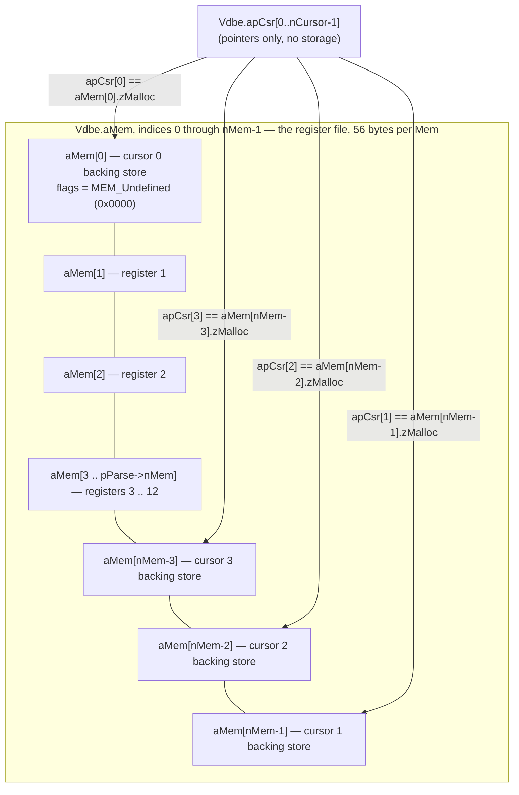
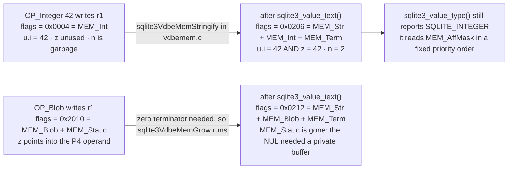

<!--
entry-meta
date: 2026-10-08
type: lesson
track: SQLite
lesson: 23
category: Database Internals
title: The VDBE — One Allocation Holding the Program, the Registers and the Cursors, and a Mem Cell That Caches Two Types at Once
slug: sqlite-vdbe-registers-and-mem-cells
-->

# The VDBE — One Allocation Holding the Program, the Registers and the Cursors, and a `Mem` Cell That Caches Two Types at Once

**2026-10-08 · SQLite Track · Lesson 23 of 33**

## Where This Fits

- [Lesson 22](../2026-10-07-sqlite-name-resolution-expr-select-trees/README.md) ended with every `TK_ID` turned into a `TK_COLUMN` carrying `iTable` (a cursor number) and `iColumn` (a column index), and it emitted no bytecode. It also recorded that it had read no `vdbe.c` and no `vdbeaux.c`, leaving this layer untouched.
- This lesson is where those two integers become operands. `iTable` becomes `OP_Column.p1`; `iColumn` becomes `OP_Column.p2`; a freshly allocated register number becomes `OP_Column.p3`; and `Expr.op2` — the field lesson 22 named and refused to follow — becomes `OP_Column.p5`. The interesting content is not the opcode list. It is three allocation decisions: that the bytecode program, the register file and every open cursor share **one** malloc; that register numbers come from a bump allocator with an eight-slot free list and are never reclaimed; and that a register is a `Mem` struct which can hold an integer **and** a string representation of that integer at the same time.
- Three mechanisms carry it: `sqlite3VdbeMakeReady()`'s `nMem += nCursor` and the `allocSpace()` two-pass carve; `sqlite3GetTempReg()`/`sqlite3ReleaseTempReg()` over `Parse.aTempReg[8]` plus the constant-factoring prologue that lives *past* `OP_Halt`; and the `MEM_*` flag word, where the affinity bits say what the value **is** and the storage bits say who owns `Mem.z`.
- What it sets up: lesson 24 takes type affinity, collating sequences and value comparison — it owns `applyAffinity`, `sqlite3MemCompare` and the `OP_Eq` family, all of which read and rewrite the flag word this lesson establishes. Lesson 25 takes `OP_MakeRecord`, `OP_Insert` and index maintenance; this lesson deliberately stops at the register file's edge and does not follow a value into a record.

**Version caveat, stated up front** (same discipline as lessons 18–22): source is read at trunk commit **`74675a9e`** (not lesson 22's `9f05c6e6` — trunk moved); every measurement is on the system `libsqlite3.so.0` reporting **3.45.1** (`sourceid 2024-01-30 16:01:20 e876e51a0ed5…`). For this lesson the two agree on everything that is measured: the `Vdbe` struct prefix through `aVar`, the whole `sqlite3_value` struct, and all sixteen `MEM_*` constants are byte-for-byte identical between trunk `74675a9e` and the `version-3.45.1` tag, which is what makes the `ctypes` probes below legitimate. The two differences found are noted where they arise (`VdbeCursor.aType` became a `FLEXARRAY`; `sqlite3_context.argc` widened from `u8` to `u16`); neither is touched by any measurement here.

A second constraint, inherited from lessons 21 and 22 and now permanent for Part IV: **this build has no `SQLITE_DEBUG` and no `SQLITE_ENABLE_BYTECODE_VTAB`.** `PRAGMA vdbe_trace`, `PRAGMA vdbe_listing`, `REGISTER_TRACE`, `memAboutToChange` and `Mem.pScopyFrom` are all compiled out, and `bytecode()` does not exist (`select * from bytecode('select 1')` → `no such table: bytecode`). The instruments actually available are `EXPLAIN`, timing, and `ctypes` reading the `Vdbe` and `Mem` structs directly. Every struct offset used below is validated against an independent observable before it is trusted.

---

## 1. An Instruction Is 24 Bytes

`struct VdbeOp` (`src/vdbe.h:54-91`) is the whole instruction set's data model:

| Field | C type | Bytes | What it is |
|---|---|---|---|
| `opcode` | `u8` | 1 | index into the generated `opcodes.h` |
| `p4type` | `signed char` | 1 | one of the `P4_*` tags that discriminates the `p4` union |
| `p5` | `u16` | 2 | flags; `OPFLAG_*` |
| `p1`, `p2`, `p3` | `int` | 12 | signed 32-bit; usually register numbers, cursor numbers or jump targets |
| `p4` | union | 8 | 16 alternatives tagged by `p4type` |

That is 24 bytes on x86-64 with no padding waste — the `u8`/`signed char`/`u16` triple exactly fills the four bytes before the three `int`s. `zComment` (`+8`) only exists under `SQLITE_ENABLE_EXPLAIN_COMMENTS`, `iSrcLine` under `SQLITE_VDBE_COVERAGE`, and `nExec`/`nCycle` under scan-status or `VDBE_PROFILE`. This build has none of them, and section 3 **measures** `sizeof(Op) == 24` rather than asserting it.

The `p4type` tag is worth dwelling on because it is where the VDBE stops being a flat integer machine. `P4_NOTUSED` and `P4_TRANSIENT` are both `0`; everything `<= P4_FREE_IF_LE` (`-7`) owns memory that `freeP4()` must release. So the sign of a `signed char` is the garbage-collection discipline for the entire operand space.

`struct VdbeOpList` (`vdbe.h:109-115`) is the same instruction compressed to four bytes — `u8 opcode` plus three `signed char` operands — used by `sqlite3VdbeAddOpList()` for canned instruction sequences where every operand fits in a byte.

---

## 2. The Dispatch Loop Is a `for` Loop Over Pointers

`sqlite3VdbeExec()` (`vdbe.c:903`) hoists five things into locals before the loop — `aOp`, `aMem`, `db`, `encoding`, and the four operand pointers `pIn1`/`pIn2`/`pIn3`/`pOut` — and then runs

```c
for(pOp=&aOp[p->pc]; 1; pOp++){            /* vdbe.c:988 */
    assert( pOp>=aOp && pOp<&aOp[p->nOp]);
    nVmStep++;
    ...
    switch( pOp->opcode ){
```

Three consequences fall straight out of that loop header, and all three are visible in `EXPLAIN` output:

- **The program counter is a pointer, not an index.** Every jump is written as `pOp = &aOp[target - 1]`, because `pOp++` runs immediately afterwards. The repeated `- 1` at `vdbe.c:1129`, `1136`, `1246`, `1269`, `1294`, `1383` and `2626-2630` is not an off-by-one; it is the loop increment being pre-paid. `OP_Goto` has no `continue` of its own.
- **There is no instruction fetch and no decode.** `pOp->opcode` indexes a `switch`, which GCC compiles to a jump table. The "virtual machine" costs one indirect branch per instruction.
- **`p->pc` is only written when control leaves the loop.** `OP_ResultRow` sets `p->pc = (int)(pOp - aOp) + 1` and `goto vdbe_return` (`vdbe.c:1843-1845`). Between `sqlite3_step()` calls the program counter lives in the `Vdbe`; during a step it lives in a register in the CPU.

The last point is directly measurable. Reading `Vdbe.pc` (offset 48) and `Vdbe.eVdbeState` (offset 199) around a `SELECT a FROM t` that returns one row:

```
  after prepare         : state=1 (READY)  pc = -1
  after step (rc=100)   : state=2 (RUN)    pc = 5
  after step (rc=101)   : state=3 (HALT)   pc = 5
  after reset           : state=1 (READY)  pc = -1
```

`pc = -1` after prepare and after reset is `sqlite3VdbeRewind()` (`vdbeaux.c:2605-2637`) setting it explicitly, so the first `for(pOp=&aOp[p->pc]; ...)` would start at `aOp[-1]` — which is why `sqlite3_step()` does not call `sqlite3VdbeExec()` on a fresh statement until it has advanced `pc` to 0. `pc = 5` is the address after the `OP_ResultRow` at address 4; it stays 5 through the `SQLITE_DONE` step because `OP_Halt` does not move it. The four states are exactly `VDBE_INIT_STATE`/`READY`/`RUN`/`HALT` from `vdbeInt.h`, and `HALT` is the state that makes `sqlite3_step()` return `SQLITE_MISUSE` until someone resets.

---

## 3. One Allocation Holds the Program, the Registers, the Parameters and the Cursor Table

`sqlite3VdbeMakeReady()` (`vdbeaux.c:2659-2756`) is called exactly once per statement, at the end of `sqlite3_prepare_v2()`. It does the arithmetic that decides how big a prepared statement is:

```c
nVar    = pParse->nVar;      /* bound parameters */
nMem    = pParse->nMem;      /* registers the code generator used */
nCursor = pParse->nTab;      /* cursors the code generator opened */
nArg    = pParse->nMaxArg;

nMem += nCursor;                                      /* vdbeaux.c:2691 */
if( nCursor==0 && nMem>0 ) nMem++;  /* space for aMem[0] even if unused */
```

Then it carves four arrays — `aMem`, `aVar`, `apArg`, `apCsr` — out of **the unused tail of the opcode array**, falling back to a second malloc only if that tail is too small:

```c
n = ROUND8P(sizeof(Op)*p->nOp);            /* opcode bytes actually used   */
x.pSpace = &((u8*)p->aOp)[n];              /* first unused opcode byte     */
x.nFree  = ROUNDDOWN8((p->nOpAlloc - p->nOp)*sizeof(Op));
...
p->aMem = allocSpace(&x, 0, nMem*sizeof(Mem));
```

`allocSpace()` hands out space from the **end** of that free region downwards. So for a statement whose opcode array has room left over, `aMem` sits inside `aOp[]`, and its address is fully determined:

$$\texttt{aMem} - \texttt{aOp} \;=\; \mathrm{ROUND8}(24 \cdot n_{op}) \;+\; \mathrm{ROUNDDOWN8}\big(24 \cdot (n_{opAlloc} - n_{op})\big) \;-\; 56 \cdot n_{mem}$$

Measured, with `aOp` at offset 136, `aMem` at 104, `nOp` at 144, `nOpAlloc` at 148, `nMem` at 36:

| SQL | `nOp` | `nOpAlloc` | `nMem` | predicted `aMem-aOp` | measured | match |
|---|---|---|---|---|---|---|
| `SELECT 1` | 5 | 50 | 2 | 1088 | 1088 | ✅ |
| `SELECT a,b,c,d FROM t` | 13 | 50 | 5 | 920 | 920 | ✅ |
| `SELECT * FROM t,u` | 18 | 50 | 8 | 752 | 752 | ✅ |

Three exact hits on a formula containing both `sizeof(Op)` and `sizeof(Mem)` is a simultaneous confirmation of **`sizeof(Op) == 24`, `sizeof(Mem) == 56`, the `ROUND8P`/`ROUNDDOWN8` rounding, and the allocate-downwards direction** — none of which is observable through any API. It also validates the struct offsets used for the rest of this lesson, because a wrong offset for any of the five fields would not have produced three exact matches.

When the tail is too small the second pass fires and `Vdbe.pFree` (offset 256) becomes non-NULL:

| SQL | tail free | `nMem*56` needed | `aMem` in tail? | `pFree` |
|---|---|---|---|---|
| `SELECT * FROM t,u` | 768 | 448 | yes | 0 |
| `SELECT * FROM t,u,t AS t2,u AS u2` | 456 | 896 | no | `0x23fc0e78` |
| `SELECT x,count(*) FROM u GROUP BY x` | 192 | 840 | no | `0x23fc1c88` |

`nOpAlloc` is 50 for every statement above, which is the growth policy in `growOpArray()` arriving at the same plateau for small statements; the leftover is what the two-pass scheme is harvesting. The comment in the source calls the motivation out directly: *"This two-pass approach … can significantly reduce the amount of memory held by a prepared statement."* A connection holding a thousand small prepared statements is the case it is written for.

---

## 4. The Register File Is Also the Cursor Table

This is the part of the VDBE that no amount of reading `EXPLAIN` will tell you, and it is the reason `nMem += nCursor` exists. `allocateCursor()` (`vdbe.c:253-320`) states it plainly:

> The memory cell for cursor 0 is `aMem[0]`. The rest are allocated from the top of the register space. Cursor 1 is at `Mem[p->nMem-1]`. Cursor 2 is at `Mem[p->nMem-2]`. And so forth.

```c
Mem *pMem = iCur>0 ? &p->aMem[p->nMem-iCur] : p->aMem;
...
pMem->z = pMem->zMalloc = sqlite3DbMallocRaw(pMem->db, nByte);
p->apCsr[iCur] = pCx = (VdbeCursor*)pMem->zMalloc;
```

A `VdbeCursor` — with its `BtCursor` appended when `eCurType==CURTYPE_BTREE`, hence `nByte += sqlite3BtreeCursorSize()` — is stored in the `zMalloc` buffer of a register. The register's *value* is never used; the register is being used purely as a growable, lazily-freeable allocator slot. The source gives two reasons: cursor numbers get reused for different-sized allocations within one program, and under `SQLITE_ENABLE_MEMORY_MANAGEMENT` register buffers can be reclaimed by `sqlite3_release_memory()`.

This is directly verifiable. Read `apCsr` (offset 120) as a pointer array, read `aMem` (offset 104), and compare `apCsr[i]` against `aMem[idx].zMalloc` at `idx = 0` for cursor 0 and `idx = nMem - i` otherwise:

```
SELECT a FROM t                       nMem=2  nCursor=1
  cursor 0: apCsr[0]=0x2d7d2828  aMem[0].zMalloc=0x2d7d2828   match=True  szMalloc=416  flags=0x0000

SELECT * FROM t,u                     nMem=8  nCursor=2
  cursor 0: apCsr[0]=0x2d7d2cd8  aMem[0].zMalloc=0x2d7d2cd8   match=True  szMalloc=448  flags=0x0000
  cursor 1: apCsr[1]=0x2d7d2828  aMem[7].zMalloc=0x2d7d2828   match=True  szMalloc=432  flags=0x0000

SELECT * FROM t,u,t AS t2,u AS u2     nMem=16 nCursor=4
  cursor 0: apCsr[0]=0x2d7d1568  aMem[0].zMalloc=0x2d7d1568   match=True  szMalloc=448  flags=0x0000
  cursor 1: apCsr[1]=0x2d7d2cd8  aMem[15].zMalloc=0x2d7d2cd8  match=True  szMalloc=432  flags=0x0000
  cursor 2: apCsr[2]=0x2d7d10b8  aMem[14].zMalloc=0x2d7d10b8  match=True  szMalloc=448  flags=0x0000
  cursor 3: apCsr[3]=0x2d7d3188  aMem[13].zMalloc=0x2d7d3188  match=True  szMalloc=432  flags=0x0000

SELECT * FROM u WHERE y='b'           nMem=5  nCursor=2
  cursor 0: apCsr[0]=0x2d7d2cd8  aMem[0].zMalloc=0x2d7d2cd8   match=True  szMalloc=432  flags=0x0000
  cursor 1: apCsr[1]=0x2d7d10b8  aMem[4].zMalloc=0x2d7d10b8   match=True  szMalloc=432  flags=0x0000
```

Nine cursors across four statements, nine exact pointer matches, and in every case `flags == 0x0000`, which is `MEM_Undefined`: a register holding a cursor is not a valid SQL value and `memIsValid()` would reject it. `szMalloc` differing between 416, 432 and 448 is `SZ_VDBECURSOR(nField) + sqlite3BtreeCursorSize()` varying with the column count — a four-column table's cursor is 16 bytes bigger than a two-column table's, which is `2*nField+1` slots of `aType[]`/`aOffset[]`.



Because the two populations grow towards each other, every opcode that writes a register asserts against the collision point. The canonical form, from `OP_Move` and `OP_ResultRow` (`vdbe.c:1677`, `1809`) and `OP_Column` (`3053`), is

```c
assert( pOut <= &aMem[(p->nMem+1 - p->nCursor)] );
```

Worth noting precisely, because it is easy to over-read: with `nCursor >= 1` that bound is `nMem - nCursor + 1`, i.e. one past the highest register the code generator can legally have used, and the cursor region starts at `nMem - nCursor + 1`. In the `nCursor == 1` case it evaluates to `nMem`, which is one past the end of the array — harmless, because cursor 0 lives at `aMem[0]` and `nMem` was bumped by the `if( nCursor==0 && nMem>0 )` branch's sibling, so no register that high is ever generated. The assert is a guard rail, not a tight bound.

The arithmetic is checkable from outside, since `nMem - nCursor` must equal `pParse->nMem`, the code generator's register high-water mark. Measured:

| SQL | `nOp` | `nMem` | `nCursor` | `nMem - nCursor` | highest register in `EXPLAIN` |
|---|---|---|---|---|---|
| `SELECT 1` | 5 | 2 | 0 | 2 | 1 (`ResultRow 1 1`) — plus the `aMem[0]` bump |
| `SELECT a FROM t` | 9 | 2 | 1 | 1 | 1 (`Rowid 0 1`) |
| `SELECT a,b,c,d FROM t` | 13 | 5 | 1 | 4 | 4 (`ResultRow 1 4`) |
| `SELECT * FROM t,u` | 18 | 8 | 2 | 6 | 6 |
| `SELECT * FROM t,u,t AS t2,u AS u2` | 31 | 16 | 4 | 12 | 12 |
| `SELECT x,count(*) FROM u GROUP BY x` | 42 | 15 | 3 | 12 | 12 |

`SELECT a FROM t` needs exactly **one** register, because `a` is an `INTEGER PRIMARY KEY` and lesson 8 established that it is the rowid: the program emits `Rowid 0 1` rather than `Column 0 0 1`. One cursor, one register, `nMem = 2`.

In every row, `nOp` read from the struct equalled the number of rows `EXPLAIN` returned (checked over 25 statements; no mismatch), which is the independent validation for offset 144.

---

## 5. Register Allocation: a Bump Allocator, an Eight-Slot Free List, and a Prologue After `Halt`

Registers are handed out at **code generation** time, not run time, by four functions in `expr.c:7710-7756`:

```c
int sqlite3GetTempReg(Parse *pParse){
  if( pParse->nTempReg==0 ){
    return ++pParse->nMem;                      /* bump */
  }
  return pParse->aTempReg[--pParse->nTempReg];  /* pop the LIFO */
}
void sqlite3ReleaseTempReg(Parse *pParse, int iReg){
  if( iReg ){
    sqlite3VdbeReleaseRegisters(pParse, iReg, 1, 0, 0);   /* no-op w/o DEBUG */
    if( pParse->nTempReg<ArraySize(pParse->aTempReg) ){
      pParse->aTempReg[pParse->nTempReg++] = iReg;
    }
  }
}
```

`Parse.aTempReg` is `int aTempReg[8]` (`sqliteInt.h:3990`) with `u8 nTempReg`. Ranges get a single block instead of a list: `sqlite3GetTempRange()` keeps exactly one `(iRangeReg, nRangeReg)` pair, and `sqlite3ReleaseTempRange()` only remembers the released block if it is **bigger** than the one already cached. `pParse->nMem` is a monotone high-water mark — it is incremented and never decremented, and `sqlite3TouchRegister()` can only raise it. `sqlite3ClearTempRegCache()` zeroes both the LIFO and the range cache, and the comment says why: after coding a subroutine or coroutine that other code can jump into, no register may be shared across the boundary.

So: how much does an expression cost in registers? Measured as `nMem - nCursor` over `SELECT a FROM t WHERE <k terms>`:

| k terms | `abs(a+i)>0`, each `i` distinct | `abs(a+a)>0`, repeated verbatim |
|---|---|---|
| 1 | 5 | 6 |
| 2 | 6 | 6 |
| 4 | 8 | 6 |
| 8 | 12 | 6 |
| 16 | 20 | 6 |

The right column is **flat at 6 forever**: 16 copies of a term cost the same as one, because each term's temporaries are released and popped straight back off `aTempReg[]`. The left column grows at exactly `+1` per term, and the thing that grows is not the temporary — it is the **literal**. Each distinct constant `i` is factored out into its own permanent register by `sqlite3ExprCodeRunJustOnce()`, tracked on `Parse.pConstExpr`, and those registers are deliberately excluded from reuse (`sqlite3NoTempsInRange()` at `expr.c:7809` asserts no temp overlaps one). `4 + k` registers for `k` distinct constants, measured at k = 1, 2, 4, 8, 16.

Constant factoring is not just a register-accounting curiosity — it reshapes the program, and `EXPLAIN SELECT 1+2*3` shows it:

```
  0  Init              0    4    0
  1  Add               3    2    1
  2  ResultRow         1    1    0
  3  Halt              0    0    0
  4  Integer           1    2    0
  5  Integer           2    4    0
  6  Integer           3    5    0
  7  Multiply          5    4    3
  8  Goto              0    1    0
```

`2*3` is evaluated **once**, at addresses 5–7, in the block *after* `OP_Halt` that `OP_Init` jumps to and `OP_Goto` returns from. Only the `Add` is in the per-row body. This is why `nMem - nCursor` is 6 for a statement with no tables: registers 1–5 hold the result, the folded constants and the product. The run-once prologue is also where `OP_Transaction` lives in every table-touching program, which is why every `EXPLAIN` in this lesson ends `Halt / Transaction / Goto`.

What was **not** found: any discontinuity at the eight-slot boundary. Forcing `k` simultaneously-live temporaries with nested two-argument calls — `max(max(…, b||'0'), b||'1')…` — gives a dead-straight `+3` registers per nesting level from depth 1 through depth 12, with no step at 8 or 9:

```
depth  1: 7      depth  5: 19     depth  9: 31
depth  2: 10     depth  6: 22     depth 10: 34
depth  3: 13     depth  7: 25     depth 11: 37
depth  4: 16     depth  8: 28     depth 12: 40
```

That is the expected shape, and worth stating because the eight-slot array invites the opposite guess: a temporary that is still **live** was never released, so the free list is irrelevant to it. `aTempReg[8]` is a peephole for sequential reuse, not a register budget. Its only consequence is that more than eight temporaries released without an intervening allocation lose the ninth and beyond — a permanently wasted register number, not an error. No construction here made that observable.

---

## 6. A Register Is a `Mem`, and a `Mem` Is Not Monomorphic

`struct sqlite3_value` (`vdbeInt.h:231-257`) is 56 bytes and is the single most important struct in the VDBE. `typedef struct sqlite3_value Mem` is in `vdbe.h:34` — so the public `sqlite3_value*` your UDF receives **is** a register, with no wrapper.

| Offset | Field | Meaning |
|---|---|---|
| 0 | `union u` | `double r` / `i64 i` / `int nZero` / `const char *zPType` / `FuncDef *pDef` |
| 8 | `char *z` | string or blob bytes |
| 16 | `int n` | byte length of `z` |
| 20 | `u16 flags` | the `MEM_*` word |
| 22 | `u8 enc` | `SQLITE_UTF8` / `UTF16LE` / `UTF16BE` |
| 23 | `u8 eSubtype` | the subtype byte |
| — | *`MEMCELLSIZE = offsetof(Mem,db)` = 24* | **everything a shallow copy copies** |
| 24 | `sqlite3 *db` | owning connection |
| 32 | `int szMalloc` | size of `zMalloc` |
| 36 | `u32 uTemp` | scratch; `OP_MakeRecord` parks a serial type here |
| 40 | `char *zMalloc` | the register's own buffer |
| 48 | `void (*xDel)(void*)` | destructor, valid only under `MEM_Dyn` |

The flag word splits in two. Bits `0x3f` are `MEM_AffMask` — six mutually-constrained bits saying what the value *is*:

```
MEM_Null 0x0001   MEM_Str 0x0002   MEM_Int 0x0004
MEM_Real 0x0008   MEM_Blob 0x0010  MEM_IntReal 0x0020
```

Bits `0x1000`–`0x8000` are the **storage discipline** for `Mem.z`, and they are the garbage collector:

```
MEM_Dyn    0x1000   call Mem.xDel(Mem.z)
MEM_Static 0x2000   Mem.z points at something immortal (usually a P4 operand)
MEM_Ephem  0x4000   Mem.z is borrowed and may vanish
MEM_Agg    0x8000   Mem.z is an aggregate accumulator context
```

and the middle bits are modifiers: `MEM_FromBind` (`0x0040`), `MEM_Cleared` (`0x0100`, a NULL that compares unequal even under `IS`), `MEM_Term` (`0x0200`, `z` is NUL-terminated), `MEM_Zero` (`0x0400`), `MEM_Subtype` (`0x0800`).

The header comment is explicit that these combine: *"The `MEM_Int` and `MEM_Real` flags may coexist with the `MEM_Str` flag."* That sentence is the whole design. A register does not convert; it **accumulates**.

Measured, by registering a UDF through `sqlite3_create_function` and reading the 56 bytes of `argv[0]` directly — first on entry, then again after forcing a text representation with `sqlite3_value_text()`:

| argument | flags on entry | decoded | after `sqlite3_value_text()` | decoded |
|---|---|---|---|---|
| `42` (literal) | `0x0004` | `Int` | `0x0206` | `Str\|Int\|Term` |
| `2.5` (literal) | `0x0008` | `Real` | `0x020a` | `Str\|Real\|Term` |
| `'hello'` (literal) | `0x2202` | `Str\|Term\|Static` | `0x2202` | unchanged |
| `x'00ff'` (literal) | `0x2010` | `Blob\|Static` | `0x0212` | `Str\|Blob\|Term` |
| `NULL` | `0x0001` | `Null` | `0x0001` | unchanged |
| `?` bound to `42` | `0x2044` | `Int\|FromBind\|Static` | `0x0246` | `Str\|Int\|FromBind\|Term` |
| `?` bound to `'hello'` | `0x2242` | `Str\|FromBind\|Term\|Static` | `0x2242` | unchanged |
| `INTEGER` column | `0x0004` | `Int` | `0x0206` | `Str\|Int\|Term` |
| `REAL` column holding `5.0` | `0x0008` | `Real` | `0x020a` | `Str\|Real\|Term` |
| `TEXT` column | `0x0202` | `Str\|Term` | `0x0202` | unchanged |
| `BLOB` column | `0x0010` | `Blob` | `0x0212` | `Str\|Blob\|Term` |
| `b \|\| b` (computed text) | `0x0202` | `Str\|Term` | `0x0202` | unchanged |
| `zeroblob(100000)` | `0x0410` | `Blob\|Zero` | `0x0212` | `Str\|Blob\|Term`, `n` 0 → 100000 |
| `1+2` | `0x0004` | `Int` | `0x0206` | `Str\|Int\|Term` |
| `7/2.0` | `0x0008` | `Real` | `0x020a` | `Str\|Real\|Term` |
| `json('{"a":1}')` | `0x0a02` | `Str\|Term\|Subtype` | `0x0a02` | unchanged, `eSubtype = 74 ('J')` |



Four things in that table are worth naming:

1. **`MEM_FromBind` (`0x0040`) appears only for bound parameters** — `0x2044` and `0x2242` — and never for a literal, a column or a computed value. This is the flag the VDBE uses to decide whether a value came from outside, and it is the only externally-visible provenance bit a register carries.
2. **`MEM_Static` (`0x2000`) appears only on literals and bound values**, never on a column read. An `OP_String8` or `OP_Blob` result points `z` straight at the `p4` operand of its own instruction; it owns nothing. A column read goes through `sqlite3VdbeMemGrow()` into the register's own `zMalloc` — measured `szMalloc = 128` for the `TEXT` and `BLOB` columns and for the computed `b||b`, which is the minimum allocation that `sqlite3DbMallocRaw` hands back for small values.
3. **The `BLOB` → text transition destroys `MEM_Static`** (`0x2010` → `0x0212`). The blob was pointing into the P4 operand and had no NUL; adding one required a private buffer. This is exactly the documented pointer-invalidation rule, reached from the inside: the [C interface](https://www.sqlite.org/c3ref/column_blob.html) says *"The initial content is a BLOB and `sqlite3_column_text()` … is called. A zero-terminator might need to be added to the string,"* and *"The pointers returned are valid until a type conversion occurs as described above, or until `sqlite3_step()` or `sqlite3_reset()` or `sqlite3_finalize()` is called."* That rule is not an API quirk; it is `MEM_Static` being dropped and `zMalloc` being allocated under your pointer.
4. **`Mem.n`, `Mem.enc` and `Mem.eSubtype` are undefined when their flags are clear.** The `INTEGER` literal case read `n = 858681203`, `enc = 108`, `eSubtype = 105` — leftover bytes from whatever last used that register. Nothing clears them, because `MemSetTypeFlag` only touches `flags`. Reading `Mem.n` without first checking `MEM_Str|MEM_Blob` is a bug, and the measurement shows what the bug returns.

### `MEM_IntReal`: present in the source, not reachable from a UDF argument

`MEM_IntReal` (`0x0020`) means *an integer in `u.i` that must stringify as a real*. It did not appear in any of the 19 cases above, including the `REAL` column holding `5.0`, which came through as plain `MEM_Real`. Reading the source explains why: `MEM_IntReal` is set in exactly two places on trunk, and both are on write paths.

- `OP_MakeRecord` (`vdbe.c:3630-3633`): after `applyAffinity`, `if( zAffinity[0]==SQLITE_AFF_REAL && (pRec->flags & MEM_Int) ){ pRec->flags |= MEM_IntReal; pRec->flags &= ~MEM_Int; }`
- `OP_TypeCheck` (`vdbe.c:3472-3491`), the `STRICT`-table checker, which sets it only when the integer fits in 6 bytes (`|u.i| <= 140737488355327`) and otherwise converts to a true `double`.

On the read path, `OP_RealAffinity` (`vdbe.c:2195-2199`) calls `sqlite3VdbeMemRealify()`, which produces `MEM_Real`, not `MEM_IntReal` — visible in `EXPLAIN SELECT a,b,c,d FROM t` as the `RealAffinity 3 0 0` at address 6. So **this lesson did not verify `MEM_IntReal` by measurement**; it is reported as source-read only. Lesson 24 owns `applyAffinity` and lesson 25 owns `OP_MakeRecord`, so one of them is the right place to settle it.

---

## 7. `MEM_Zero`: the Bytes That Do Not Exist Until Someone Insists

`MEM_Zero` (`0x0400`), combined with `MEM_Blob`, means `Mem.z` holds `Mem.n` bytes and then `Mem.u.nZero` implicit zero bytes. It is the one place a register is *smaller than its value*, and it is measurable with a stopwatch:

```
    0.003 ms   SELECT typeof(zeroblob(100000000)), length(zeroblob(100000000))   ->  ('blob', '100000000')
  226.793 ms   SELECT typeof(zeroblob(100000000)||x'00'), length(... ||x'00')    ->  ('text', '0')
    0.009 ms   SELECT length(hex(zeroblob(1000)))                               ->  2000
```

A hundred megabytes of blob measured in 3 microseconds, because `n = 0` and `u.nZero = 100000000` and nothing ever touches a byte. The `||` forces `ExpandBlob()` — `#define ExpandBlob(P) (((P)->flags&MEM_Zero)?sqlite3VdbeMemExpandBlob(P):0)` — and the cost jumps by five orders of magnitude to 227 ms.

The `('text','0')` in that second row is two separate behaviours stacking, and both are worth being precise about rather than hand-waving: `||` yields TEXT, and `length()` on a TEXT value counts characters up to the first NUL — the expanded value begins with `0x00`, so the answer is 0 after materialising 100 MB. The 227 ms is the real finding; the `0` is a reminder that `length()` means different things for TEXT and BLOB.

`MEM_Zero` also does **not** survive a round trip through a table. Inserting `zeroblob(100000)` and reading the column back gave `flags = 0x1010` — `MEM_Blob|MEM_Dyn`, `n = 100000` — a fully materialised 100 KB blob in a dynamically-owned buffer. The compact form is an in-register optimization only; `OP_MakeRecord` has to serialise real bytes. And at the top end the limit is `SQLITE_MAX_LENGTH`: `SELECT length(zeroblob(2000000000))` fails with `SQLITE_TOOBIG` (`rc=18`, *"string or blob too big"*) in 7 microseconds, before any allocation.

---

## 8. Moving Values Between Registers: Four Opcodes, Very Different Frequencies

The four register-to-register opcodes differ only in how much of a `Mem` they copy and who owns `z` afterwards.

| Opcode | Source | What it does | Leaves source as |
|---|---|---|---|
| `OP_Move P1 P2 P3` | `vdbe.c:1662-1697` | `sqlite3VdbeMemMove` over `P3` registers; transfers ownership outright | NULL |
| `OP_Copy P1 P2 P3 * P5` | `vdbe.c:1713-1735` | `MemShallowCopy` then `Deephemeralize` — a **deep** copy; `P5&0x0002` also clears `MEM_Subtype` | unchanged |
| `OP_SCopy P1 P2` | `vdbe.c:1751-1764` | `MemShallowCopy(…, MEM_Ephem)` and nothing else — destination borrows `P1`'s bytes | unchanged |
| `OP_IntCopy P1 P2` | `vdbe.c:1772-1780` | `sqlite3VdbeMemSetInt64(pOut, pIn1->u.i)` — asserts `MEM_Int` | unchanged |

`Deephemeralize(P)` (`vdbe.c:242`) is the hinge: `if( ((P)->flags&MEM_Ephem)!=0 && sqlite3VdbeMemMakeWriteable(P) ) goto no_mem;`. `OP_Copy` applies it and `OP_SCopy` does not, and that single line is the entire difference between a copy you can keep and a copy that dangles the moment the source register is rewritten. The opcode documentation is unusually blunt about it: *"if the original is deallocated, the copy becomes invalid. Thus the program must guarantee that the original will not change during the lifetime of the copy."*

Which raises the obvious question: how often does the code generator take that risk? Counted across three corpora of 12, 24 and 25 statements (61 in all, some overlapping) covering joins, `GROUP BY`, `DISTINCT`, `HAVING`, compounds, `ORDER BY` with and without sorter references, `LIMIT`/`OFFSET`, views, recursive CTEs, window functions, `VALUES`, upsert, `RETURNING`, correlated subqueries, row-value `IN`, and an `AFTER INSERT` trigger:

| corpus | statements | `SCopy` | `Copy` | `Move` | `IntCopy` |
|---|---|---|---|---|---|
| first | 12 | 0 | 8 | 1 | 0 |
| second | 24 | 0 | 13 | 1 | 0 |
| third (wide) | 25 | **3** | 23 | 2 | **3** |

`OP_SCopy` appeared in **two** statements across all three, both on the insert path:

```
  {'SCopy': 1, 'IntCopy': 1}  <- INSERT INTO u VALUES(9,'z')
  {'SCopy': 2, 'IntCopy': 2}  <- INSERT INTO w VALUES(1,'q') ON CONFLICT(v) DO UPDATE SET k=k+1
```

It appeared in **none** of the roughly 45 read-only statements across the three corpora, including every `ORDER BY` shape tried. The source says where it can come from: `sqlite3ExprCode()` (`expr.c:6027-6034`) emits `OP_SCopy` when `sqlite3ExprCodeTarget()` returned a register other than `target` *and* the expression is neither a subquery nor a `TK_REGISTER`; otherwise it emits `OP_Copy`. And `sqlite3ExprCodeExprList()` (`expr.c:6092`) picks `OP_SCopy` unless the caller passes `SQLITE_ECEL_DUP`. Both paths exist; neither fired for a plain query in this sample. `OP_Copy` carried 44 of the 50 register-to-register instructions seen.

The honest summary: **the shallow-copy opcode that the documentation explains at greatest length is, on this build and this sample, a DML-path instruction.** Because `OP_SCopy`'s correctness rests entirely on `Mem.pScopyFrom` assertions that only exist under `SQLITE_DEBUG`, that is an uncomfortable combination — the safety net for the dangerous opcode is compiled out of the builds everybody ships. Finding a `SELECT` that emits one is a Next Step; `INSERT`-path codegen is lesson 25's, and this lesson does not open it.

---

## 9. `OP_Column.p5`: the Operand Lesson 22 Handed Over, and a 900× Asymmetry

Lesson 22's note (b) assigned this lesson `OP_Column`'s `p5`, which is `Expr.op2` for a `TK_COLUMN` node. Three `OPFLAG_*` bits live there (`sqliteInt.h:4118-4120`):

```
OPFLAG_LENGTHARG   0x40   result is only used by length()
OPFLAG_TYPEOFARG   0x80   result is only used by typeof() (or IS NULL / IS NOT NULL)
OPFLAG_BYTELENARG  0xc0   result is only used by octet_length()
```

and `OP_Column`'s overflow branch (`vdbe.c:3341-3373`) consults them before deciding whether to read anything:

```c
if( ((p5 = (pOp->p5 & OPFLAG_BYTELENARG))!=0
      && (p5==OPFLAG_TYPEOFARG
          || (t>=12 && ((t&1)==0 || p5==OPFLAG_BYTELENARG))))
 || sqlite3VdbeSerialTypeLen(t)==0 ){
  /* Content is irrelevant … we might as well use bogus content rather
  ** than reading content from disk. */
  sqlite3VdbeSerialGet((u8*)sqlite3CtypeMap, t, pDest);
}else{
  rc = vdbeColumnFromOverflow(pC, p2, t, aOffset[p2], ...);
}
```

`sqlite3CtypeMap` — a 256-byte global that starts with zeros — is handed to the deserialiser as a stand-in for the row data. The length and type come from the record header, which lesson 2 established is enough.

The flags land in `p5` exactly as predicted. On a four-column table:

```
EXPLAIN SELECT typeof(d), length(d), octet_length(d), d FROM t
  3  Column   0  3  5   p5=0x80     <- typeof
  5  Column   0  3  5   p5=0x40     <- length
  7  Column   0  3  5   p5=0xc0     <- octet_length
  9  Column   0  3  4   p5=0x00     <- the bare column
```

And the payoff on a 12 MB table of ten 1.2 MB blobs (best of seven runs, warm cache, so this is CPU and page-walk cost, not I/O):

| query | `Column.p5` | best time | rows |
|---|---|---|---|
| `SELECT typeof(payload) FROM big` | `0x80` | **0.0062 ms** | 10 |
| `SELECT length(payload) FROM big` | `0x40` | 0.010 ms | 10 |
| `SELECT octet_length(payload) FROM big` | `0xc0` | 0.007 ms | 10 |
| `SELECT id FROM big WHERE typeof(payload)='blob'` | `0x80` | 0.0065 ms | 10 |
| `SELECT id FROM big WHERE payload IS NULL` | `0x80` | 0.0025 ms | 0 |
| `SELECT id FROM big WHERE payload IS NOT NULL` | `0x80` | 0.0062 ms | 10 |
| `SELECT payload IS NULL FROM big` | **`0x00`** | **2.2764 ms** | 10 |
| `SELECT length(CAST(payload AS BLOB)) FROM big` | `0x00` | 1.485 ms | 10 |

The sixth and seventh rows are the same predicate on the same column, differing only in where it sits in the statement, and they differ by **a factor of about 900**. `IS NULL` in a `WHERE` clause gets `OPFLAG_TYPEOFARG` and reads nothing; `IS NULL` in the result set gets `p5 = 0` and drags 12 MB through overflow pages to answer a question about the record header.

The cause is one line of codegen, duplicated in the two jump-generating functions (`expr.c:6346` in `sqlite3ExprIfTrue` and `expr.c:6544` in `sqlite3ExprIfFalse`):

```c
case TK_ISNULL:
case TK_NOTNULL: {
  r1 = sqlite3ExprCodeTemp(pParse, pExpr->pLeft, &regFree1);
  assert( regFree1==0 || regFree1==r1 );
  if( regFree1 ) sqlite3VdbeTypeofColumn(v, r1);     /* <-- only here */
  sqlite3VdbeAddOp2(v, op, r1, dest);
```

`sqlite3VdbeTypeofColumn()` (`vdbeaux.c:1313-1321`) is a peephole: it looks at the **last** opcode emitted and sets the flag only if it is an `OP_Column` writing to `iDest`.

```c
void sqlite3VdbeTypeofColumn(Vdbe *p, int iDest){
  VdbeOp *pOp = sqlite3VdbeGetLastOp(p);
  if( pOp->p3==iDest && pOp->opcode==OP_Column ){
    pOp->p5 |= OPFLAG_TYPEOFARG;
  }
}
```

It is called from the two jump paths and **from nowhere else**. The value-producing path, `sqlite3ExprCodeTarget`'s `TK_ISNULL`/`TK_NOTNULL` arm, emits `OP_IsNull`/`OP_NotNull` into a register without ever calling it. So the optimization is real, correct, and scoped to `WHERE`/`ON`/`HAVING`.

That is worth holding against [the opcode documentation](https://www.sqlite.org/opcode.html), which says of `OPFLAG_TYPEOFARG`: *"the result will only be used by the `typeof()` function or the `IS NULL` or `IS NOT NULL` operators or the equivalent."* True of the flag's semantics; not true as a description of when the code generator sets it. A reader who takes that sentence as a performance guarantee and writes `SELECT blob_col IS NULL` over wide rows gets the 2.3 ms path, silently, with `EXPLAIN` showing an identically-named opcode.

(`CAST(payload AS BLOB)` at 1.485 ms is the same story from the other direction: `OP_Cast` is a real consumer of the bytes, so the peephole correctly does not fire, and the only reason it is faster than `IS NULL` is that it skips the comparison.)

---

## Hands-On

Everything below runs against a stock `libsqlite3` through Python's `ctypes` plus the `sqlite3` module; no custom build is required. The `Vdbe` and `Mem` offsets are for x86-64 and are **validated by the first exercise** — do that one first, and if it fails, stop, because every later number depends on it.

### 1. Validate the struct offsets before trusting any of them

`sqlite3_stmt*` *is* `Vdbe*`. Two independent checks make the offsets safe: `nOp` must equal the number of rows `EXPLAIN` returns, and `aMem - aOp` must satisfy the `allocSpace()` formula from section 3.

```python
import ctypes, ctypes.util
lib = ctypes.CDLL(ctypes.util.find_library("sqlite3") or "libsqlite3.so.0")
lib.sqlite3_open.argtypes=[ctypes.c_char_p, ctypes.POINTER(ctypes.c_void_p)]
lib.sqlite3_prepare_v2.argtypes=[ctypes.c_void_p, ctypes.c_char_p, ctypes.c_int,
                                 ctypes.POINTER(ctypes.c_void_p), ctypes.c_void_p]
lib.sqlite3_column_text.restype = ctypes.c_char_p
for n in ("sqlite3_step","sqlite3_finalize","sqlite3_reset"):
    getattr(lib,n).argtypes=[ctypes.c_void_p]

OFF = dict(nMem=36, nCursor=40, aMem=104, apCsr=120, aOp=136,
           nOp=144, nOpAlloc=148, pc=48, state=199, pFree=256)

db = ctypes.c_void_p(); lib.sqlite3_open(b":memory:", ctypes.byref(db))
def ex(s): lib.sqlite3_exec(db, s.encode(), None, None, None)
ex("CREATE TABLE t(a INTEGER PRIMARY KEY, b TEXT, c REAL, d BLOB)")
ex("CREATE TABLE u(x INTEGER, y TEXT)")

def prep(s):
    st = ctypes.c_void_p()
    lib.sqlite3_prepare_v2(db, s.encode(), -1, ctypes.byref(st), None)
    return st
def G(st, off, ty=ctypes.c_uint64):
    b = ctypes.cast(st, ctypes.POINTER(ctypes.c_char))
    return ctypes.cast(ctypes.byref(b.contents, off), ctypes.POINTER(ty)).contents.value

for s in ["SELECT 1", "SELECT a,b,c,d FROM t", "SELECT * FROM t,u"]:
    st = prep(s)
    nOp, nOpA = G(st,OFF['nOp'],ctypes.c_int32), G(st,OFF['nOpAlloc'],ctypes.c_int32)
    nMem = G(st,OFF['nMem'],ctypes.c_int32)
    pred = ((24*nOp+7)//8*8) + ((nOpA-nOp)*24)//8*8 - nMem*56
    print(nOp, nOpA, nMem, "predicted", pred, "measured", G(st,OFF['aMem'])-G(st,OFF['aOp']))
    lib.sqlite3_finalize(st)
```

**What to look for:** `predicted == measured` on all three lines. That single equality pins `sizeof(Op)=24`, `sizeof(Mem)=56`, both rounding macros, and the offsets of `aMem`, `aOp`, `nOp`, `nOpAlloc` and `nMem` simultaneously. If your platform differs (32-bit, or a build with `SQLITE_ENABLE_EXPLAIN_COMMENTS`, which adds 8 bytes to `Op`), the mismatch will tell you so immediately instead of silently poisoning every later reading.

### 2. Prove that cursors live inside the register file

```python
st = prep("SELECT * FROM t,u,t AS t2,u AS u2")
lib.sqlite3_step(st)                       # must run far enough to open them
aMem, apCsr = G(st,OFF['aMem']), G(st,OFF['apCsr'])
nMem, nCur  = G(st,OFF['nMem'],ctypes.c_int32), G(st,OFF['nCursor'],ctypes.c_int32)
for i in range(nCur):
    cur = ctypes.cast(ctypes.c_void_p(apCsr+i*8), ctypes.POINTER(ctypes.c_uint64)).contents.value
    idx = 0 if i == 0 else nMem - i
    zM  = ctypes.cast(ctypes.c_void_p(aMem+idx*56+40), ctypes.POINTER(ctypes.c_uint64)).contents.value
    flg = ctypes.cast(ctypes.c_void_p(aMem+idx*56+20), ctypes.POINTER(ctypes.c_uint16)).contents.value
    print(f"cursor {i}: aMem[{idx}]  match={cur==zM}  flags=0x{flg:04x}")
```

**What to look for:** `match=True` for all four, with `idx` running `0, nMem-1, nMem-2, nMem-3`, and `flags=0x0000` on every one. The `True` proves `allocateCursor()`'s `&p->aMem[p->nMem-iCur]`; the `0x0000` proves those registers are `MEM_Undefined` and are not participating as SQL values. Then step it again and confirm the pointers do not move — the cursor is allocated once per register, grown in place if reused.

### 3. Watch a register hold two types at once

Register a UDF and read `argv[0]`'s 56 bytes before and after forcing a conversion. This is the only way to see the dual representation, because `sqlite3_value_type()` deliberately reports a single type.

```python
MEM = [(0x0001,"Null"),(0x0002,"Str"),(0x0004,"Int"),(0x0008,"Real"),(0x0010,"Blob"),
       (0x0020,"IntReal"),(0x0040,"FromBind"),(0x0100,"Cleared"),(0x0200,"Term"),
       (0x0400,"Zero"),(0x0800,"Subtype"),(0x1000,"Dyn"),(0x2000,"Static"),
       (0x4000,"Ephem"),(0x8000,"Agg")]
decode = lambda f: "|".join(n for b,n in MEM if f&b) or "Undefined"
XFUNC = ctypes.CFUNCTYPE(None, ctypes.c_void_p, ctypes.c_int, ctypes.POINTER(ctypes.c_void_p))
lib.sqlite3_value_text.restype = ctypes.c_char_p
lib.sqlite3_value_text.argtypes = [ctypes.c_void_p]

def peek(ctx, argc, argv):
    rd = lambda off,ty: ctypes.cast(ctypes.c_void_p(argv[0]+off), ctypes.POINTER(ty)).contents.value
    before, n0, szM = rd(20,ctypes.c_uint16), rd(16,ctypes.c_int32), rd(32,ctypes.c_int32)
    lib.sqlite3_value_text(argv[0])                       # force stringification
    after,  n1      = rd(20,ctypes.c_uint16), rd(16,ctypes.c_int32)
    print(f"  0x{before:04x} {decode(before):<28} n={n0:<9} szMalloc={szM}")
    print(f"  0x{after:04x} {decode(after):<28} n={n1}")
cb = XFUNC(peek)
lib.sqlite3_create_function.argtypes=[ctypes.c_void_p, ctypes.c_char_p, ctypes.c_int,
    ctypes.c_int, ctypes.c_void_p, XFUNC, ctypes.c_void_p, ctypes.c_void_p]
lib.sqlite3_create_function(db, b"peek", 1, 1, None, cb, None, None)

for q in ["SELECT peek(42)", "SELECT peek(x'00ff')", "SELECT peek('hello')",
          "SELECT peek(zeroblob(100000))", "SELECT peek(json('{\"a\":1}'))"]:
    print(q); ex(q)
```

**What to look for:** `peek(42)` going `0x0004` → `0x0206`, i.e. `MEM_Int` gaining `MEM_Str|MEM_Term` **without losing `MEM_Int`** — the register now holds both `u.i = 42` and the string `"42"`. `peek(x'00ff')` going `0x2010` → `0x0212`, losing `MEM_Static`: that is the documented pointer invalidation happening under your hands. And `peek(42)`'s `n` on entry being an absurd number is the lesson that `Mem.n` is meaningless unless `MEM_Str|MEM_Blob` is set. (Keep a reference to `cb` alive; if Python collects the `CFUNCTYPE` object the callback address dangles.)

### 4. Separate the two costs of a register: temporaries vs literals

```python
def pnmem(s):
    st = prep(s)
    v = G(st,OFF['nMem'],ctypes.c_int32) - G(st,OFF['nCursor'],ctypes.c_int32)
    lib.sqlite3_finalize(st); return v
for k in (1,2,4,8,16,32):
    distinct = "SELECT a FROM t WHERE " + " AND ".join(f"abs(a+{i})>0" for i in range(k))
    repeated = "SELECT a FROM t WHERE " + " AND ".join("abs(a+a)>0" for _ in range(k))
    print(k, pnmem(distinct), pnmem(repeated))
```

**What to look for:** the second column climbing as `4 + k` and the third staying pinned at `6` no matter how large `k` gets. The flat column is `aTempReg[8]` recycling the per-term temporary; the climbing one is constant factoring minting a permanent register for each distinct literal. Two mechanisms, one counter, told apart by changing only whether the constants differ.

### 5. See the run-once prologue sitting after `Halt`

```sql
EXPLAIN SELECT 1+2*3;
```

**What to look for:** `Init` at address 0 jumping *forward* past `Halt`, the arithmetic for `2*3` at addresses 5–7, and a `Goto` at the end sending control back to address 1. The per-row body is addresses 1–3. Then try `EXPLAIN SELECT a FROM t` and find `OP_Transaction` in the same post-`Halt` block — every table-touching statement has one, and this is why every `EXPLAIN` in this lesson ends with the `Halt / Transaction / Goto` trio rather than with `Halt`.

### 6. Measure the `p5` asymmetry yourself

```sql
CREATE TABLE big(id INTEGER PRIMARY KEY, payload BLOB);
INSERT INTO big SELECT NULL, randomblob(1200000)
  FROM (SELECT 1 UNION ALL SELECT 2 UNION ALL SELECT 3 UNION ALL SELECT 4 UNION ALL SELECT 5
        UNION ALL SELECT 6 UNION ALL SELECT 7 UNION ALL SELECT 8 UNION ALL SELECT 9 UNION ALL SELECT 10);
.timer on
SELECT count(*) FROM (SELECT payload IS NULL FROM big);      -- result set:   slow
SELECT count(*) FROM big WHERE payload IS NULL;              -- WHERE clause: fast
.timer off
EXPLAIN SELECT payload IS NULL FROM big;                     -- Column p5 = 0
EXPLAIN SELECT id FROM big WHERE payload IS NULL;            -- Column p5 = 128
```

**What to look for:** two to three orders of magnitude between the two timings, and the only difference in the bytecode being `OP_Column`'s `p5`. This is the cleanest available demonstration that `p5` is not an annotation — it decides whether overflow pages get read. Vary the blob size and confirm the fast query's time stays flat while the slow one grows linearly: that is the proof that one of them is reading payload and the other is reading only the record header.

### 7. Find a `SELECT` that emits `OP_SCopy`

```python
from collections import Counter
def ops(sql):
    st = prep("EXPLAIN " + sql); c = Counter()
    while lib.sqlite3_step(st) == 100:
        c[lib.sqlite3_column_text(st,1).decode()] += 1
    lib.sqlite3_finalize(st); return c
for s in [...your corpus...]:
    c = ops(s)
    if c["SCopy"]: print(c["SCopy"], s)
```

**What to look for:** in the 61 statements tested here, nothing but `INSERT`-path statements. Feed it your own application's statement log. A hit on a read-only query would mean `sqlite3ExprCodeTarget()` returned a register other than its target for a non-subquery expression — worth knowing which construct does that, since the resulting borrowed pointer is checked only by `SQLITE_DEBUG` asserts.

---

## Where This Breaks Down

- **The register file and the cursor table grow towards each other with no runtime bound check.** Registers climb from `aMem[1]`, cursors descend from `aMem[nMem-1]`, and the only thing keeping them apart is that `sqlite3VdbeMakeReady()` added `nCursor` to a number the code generator had already finished computing. Every guard is an `assert()`, so on a release build a code-generator bug that overran `pParse->nMem` would corrupt a `BtCursor` rather than fail. The design is sound precisely because `nMem` is fixed before execution begins — but it means the "virtual machine" has no memory safety of its own.
- **`nMem` is a high-water mark that is never reclaimed, so register count is a property of statement *text*, not of work done.** `pParse->nMem` only ever increases. Sixteen distinct constants in a `WHERE` clause cost sixteen permanent registers — 896 bytes of `Mem` — for the life of the prepared statement, even though all sixteen are read once in the prologue. Generated SQL with inlined literals pays this per literal; the same statement with bound parameters does not.
- **`aTempReg[8]` silently drops the ninth release.** `if( pParse->nTempReg<ArraySize(pParse->aTempReg) )` means a ninth consecutive `sqlite3ReleaseTempReg()` throws the register number away. Benign — a wasted slot, not a correctness issue — but there is no counter, no warning, and no way to observe it from outside. No construction here made it visible.
- **The range allocator remembers exactly one block, and prefers the biggest.** `sqlite3ReleaseTempRange()` overwrites its cache only when `nReg > pParse->nRangeReg`. Release a 10-register block then a 3-register block and the 3 is simply forgotten. For a statement with many multi-argument function calls of differing arity, most released ranges are dropped.
- **`OP_SCopy`'s safety net is compiled out of every shipping build.** Its correctness obligation — that the source register not change while the borrowed copy lives — is enforced only by `Mem.pScopyFrom`, `Mem.mScopyFlags`, `Mem.bScopy` and `memAboutToChange()`, all inside `#ifdef SQLITE_DEBUG`. A code-generator change that violated the invariant would be caught by the test suite and by nothing a user runs.
- **`Mem.n`, `Mem.enc` and `Mem.eSubtype` hold stale garbage when their flags are clear**, measured as `n = 858681203` on a register holding the integer 42. `MemSetTypeFlag` rewrites only `flags`. Anything reading a `sqlite3_value`'s internals — a VFS shim, an extension, a debugger macro — must check the flag before the field.
- **`MEM_Zero`'s laziness ends at the first operator that touches bytes**, and nothing warns you which operators those are. `length()` and `typeof()` of a 100 MB `zeroblob` cost 3 µs; adding `|| x'00'` costs 227 ms. The cliff is invisible in `EXPLAIN` because `ExpandBlob()` is a macro inside the opcodes, not an opcode.
- **`IS NULL` in a result set reads the whole value; `IS NULL` in a `WHERE` clause does not.** Measured at 2.28 ms versus 0.0025 ms on ten 1.2 MB blobs. The peephole that sets `OPFLAG_TYPEOFARG` is called from `sqlite3ExprIfTrue` and `sqlite3ExprIfFalse` only, and it is a *last-opcode* peephole, so anything between the `OP_Column` and the test — a collation, an affinity conversion — also defeats it. The opcode documentation's phrasing invites the opposite expectation.
- **Nothing in this layer is traceable on a release build.** `PRAGMA vdbe_trace`, `PRAGMA vdbe_listing`, `REGISTER_TRACE`, `VdbeBranchTaken` and `bytecode()` all require `SQLITE_DEBUG`, `SQLITE_VDBE_COVERAGE` or `SQLITE_ENABLE_BYTECODE_VTAB`. That is now three lessons in a row ending on this constraint. The workaround used here — reading `Vdbe` and `Mem` through `ctypes` after validating offsets against an independent observable — is not a substitute: it shows state, never a trace.

---

## Further Study

- [The Bytecode() And Tables_Used() Table-Valued Functions](https://sqlite.org/bytecodevtab.html) — what this lesson could not use. `bytecode()` needs `-DSQLITE_ENABLE_BYTECODE_VTAB` and returns `EXPLAIN`'s eight columns plus `subprog` (NULL for the main body, otherwise a trigger name or `"(FK)"`), `nexec` and `ncycle`. If you build with it plus `SQLITE_ENABLE_STMT_SCANSTATUS`, section 8's opcode census becomes a per-instruction execution count instead of a static one, and section 9's timing becomes a cycle count on the `OP_Column` itself.
- [Dynamically Typed Value Object (`sqlite3_value`)](https://sqlite.org/c3ref/value.html) — the public face of the struct in section 6, including the protected/unprotected distinction, which is about mutex ownership of the very `Mem` cells this lesson reads.
- [Result Values From A Query (`sqlite3_column_*`)](https://www.sqlite.org/c3ref/column_blob.html) — read the pointer-invalidation rules again with the measured `0x2010 → 0x0212` transition in mind. The "safest policy" list and the "do not mix" warnings are `MEM_Static`/`MEM_Dyn`/`MEM_Ephem` expressed as API etiquette.
- [Obtaining SQL Values (`sqlite3_value_*`)](https://www.sqlite.org/c3ref/value_blob.html) — the same rules on the function-argument side, which is the path Hands-On 3 uses.
- [The SQLite Bytecode Engine](https://www.sqlite.org/opcode.html) — the full opcode table, and the sentence that section 9 tests against reality. Worth reading the `Init`, `Once` and `String8` entries: the page notes these opcodes modify their own operands at run time, which is a second reason the `Op` array is not read-only.
- [The Virtual Table Mechanism Of SQLite](https://www.sqlite.org/vtab.html) — `CURTYPE_VTAB` is one of the four cursor types sharing the register file, and `OPFLAG_NOCHNG` is a fourth meaning for `p5` on `OP_VColumn`. Lesson 30 owns `xBestIndex`; this is background for why `VdbeCursor` is a tagged union.
- [List Of Virtual Tables](https://sqlite.org/vtablist.html) — the introspection tables, including the ones lessons 30 and 32 will use.

---

## Next Steps

1. **Build with `-DSQLITE_ENABLE_BYTECODE_VTAB -DSQLITE_ENABLE_STMT_SCANSTATUS` and redo section 8's census as a dynamic count.** The static census says `OP_Copy` outnumbers `OP_SCopy` 44 to 3; the interesting number is how often each *executes* on a real workload, which `bytecode().nexec` gives directly.
2. **Find a read-only statement that emits `OP_SCopy`.** Instrument `sqlite3ExprCode()` (`expr.c:6027`) in a debug build with a print on the `inReg != target` branch, then fuzz `SELECT` shapes. If the branch is genuinely unreachable for non-DML on current trunk, the `SQLITE_DEBUG`-only `pScopyFrom` machinery is guarding a path only `INSERT` takes, which is worth saying out loud upstream.
3. **Settle `MEM_IntReal` by measurement.** Build a `STRICT` table with a `REAL` column, insert integers on both sides of the 6-byte boundary (`140737488355327` and `140737488355328`), and check what serial type each lands on disk with, using lesson 2's record decoder. That tests the `OP_TypeCheck` branch at `vdbe.c:3477-3491` and tells you whether the `MEM_IntReal` representation is visible in the file format or only in registers.
4. **Make the `aTempReg[8]` overflow observable.** Construct an expression that releases nine or more temporaries without an intervening allocation and show `pParse->nMem` one higher than an otherwise identical expression that releases eight. If that cannot be constructed, the eighth slot is never reached in practice and the array could be smaller.
5. **Check whether the result-set `IS NULL` miss is worth a patch.** `sqlite3ExprCodeTarget`'s `TK_ISNULL`/`TK_NOTNULL` arm could call `sqlite3VdbeTypeofColumn()` the same way the jump paths do; the result register holds only a boolean either way. Write the two-line change, run the test suite, and measure section 9's query again. If it is a clean win, that is a reportable finding rather than a curiosity.
6. **Measure the `allocSpace()` saving on a realistic statement cache.** Prepare a few hundred statements from an application's log, sum `nOpAlloc*24 + (pFree ? nMem*56 + nVar*56 + … : 0)`, and compare against the hypothetical cost of always allocating `aMem` separately. The source claims the two-pass carve "significantly" reduces per-statement memory; section 3 shows it succeeds for small statements and fails for anything with four cursors. Where the crossover sits is unmeasured.
7. **Re-run Hands-On 1 on 32-bit ARM and on a build with `SQLITE_ENABLE_EXPLAIN_COMMENTS`.** Both change `sizeof(Op)`; the second adds 8 bytes. The formula should still close with the right constant, which would confirm that the only platform assumption in this lesson is struct layout and not the algorithm.

---

## Sources

Source line numbers are from trunk commit **`74675a9e`** ([`74675a9e87c45888a4ba2ea009a91fbc769539f8`](https://github.com/sqlite/sqlite/commit/74675a9e87c45888a4ba2ea009a91fbc769539f8)); each file below was fetched at that commit through the GitHub API during this run, and the blob links are that commit SHA plus the path fetched.

- [src/vdbe.h @ 74675a9e, sqlite/sqlite](https://github.com/sqlite/sqlite/blob/74675a9e87c45888a4ba2ea009a91fbc769539f8/src/vdbe.h) — `typedef struct sqlite3_value Mem` 34; `struct SubrtnSig` 40–47; `struct VdbeOp` 54–91; `struct SubProgram` 97–105; `struct VdbeOpList` 109–115; the `P4_*` constants 134–155 with the `P4_FREE_IF_LE` boundary 141; `P5_Constraint*` 158–161; `COLNAME_*` 167–180; `ADDR(X)` 186; `sqlite3VdbeChangeP5`/`sqlite3VdbeTypeofColumn` declarations 266–267; `sqlite3VdbeReleaseRegisters` 270–274; the `VdbeComment`/`VdbeCoverage` macro blocks 371–449.
- [src/vdbeInt.h @ 74675a9e, sqlite/sqlite](https://github.com/sqlite/sqlite/blob/74675a9e87c45888a4ba2ea009a91fbc769539f8/src/vdbeInt.h) — `VDBE_DISPLAY_P4` 30–38; `CURTYPE_*` 62–65; `struct VdbeCursor` 76–143 with `SZ_VDBECURSOR` 150–151 and `aType[FLEXARRAY]` 142; `struct VdbeTxtBlbCache` 162–168; `struct VdbeFrame` 190–211 and `VdbeFrameMem` 222; `struct sqlite3_value` 231–257 with the representation comment 259–296; `MEMCELLSIZE` 253 (as `offsetof(Mem,db)`); the `MEM_*` constants 298–326; `VdbeMemDynamic` 331, `MemSetTypeFlag` 336, `MemNullNochng` 342, `memIsValid` 355; `struct AuxData` 365–371; `struct sqlite3_context` 387–398 and `SZ_CONTEXT` 404; `struct Vdbe` 462–534; `VDBE_INIT_STATE`/`READY`/`RUN`/`HALT` 539–542; the `Mem` function prototypes 620–680.
- [src/vdbe.c @ 74675a9e, sqlite/sqlite](https://github.com/sqlite/sqlite/blob/74675a9e87c45888a4ba2ea009a91fbc769539f8/src/vdbe.c) — 9580 lines. `VdbeBranchTaken` 191–230; `Deephemeralize` 242–244; `allocateCursor` 253–320 (the cursor-placement comment 262–276, `Mem *pMem = iCur>0 ? &p->aMem[p->nMem-iCur] : p->aMem` 277, the `MEM_Undefined` asserts 290–292, `p->apCsr[iCur] = pCx = (VdbeCursor*)pMem->zMalloc` 307); `vdbeMemTypeName` 888–897; `sqlite3VdbeExec` 903–988 (local hoists 905–935, the state assert 933, the dispatch loop header 988–1010); `OP_Goto` 1120–1134 and `jump_to_p2_and_check_for_interrupt` 1135–1136; `jump_to_p2` 1243–1246; `OP_Halt` 1350–1383; `OP_Integer` 1428, `OP_Int64` 1441, `OP_Real` 1455, `OP_String8` 1475, `OP_String` 1519, `OP_Null` 1573, `OP_Blob` 1617, `OP_Variable` 1636; `OP_Move` 1662–1697; `OP_Copy` 1713–1735; `OP_SCopy` 1751–1764; `OP_IntCopy` 1772–1780; `OP_ResultRow` 1807–1846; `OP_RealAffinity` 2195–2199; `OP_Column` 3014–3390 (the `p5` documentation 3029–3033, the register bound assert 3053, the overflow branch and `sqlite3CtypeMap` substitution 3341–3373, `op_column_out` 3375); `OP_TypeCheck` 3427–3500 with the `MEM_IntReal` 6-byte branch 3472–3491; `OP_MakeRecord` 3578–3640 with the `SQLITE_AFF_REAL` → `MEM_IntReal` conversion 3630–3633.
- [src/vdbeaux.c @ 74675a9e, sqlite/sqlite](https://github.com/sqlite/sqlite/blob/74675a9e87c45888a4ba2ea009a91fbc769539f8/src/vdbeaux.c) — 5766 lines. `sqlite3VdbeChangeP5` 1303–1306; `sqlite3VdbeTypeofColumn` 1308–1321; `allocSpace` 2560–2599; `sqlite3VdbeRewind` 2601–2637; `sqlite3VdbeMakeReady` 2639–2756 (the `nMem += nCursor` block 2685–2692, the two-pass carve comment 2716–2723, the four `allocSpace` calls 2725–2737, `initMemArray(p->aMem, nMem, db, MEM_Undefined)` 2752); `sqlite3VdbeFreeCursor` 2762–2780; `releaseMemArray` 2860.
- [src/expr.c @ 74675a9e, sqlite/sqlite](https://github.com/sqlite/sqlite/blob/74675a9e87c45888a4ba2ea009a91fbc769539f8/src/expr.c) — 7832 lines. the `OP_SCopy` site in `sqlite3ExprCode` 6016–6035; `sqlite3ExprCodeExprList`'s `copyOp` 6092 and the `SQLITE_ECEL_*` documentation 6064–6082; the `TK_ISNULL`/`TK_NOTNULL` arms with `if( regFree1 ) sqlite3VdbeTypeofColumn(v, r1)` at 6346 (`sqlite3ExprIfTrue`) and 6544 (`sqlite3ExprIfFalse`); `sqlite3GetTempReg` 7710–7715; `sqlite3ReleaseTempReg` 7721–7728; `sqlite3GetTempRange` 7733–7745; `sqlite3ReleaseTempRange` 7747–7756; `sqlite3ClearTempRegCache` 7767–7770; `sqlite3TouchRegister` 7775–7777; `sqlite3FirstAvailableRegister` 7785–7797; `sqlite3NoTempsInRange` 7809–7830.
- [src/sqliteInt.h @ 74675a9e, sqlite/sqlite](https://github.com/sqlite/sqlite/blob/74675a9e87c45888a4ba2ea009a91fbc769539f8/src/sqliteInt.h) — the `OPFLAG_*` constants 4109–4129, including `OPFLAG_LENGTHARG` 4118, `OPFLAG_TYPEOFARG` 4119 and `OPFLAG_BYTELENARG` 4120; `Parse.nTempReg` 3928, `Parse.nRangeReg`/`iRangeReg` 3954–3955, `Parse.nMem` 3958, `Parse.aTempReg[8]` 3990; `PARSE_HDR_SZ` 4062.
- [src/vdbeInt.h @ version-3.45.1, sqlite/sqlite](https://github.com/sqlite/sqlite/blob/189e44dfecdc7868bb860dfb5d98eab371318c37/src/vdbeInt.h) — fetched separately to confirm that the measured build's `struct Vdbe` prefix, `struct sqlite3_value` and all sixteen `MEM_*` constants match trunk exactly. The two differences found: `VdbeCursor.aType` is `u32 aType[1]` here and `u32 aType[FLEXARRAY]` on trunk, and `sqlite3_context.argc` is `u8` here and `u16` on trunk.
- [src/vdbemem.c @ 74675a9e, sqlite/sqlite](https://github.com/sqlite/sqlite/blob/74675a9e87c45888a4ba2ea009a91fbc769539f8/src/vdbemem.c) — 2280 lines, fetched and used for the `sqlite3VdbeMemGrow` / `MemShallowCopy` / `MemStringify` / `ExpandBlob` behaviours named in sections 6–8.
- [The SQLite Bytecode Engine](https://www.sqlite.org/opcode.html) — the `P1`–`P5` operand description quoted in section 1 (*"The `P1`, `P2`, and `P3` operands are 32-bit signed integers… `P5` is a 16-bit unsigned integer normally used to hold flags"*), the register object list, the statement that the number of registers is fixed at compile time, the `EXPLAIN` column list, and the `OPFLAG_TYPEOFARG` wording tested in section 9.
- [The Bytecode() And Tables_Used() Table-Valued Functions](https://sqlite.org/bytecodevtab.html) — `-DSQLITE_ENABLE_BYTECODE_VTAB`, and the `subprog` / `nexec` / `ncycle` columns.
- [Result Values From A Query](https://www.sqlite.org/c3ref/column_blob.html) — the pointer-invalidation rules quoted in section 6, the "safest policy" ordering, and *"The return value from `sqlite3_column_blob()` for a zero-length BLOB is a NULL pointer."*
- [Dynamically Typed Value Object](https://sqlite.org/c3ref/value.html) and [Obtaining SQL Values](https://www.sqlite.org/c3ref/value_blob.html) — the public `sqlite3_value` contract.

Measurements were taken against the system `libsqlite3.so.0` reporting `sqlite3_libversion() = 3.45.1`, `sqlite3_sourceid() = 2024-01-30 16:01:20 e876e51a0ed5c5b3126f52e532044363a014bc594cfefa87ffb5b82257ccalt1`, on x86-64 Linux, via Python 3.13's `sqlite3` module and `ctypes`. Relevant compile options on that build: `ENABLE_STMTVTAB`, `DIRECT_OVERFLOW_READ`, `SECURE_DELETE`, `DEFAULT_PAGE_SIZE=4096`, `MAX_VDBE_OP=250000000`, and **no** `SQLITE_DEBUG`, `SQLITE_ENABLE_BYTECODE_VTAB`, `SQLITE_ENABLE_EXPLAIN_COMMENTS`, `SQLITE_ENABLE_STMT_SCANSTATUS` or `SQLITE_ENABLE_NORMALIZE`.

---

## Takeaways

- **A prepared statement is, where possible, one allocation.** `sqlite3VdbeMakeReady()` carves `aMem`, `aVar`, `apArg` and `apCsr` out of the unused tail of the opcode array, downwards from the end, and only mallocs again if that tail is too small. The resulting address of `aMem` is predictable to the byte, and matching the prediction three times over is what pins `sizeof(Op) = 24` and `sizeof(Mem) = 56` without a debug build.
- **The register file doubles as the cursor table, and the two populations grow towards each other.** Cursor 0 is `aMem[0]`; cursor *i* is `aMem[nMem-i]`; the `VdbeCursor` plus its `BtCursor` lives in that register's `zMalloc`. Measured as nine exact pointer matches across four statements, every one of those registers reading `flags = MEM_Undefined`. `nMem += nCursor` in `MakeReady` is the one line that makes it safe, and every bound check on it is an `assert()`.
- **Register numbers come from a bump allocator that never gives anything back.** `pParse->nMem` only increases. An eight-slot LIFO recycles temporaries — provably, since 16 identical `WHERE` terms cost the same six registers as one — but each *distinct literal* mints a permanent register, so the same 16 terms with distinct constants cost `4 + k`. Register count is a property of statement text.
- **Constant subexpressions are evaluated once, in a block after `OP_Halt`.** `EXPLAIN SELECT 1+2*3` puts `2*3` at addresses 5–7, reached by `OP_Init`'s forward jump and left by a `Goto` back to address 1. `OP_Transaction` lives in the same prologue. That is why a VDBE program's last three instructions are so often `Halt / Transaction / Goto`.
- **A register does not convert between types; it accumulates representations.** An `OP_Integer` register is `MEM_Int` (`0x0004`); ask for its text and it becomes `MEM_Str|MEM_Int|MEM_Term` (`0x0206`), holding `u.i = 42` *and* `"42"` simultaneously. `sqlite3_value_type()` hides this by reporting one type. The documented rule that `sqlite3_column_text()` can invalidate a pointer from `sqlite3_column_blob()` is this mechanism, seen from outside: measured as `0x2010 → 0x0212`, `MEM_Static` dropped because the NUL needed a private buffer.
- **The flag word is two things: six affinity bits saying what the value is, and four storage bits saying who owns `Mem.z`.** `MEM_Static` appears only on literals and bound values (pointing into a `p4` operand); column reads get their own `zMalloc`. `MEM_FromBind` is the only provenance bit a register carries. And `Mem.n`, `Mem.enc`, `Mem.eSubtype` are *garbage* when their flags are clear — measured as `n = 858681203` on a register holding 42.
- **`OP_SCopy`, the shallow copy the documentation warns about at length, barely appears.** Three occurrences in 61 statements, all on the `INSERT`/upsert path, zero in any `SELECT`; `OP_Copy` carried 44. Its correctness invariant is checked only by `SQLITE_DEBUG` fields, so the dangerous opcode's safety net is absent from every shipping build.
- **`OP_Column.p5` is not an annotation — it decides whether overflow pages are read.** `typeof()` sets `0x80`, `length()` `0x40`, `octet_length()` `0xc0`, and the opcode then hands the deserialiser 256 zero bytes from `sqlite3CtypeMap` instead of touching the row.
- **`IS NULL` is ~900× slower in a result set than in a `WHERE` clause.** 2.2764 ms versus 0.0025 ms on ten 1.2 MB blobs, because `sqlite3VdbeTypeofColumn()` is a last-opcode peephole called from `sqlite3ExprIfTrue`/`sqlite3ExprIfFalse` and from nowhere else. The opcode documentation's claim that `IS NULL` gets `OPFLAG_TYPEOFARG` describes the flag's meaning, not the code generator's behaviour.
- **`MEM_Zero` makes a 100 MB blob cost 3 microseconds until something insists on the bytes.** `typeof()` and `length()` never do; `||` does, and the cost jumps to 227 ms. The representation does not survive `OP_MakeRecord` — read back from a table, the same value is `MEM_Blob|MEM_Dyn` with `n = 100000`.
