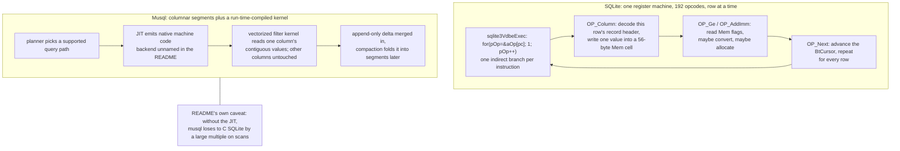

<!--
entry-meta
date: 2026-10-08
type: daily-diff
category: Daily Diff
title: Daily Diff — 2026-10-08
slug: sqlite-vdbe-registers-and-mem-cells
-->

# Daily Diff — 2026-10-08

**2026-10-08 · Daily Diff Digest**

## Which Edition This Covers

**The edition of Wednesday, October 7, 2026 — 45 listings, 44 distinct stories** (the OSC 7501 post appears twice, with two different HN threads).

Worth recording how it was found, because this repository's convention is to cover *the newest edition not yet covered* and to say which one it is. [`https://tdd.cat/`](https://tdd.cat/) was still serving `End of Edition — Tuesday, October 6, 2026` this morning, and the October 6 edition was already covered by [lesson 22's digest](../2026-10-07-sqlite-name-resolution-expr-select-trees/daily-diff.md) yesterday. `https://tdd.cat/llms.txt` documents the edition URL pattern as `https://tdd.cat/{YYYY-MM-DD}.md`, so both neighbours were probed directly: `2026-10-08.md` returns **404**, and `2026-10-07.md` **exists and is complete**. That is the dated-archive-leads-the-homepage behaviour the root README already notes, and the reason the homepage alone is not a sufficient check. The site's own note explains the lag: *"Editions are published with a 2-day settling window so the highest-signal discussions and insights surface."*

---

## The Edition, Point-Wise

### Databases and storage

- **Musql — SQLite-compatible SQL on columnar storage with a JIT** — a Go engine, not a SQLite fork, claiming 300× C SQLite on a filtered count. **Deep-dived below.** [link](https://github.com/samyfodil/musql)
- **DuckLake** — a lakehouse format that keeps the table catalog in an ordinary database file and the column data in Parquet, so DuckDB needs no external catalog service. [link](https://github.com/duckdb/ducklake)
- **ZFS-style copy-on-write storage for a relational database** — copy-on-write tablespaces, an A/B uberblock scheme, and WAL records that are logical with physical hints. Directly relevant to lessons 16–17: an A/B uberblock is a different answer to the same durability question a rollback journal answers. [link](https://6it.dev/blog/mechlove-blueprint---27-storage-zfs-style-and-wal-template-based-logical-with-physical-hints-80745)
- **`pg_plan_filter` 1.0.0** — a PostgreSQL extension that aborts a statement or transaction whose *planner cost estimate* exceeds a limit, before execution begins. [link](https://www.postgresql.org/about/news/pg_plan_filter-100-released-3352/)
- **Bitsql** — a memory-only TDS wire-protocol emulator standing in for SQL Server in CI, fast to start and compatible with common ORMs. [link](https://mirekrusin.com/bitsql/)
- **Apache Pulsar 5.0** — topics that scale their partition count automatically while preserving per-key ordering, with Oxia replacing ZooKeeper for metadata, non-breaking for v4 clients. [link](https://pulsar.apache.org/blog/2026/10/05/announcing-apache-pulsar-5-0/)

### Git, as a data structure and as infrastructure

- **Git refs are a mutable key-value store** (matklad) — branches, remotes and tags are mutable name→hash mappings layered over immutable objects. The cleanest one-sentence framing of Git's storage model in a while. [link](https://matklad.github.io/2026/10/07/git-ref.html)
- **Rebuilding Git infrastructure for concurrent agentic development** (GitHub) — moving Git storage toward horizontally scalable commit infrastructure to absorb agent-driven write volume. [link](https://github.blog/engineering/architecture-optimization/building-git-infrastructure-for-agent-scale-development/)

### Performance measurement — an unusually good cluster this edition

- **Microbenchmarks in the age of clankers** (Vyacheslav Egorov) — benchmark numbers must be checked against compiler output and CPU behaviour before any conclusion is drawn; treating a system as a black box produces confident nonsense. Read this one *before* the Musql benchmark table. [link](https://mrale.ph/blog/2026-10-06-microbenchmarks-in-the-age-of-clankers.html)
- **Coz — causal profiling** — estimates how much end-to-end throughput would improve from speeding up a given line, via virtual speedup experiments, rather than reporting where time is spent. [link](https://github.com/plasma-umass/coz)
- **Decode decoded** — profiling finds LLM decode on an H100 is often bound by kernel-launch overhead, not memory bandwidth. [link](https://zhebrak.io/posts/decode-decoded/)

### Language and runtime

- **Replacing the JVM garbage collector to get real weak references** (Edward Kmett) — a custom HotSpot GC, Jam, with ephemeron semantics that standard Java weak references cannot express. [link](https://comonad.com/reader/2026/stretching-the-storage-manager-on-the-jvm/)
- **Goose — memory safety without a heap** — compiler-managed static stacks instead of heap, GC or lifetime annotations. [link](https://github.com/aardappel/goose/blob/master/README.md)
- **Push ifs up and fors down** — move branches into callers and loops into leaf functions; narrower state, batch-friendly code. [link](https://debasishg.github.io/blog/push-ifs-up-fors-down/)
- **Minimal post-mortem debuggable memory dumps on macOS** — small LLDB-debuggable crash dumps, the MiniDump equivalent. [link](https://peteronprogramming.wordpress.com/2026/10/07/post-mortem-debuggable-minimal-size-memory-dumps-on-macos/)
- **Connect-go v2** — drops generic request wrappers to match standard gRPC method shapes. [link](https://buf.build/blog/connect-go-v2)
- **Sheetstream** — constant-memory XLSX streaming in Node via a Rust core over napi-rs; a million-row export stays near 82 MB. [link](https://github.com/anzal1/sheetstream)
- **Chelis** — compile-time tensor dimension and precision checking, aimed at silent broadcasting bugs in agent-written code. [link](https://github.com/Chelis-Lang/chelis)

### Infrastructure and ops

- **Proteus — a hypervisor-agnostic VPC dataplane** — VPC networking in the host kernel, 19.4 Gbit/s VM-to-VM on illumos. [link](https://tritoncloud.io/blog/proteus-a-hypervisor-agnostic-vpc-for-triton-cloud/)
- **HAProxy defaults after an ingress-nginx migration** — the redirect status code changes, and that alone can break production traffic. [link](https://nine.ch/en/blog/haproxy-defaults-after-ingress-nginx-migration/)
- **Warming the Puma master before it forks** (37signals) — warm Rails in the master so copy-on-write children start pre-warmed, cutting post-deploy queueing. [link](https://dev.37signals.com/warming-up-the-puma-master-before-it-forks/)
- **Scaling network probing for HTTP/3 readiness** (Slack) — extending the Prometheus Blackbox Exporter to probe QUIC endpoints. [link](https://slack.engineering/from-custom-to-open-scalable-network-probing-and-http-3-readiness-with-prometheus/)
- **Meta's `rebalancer`** — an assignment solver separating specification, storage, solvers and debugging. [link](https://engineering.fb.com/2026/09/21/open-source/rebalancer-generic-high-performance-library-assignment-problems/)
- **OSC 7501, program status** — a terminal escape sequence letting a CLI tool report working / idle / blocked. [link](https://mitchellh.com/writing/program-status-osc7501)

### Agents, models, security

- **AI agents duplicate writes and report false success after timeouts** — a 500-trial benchmark finds agents retrying non-idempotent writes and reporting success after failures. The most operationally alarming item in the edition. [link](https://github.com/0xguenther/agent-write-path-runs)
- **Trigora** — durable execution that resumes from committed continuation state instead of replaying event history, the opposite trade-off to yesterday's Obelisk. [link](https://github.com/trigora-dev/trigora)
- **Cyber guardrails tax the defender, not the attacker** — safety filters blocked malware analysis, so the team ran an open-weight model locally. [link](https://winfunc.com/research/cyber-guardrails-tax-the-defender-not-the-attacker)
- **Argos** — a Rust reverse proxy blocking path traversal, secret reads and dangerous shell commands in MCP traffic. [link](https://github.com/JUSICK/Argos-mcp-guardrail)
- **Pawl** — deterministic code gates instead of prompt instructions for blocking destructive agent commands. [link](https://github.com/ulukaya/pawl)
- **Weft** — sequences parallel coding agents' edits through a validator rather than file locks or PR queuing. [link](https://github.com/celador/weft)
- **Transformer MLPs store facts without gradient descent** (Stanford Hazy Research) — MLP blocks can hold facts via closed-form weight construction. [link](https://hazyresearch.stanford.edu/blog/2026-07-22-mlps-are-hebbians)
- Also: [Cascadia running a 975B MoE across eleven consumer PCs](https://arxiv.org/abs/2610.07219), [moefit paging inactive experts from SSD on Apple Silicon](https://github.com/yavarb/moefit), [Flux compiling layer placement across GPU/CPU/NVMe](https://github.com/cyqlelabs/flux), [rgpu offloading PyTorch ops to a remote GPU](https://github.com/ymcrcat/rgpu), [Zephon preserving global batches across cluster resizes](https://www.datologyai.com/blog/zephon), [d1-3B returning typed decisions in one forward pass](https://huggingface.co/LiquidAI/d1-3B), [GRPO taking a 1.7B model from 75.0% to 89.8% on a smart-home benchmark](https://www.neelabhbuilds.com/writing/training-a-small-model-to-run-a-house), [AutoCompact](https://academy.dair.ai/papers), [LensIR](https://lens-compiler.dk.workers.dev), [Artifact Arena](https://artifactarena.ai), [a hobby Rust kernel driving an RTX 3050 through GSP-RM and NVK](https://github.com/oriaj-nocrala/rust_so_kernel/blob/master/docs/blog/gsp-to-vulkan.md), and [480 containers producing financial reports for fifteen synthetic companies](https://mainbrella.com/blog/virtual-companies-producing-reports/).

---

## Deep Dive: Musql — "300× Faster Than C SQLite", and What That Number Is Actually Measuring

Picked because it is a direct attack on the layer today's lesson spent the whole day inside. Lesson 23 measured the VDBE's execution shape from the inside: a 24-byte instruction, one indirect branch per instruction through a `switch`, and every single value materialised into a 56-byte `Mem` cell with its own flag word, ownership bits and encoding byte. Musql's claim is that this shape is leaving two to three orders of magnitude on the table for analytical queries. Reading the claim against the measurements is the exercise.

Source followed and fetched: [github.com/samyfodil/musql](https://github.com/samyfodil/musql).

### What it actually is

Not a fork, not an extension, not a VFS. The README is explicit: *"musql implements SQLite's SQL dialect through its own parser, planner, and execution engine."* It is a **pure-Go database** (Go 1.27+, no CGo) that accepts SQLite's SQL and stores data in its own `.musq` columnar segment format.

That distinction matters more than the headline number, because it means **SQL compatibility and file compatibility are separate things**. Existing SQLite databases must be run through `musql-convert import` before the driver will open them. Every byte-level mechanism Part I of this track covered — the 100-byte file header, varints and serial types, the b-tree page header, overflow chains, the freelist, pointer-map pages — is simply not present in a `.musq` file. This is a SQLite-compatible *dialect*, not a SQLite-compatible *database*.

Three deployment shapes: embedded through `database/sql`; a `musqld` server speaking the Hrana protocol (so Turso and libSQL clients work); and a replication package returning an ordinary `*sql.DB`, with CRDT, leader, and leader-with-quorum modes where the consensus log is supplied by the caller.

### The storage and execution claims

The README is thin on the segment format: columns stored contiguously so a filter reads only the values it needs; writes landing in an append-only delta; compaction folding the delta into segments. No byte-level layout is published. Append-only delta plus background compaction is the LSM-ish shape — which is to say the write path is a different set of trade-offs entirely, and the README does not quantify them.

On the JIT it is thinner still, and this is worth stating plainly rather than filling in: **the README does not name the JIT backend or code generator**, and it does not say whether the JIT compiles from planner output or from bytecode. It says supported query paths become native machine code at run time and that *"vectorized filter kernels"* run on *"supported CPUs."* LLVM appears on the page only in a DOOM demo — DOOM compiled C → LLVM IR → *musql VDBE bytecode*, executed via `engine.ProgramStmt` at "about 38 fps without JIT and 96 fps with JIT on an Intel i9." So musql has a VDBE of its own; the page does not claim the register machine was removed for ordinary SQL, only that hot paths get compiled.

### The benchmark, and the two lines that reframe it

| Query | musql | vs C SQLite | vs Turso | vs DuckDB |
|---|---|---|---|---|
| Filtered count, one predicate | **21 µs** | **300×** | 970× | 29× |
| Rowid lookup | 3 µs | 4× | 17× | 130× |
| `ORDER BY v DESC LIMIT 20` | 345 µs | 25× | 270× | 3× |
| `IN` list | 1.6 ms | 7× | 20× | 1.7× |

Setup as stated: 100,000-row read workloads, one thread each, on an amd64 server, with musql reached through its **direct engine API**; C SQLite called natively from C; Turso through its Go driver; each workload validated against C SQLite on up to 40 bind values, then timed for about 200 ms.

Two sentences in the README's own caveats do more to explain the table than the table does:

> *"Without the JIT, musql loses to C SQLite by a large multiple on scans."*

> Through `database/sql`, a point lookup costs about 12 µs — *roughly the same as C SQLite.*

The first says the columnar layout is not where the win comes from; the JIT is. Columnar storage without compiled kernels is **slower** than SQLite's row-at-a-time interpreter on this engine's own scans. The second says the 4× rowid-lookup win evaporates the moment you go through Go's standard database interface, which is how anyone would actually embed it — 21 µs via the direct engine API versus ~12 µs for a point lookup through `database/sql`, matching C SQLite. The analytical numbers are real; the OLTP numbers are a benchmark-harness artifact, and the README says so.

Credit where it is due on the correctness side, which is the part most projects in this category skip: differential testing against the SQLite test-suite corpus, **73,855 statements with "zero wrong results and zero panics,"** declining 16 `PRAGMA max_page_count` statements because page counts describe musql's own storage. That is a serious compatibility bar, and it is the number I would lead with rather than the 300×.

### Why it matters, held against today's lesson

The honest version of the 300× is: *for a single-predicate count over 100,000 rows, a compiled kernel over contiguous column values beats a general-purpose register machine that materialises every value into a tagged 56-byte cell.* Nobody disputes that, and it is why every analytical engine of the last fifteen years is shaped like musql rather than like SQLite.

What today's lesson adds is that SQLite's interpreter is not naive about exactly this cost, and the measurements are specific. `OP_Column`'s `p5` operand exists so that `typeof(x)`, `length(x)` and `octet_length(x)` never read the value at all — the opcode hands the deserialiser 256 zero bytes from `sqlite3CtypeMap` and answers from the record header. Measured on ten 1.2 MB blobs, that is **0.0062 ms versus 2.2764 ms**, a ~370× difference inside SQLite, from one 16-bit flag. `MEM_Zero` is the same instinct: a 100 MB `zeroblob` costs 3 µs to measure and only materialises when an operator insists. The register machine's generality is not free, but it is also not where SQLite spends its optimization budget blindly.

The more interesting comparison is what the register machine buys. Lesson 23's finding that the register file *is* the cursor table — cursor *i* living in `aMem[nMem-i]`'s malloc buffer, verified as nine exact pointer matches — is only possible because there is one uniform storage array that 192 opcodes compose over. A JIT that emits a bespoke kernel per query path gets speed by giving that up: every unsupported path needs a fallback, and the README's framing of "supported query paths" and "supported CPUs" is where that cost lives. SQLite's trade is one execution model that is correct for every statement, on every platform, at 700 KB.

### What to be skeptical about

- **The 300× and 970× are one query, and the SQL text and schema are not published.** The README states this itself. 100,000 rows at one thread, with DuckDB faster on some workloads at its default thread count.
- **The JIT backend is unnamed.** For a project whose entire performance story is "we compile it," that is the one implementation detail a reader needs, and the page does not give it. LLVM appears only in the DOOM toolchain.
- **`database/sql` erases the OLTP win** — ~12 µs point lookup, same as C SQLite — and `database/sql` takes one statement per `Exec`/`Query` call. The direct engine API that produced the table is not the interface most users would reach for.
- **The write path is unquantified.** Append-only delta plus compaction has a cost profile the README does not measure at all. Every number in the table is a read workload.
- **CRDT replication can break constraints the local writes satisfied** — the README says so directly: *"CRDT merges can violate constraints that each local write satisfied,"* such as foreign keys or multi-column `CHECK`s. Replicated databases also restrict triggers, virtual tables and `WITHOUT ROWID`.
- **Conversion is one-way at the file level.** Adopting musql means your database is no longer a SQLite file, which forfeits the property that has made SQLite a storage format rather than a library.

And the self-aware note: this edition also carries [Microbenchmarks in the age of clankers](https://mrale.ph/blog/2026-10-06-microbenchmarks-in-the-age-of-clankers.html), whose whole argument is that a benchmark number is worthless until you have checked it against the compiler output and the CPU's behaviour. The two items are forty listings apart in the same edition. Read them in the other order.

---

## Sources

- [The Daily Diff — Wednesday, October 7, 2026](https://tdd.cat/2026-10-07.md) — the edition this digest covers, fetched as Markdown in two passes.
- [tdd.cat](https://tdd.cat/) — the live front page, which was still serving the October 6 edition, and the source of the two-day settling-window note. `https://tdd.cat/2026-10-08.md` returned HTTP 404.
- [tdd.cat/llms.txt](https://tdd.cat/llms.txt) — the source for the `https://tdd.cat/{YYYY-MM-DD}.md` edition URL pattern, which is how the October 7 edition was located ahead of the homepage.
- [github.com/samyfodil/musql](https://github.com/samyfodil/musql) — the deep-dive item; README fetched in full for the storage description, the JIT claims, the benchmark table and every caveat quoted.
- [Microbenchmarks in the age of clankers](https://mrale.ph/blog/2026-10-06-microbenchmarks-in-the-age-of-clankers.html) — from the same edition, cited in the skepticism section.
- Edition footer links, for the record: [the-daily-diff on GitHub](https://github.com/arpitbbhayani/the-daily-diff), [stats](https://tdd.cat/stats/), [RSS](https://tdd.cat/rss.xml).
- Every per-item link in the point-wise summary is a source URL printed by the October 7 edition itself.
