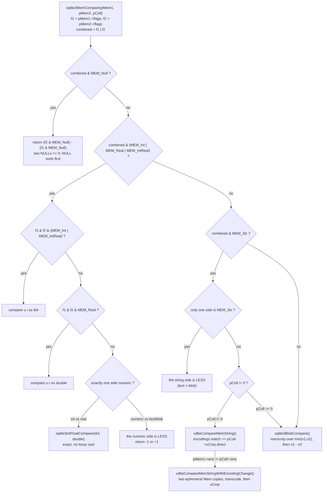
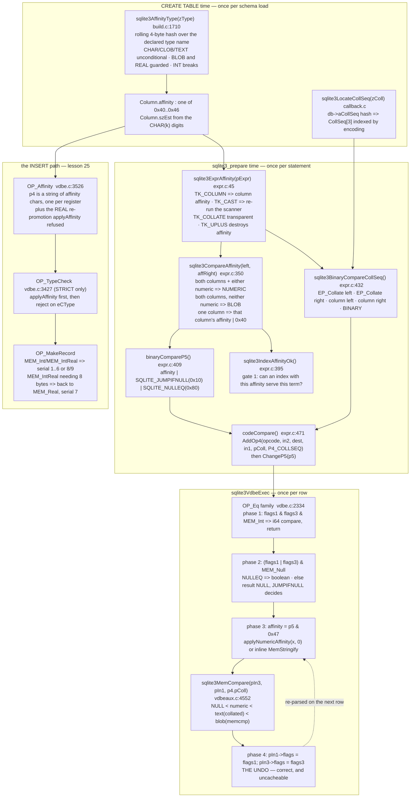

<!--
entry-meta
date: 2026-10-09
type: lesson
track: SQLite
lesson: 24
category: Database Internals
title: Type Affinity, Collating Sequences and Value Comparison — Seven ASCII Characters, a Rolling 4-Byte Hash, and a Conversion That Is Undone After Every Row
slug: sqlite-affinity-collation-comparison
-->

# Type Affinity, Collating Sequences and Value Comparison — Seven ASCII Characters, a Rolling 4-Byte Hash, and a Conversion That Is Undone After Every Row

**2026-10-09 · SQLite Track · Lesson 24 of 33**

## Where This Fits

- [Lesson 23](../2026-10-08-sqlite-vdbe-registers-and-mem-cells/README.md) established the register file and the `Mem` cell: one allocation holding program, registers and cursors; a bump allocator with an eight-slot free list handing out register numbers; and a `MEM_*` flag word in which the *affinity bits* say what the value is and the *storage bits* say who owns `Mem.z`. It stopped at the register file's edge and explicitly handed this lesson `applyAffinity`, `sqlite3MemCompare` and the `OP_Eq` family.
- This lesson is the other half of that flag word: who writes it and who reads it. Three mechanisms carry it. **Affinity is seven consecutive ASCII characters** (`0x40`–`0x46`), chosen so that "is this numeric" is one `>=` comparison, and they travel in `OP_Eq.p5` sharing a byte with `SQLITE_JUMPIFNULL` and `SQLITE_NULLEQ`. **Column affinity is computed by a single left-to-right pass with a rolling 4-byte hash** over the declared type name — the five documented precedence rules are not five passes, they are four guard conditions and one `break`. And **the conversion a comparison performs on its operands is undone immediately afterwards**, which is why a `TEXT` column compared numerically keeps its string bytes, and also why the parse happens again on the next row.
- What it sets up: lesson 25 takes `OP_MakeRecord`, `OP_Insert` and index maintenance. That lesson needs `applyAffinity`'s output as its input — the `OP_Affinity` opcode this lesson dissects is the instruction that runs immediately before `OP_MakeRecord` on every `INSERT`. Lesson 26 (the `where.c` path solver) needs `sqlite3IndexAffinityOk`, measured in section 9 here, because that one function decides whether an index is even a candidate. Lesson 28 (the sorter) needs `sqlite3MemCompare` and the `CollSeq` triple.

**Version caveat, same discipline as lessons 18–23.** Source is read at trunk commit **`9cba4634`** (`9cba46343ecf41fed36f4fb8462cfe0351067dd4`, 2026-10-08), which is one commit newer than this document's start. Every measurement is on the system `libsqlite3.so.0` reporting **3.45.1** (`sourceid 2024-01-30 16:01:20 e876e51a0ed5…`), x86-64 Linux, gcc-13.3.0, via Python 3.13.16's `sqlite3` module and `ctypes`. **Two trunk-vs-3.45.1 differences matter here and are stated where they arise:** on trunk the BINARY collation's comparison function is the exported `sqlite3BinaryCompare()` (`main.c:1061`) with a companion predicate `sqlite3IsBinary()` (`main.c:1100`); in 3.45.1 it was a file-static `binCollFunc()` and there was no `sqlite3IsBinary`. The *behaviour* is byte-identical — `memcmp` then length difference — and nothing measured below depends on the name. The affinity constants, `SQLITE_AFF_MASK`, `struct CollSeq`, `sqlite3MemCompare`'s ladder and `sqlite3IntFloatCompare` are unchanged between the two.

As in lessons 21–23, this build has **no `SQLITE_DEBUG`**, so `PRAGMA vdbe_trace` and `REGISTER_TRACE` are compiled out. The instruments are `EXPLAIN` (which exposes `p4` and `p5` directly, and that turns out to be enough), `EXPLAIN QUERY PLAN`, a user-registered collation used as a **call counter**, `typeof()`, raw file bytes, and timing.

---

## 1. Affinity Is Seven ASCII Characters, Deliberately Consecutive

`sqliteInt.h:2370-2385`:

| Constant | Value | Char | Meaning |
|---|---|---|---|
| `SQLITE_AFF_NONE` | `0x40` | `@` | no affinity (an expression, not a column) |
| `SQLITE_AFF_BLOB` | `0x41` | `A` | no-op; store as given |
| `SQLITE_AFF_TEXT` | `0x42` | `B` | stringify numbers |
| `SQLITE_AFF_NUMERIC` | `0x43` | `C` | numify strings, int preferred |
| `SQLITE_AFF_INTEGER` | `0x44` | `D` | as NUMERIC |
| `SQLITE_AFF_REAL` | `0x45` | `E` | as NUMERIC, then force real |
| `SQLITE_AFF_FLEXNUM` | `0x46` | `F` | numify strings, change nothing else |
| `SQLITE_AFF_DEFER` | `0x58` | `X` | "compute later" marker on a function node |
| `SQLITE_AFF_MASK` | `0x47` | — | mask for the significant bits |

Three design decisions are packed into that table, and the source says so:

- **They start at `'A'`, not at 0.** The comment at `sqliteInt.h:2362-2364`: *"rather than start with 0 or 1, we begin with 'A'. That way, when multiple affinity types are concatenated into a string and used as the P4 operand, they will be more readable."* `OP_Affinity`'s `p4` is literally a C string of these characters, one per register. An index on `(TEXT, INTEGER)` carries the `p4` string `"BD"`.
- **The numeric affinities are contiguous and last.** `sqlite3IsNumericAffinity(X)` is `((X)>=SQLITE_AFF_NUMERIC)` — `sqliteInt.h:2379`. Every "is this numeric" test in the codebase is one unsigned compare. `applyAffinity` opens with `if( affinity>=SQLITE_AFF_NUMERIC )` and that single branch covers NUMERIC, INTEGER, REAL and FLEXNUM.
- **BLOB is first (after NONE)** so that `aff<SQLITE_AFF_TEXT` means "no conversion will happen", which is the first early-out in `sqlite3IndexAffinityOk`.

### The mask is `0x47`, and the other bits are flags

`SQLITE_AFF_MASK` is `0x47`, not `0xFF`. Bits `0x08`, `0x10`, `0x20`, `0x80` are free for flags that ride in the same operand (`sqliteInt.h:2396-2398`):

| Flag | Value | Meaning |
|---|---|---|
| `SQLITE_JUMPIFNULL` | `0x10` | take the jump if either operand is NULL |
| `SQLITE_NULLEQ` | `0x80` | `NULL=NULL` is true; result is never NULL (this is `IS` / `IS NOT`) |
| `SQLITE_NOTNULL` | `0x90` | both of the above: an assertion that neither operand can be NULL |

So `OP_Eq.p5` is a single `u16` carrying *the affinity to coerce to* and *the NULL semantics to use*, and `pOp->p5 & SQLITE_AFF_MASK` at `vdbe.c:2409` is the whole decode. Section 3 reads these bytes out of `EXPLAIN` output.

---

## 2. Column Affinity: One Left-to-Right Pass with a Rolling 4-Byte Hash

[datatype3.html](https://www.sqlite.org/datatype3.html) presents five numbered rules and warns that *"the order of the rules for determining column affinity is important."* The implementation is not five rules. It is `sqlite3AffinityType()` at `build.c:1710`, a single scan of the declared type string:

```c
char sqlite3AffinityType(const char *zIn, Column *pCol){
  u32 h = 0;
  char aff = SQLITE_AFF_NUMERIC;
  const char *zChar = 0;

  assert( zIn!=0 );
  while( zIn[0] ){
    u8 x = *(u8*)zIn;
    h = (h<<8) + sqlite3UpperToLower[x];
    zIn++;
    if( h==(('c'<<24)+('h'<<16)+('a'<<8)+'r') ){             /* CHAR */
      aff = SQLITE_AFF_TEXT;
      zChar = zIn;
    }else if( h==(('c'<<24)+('l'<<16)+('o'<<8)+'b') ){       /* CLOB */
      aff = SQLITE_AFF_TEXT;
    }else if( h==(('t'<<24)+('e'<<16)+('x'<<8)+'t') ){       /* TEXT */
      aff = SQLITE_AFF_TEXT;
    }else if( h==(('b'<<24)+('l'<<16)+('o'<<8)+'b')          /* BLOB */
        && (aff==SQLITE_AFF_NUMERIC || aff==SQLITE_AFF_REAL) ){
      aff = SQLITE_AFF_BLOB;
      if( zIn[0]=='(' ) zChar = zIn;
    }else if( h==(('r'<<24)+('e'<<16)+('a'<<8)+'l')          /* REAL */
        && aff==SQLITE_AFF_NUMERIC ){
      aff = SQLITE_AFF_REAL;
    }else if( h==(('f'<<24)+('l'<<16)+('o'<<8)+'a')          /* FLOA */
        && aff==SQLITE_AFF_NUMERIC ){
      aff = SQLITE_AFF_REAL;
    }else if( h==(('d'<<24)+('o'<<16)+('u'<<8)+'b')          /* DOUB */
        && aff==SQLITE_AFF_NUMERIC ){
      aff = SQLITE_AFF_REAL;
    }else if( (h&0x00FFFFFF)==(('i'<<16)+('n'<<8)+'t') ){    /* INT */
      aff = SQLITE_AFF_INTEGER;
      break;
    }
  }
  /* ... pCol->szEst estimation ... */
  return aff;
}
```

How this actually works, point by point:

- **`h` is a sliding window, not a hash of the whole string.** `h` is `u32`. `h = (h<<8) + lower(x)` shifts the fifth-oldest byte off the top. Comparing `h` against a four-character constant therefore tests *exactly the last four characters*, and there are **no collisions** — a `u32` holds a 4-byte window exactly. The `INT` test masks `0x00FFFFFF` to get a 3-byte window. This is a four-byte substring search with no allocation, no `strstr`, one pass, and the case-folding is a table lookup through `sqlite3UpperToLower` (`sqliteInt.h:5552`).
- **The documented rule *order* is encoded as guard conditions.** `CHAR`/`CLOB`/`TEXT` set TEXT **unconditionally**, so they win over an earlier `REAL` or `BLOB` match. `BLOB` only fires when `aff` is still NUMERIC or REAL, so it cannot overwrite TEXT. `REAL`/`FLOA`/`DOUB` only fire when `aff` is still NUMERIC, so they cannot overwrite TEXT or BLOB. That is rules 2 > 3 > 4, expressed as two `&&` clauses.
- **`INT` is the only rule that `break`s.** Rule 1's precedence is not a guard; it is an early exit. The moment a 3-byte `int` window appears, the function stops reading. `"CHARINT"` sets TEXT at offset 4 and then INTEGER at offset 7 and leaves. `"INTCHAR"` leaves at offset 3 having never seen `char`.
- **The window does not care about word boundaries.** This is the whole explanation for the documented oddity that `FLOATING POINT` has INTEGER affinity: the window `oint` from `POINT` has `h&0x00FFFFFF == 'int'`. And `STRING` is NUMERIC because no window in it matches anything.
- **NUMERIC is the initial value, not a final `else`.** A type name that matches nothing — `DATE`, `BOOLEAN`, `mytype`, the empty string from `CREATE TABLE t(x)` — keeps the initialiser. Except: no type at all is BLOB affinity per the docs, which is handled elsewhere (the column simply has no `zType` and `Column.affinity` is set to `SQLITE_AFF_BLOB`), not by this function returning NUMERIC.
- **`zChar` is a side-channel for the size estimate.** The same pass records where `CHAR(`/`BLOB(` started so the trailing digits can be parsed into `pCol->szEst`, scaled so an integer is 1, capped at 255. That estimate is a *planner* input and lesson 26 will use it; it is computed here only because the string is already in cache.

### Measured: 29 declared types, six probe values

Every cell below is `typeof()` of the value actually stored, which is the only externally visible definition of a column's affinity. `(none)` is `CREATE TABLE t(x)`.

| declared type | `'123'` | `'abc'` | `1` | `1.0` | `x'41'` | `'48.00'` |
|---|---|---|---|---|---|---|
| `INT`, `INTEGER`, `TINYINT`, `BIGINT` | integer | text | integer | integer | blob | integer |
| `CHARINT` | integer | text | integer | integer | blob | integer |
| `INTCHAR` | integer | text | integer | integer | blob | integer |
| `VARCHAR(10)`, `CHAR`, `CLOB`, `TEXT` | text | text | text | text | blob | text |
| `BLOB` | text | text | integer | real | blob | text |
| `(none)` | text | text | integer | real | blob | text |
| `FLOATING POINT` | integer | text | integer | integer | blob | integer |
| `REAL`, `FLOAT`, `DOUBLE`, `DOUBLE PRECISION` | real | text | real | real | blob | real |
| `STRING` | integer | text | integer | integer | blob | integer |
| `DECIMAL(10,5)`, `BOOLEAN`, `DATE`, `DATETIME`, `NUMERIC` | integer | text | integer | integer | blob | integer |
| `BLOBTEXT` | text | text | text | text | blob | text |
| `TEXTBLOB` | text | text | text | text | blob | text |
| `REALCHAR` | text | text | text | text | blob | text |
| `CHARREAL` | text | text | text | text | blob | text |
| `POINT`, `mytype` | integer | text | integer | integer | blob | integer |

Four of these rows are the guard conditions made visible:

- **`BLOBTEXT` → TEXT and `TEXTBLOB` → TEXT.** The `blob` branch is guarded; the `text` branch is not. Order in the string does not matter, only which branch is guarded.
- **`REALCHAR` → TEXT and `CHARREAL` → TEXT.** Same asymmetry, one rule further down.
- **`'48.00'` lands as `integer` 48 in every numeric-affinity column.** That is `applyNumericAffinity(pRec, /*bTryForInt=*/1)`, section 4.
- **`BLOB`/`(none)` keeps `1.0` as `real` while `NUMERIC` turns it into `integer`.** Affinity BLOB is a no-op; affinity NUMERIC runs `sqlite3VdbeIntegerAffinity()`.

---

## 3. Comparison Affinity: Three Rules, Two Functions, One `| 0x40`

Column affinity belongs to a column. A comparison has two operands, which may have two different affinities or none, and must pick exactly one to coerce *both* sides to. That choice happens at **compile time**, in `expr.c`, and the answer is baked into `p5`.

### Expression affinity

`sqlite3ExprAffinity()` (`expr.c:45-94`) is a loop, not a recursion, over the cases that *preserve* affinity:

- `TK_COLUMN` / `TK_AGG_COLUMN` with a table → `sqlite3TableColumnAffinity(pTab, iColumn)`. This is the base case.
- `TK_SELECT` → the affinity of the first result expression. `TK_SELECT_COLUMN` → the affinity of the *n*-th.
- `TK_CAST` → `sqlite3AffinityType(pExpr->u.zToken, 0)`. A `CAST` re-runs section 2's scanner on the cast's type name at compile time, so `CAST(x AS CHARINT)` has INTEGER affinity.
- `TK_VECTOR`, and `TK_FUNCTION` whose `affExpr` is `SQLITE_AFF_DEFER` → the first argument's affinity. This is how `max()`/`min()`/`coalesce()` propagate affinity from an argument instead of having none.
- `EP_Skip|EP_IfNullRow` nodes (`TK_COLLATE`, `TK_IF_NULL_ROW`) → step to `pLeft` and continue. **`COLLATE` is transparent to affinity**, which is exactly the documented rule "a COLLATE operator has the same affinity as its left-hand side operand."
- `TK_REGISTER` → re-dispatch on `op2`.
- Anything else → `pExpr->affExpr`, which is 0 for an ordinary expression node. So `+x` — a `TK_UPLUS`, which is *not* in the list above — has no affinity, which is the documented "any operators applied to column names… convert the column name into an expression which always has no affinity."

### The combination rule

`sqlite3CompareAffinity()` (`expr.c:350-366`):

```c
char sqlite3CompareAffinity(const Expr *pExpr, char aff2){
  char aff1 = sqlite3ExprAffinity(pExpr);
  if( aff1>SQLITE_AFF_NONE && aff2>SQLITE_AFF_NONE ){
    if( sqlite3IsNumericAffinity(aff1) || sqlite3IsNumericAffinity(aff2) ){
      return SQLITE_AFF_NUMERIC;
    }else{
      return SQLITE_AFF_BLOB;
    }
  }else{
    assert( aff1<=SQLITE_AFF_NONE || aff2<=SQLITE_AFF_NONE );
    return (aff1<=SQLITE_AFF_NONE ? aff2 : aff1) | SQLITE_AFF_NONE;
  }
}
```

Two things to notice:

- **"No affinity" is numerically 0, and `> SQLITE_AFF_NONE` (`> 0x40`) is the test for "has one".** So `aff1>0x40 && aff2>0x40` is "both sides are columns". Both columns, either numeric → NUMERIC. Both columns, neither numeric → BLOB, i.e. compare as-is.
- **`| SQLITE_AFF_NONE` is a coercion from 0 to a valid affinity character.** In the one-sided case the surviving affinity is OR-ed with `0x40`. If the surviving value is already an affinity (`0x41`–`0x46`) the OR is a no-op. If *both* are 0 — neither side is a column — the result is exactly `0x40`, `SQLITE_AFF_NONE`. One bitwise OR replaces a branch and guarantees the returned byte is always in the legal range for `p5`.

`comparisonAffinity()` (`expr.c:372-388`) wraps it for a whole comparison node, with a final `else if( aff==0 ) aff = SQLITE_AFF_BLOB;` for the `x IN (subquery-less)` shape. `binaryCompareP5()` (`expr.c:409-418`) is three lines and produces the operand:

```c
static u8 binaryCompareP5(const Expr *pExpr1, const Expr *pExpr2, int jumpIfNull){
  u8 aff = (char)sqlite3ExprAffinity(pExpr2);
  aff = (u8)sqlite3CompareAffinity(pExpr1, aff) | (u8)jumpIfNull;
  return aff;
}
```

That `| jumpIfNull` is where `SQLITE_JUMPIFNULL` and `SQLITE_NULLEQ` join the affinity in one byte.

### Measured: reading `p5` straight out of `EXPLAIN`

`EXPLAIN` exposes `p4` and `p5` as ordinary result columns, so no debug build is needed. Table `p(a INTEGER, t TEXT, x)`:

| WHERE clause | opcode | `p4` | `p5` | `p5 & 0x47` | affinity | other bits |
|---|---|---|---|---|---|---|
| `a = '7'` | `Ne` | `BINARY` | 84 = `0x54` | `0x44` | `'D'` INTEGER | `0x10` JUMPIFNULL |
| `t = 7` | `Ne` | `BINARY` | 82 = `0x52` | `0x42` | `'B'` TEXT | `0x10` JUMPIFNULL |
| `x = 7` | `Ne` | `BINARY` | 81 = `0x51` | `0x41` | `'A'` BLOB | `0x10` JUMPIFNULL |
| `a = t` | `Ne` | `BINARY` | 83 = `0x53` | `0x43` | `'C'` NUMERIC | `0x10` JUMPIFNULL |
| `t IS 7` | `Ne` | `BINARY` | 194 = `0xC2` | `0x42` | `'B'` TEXT | `0x80` NULLEQ |

Every documented rule is one row of that table:

- `a = '7'`: one side INTEGER, other has no affinity → `'D'` (not `'C'`; the one-sided branch returns the column's own affinity, and INTEGER behaves as NUMERIC in `applyAffinity`).
- `t = 7`: one side TEXT, other none → `'B'`, TEXT applied to the integer.
- `x = 7`: `x` has BLOB affinity (no declared type), other side none → `'A'`, no conversion at all. This is why `SELECT 1='1'` is false, the behaviour [quirks.html](https://www.sqlite.org/quirks.html) calls out: *"It does this because an integer is not a string."*
- `a = t`: both columns, one numeric → `'C'` NUMERIC, the two-column branch.
- `t IS 7`: same affinity as `t = 7`, but `0x80` instead of `0x10`. `IS` and `=` differ **only in those flag bits**; the affinity machinery is identical. [lang_expr.html](https://www.sqlite.org/lang_expr.html) states the semantics (*"It is not possible for an IS or IS NOT expression to evaluate to NULL"*); `p5` is where that semantics lives.

Note the opcode is `Ne`, not `Eq`: a `WHERE a = '7'` compiles to "jump past the row body if **not** equal". Same `p5`, inverted sense, which `sqlite3aLTb`/`aEQb`/`aGTb` handle (section 6).

### `codeCompare` writes both operands

`codeCompare()` (`expr.c:471-495`) is the single place a comparison instruction is emitted:

```c
  if( isCommuted ){
    p4 = sqlite3BinaryCompareCollSeq(pParse, pRight, pLeft);
  }else{
    p4 = sqlite3BinaryCompareCollSeq(pParse, pLeft, pRight);
  }
  p5 = binaryCompareP5(pLeft, pRight, jumpIfNull);
  addr = sqlite3VdbeAddOp4(pParse->pVdbe, opcode, in2, dest, in1,
                           (void*)p4, P4_COLLSEQ);
  sqlite3VdbeChangeP5(pParse->pVdbe, (u16)p5);
```

Note the operand order: `in2` becomes `p1` and `in1` becomes `p3`. That is why `OP_Eq`'s synopsis reads `IF r[P3]==r[P1]` — the **left** operand is in `p3`. The `isCommuted` branch exists because the optimizer may have rewritten `7 = a` to `a = 7`; `EP_Commuted` records that, and the collation lookup is done in the *original* operand order so that rule-precedence ("left operand wins") still refers to the SQL the user wrote.

---

## 4. `applyAffinity`: What Conversion Actually Means

`applyAffinity()` (`vdbe.c:397-426`) is 30 lines and has exactly three arms.

**Numeric arm** (`affinity >= SQLITE_AFF_NUMERIC`):

```c
    if( (pRec->flags & MEM_Int)==0 ){ /*OPTIMIZATION-IF-FALSE*/
      if( (pRec->flags & (MEM_Real|MEM_IntReal))==0 ){
        if( pRec->flags & MEM_Str ) applyNumericAffinity(pRec,1);
      }else if( affinity<=SQLITE_AFF_REAL ){
        sqlite3VdbeIntegerAffinity(pRec);
      }
    }
```

- Already `MEM_Int`? Nothing to do.
- A string? `applyNumericAffinity(pRec, 1)`.
- Already real? Try to demote to integer — **but only if `affinity <= SQLITE_AFF_REAL`**. `SQLITE_AFF_FLEXNUM` (`0x46`) fails that test, which is the entire difference between FLEXNUM and NUMERIC: FLEXNUM numifies strings and then *leaves the representation alone*. That is what a `VIEW` column or a subquery result column needs, where re-typing a value the user already produced would be wrong.
- Blobs and NULLs fall through untouched: neither has `MEM_Str`.

**Text arm** (`affinity == SQLITE_AFF_TEXT`): if there is no string representation but there is a numeric one, `sqlite3VdbeMemStringify()`. Then, unconditionally, `pRec->flags &= ~(MEM_Real|MEM_Int|MEM_IntReal)`. The numeric representation is *discarded*, not merely deprioritised — lesson 23's point that a `Mem` can hold two representations at once means "which one is live" is a flag decision, and TEXT affinity makes that decision by clearing bits.

**BLOB / NONE arm**: the function does nothing. The source comment says `No-op. pRec is unchanged.`

### `applyNumericAffinity` and the `bTryForInt` flag

`vdbe.c:354-371`:

```c
static void applyNumericAffinity(Mem *pRec, int bTryForInt){
  double rValue;
  int rc;
  assert( (pRec->flags & (MEM_Str|MEM_Int|MEM_Real|MEM_IntReal))==MEM_Str );
  rc = sqlite3MemRealValueRC(pRec, &rValue);
  if( rc<=0 ) return;
  if( (rc&2)==0 && alsoAnInt(pRec, rValue, &pRec->u.i) ){
    pRec->flags |= MEM_Int;
  }else{
    pRec->u.r = rValue;
    pRec->flags |= MEM_Real;
    if( bTryForInt ) sqlite3VdbeIntegerAffinity(pRec);
  }
  /* TEXT->NUMERIC is many->one.  Hence, it is important to invalidate the
  ** string representation after computing a numeric equivalent, because the
  ** string representation might not be the canonical representation for the
  ** numeric value.  Ticket [343634942dd54ab57b7024] 2018-01-31. */
  pRec->flags &= ~MEM_Str;
}
```

- `rc<=0` — not a well-formed number — returns with the value untouched. This is the "if it does not look like a number, leave it alone" rule, and it is why `INSERT INTO t(intcol) VALUES('wxyz')` stores the string.
- `alsoAnInt()` (`vdbe.c:329`) is the exactness gate: it converts the double to `i64`, asks `sqlite3RealSameAsInt()` whether the round-trip is exact, and if not falls back to `sqlite3Atoi64()` on the original text. A 19-digit integer that a `double` cannot hold is parsed as an integer from the *string*, not from the double.
- **`bTryForInt` is called with 1 from `applyAffinity` and with 0 from the comparison path** (`vdbe.c:2413`, `2418`). With 1, `'48.00'` and `'1e3'` become integers. With 0, a string containing a decimal point or exponent stays `MEM_Real` even when exactly integral. Storage prefers integers because they are smaller on disk; comparison does not care, and skipping the demotion saves a call.
- **The flag-clearing line is a bug fix with a ticket number.** TEXT→NUMERIC is many-to-one: `'1e3'`, `'1000'`, `'1000.0'` and `' 1000 '` all become 1000. Leaving `MEM_Str` set would let a later operation read back a string that is not the canonical rendering of the number now in `u.i`. This matters in section 6.

### `OP_Affinity` and the REAL fix-up

`OP_Affinity` (`vdbe.c:3526`) walks a register range applying one `p4` character each, and then does something `applyAffinity` deliberately does not:

```c
    applyAffinity(pIn1, zAffinity[0], encoding);
    if( zAffinity[0]==SQLITE_AFF_REAL && (pIn1->flags & MEM_Int)!=0 ){
      pIn1->u.r = (double)pIn1->u.i;
      pIn1->flags |= MEM_Real;
      pIn1->flags &= ~(MEM_Int|MEM_Str);
    }
```

`applyAffinity`'s own comment explains why the two layers disagree: *"Note that the integer representation is always preferred, even if the affinity is REAL, because an integer representation is more space efficient on disk."* `applyAffinity` optimises for the record encoder. `OP_Affinity` then re-promotes to real, because a value that is *about to be compared* against a REAL column's index key must compare as a real. The measured consequence is row `REAL` of section 2's table: `1` stored into a `REAL` column reads back as `real`, even though the bytes on disk are an integer (section 5).

### `OP_TypeCheck`: affinity first, then enforcement

STRICT tables do not replace affinity; they run after it. `OP_TypeCheck` (`vdbe.c:3427`) calls `applyAffinity(pIn1, aCol[i].affinity, encoding)` at `vdbe.c:3456` and *then* switches on `aCol[i].eCType`, jumping to `vdbe_type_error` if the flags do not match. [stricttables.html](https://sqlite.org/stricttables.html) states the policy; the opcode is the implementation. Measured on a `CREATE TABLE s1(a ANY, b INT, c TEXT) STRICT`:

| statement | result |
|---|---|
| `INSERT … (b) VALUES('48.00')` | **accepted**, stored as `integer` 48 |
| `INSERT … (b) VALUES('1.5')` | `IntegrityError: cannot store REAL value in INT column s1.b` |
| `INSERT … (b) VALUES('abc')` | `IntegrityError: cannot store TEXT value in INT column s1.b` |

`'48.00'` survives because `applyNumericAffinity(…,1)` reached `MEM_Int` before the check ran. `'1.5'` fails *as a REAL*, not as a TEXT — the error message names the type the affinity pass produced, not the type the user supplied. And an `ANY` column stored `'000123'` as `text`: `ANY` has no affinity, so there is nothing to apply.

---

## 5. The On-Disk Consequence: Affinity Decides Serial Types

Affinity is a register-level transformation, but it runs immediately before `OP_MakeRecord`, so it chooses the record encoding from lesson 02. This is measurable with no tooling at all.

```sql
PRAGMA page_size=4096;
CREATE TABLE r(x REAL, y INTEGER, z TEXT, w NUMERIC);
INSERT INTO r VALUES(1, 1, 1, 1);
INSERT INTO r VALUES(1.5, '2', 2, '2.0');
```

Page 2, cell 0 (`06 01 05 09 09 0f 09 31`) decodes as: payload 6, rowid 1, header size 5, serial types `09 09 0f 09`, body `31`.

| column | declared | value given | serial type | bytes on disk | reads back as |
|---|---|---|---|---|---|
| `x` | REAL | `1` | 9 | **0** | `real` |
| `y` | INTEGER | `1` | 9 | **0** | `integer` |
| `z` | TEXT | `1` | 15 | 1 (`0x31` = `'1'`) | `text` |
| `w` | NUMERIC | `1` | 9 | 0 | `integer` |

Cell 1 (`10 02 05 07 01 0f 01 3ff8000000000000 02 32 02`): header size 5, serial types `07 01 0f 01`.

| column | value given | serial type | bytes |
|---|---|---|---|
| `x` | `1.5` | 7 (IEEE double) | `3f f8 00 00 00 00 00 00` |
| `y` | `'2'` | 1 (1-byte int) | `02` |
| `z` | `2` | 15 (text, len 1) | `32` = `'2'` |
| `w` | `'2.0'` | 1 (1-byte int) | `02` |

Four affinity conversions, visible as four serial-type bytes. A `REAL` column holding the integer 1 costs **zero** payload bytes, because serial types 8 and 9 encode the constants 0 and 1 in the header itself.

### Where the REAL compression stops

A `REAL` column stores an exact integer as an integer serial type only while the integer fits in six bytes. `sqlite3VdbeSerialType()` — kept at `vdbeaux.c:3916` behind `#if 0` with the note *"Inlined into the OP_MakeRecord opcode"*, the live copy being inside `OP_MakeRecord` — makes the decision:

```c
    *pLen = 8;
    if( flags&MEM_IntReal ){
      /* If the value is IntReal and is going to take up 8 bytes to store
      ** as an integer, then we might as well make it an 8-byte floating
      ** point value */
      pMem->u.r = (double)pMem->u.i;
      pMem->flags &= ~MEM_IntReal;
      pMem->flags |= MEM_Real;
      return 7;
    }
```

Measured on `CREATE TABLE r(x REAL)`, one row per value, serial type read from the page bytes:

| value inserted | serial type | payload bytes | `typeof()` |
|---|---|---|---|
| `1` | 9 | 0 | real |
| `2` | 1 | 1 | real |
| `127` | 1 | 1 | real |
| `128` | 2 | 2 | real |
| `32767` | 2 | 2 | real |
| `8388607` | 3 | 3 | real |
| `2147483647` | 4 | 4 | real |
| `1099511627776` (2^40) | 5 | 6 | real |
| `1125899906842624` (2^50) | **7** | 8 | real |
| `1.5` | 7 | 8 | real |

2^40 is stored as a 6-byte integer; 2^50 crosses into the 8-byte case and the `MEM_IntReal` branch converts it to a double instead. Every one of the ten rows reports `typeof() = 'real'`, so the representation switch is invisible above the record layer — which is the point of `MEM_IntReal` existing. This closes the measurement lesson 23 left open in its Next Steps item 3, and the boundary is between 2^40 and 2^50 rather than at the `140737488355327`/`140737488355328` pair that item guessed at: the 6-byte limit is `MAX_6BYTE = ((i64)0x00008000<<32)-1` = 140737488355327, so that pair is in fact the exact boundary, and the measurement above brackets it on both sides.

---

## 6. `OP_Eq`: A Fast Path, a NULL Block, a Conversion, and an Undo

`case OP_Eq … OP_Ge` is one block at `vdbe.c:2334-2478`. Four phases.

**Phase 1 — two integers, no function calls.**

```c
  flags1 = pIn1->flags;
  flags3 = pIn3->flags;
  if( (flags1 & flags3 & MEM_Int)!=0 ){
    /* Common case of comparison of two integers */
```

One `AND` of two flag words decides it. Inside, three `i64` comparisons and a lookup in `sqlite3aGTb[]`/`aLTb[]`/`aEQb[]` — tables indexed by *opcode number* that turn "the comparison came out greater" into "does this operator jump". No affinity is consulted, `sqlite3MemCompare` is not called, and the collation in `p4` is never looked at. The `assert( OP_Eq==OP_Ne+1 ); assert( OP_Gt==OP_Ne+2 ); …` chain at `vdbe.c:2455-2456` is what makes those tables indexable.

**Phase 2 — NULL.** `if( (flags1 | flags3)&MEM_Null )`. With `SQLITE_NULLEQ` set, two NULLs compare equal and the result is a definite boolean. Without it, the result is NULL: `iCompare` is set to 1, and the jump is taken only if `SQLITE_JUMPIFNULL` is set. `MEM_Cleared` is checked here too — that is the `OP_NullRow` marker that distinguishes "NULL because the row is absent" from "NULL because the column is NULL".

**Phase 3 — coerce.** Only now does `p5` get decoded:

```c
    affinity = pOp->p5 & SQLITE_AFF_MASK;
    if( affinity>=SQLITE_AFF_NUMERIC ){
      if( (flags1 | flags3)&MEM_Str ){
        if( (flags1 & (MEM_Int|MEM_IntReal|MEM_Real|MEM_Str))==MEM_Str ){
          applyNumericAffinity(pIn1,0);
          …
```

The inner test is `== MEM_Str`, not `& MEM_Str`: the operand must be *only* a string, with no numeric representation already cached. The TEXT arm is hand-inlined rather than calling `applyAffinity`, because it also has to maintain the saved `flags1`/`flags3` copies across a `sqlite3VdbeMemStringify()` that may change the ownership bits:

```c
        flags1 = (pIn1->flags & ~MEM_TypeMask) | (flags1 & MEM_TypeMask);
```

— keep the *new* storage bits, restore the *old* type bits. That line only makes sense once you know phase 4 exists.

**Phase 4 — undo.**

```c
  /* Undo any changes made by applyAffinity() to the input registers. */
  assert( (pIn3->flags & MEM_Dyn) == (flags3 & MEM_Dyn) );
  pIn3->flags = flags3;
  assert( (pIn1->flags & MEM_Dyn) == (flags1 & MEM_Dyn) );
  pIn1->flags = flags1;
```

The flag word is restored wholesale. The *data* written into `u.i` or `u.r` stays, and any string buffer allocated by `MemStringify` stays owned, but the type bits go back to what they were. The two `assert`s are the memory-safety contract: the undo is only legal because `MEM_Dyn` is guaranteed unchanged, so restoring the word cannot orphan a malloc.

### Measured: the string representation survives a numeric comparison

```sql
CREATE TABLE q(t TEXT, n INTEGER);
INSERT INTO q VALUES('1e3', 1000);
```

`t = n` has `p5` affinity NUMERIC, so `'1e3'` is parsed to 1000 for the comparison, and `applyNumericAffinity` clears `MEM_Str` while doing it.

| query | result |
|---|---|
| `SELECT t, typeof(t), t = n FROM q` | `('1e3', 'text', 1)` |
| `SELECT * FROM q WHERE t = n AND t = '1e3'` | one row |
| `SELECT * FROM q WHERE t = '1e3' AND t = n` | one row |
| `SELECT hex(t) FROM q WHERE t = n` | `316533` |

`316533` is `'1','e','3'`. Both conjunct orders work: the numeric comparison does not poison the register for the subsequent string comparison. Without phase 4, `t = n AND t = '1e3'` would return nothing, because after the first conjunct the register would hold the integer 1000 with no string representation at all.

### Measured: the price of the undo is re-parsing, every row

The undo makes the conversion *correct* and makes it *non-cacheable*. On a 300,000-row table `big(i INTEGER, s TEXT)`, best of five, in-memory database:

| query | time | ratio |
|---|---|---|
| `SELECT count(*) FROM big WHERE i = 299999` | 7.72 ms | 1.00× |
| `SELECT count(*) FROM big WHERE i = '299999'` | 12.41 ms | 1.61× |
| `SELECT count(*) FROM big WHERE i = '2.99999e5'` | 14.09 ms | 1.82× |
| `SELECT count(*) FROM big WHERE i = '00000000000000299999'` | 16.22 ms | 2.10× |
| `SELECT count(*) FROM big WHERE i = CAST('299999' AS INTEGER)` | 7.48 ms | 0.97× |
| `SELECT count(*) FROM big WHERE s = '299999'` | 10.76 ms | 1.39× |
| `SELECT count(*) FROM big WHERE s = 299999` | 14.26 ms | 1.85× |

The three string-literal rows are the proof. If the literal register's conversion were kept, all three would cost the same as each other and nearly the same as the integer literal. Instead the cost **tracks how hard the string is to parse** — plain digits 1.61×, exponent notation 1.82×, twenty characters of leading zeros 2.10× — which only happens if `strtod` runs 300,000 times. `CAST('299999' AS INTEGER)` is 0.97×: a `CAST` is a constant expression, so lesson 23's constant-factoring prologue evaluates it **once**, past `OP_Halt`, and the register it leaves behind is already `MEM_Int`, which hits phase 1. That is the whole mechanism in one row of a table: *the undo is per-row; the prologue is once.*

`s = 299999` at 1.85× is the mirror image — TEXT affinity forces `sqlite3VdbeMemStringify()` on the integer literal, with an allocation, 300,000 times.

---

## 7. `sqlite3MemCompare`: the Five-Way Ladder, and Why `i64` vs `double` Is Not a Cast

`sqlite3MemCompare()` (`vdbeaux.c:4552-4641`) implements the documented ordering NULL < numbers < text < blob. The structure is a ladder on the *combined* flag word, so the common cases are reached in one or two tests.



Three details the diagram compresses:

- **The NULL answer is arithmetic on flag bits.** `return (f2&MEM_Null) - (f1&MEM_Null);` — `MEM_Null` is a single bit, so this is `0` when both are NULL and `±MEM_Null` otherwise. The magnitude is meaningless; only the sign is contractual.
- **A NULL collation pointer falls through to `memcmp`.** `if( pColl ){ return vdbeCompareMemString(…); }` and then the comment *"If a NULL pointer was passed as the collate function, fall through to the blob case and use memcmp()."* Two TEXT values with `p4 == 0` are compared as blobs. This is also what `sqlite3IsBinary()` exploits: BINARY *is* `memcmp` + length, so a BINARY comparison can be short-circuited to the blob path.
- **`sqlite3BlobCompare()` (`vdbeaux.c:4481`) handles `MEM_Zero`** — the zeroblob representation from lesson 23 — by comparing `u.nZero` counts and `isAllZero()` scans without materialising anything.

### `sqlite3IntFloatCompare` is exact; a C cast is not

`vdbeaux.c:4524`:

```c
int sqlite3IntFloatCompare(i64 i, double r){
  if( sqlite3IsNaN(r) ){
    /* SQLite considers NaN to be a NULL. And all integer values are greater
    ** than NULL */
    return 1;
  }else{
    i64 y;
    if( r<-9223372036854775808.0 ) return +1;
    if( r>=9223372036854775808.0 ) return -1;
    y = (i64)r;
    if( i<y ) return -1;
    if( i>y ) return +1;
    return (((double)i)<r) ? -1 : (((double)i)>r);
  }
}
```

Four stages: NaN is treated as less than everything (the "NaN is a NULL" convention); out-of-`i64`-range doubles are answered from the range check alone, before any cast; the integer parts are compared as `i64`; and only when the integer parts are equal does a `double` comparison resolve the fraction. The naive `(double)i == r` is never the deciding test on its own.

Measured, with the Python equivalents for contrast:

| expression | SQLite | naive double arithmetic |
|---|---|---|
| `9007199254740993 = 9007199254740992.0` | **0** | `float(9007199254740993) == 9007199254740992.0` → `True` |
| `9007199254740993 > 9007199254740992.0` | 1 | — |
| `9223372036854775807 < 9.3e18` | 1 | — |
| `9223372036854775807 > 9.2e18` | 1 | — |
| `-9223372036854775808 > -9.3e18` | 1 | — |
| `1 = 1.0` | 1 | — |

2^53+1 is the smallest integer a `double` cannot represent. SQLite says it is not equal to 2^53; an engine that casts to double before comparing says it is. `9223372036854775807 < 9.3e18` is answered by the `r>=9223372036854775808.0` early return — casting `9.3e18` to `i64` would be undefined behaviour, so the range test exists to avoid the cast entirely, not merely to be fast.

---

## 8. Collating Sequences: Three Structs per Name, Three Built-ins, One Function Pointer

### The registry

`struct CollSeq` (`sqliteInt.h:2341-2347`) is five fields:

```c
struct CollSeq {
  char *zName;          /* Name of the collating sequence, UTF-8 encoded */
  u8 enc;               /* Text encoding handled by xCmp() */
  void *pUser;          /* First argument to xCmp() */
  int (*xCmp)(void*,int, const void*, int, const void*);
  void (*xDel)(void*);  /* Destructor for pUser */
};
```

`findCollSeqEntry()` in `callback.c` allocates them **three at a time**, plus the name:

```c
      pColl = sqlite3DbMallocZero(db, 3*sizeof(*pColl) + nName);
      …
      pColl[0].zName = (char*)&pColl[3];  pColl[0].enc = SQLITE_UTF8;
      pColl[1].zName = (char*)&pColl[3];  pColl[1].enc = SQLITE_UTF16LE;
      pColl[2].zName = (char*)&pColl[3];  pColl[2].enc = SQLITE_UTF16BE;
```

One `db->aCollSeq` hash entry per *name*, pointing at a 3-element array indexed by encoding, with the name string carved out of the tail of the same allocation and shared by all three. `sqlite3FindCollSeq()` then does `pColl += enc-1`, which is only valid because of the assertion `SQLITE_UTF8==1 && SQLITE_UTF16LE==2 && SQLITE_UTF16BE==3`. Same trick as lesson 23's `allocSpace()` carve, same reason: one malloc instead of four.

An entry whose `xCmp` is 0 exists but is undefined. `sqlite3GetCollSeq()` handles that by calling the *collation factory* (`sqlite3_collation_needed()`) and, failing that, `synthCollSeq()`, which copies a sibling entry for a different encoding — with `pColl->xDel = 0` so the clone does not double-free the original's `pUser`. Only if both fail does it raise `no such collation sequence: %s` with `SQLITE_ERROR_MISSING_COLLSEQ`.

`sqlite3SetTextEncoding()` sets `db->pDfltColl = sqlite3FindCollSeq(db, enc, sqlite3StrBINARY, 0)` and carries the comment `/* EVIDENCE-OF: R-08308-17224 The default collating function for all strings is BINARY. */`. A NULL collation name resolves to `db->pDfltColl`, so "no collation specified" and "BINARY" are the same pointer.

### The three built-ins, verbatim

Registered in `sqlite3_open` (`main.c:3579-3586`) — note **three** registrations for BINARY and **one** each for the others:

```c
  createCollation(db, sqlite3StrBINARY, SQLITE_UTF8,    0, sqlite3BinaryCompare, 0);
  createCollation(db, sqlite3StrBINARY, SQLITE_UTF16BE, 0, sqlite3BinaryCompare, 0);
  createCollation(db, sqlite3StrBINARY, SQLITE_UTF16LE, 0, sqlite3BinaryCompare, 0);
  createCollation(db, "NOCASE", SQLITE_UTF8, 0, nocaseCollatingFunc, 0);
  createCollation(db, "RTRIM",  SQLITE_UTF8, 0, rtrimCollFunc, 0);
```

BINARY is registered for all three encodings *because it works for all three* — the comment says so: `/* BINARY works for both UTF-8 and UTF-16, so add a version for each to avoid any unnecessary conversions. */` NOCASE and RTRIM exist only in UTF-8, which has a measurable consequence below.

| collation | implementation | source |
|---|---|---|
| BINARY | `memcmp(pKey1,pKey2,min(n1,n2))`, then `nKey1 - nKey2` | `main.c:1061` |
| RTRIM | `while( nKey1 && pK1[nKey1-1]==' ' ) nKey1--;` on both, then call BINARY | `main.c:1084` |
| NOCASE | `sqlite3StrNICmp(pKey1,pKey2,min(n1,n2))`, then `nKey1-nKey2` | `main.c:1116` |

`sqlite3StrNICmp` is `#define`d to `sqlite3_strnicmp` (`sqliteInt.h:4810`), which is three lines at `util.c:442`:

```c
  while( N-- > 0 && *a!=0 && UpperToLower[*a]==UpperToLower[*b]){ a++; b++; }
  return N<0 ? 0 : UpperToLower[*a] - UpperToLower[*b];
```

Two properties fall straight out of that loop:

- **Case folding is a 256-byte table lookup**, so only the 26 ASCII letters fold. `'æ' = 'Æ' COLLATE NOCASE` is false. This is the same `sqlite3UpperToLower` table section 2's affinity scanner uses.
- **`*a!=0` terminates the loop at an embedded NUL**, regardless of the length argument. This is not a theoretical quirk, and it is measurable.

### Measured: NOCASE cannot distinguish two different strings

SQLite strings may contain `0x00`; `char(0)` produces one.

| expression | result |
|---|---|
| `('a'\|\|char(0)\|\|'b') = ('a'\|\|char(0)\|\|'c')` | 0 |
| `('a'\|\|char(0)\|\|'b') = ('a'\|\|char(0)\|\|'c') COLLATE NOCASE` | **1** |
| `length(CAST(('a'\|\|char(0)\|\|'b') AS BLOB))` | 3 |

Both strings are three bytes and differ in the third. BINARY says they differ. NOCASE says they are **equal**, because `sqlite3_strnicmp` stops at the NUL in position 2 and then both `*a` and `*b` are `0`, so the difference is 0 and the lengths are equal. And the consequence is not merely a wrong boolean:

```sql
CREATE TABLE u(k TEXT COLLATE NOCASE UNIQUE);
INSERT INTO u VALUES('a'||char(0)||'b');   -- ok
INSERT INTO u VALUES('a'||char(0)||'c');   -- IntegrityError: UNIQUE constraint failed: u.k
```

A `UNIQUE … COLLATE NOCASE` index rejects a genuinely distinct key. `hex(CAST(k AS BLOB))` on the surviving row is `610062` — three bytes, so nothing was truncated on storage; only the comparison is blind past the NUL. [datatype3.html](https://www.sqlite.org/datatype3.html) does document this (*"any U+0000 characters in the string are considered string terminators for comparison purposes"*); it is worth knowing that it reaches all the way into constraint enforcement.

Two more measured boundaries, both consistent with the source:

- **RTRIM trims only `0x20`.** `('abc'||char(9)) = 'abc' COLLATE RTRIM` is 0; `'abc ' = 'abc' COLLATE RTRIM` is 1. The loop tests `== ' '` literally — no tabs, no newlines, no Unicode spaces.
- **Collation is ignored unless both operands are TEXT.** `x'6162' = x'4142' COLLATE NOCASE` is 0 (blobs take `sqlite3BlobCompare`), and `1 = 1 COLLATE NOCASE` is 1 (numbers never reach the string arm). The ladder in section 7 reaches `pColl` only on the both-`MEM_Str` branch.

### The encoding-change path

`vdbeCompareMemString()` (`vdbeaux.c:4449`) is a fast path and a slow path:

```c
  if( pMem1->enc==pColl->enc ){
    return pColl->xCmp(pColl->pUser,pMem1->n,pMem1->z,pMem2->n,pMem2->z);
  }else{
    return vdbeCompareMemStringWithEncodingChange(pMem1,pMem2,pColl,prcErr);
  }
```

The slow path (`vdbeaux.c:4423`) builds **two ephemeral `Mem` cells**, shallow-copies both operands into them with `MEM_Ephem`, transcodes each with `sqlite3ValueText(…, pColl->enc)`, calls `xCmp`, and releases both. Two transcodes and up to two mallocs **per comparison**. This is why BINARY is registered three times: on a UTF-16 database, a BINARY comparison finds a matching-encoding `CollSeq` and takes the fast path, while NOCASE — UTF-8 only — takes the slow path on every single comparison. On a UTF-8 database (the default, and the one measured here) the question does not arise.

### Which collation, decided at compile time

`sqlite3BinaryCompareCollSeq()` (`expr.c:432-452`) is the three documented rules:

```c
  if( pLeft->flags & EP_Collate ){
    pColl = sqlite3ExprCollSeq(pParse, pLeft);
  }else if( pRight && (pRight->flags & EP_Collate)!=0 ){
    pColl = sqlite3ExprCollSeq(pParse, pRight);
  }else{
    pColl = sqlite3ExprCollSeq(pParse, pLeft);
    if( !pColl ) pColl = sqlite3ExprCollSeq(pParse, pRight);
  }
```

- `EP_Collate` is a *propagated* flag, set on any node that has a `COLLATE` anywhere beneath it. So the first two branches implement "an explicit `COLLATE` wins, leftmost first" without walking the tree twice — the flag already tells you which subtree contains one.
- The third branch is "otherwise take a column's collation, left first". `sqlite3ExprCollSeq()` (`expr.c:254`) walks down through `TK_CAST` and `TK_UPLUS` — which is why [datatype3.html](https://www.sqlite.org/datatype3.html) says *"a column name preceded by one or more unary '+' operators and/or CAST operators is still considered a column name"* for collation purposes, even though those same operators **destroy affinity** (section 3). Affinity and collation disagree about what counts as a column, deliberately and in the same file.
- Inside the `EP_Collate` descent, when a node's `pLeft` does not carry the flag, the walk follows `pRight` or scans `x.pList` for the flagged child. That is how a `COLLATE` nested arbitrarily deep still wins.

### Measured: `xCmp` call counts

A user collation registered through `sqlite3_create_collation` is a perfect call counter. Table `z(s TEXT COLLATE MYCOLL, i INTEGER)`, 500 rows:

| query | rows scanned | `xCmp` calls |
|---|---|---|
| `SELECT count(*) FROM z WHERE s = '250'` | 500 | **500** |
| `SELECT count(*) FROM z WHERE s = 250` | 500 | **500** |
| `SELECT count(*) FROM z WHERE i = 250` | 500 | 0 |
| `SELECT count(*) FROM z WHERE b = x'41'` | 500 | 0 |
| `SELECT s FROM z ORDER BY s LIMIT 1` | 500 | 499 |
| `SELECT count(DISTINCT s) FROM z` | 500 | 3730 |
| `SELECT s FROM z GROUP BY s` | 500 | 3074 |

- One call per row for the equality scan: the collation is invoked inside `OP_Ne`, per row, with no memoisation.
- `s = 250` also makes 500 calls — TEXT affinity converts the integer literal to a string, so the comparison still lands on the collated-string branch.
- Zero calls for the integer and blob columns, as the ladder predicts.
- `ORDER BY s LIMIT 1` makes 499 calls: a running minimum, one comparison per row after the first. `DISTINCT` and `GROUP BY` make ~6× more because they go through the sorter's merge, which is lesson 28's subject. A custom collation in Python costs roughly a microsecond per call, so these counts, not the collation's own complexity, are what determine whether a custom collation is affordable.

---

## 9. Affinity and Collation Each Gate Index Use, Independently

An index is a sorted b-tree over records. It is usable for a comparison only if the comparison's *ordering* is the same ordering the index was built with — which means both the affinity and the collation must line up. SQLite checks them in two different places.

**Affinity:** `sqlite3IndexAffinityOk()` (`expr.c:395-403`), nine lines:

```c
int sqlite3IndexAffinityOk(const Expr *pExpr, char idx_affinity){
  char aff = comparisonAffinity(pExpr);
  if( aff<SQLITE_AFF_TEXT ){
    return 1;
  }
  if( aff==SQLITE_AFF_TEXT ){
    return idx_affinity==SQLITE_AFF_TEXT;
  }
  return sqlite3IsNumericAffinity(idx_affinity);
}
```

- `aff < SQLITE_AFF_TEXT` means NONE or BLOB — no conversion will occur, values compare as stored, so **any** index works.
- `aff == SQLITE_AFF_TEXT` requires the index's column to also be TEXT. A TEXT comparison over an INTEGER-affinity index would be comparing stringified values against an index ordered numerically.
- Otherwise (numeric) the index column must be numeric.

**Collation** is checked separately, in `where.c`, by comparing the comparison's `CollSeq` against the index's `aColl[]` entry. `sqlite3ExprCollSeqMatch()` (`expr.c:337`) is the pointer comparison, and its assertion `assert( (pColl1==pColl2) == (sqlite3_stricmp(pColl1->zName,pColl2->zName)==0) )` is the invariant that makes pointer identity a valid name comparison — guaranteed by the one-hash-entry-per-name design in section 8.

### Measured

`CREATE TABLE ix(tcol TEXT, icol INTEGER, ncol NUMERIC); CREATE INDEX ix_t ON ix(tcol);`

| WHERE clause | `comparisonAffinity` | plan |
|---|---|---|
| `tcol = 'x'` | TEXT | `SEARCH … USING COVERING INDEX ix_t (tcol=?)` |
| `tcol = 5` | TEXT | `SEARCH … USING COVERING INDEX ix_t (tcol=?)` |
| `tcol = icol` | NUMERIC | **`SCAN ix`** |
| `tcol = ncol` | NUMERIC | **`SCAN ix`** |
| `tcol = CAST(icol AS TEXT)` | NUMERIC | **`SCAN ix`** |
| `tcol = 5 COLLATE NOCASE` | TEXT | **`SCAN ix USING COVERING INDEX ix_t`** |
| `tcol = +tcol` | TEXT | `SCAN ix USING COVERING INDEX ix_t` |

Four separate mechanisms in seven rows:

- `tcol = 5` **uses the index.** A numeric literal has no affinity, so the one-sided branch of `sqlite3CompareAffinity` returns TEXT, and `idx_affinity==SQLITE_AFF_TEXT` holds. The literal is stringified; the index order is TEXT order; the seek is valid. This is the opposite of the folk rule "comparing a text column to a number kills the index".
- `tcol = icol` **does not.** Two columns, one numeric → NUMERIC, and `sqlite3IsNumericAffinity(SQLITE_AFF_TEXT)` is false. Joining a TEXT key to an INTEGER key defeats the index on *both* sides — a real and common schema bug.
- `tcol = CAST(icol AS TEXT)` **also does not**, and the affinity gate is not the reason. `CAST(… AS TEXT)` *does* give the right-hand side TEXT affinity (section 3), so now **both** sides have an affinity and `sqlite3CompareAffinity` takes its two-column branch: `aff1 = aff2 = SQLITE_AFF_TEXT`, neither is numeric, so it returns `SQLITE_AFF_BLOB`. `SQLITE_AFF_BLOB < SQLITE_AFF_TEXT`, so `sqlite3IndexAffinityOk` returns 1 and permits the index. The plan is still a `SCAN`, which means something else in `where.c` declines this term — most plausibly that the right-hand side is a column of the same table, so the term cannot serve as a seek key whatever its types. I did not verify that, so it is recorded as unresolved rather than asserted, and it is in Next Steps. What *is* verified: the affinity gate is open on this row, so a `SCAN` is not by itself evidence of an affinity mismatch.
- `tcol = 5 COLLATE NOCASE` fails on **collation**, not affinity: `comparisonAffinity` is still TEXT, but the comparison's `CollSeq` is NOCASE while `ix_t` was built with BINARY. The plan degrades to a covering-index *scan* — the index is still read (it has the only column needed) but not seeked. Fixing it requires `CREATE INDEX … ON ix(tcol COLLATE NOCASE)`, a separate index.
- `tcol = +tcol` loses affinity on the right (`TK_UPLUS`) but keeps collation (the `sqlite3ExprCollSeq` walk descends through `TK_UPLUS`). It scans for the obvious reason that the predicate is not a seekable constraint.

---

## Where This Fits in the Whole Pipeline



---

## Hands-On

Everything below runs against the stock `sqlite3` CLI or Python's `sqlite3` module. No debug build is required: `EXPLAIN` exposes `p4` and `p5` as ordinary columns, which is the key that makes this lesson measurable.

### 1. Read the affinity character out of `p5` yourself

```sql
CREATE TABLE p(a INTEGER, t TEXT, x);
EXPLAIN SELECT 1 FROM p WHERE a = '7';
EXPLAIN SELECT 1 FROM p WHERE t = 7;
EXPLAIN SELECT 1 FROM p WHERE x = 7;
EXPLAIN SELECT 1 FROM p WHERE a = t;
EXPLAIN SELECT 1 FROM p WHERE t IS 7;
```

**What to look for:** the `Ne` row's `p5`. Compute `p5 & 0x47` and read it as ASCII: `D`=INTEGER, `B`=TEXT, `A`=BLOB, `C`=NUMERIC. Then look at what is left: `0x10` on the `=` rows (JUMPIFNULL) and `0x80` on the `IS` row (NULLEQ). **This proves** that the affinity decision is made once at prepare time and stored in one byte alongside the NULL semantics — and that `IS` and `=` differ only in that byte.

In Python, to avoid doing the arithmetic by hand:

```python
for r in c.execute("EXPLAIN SELECT 1 FROM p WHERE a = '7'"):
    if r[1] in ("Eq","Ne","Lt","Le","Gt","Ge"):
        print(r[1], "p4=",r[5], "p5=",r[6], "aff=", chr(r[6] & 0x47))
```

### 2. Make the affinity scanner's guard conditions visible

```sql
CREATE TABLE t1(x BLOBTEXT);  CREATE TABLE t2(x TEXTBLOB);
CREATE TABLE t3(x REALCHAR);  CREATE TABLE t4(x CHARREAL);
CREATE TABLE t5(x CHARINT);   CREATE TABLE t6(x "FLOATING POINT");
CREATE TABLE t7(x STRING);
INSERT INTO t1 VALUES('123'); INSERT INTO t2 VALUES('123');
INSERT INTO t3 VALUES('123'); INSERT INTO t4 VALUES('123');
INSERT INTO t5 VALUES('123'); INSERT INTO t6 VALUES('123');
INSERT INTO t7 VALUES('123');
SELECT 'BLOBTEXT',typeof(x) FROM t1 UNION ALL SELECT 'TEXTBLOB',typeof(x) FROM t2
UNION ALL SELECT 'REALCHAR',typeof(x) FROM t3 UNION ALL SELECT 'CHARREAL',typeof(x) FROM t4
UNION ALL SELECT 'CHARINT',typeof(x) FROM t5 UNION ALL SELECT 'FLOATING POINT',typeof(x) FROM t6
UNION ALL SELECT 'STRING',typeof(x) FROM t7;
```

**What to look for:** `BLOBTEXT` and `TEXTBLOB` both give `text`; `REALCHAR` and `CHARREAL` both give `text`; `CHARINT` gives `integer`; `FLOATING POINT` gives `integer`; `STRING` gives `integer`. **This proves** that precedence is not positional — the `text` branch is unguarded while `blob` and `real` are guarded — and that the `int` window is checked three bytes wide with an immediate `break`, so `oint` inside `POINT` wins.

### 3. Catch the undo in the act

```sql
CREATE TABLE q(t TEXT, n INTEGER);
INSERT INTO q VALUES('1e3', 1000);
SELECT t, typeof(t), t = n FROM q;
SELECT hex(t) FROM q WHERE t = n;
SELECT * FROM q WHERE t = n AND t = '1e3';
SELECT * FROM q WHERE t = '1e3' AND t = n;
```

**What to look for:** `t = n` is 1 (the string was parsed to 1000), `typeof(t)` is still `text`, `hex(t)` is still `316533`, and **both** conjunction orders return the row. `applyNumericAffinity` clears `MEM_Str`, so without phase 4's `pIn1->flags = flags1` the first query's conversion would survive into the second conjunct and `t = '1e3'` would fail. **This proves** the restore happens, and that it restores *type* bits while leaving the data and the buffer ownership alone.

### 4. Price the undo

```sql
CREATE TABLE big(i INTEGER, s TEXT);
WITH RECURSIVE n(k) AS (SELECT 0 UNION ALL SELECT k+1 FROM n WHERE k<299999)
INSERT INTO big SELECT k, CAST(k AS TEXT) FROM n;
.timer on
SELECT count(*) FROM big WHERE i = 299999;
SELECT count(*) FROM big WHERE i = '299999';
SELECT count(*) FROM big WHERE i = '2.99999e5';
SELECT count(*) FROM big WHERE i = '00000000000000299999';
SELECT count(*) FROM big WHERE i = CAST('299999' AS INTEGER);
```

**What to look for:** the three string-literal queries cost progressively more (measured here 1.61×, 1.82×, 2.10× the integer-literal baseline), and the `CAST` version costs the same as the integer. If the conversion were cached in the literal's register, all five would be within noise of each other. **This proves** the per-row re-parse, and shows the fix: a `CAST` is constant-foldable and lands in lesson 23's run-once prologue.

### 5. Count collation invocations

```python
import sqlite3
d = sqlite3.connect(":memory:")
n = [0]
d.create_collation("MYCOLL", lambda a, b: (n.__setitem__(0, n[0]+1), (a>b)-(a<b))[1])
c = d.cursor()
c.execute("CREATE TABLE z(s TEXT COLLATE MYCOLL, i INTEGER)")
c.executemany("INSERT INTO z VALUES(?,?)", [(str(i), i) for i in range(500)])
for sql in ["SELECT count(*) FROM z WHERE s = '250'",
            "SELECT count(*) FROM z WHERE s = 250",
            "SELECT count(*) FROM z WHERE i = 250",
            "SELECT s FROM z ORDER BY s LIMIT 1",
            "SELECT count(DISTINCT s) FROM z"]:
    n[0] = 0; c.execute(sql).fetchall(); print(n[0], sql)
```

**What to look for:** 500 / 500 / 0 / 499 / ~3730. The second line is the interesting one — comparing a collated TEXT column against an *integer* literal still invokes the collation 500 times, because TEXT affinity stringifies the literal first. **This proves** that collation cost is proportional to comparisons, not to rows matched, and that affinity runs before collation, not instead of it.

### 6. Break a UNIQUE NOCASE index with a NUL byte

```sql
CREATE TABLE u(k TEXT COLLATE NOCASE UNIQUE);
INSERT INTO u VALUES('a'||char(0)||'b');
INSERT INTO u VALUES('a'||char(0)||'c');   -- expect: UNIQUE constraint failed
SELECT length(CAST(k AS BLOB)), hex(CAST(k AS BLOB)) FROM u;
SELECT ('a'||char(0)||'b') = ('a'||char(0)||'c');                  -- 0
SELECT ('a'||char(0)||'b') = ('a'||char(0)||'c') COLLATE NOCASE;   -- 1
```

**What to look for:** the second insert is rejected, and the stored row is `3 / 610062` — three bytes, nothing truncated. **This proves** the `*a!=0` loop guard in `sqlite3_strnicmp` reaches all the way into constraint enforcement: two keys that differ in their stored bytes are indistinguishable to the index.

### 7. Watch affinity choose serial types on disk

```sql
PRAGMA page_size=4096;
CREATE TABLE r(x REAL, y INTEGER, z TEXT, w NUMERIC);
INSERT INTO r VALUES(1, 1, 1, 1);
INSERT INTO r VALUES(1.5, '2', 2, '2.0');
```

Then decode page 2 by hand (lesson 03's cell-pointer array, lesson 02's serial types):

```python
import struct
b = open("r.db","rb").read(); pg = b[4096:8192]
n = struct.unpack(">H", pg[3:5])[0]
for i in range(n):
    off = struct.unpack(">H", pg[8+2*i:10+2*i])[0]
    print(pg[off:off+32].hex())
```

**What to look for:** cell 0 is `06 01 05 09 09 0f 09 31` — serial types `9, 9, 15, 9`, so the `REAL` column holding 1 occupies **zero** payload bytes. Cell 1 is `10 02 05 07 01 0f 01 …` — `7, 1, 15, 1`: the real 1.5 as an 8-byte double, `'2'` coerced to a 1-byte integer, the integer 2 coerced to the text `'2'`, and `'2.0'` coerced to the integer 2. **This proves** that affinity is the thing choosing the record encoding, and lets you see the `MEM_IntReal` compression. Repeat with `INSERT INTO r(x) VALUES(1099511627776), (1125899906842624)` and watch the serial type jump from 5 (6 bytes) to 7 (8-byte double) while `typeof(x)` stays `real` for both.

---

## Where This Breaks Down

- **The undo makes every string-literal comparison re-parse, forever.** Phase 4 is required for correctness — the string representation is not recoverable from the number — but it means SQLite cannot memoise "this register's text is the integer 299999" even though the register is a constant. Measured at 1.6×–2.1× on a full scan. The workaround is to put the conversion where it can be hoisted: bind an integer, or wrap the literal in a `CAST`. Writing `WHERE intcol = '7'` because the application's value arrived as a string is a real per-row tax.
- **Affinity is advisory, so a type error becomes a silent ordering change.** `INSERT INTO t(intcol) VALUES('wxyz')` stores the string, and from then on that row sorts *after* every numeric row in the same column, because the storage-class ordering puts numbers before text. The column now has two orderings in it and no index can fix that. STRICT tables exist precisely to turn this into `SQLITE_CONSTRAINT_DATATYPE`, and the cost is the loss of what [quirks.html](https://www.sqlite.org/quirks.html) calls the freedom of flexible typing.
- **TEXT→NUMERIC is many-to-one and the conversion is irreversible in-register.** `'1e3'`, `'1000'`, `'+1000'`, `'1000.0'` all compare equal to 1000, so an equality comparison is not a test of the stored bytes. If you need byte equality, compare blobs or add `COLLATE BINARY` with both sides textual — and note that even `COLLATE BINARY` does not help if the comparison's `p5` affinity is numeric, because the conversion happens before the collation is consulted.
- **NOCASE folds 26 letters and stops at a NUL.** Non-ASCII case-insensitivity does not work at all, and a NUL byte makes two distinct strings compare equal, up to and including a UNIQUE constraint violation on genuinely different keys. If your keys can contain `0x00` — serialized protobuf, UTF-16 pretending to be TEXT, binary tokens — use BLOB, not TEXT with NOCASE. The [create_collation](https://www.sqlite.org/c3ref/create_collation.html) contract also warns that a collation must be deterministic and must satisfy symmetry and both transitivity rules, *"otherwise the behavior of SQLite is undefined"* — so writing your own is a correctness obligation, not just a performance one.
- **NOCASE and RTRIM exist only in UTF-8.** On a UTF-16 database every NOCASE comparison takes `vdbeCompareMemStringWithEncodingChange()`: two `Mem` copies and two transcodes per comparison. BINARY is registered three times to avoid exactly this, and user collations should be too if the database might not be UTF-8.
- **A custom collation costs a function call per comparison, and the counts are larger than the row count.** `DISTINCT` over 500 rows made 3,730 `xCmp` calls. A Python or even a C callback at that rate is a materially different cost structure from `memcmp`, and it also disqualifies the index unless the index was declared with the same collation.
- **Two mechanisms gate index use and they fail differently.** An affinity mismatch (`tcol = icol`) produces a full `SCAN`; a collation mismatch (`tcol = 5 COLLATE NOCASE`) produces a covering-index scan. Reading only the plan's verb will not tell you which gate closed — you have to compute `comparisonAffinity` and compare collation names yourself.
- **One row in section 9 is unexplained.** `tcol = CAST(icol AS TEXT)` is not blocked by `sqlite3IndexAffinityOk` by my reading of `sqlite3CompareAffinity` (both sides TEXT → BLOB → `aff < SQLITE_AFF_TEXT` → allowed), yet the plan is a `SCAN`. Something in `where.c` declines the term for another reason. I could not verify which, and have not filled the gap with a guess; it is in Next Steps and it is lesson 26's territory.
- **The one-byte `p5` is nearly full.** Affinity occupies `0x47`, `JUMPIFNULL` `0x10`, `NULLEQ` `0x80`. `SQLITE_AFF_DEFER` is `0x58`, which overlaps `NULLEQ|JUMPIFNULL` — it is a marker on an `Expr` node, never a `p5` value, and the two namespaces only coexist because they never share a field. That is a real constraint on adding a seventh affinity or a third comparison flag.

---

## Further Study

- [Datatypes In SQLite](https://www.sqlite.org/datatype3.html) — the normative statement of every rule this lesson implements. Read §3.1's five column-affinity rules next to `build.c:1710` and notice that the *order* of the rules is the guard conditions; read §4.2's three comparison-affinity rules next to `sqlite3CompareAffinity`; read §7.1's three collation rules next to `sqlite3BinaryCompareCollSeq`. Also §6: *"No storage class conversions occur before the sort"* — `ORDER BY` does not apply affinity, which is why a mixed column sorts into two groups.
- [SQL Language Expressions](https://www.sqlite.org/lang_expr.html) — the operator precedence table puts `COLLATE` second-highest, directly below unary `~ + -`, which is why `a = b COLLATE RTRIM` binds the collation to `b` and not to the comparison. Also the `IS` / `IS NOT DISTINCT FROM` equivalence, and the `BETWEEN` rewrite (*"equivalent to x >= y AND x <= z except that with BETWEEN, the x expression is only evaluated once"*) — two comparisons, which may get two different affinities.
- [Create Or Redefine SQL Collation Sequences](https://www.sqlite.org/c3ref/create_collation.html) — the `xCompare` contract: the four required properties, the determinism requirement, the `eTextRep` options including `SQLITE_UTF16_ALIGNED`, and the detail that if `sqlite3_create_collation_v2()` *fails*, `xDestroy` is **not** called and the application must free `pArg` itself.
- [STRICT Tables](https://sqlite.org/stricttables.html) — the six allowed type names, the fact that affinity coercion still runs *before* the check, and the `ANY` column's no-coercion behaviour (`'000123'` stays text in a STRICT table, becomes integer 123 in a lax one). This is the counterfactual that makes affinity's design choices legible.
- [Quirks, Caveats, and Gotchas In SQLite](https://www.sqlite.org/quirks.html) — §3 flexible typing, §13 on `SELECT 1='1'` being false, and §3.2 on there being no DATETIME type (which is why `DATE` and `DATETIME` both land on NUMERIC affinity by falling through every branch of section 2's scanner).

---

## Next Steps

1. **Settle the `tcol = CAST(icol AS TEXT)` row.** Instrument `where.c`'s term-analysis path in a debug build (or read `termCanDriveIndex` / `whereScanInit`'s collation and affinity tests) and find which check rejects it. If it is `sqlite3IndexAffinityOk`, my reading of `sqlite3CompareAffinity`'s two-column branch is wrong and this document needs a correction. If it is something else, that something else belongs in lesson 26.
2. **Measure the UTF-16 NOCASE penalty directly.** Open a database with `PRAGMA encoding='UTF-16le'`, run an equality scan over a `TEXT COLLATE NOCASE` column, and compare against the same scan on a UTF-8 database. The prediction from `vdbeCompareMemStringWithEncodingChange` is two transcodes plus up to two mallocs per comparison; the question is whether that is 2× or 20×.
3. **Build with `-DSQLITE_DEBUG` and use `PRAGMA vdbe_trace` to watch phase 3 and phase 4 on one row.** `REGISTER_TRACE` prints the `Mem` flags; the trace should show the operand gaining `MEM_Int` and losing `MEM_Str` between the `applyNumericAffinity` call and the end of the opcode, and getting both back at the undo. This lesson inferred the undo from behaviour; a trace would show it.
4. **Write a collation that violates transitivity and see what actually breaks.** The docs say behaviour is undefined. Register `xCmp` returning a value derived from a hash, build a UNIQUE index on it, and find out whether the failure mode is a wrong query result, a corrupt index that `PRAGMA integrity_check` catches, or an assertion. That is directly lesson 32's subject and worth knowing before trusting a hand-written collation.
5. **Quantify the `szEst` side-channel.** `sqlite3AffinityType` parses `VARCHAR(k)` digits into `pCol->szEst = k/4+1`, capped at 255. Build two identical schemas differing only in declared lengths (`VARCHAR(10)` vs `VARCHAR(4000)`) and see whether any plan changes. If none does on realistic queries, that is a documented-but-inert planner input; if one does, declared lengths are not cosmetic after all.
6. **Check whether the phase-1 integer fast path is reachable for `REAL` columns.** `OP_Affinity` re-promotes integers to `MEM_Real` for REAL-affinity registers, which means a `REAL` column can never hit `flags1 & flags3 & MEM_Int`. Measure a `WHERE realcol = 7.0` scan against an identical `WHERE intcol = 7` scan on the same data and see how much the general path costs.
7. **Re-run section 5's serial-type table on a big-endian machine and on a `file_format=1` database.** Serial types 8 and 9 (the 0/1 constants that made the REAL column cost zero bytes) require `file_format>=4`; `sqlite3VdbeSerialType`'s `if( (i&1)==i && file_format>=4 )` is the gate. A legacy-format database should show serial type 1 and one payload byte instead.

---

## Sources

Source line numbers are from **sqlite/sqlite trunk commit `9cba4634`** — [`9cba46343ecf41fed36f4fb8462cfe0351067dd4`](https://github.com/sqlite/sqlite/commit/9cba46343ecf41fed36f4fb8462cfe0351067dd4), authored 2026-10-08 by drh. Each file below was fetched **in full at that exact commit through the GitHub API during this run** and read locally; this lesson cites files by path and line number rather than by constructed blob URLs, since the only sqlite/sqlite URL actually returned to me this run is the commit link above.

- `src/vdbe.c` @ `9cba4634` — 9562 lines. `alsoAnInt()` 329–336; `applyNumericAffinity()` 339–371 including the ticket `[343634942dd54ab57b7024]` comment 366–369; `applyAffinity()`'s documentation block 373–396 and body 397–426; `sqlite3_value_numeric_type()` 436–451; `sqlite3ValueApplyAffinity()` 455–461; `computeNumericType()` 469–491; `numericType()` 500–512; `OP_Cast` 2223; the `OP_Eq`/`OP_Ne`/`OP_Lt` documentation blocks 2242–2333 (the sentence *"the affinity conversions are stored back into the input registers P1 and P3"* at 2252–2254); `case OP_Eq … OP_Ge` 2334–2478 with the two-integer fast path 2344–2375, the NULL block 2376–2405, `affinity = pOp->p5 & SQLITE_AFF_MASK` 2409, the two `applyNumericAffinity(…,0)` calls 2413 and 2418, the inlined TEXT arm 2421–2443, `res = sqlite3MemCompare(pIn3, pIn1, pOp->p4.pColl)` 2445, the consecutive-opcode asserts 2455–2456, and the undo 2466–2470; `OP_TypeCheck` 3427–3500 with `applyAffinity` at 3456; `OP_Affinity` 3526–3550 with the `SQLITE_AFF_REAL` re-promotion 3538–3542; the `applyAffinity` call inside `OP_MakeRecord` 3630.
- `src/vdbeaux.c` @ `9cba4634` — 5766 lines. the historical `sqlite3VdbeSerialType()` 3916–3998 behind `#if 0` with the *"Inlined into the OP_MakeRecord opcode"* note 3904–3915 and the `MEM_IntReal` → `MEM_Real` conversion 3951–3958; `vdbeCompareMemStringWithEncodingChange()` 4423–4447; `vdbeCompareMemString()` 4449–4462; `isAllZero()` 4466–4474; `sqlite3BlobCompare()` 4481–4506; `doubleLt`/`doubleEq` 4514–4516; `sqlite3IntFloatCompare()` 4524–4540; `sqlite3MemCompare()` 4552–4641.
- `src/expr.c` @ `9cba4634` — 7832 lines. `sqlite3ExprAffinity()` 45–94 (doc comment 29–44); `sqlite3ExprCollSeq()` 254–320 (doc comment 240–253); `sqlite3ExprNNCollSeq()` 327–333; `sqlite3ExprCollSeqMatch()` 337–343 with the pointer-identity assert; `sqlite3CompareAffinity()` 350–366; `comparisonAffinity()` 372–388; `sqlite3IndexAffinityOk()` 395–403; `binaryCompareP5()` 409–418; `sqlite3BinaryCompareCollSeq()` 432–452; `sqlite3ExprCompareCollSeq()` 460–466; `codeCompare()` 471–495; the `TK_EQ` arm of `sqlite3ExprCodeTarget` 5296–5330 and of `sqlite3ExprIfTrue` 6306–6340.
- `src/build.c` @ `9cba4634` — 5891 lines. `sqlite3AffinityType()` 1710–1776, quoted in full in section 2, including the `szEst` estimation tail and the `COLFLAG_SORTERREF` hook.
- `src/sqliteInt.h` @ `9cba4634` — 6033 lines. `Column.affinity` 2288; `struct CollSeq` 2341–2347; the affinity comment 2349–2368; `SQLITE_AFF_NONE … SQLITE_AFF_DEFER` 2370–2377; `sqlite3IsNumericAffinity` 2379; `SQLITE_AFF_MASK` 2385; the flag-bit comment 2387–2395 and `SQLITE_JUMPIFNULL`/`SQLITE_NULLEQ`/`SQLITE_NOTNULL` 2396–2398; `sqlite3Tolower` 4785; `#define sqlite3StrNICmp sqlite3_strnicmp` 4810; `sqlite3TableColumnAffinity` declaration 5467; `extern const unsigned char sqlite3UpperToLower[]` 5552.
- `src/main.c` @ `9cba4634` — 5273 lines. `sqlite3BinaryCompare()` 1061–1078 with the `EVIDENCE-OF: R-65033-28449` comment; `rtrimCollFunc()` 1084–1094; `sqlite3IsBinary()` 1100–1105; `nocaseCollatingFunc()` 1116–1128; `createCollation()` 2907–2975; the five built-in registrations 3579–3586 with the `EVIDENCE-OF: R-52786-44878` comment.
- `src/callback.c` @ `9cba4634` — fetched in full. `callCollNeeded()`, `synthCollSeq()` (and its `pColl->xDel = 0` note), `sqlite3CheckCollSeq()`, `findCollSeqEntry()` with the `3*sizeof(*pColl) + nName` carve, `sqlite3FindCollSeq()` with the `pColl += enc-1` indexing and the `SQLITE_UTF8==1 && SQLITE_UTF16LE==2 && SQLITE_UTF16BE==3` assert, `sqlite3SetTextEncoding()` with the `EVIDENCE-OF: R-08308-17224` default-BINARY comment, `sqlite3GetCollSeq()`, `sqlite3LocateCollSeq()`.
- `src/util.c` @ `9cba4634` — 2230 lines. `sqlite3_stricmp()` 415–422; `sqlite3StrICmp()` 423–441; `sqlite3_strnicmp()` 442–453 — the `while( N-- > 0 && *a!=0 && … )` loop at 451 that section 8's NUL-byte measurement exercises; the `IMPLEMENTATION-OF: R-30243-02494` comment 409–414.
- `src/vdbemem.c` @ `9cba4634` — 2280 lines, fetched and used for `sqlite3VdbeMemStringify()` 471 and `sqlite3VdbeIntegerAffinity()` 802, both called from `applyAffinity`.
- [Datatypes In SQLite](https://www.sqlite.org/datatype3.html) — the five column-affinity rules, the three comparison-affinity rules, the expression-affinity rules, the storage-class ordering, the three collation rules, and the BINARY/NOCASE/RTRIM descriptions including *"any U+0000 characters in the string are considered string terminators for comparison purposes"*; also the `a IN (x,y,z)` ≡ `a = +x OR …` rewrite quoted in section 3.
- [SQL Language Expressions](https://www.sqlite.org/lang_expr.html) — `COLLATE`'s precedence and postfix-unary nature (*"The COLLATE operator is a unary postfix operator that assigns a collating sequence to an expression"*), the `IS` semantics (*"It is not possible for an IS or IS NOT expression to evaluate to NULL"*), and the `BETWEEN` rewrite.
- [Create Or Redefine SQL Collation Sequences](https://www.sqlite.org/c3ref/create_collation.html) — the `xCompare` signature, the four required properties, the determinism requirement, the undefined-behaviour consequence, the `eTextRep` list, and the `_v2()` `xDestroy` caveat.
- [STRICT Tables](https://sqlite.org/stricttables.html) — the allowed type list, "affinity coercion runs first, then the check", `SQLITE_CONSTRAINT_DATATYPE`, and the `ANY` no-coercion rule.
- [Quirks, Caveats, and Gotchas In SQLite](https://www.sqlite.org/quirks.html) — flexible typing, *"SELECT 1='1' … It does this because an integer is not a string"*, and the absence of a DATETIME type.

Measurements: system `libsqlite3.so.0`, `sqlite3_libversion() = 3.45.1`, `sqlite3_sourceid() = 2024-01-30 16:01:20 e876e51a0ed5c5b3126f52e532044363a014bc594cfefa87ffb5b82257ccalt1`, on `Linux-6.18.44-x86_64-with-glibc2.39`, Python 3.13.16, via the `sqlite3` module and `ctypes`. 58 compile options reported; the relevant ones are `DEFAULT_PAGE_SIZE=4096`, `DEFAULT_FILE_FORMAT=4`, `ENABLE_DBSTAT_VTAB`, `ENABLE_MATH_FUNCTIONS`, `LIKE_DOESNT_MATCH_BLOBS`, `SECURE_DELETE`, `THREADSAFE=1`, and **no** `SQLITE_DEBUG`, `SQLITE_ENABLE_BYTECODE_VTAB` or `SQLITE_ENABLE_EXPLAIN_COMMENTS`. Timings are best-of-five on an in-memory database and are relative-ratio evidence, not absolute benchmarks.

---

## Takeaways

- **Affinity is seven consecutive ASCII characters because that makes "is it numeric" one `>=` and makes `OP_Affinity`'s `p4` a readable string.** `0x40`–`0x46`, masked out of `p5` by `0x47`, sharing the byte with `JUMPIFNULL` (`0x10`) and `NULLEQ` (`0x80`). `IS` and `=` differ only in those flag bits.
- **The five documented column-affinity rules are one left-to-right pass with a rolling 4-byte hash.** `CHAR`/`CLOB`/`TEXT` are unguarded, `BLOB` and `REAL`/`FLOA`/`DOUB` are guarded on the current value, and `INT` `break`s. `FLOATING POINT` is INTEGER because `oint` matched; `BLOBTEXT` and `TEXTBLOB` are both TEXT because only one of the two branches has a guard.
- **A comparison's affinity is decided once at prepare time and lives in one byte.** Both columns and either numeric → NUMERIC; both columns and neither numeric → BLOB; one column → that column's affinity, OR-ed with `0x40` so the byte is always legal.
- **Affinity and collation disagree about what a column is, on purpose.** `CAST` and unary `+` destroy affinity but preserve collation. `COLLATE` preserves affinity and overrides collation.
- **The conversion a comparison performs is undone at the end of the opcode.** That is why a TEXT column keeps its bytes after a numeric comparison — measured, `hex(t)` still `316533` — and why the parse runs again on every row, measured at 1.6×–2.1× depending on how hard the string is to parse. A `CAST` moves the work into the run-once prologue and the cost disappears.
- **`i64` vs `double` is never a cast.** `sqlite3IntFloatCompare` range-checks, compares integer parts as `i64`, and only then looks at the fraction, so `9007199254740993 = 9007199254740992.0` is correctly false where naive double arithmetic says true.
- **One hash entry per collation name, three `CollSeq` structs behind it, one per encoding.** BINARY is registered for all three so it never transcodes; NOCASE and RTRIM are UTF-8 only, so on a UTF-16 database every comparison builds two ephemeral `Mem` cells and transcodes both operands.
- **NOCASE stops at an embedded NUL, and that reaches constraint enforcement.** `'a\0b'` and `'a\0c'` are three distinct bytes each and collide in a `UNIQUE … COLLATE NOCASE` index. Binary keys belong in BLOB columns.
- **Affinity and collation gate index use separately and fail differently.** `tcol = 5` keeps the index (TEXT affinity, TEXT index); `tcol = icol` loses it to a `SCAN` (NUMERIC affinity, TEXT index); `tcol = 5 COLLATE NOCASE` degrades to a covering-index scan (collation mismatch). The plan's verb does not tell you which gate closed.
- **Affinity is what chooses the on-disk record encoding.** A `REAL` column holding the integer 1 occupies zero payload bytes (serial type 9), stays an integer serial type up to six bytes, and reverts to an 8-byte double past that — while `typeof()` reports `real` for every one of them.
