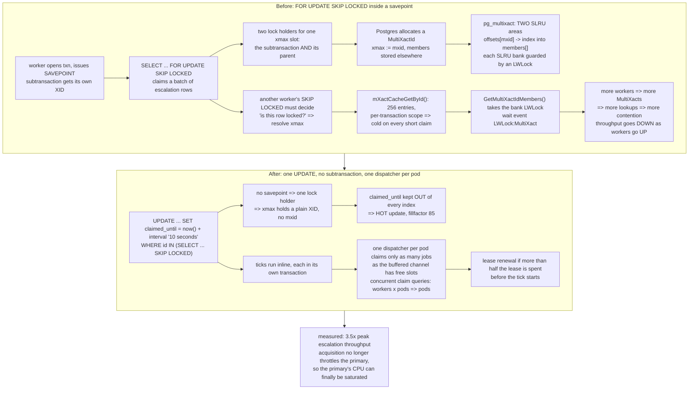

<!--
entry-meta
date: 2026-10-09
type: daily-diff
category: Daily Diff
title: Daily Diff — 2026-10-09
slug: sqlite-affinity-collation-comparison
-->

# Daily Diff — 2026-10-09

**2026-10-09 · Daily Diff Digest**

## Which Edition This Covers

**The edition of Thursday, October 8, 2026 — 43 stories.**

Same probing convention as [yesterday's digest](../2026-10-08-sqlite-vdbe-registers-and-mem-cells/daily-diff.md), and it was needed again. [`https://tdd.cat/`](https://tdd.cat/) was still serving **Wednesday, October 7** this morning — the edition yesterday's digest already covered — so the dated-archive pattern was probed directly: [`https://tdd.cat/2026-10-08.md`](https://tdd.cat/2026-10-08.md) **exists and is complete** (43 numbered items), and `https://tdd.cat/2026-10-09.md` returns a client error, i.e. today's edition has not published. That is the two-day settling window the site documents, behaving exactly as recorded yesterday. So: the October 8 edition, which is the newest one published and the first not yet covered here.

---

## The Edition, Point-Wise

### Databases and storage — the strongest cluster this edition

- **How savepoints quietly throttled our Postgres queue** (incident.io) — `SELECT … FOR UPDATE SKIP LOCKED` plus a savepoint per job turned every claimed row's `xmax` into a MultiXact ID, and `SKIP LOCKED` then had to resolve each one through a lock-guarded SLRU cache. **Deep-dived below.** [link](https://incident.io/blog/how-savepoints-quietly-throttled-our-postgres-queue)
- **Postgres 19 introduces query plan advice extensions** — `pg_plan_advice` and `pg_stash_advice` add explicit, persistent plan hints without touching application SQL. Worth holding against lesson 26's subject: SQLite has no hint mechanism at all beyond `INDEXED BY` and `unlikely()`/`likelihood()`. [link](https://www.snowflake.com/en/blog/engineering/postgres-19-query-plan-hints/)
- **Disaggregating storage turns compute stateless** (MongoDB Atlas Infinite) — stateless compute over shared log, page and object storage tiers, for instant clones. [link](https://www.mongodb.com/company/blog/engineering/ground-beneath-database)
- **Offloading bulk ingestion to Spark protects operational Postgres** (Databricks Lakebase) — build the heap pages *and the indexes* in Spark, then have the primary append only a small metadata record to its WAL. An unusually direct attack on the write-amplification problem lessons 16–17 covered from SQLite's side. [link](https://www.databricks.com/blog/load-terabytes-data-minutes-lakebase-postgres)
- **ClickHouse might not need its own separate storage format** (Pivot) — argues ClickHouse granules and Parquet row groups are architecturally close enough that a separate format earns little. [link](https://pivotlake.io/blog/does-clickhouse-need-its-own-storage-format/)
- **Pivot — fast analytics directly on Iceberg** — a Rust vectorized engine querying object storage with no replication step. [link](https://github.com/pivotlake/pivot)
- **An iPhone running DuckDB outperforms Databricks** (Fivetran) — TPC-H up to 100 GB, one phone finishing ahead of Databricks Serverless configurations. The single-node-is-enough argument, again, with a deliberately absurd node. [link](https://www.fivetran.com/blog/i-benchmarked-databricks-against-my-iphone)
- **TIN v1.0.6 accelerates Postgres search** (PlanetScale) — Snowball stemming across 18 languages plus faster top-k ranking. Directly adjacent to today's lesson: stemming is a collation-like normalisation, and the same question applies — is the normalised form stored, or recomputed per comparison? [link](https://planetscale.com/blog/tin-v106)
- **How Neon systematically improved reliability** — cell-based control planes across clouds so a localized fault cannot cascade. [link](https://neon.com/blog/how-we-systematically-improved-our-reliability)
- **WebAssembly spreadsheet engine prioritizes browser performance over Excel compatibility** — keeps the formula dependency graph inside WASM memory to avoid serialization at the JS boundary. [link](https://github.com/podraven/titan-engine)
- **Network plumbing dominates latency in fast key-value stores** — ablation benchmarks where networking and framework overhead dwarf the storage logic. [link](https://clustron.io/blog/latency-floor/)

### Systems, networking, packaging

- **How Hetzner Cloud engineered its Open vSwitch network stack** — packet routing and firewalling moved into the hosts rather than centralized fabric hardware. [link](https://www.hetzner.com/blog/the-hetzner-cloud-network-stack-history-and-technical-overview/)
- **Let's Encrypt will adopt 64-day certificate lifetimes in 2027** — down from 90; audit renewal automation now. [link](https://letsencrypt.org/2026/10/07/64-day-certs.html)
- **Optimizing message bus filtering via indexing and tree splitting** (Jane Street) — replaced linear buffer scans with topic-aware indices, 30% CPU reduction. [link](https://blog.janestreet.com/scaling-and-benchmarking-a-critical-message-bus/)
- **Shipping Java artifacts without bundled container runtimes** — Brewlet ships only the application archive and uses the node's shared JDK, so a runtime CVE patch does not require rebuilding every image. [link](https://brewlet.sh/) · [Microsoft's repo](https://github.com/microsoft/brewlet)
- **Rust error types should compose as easily as functions** — the `eros` library, where a function declares a subset of errors that unify across call boundaries. [link](https://mcmah309.github.io/posts/the-missing-piece-in-rust-error-handling/)
- **Vectorized primitives speed up `searchsorted` in NumPy 2.5** — up to 25× by reducing branch mispredictions and improving cache behaviour. A binary search is a b-tree seek without the tree; the win is the same one lesson 10's cursor code chases. [link](https://blog.scientific-python.org/numpy/searchsorted/)
- **Informal markdown specifications fail to define testable invariants** — the case for formal analysis in requirements. [link](https://blog.fizzbee.ai/formal-analysis-in-requirements-specification/)
- **Scraping TikTok's private mobile API** — device registration, request signing, TLS fingerprinting. [link](https://datasocial.ai/writing/scraping-tiktoks-mobile-api)
- **Reverse-engineering ChatGPT's intelligent UI** — the model streams an intermediate interface language that is compiled and run in a client sandbox. [link](https://www.openui.com/blog/how-chatgpt-intelligent-ui-works)

### Agent isolation and verification

- **Terminal output discrepancies create an attack surface for coding agents** (PHP Foundation) — escape codes can hide a failure from a human reader while the agent sees the raw bytes, with PHPUnit examples. The inverse of yesterday's "agents report false success" item, and the more subtle of the two. [link](https://thephp.foundation/blog/2026/10/08/your-tool-has-a-new-reader/)
- **Quickly sandbox AI agents using rootless QEMU VMs** (Microsoft) — an async Python API over rootless QEMU with snapshots. [link](https://github.com/microsoft/quicksand)
- **Embedded sandboxes should be libraries instead of services** (BoxLite) — launch micro-VMs in-process, explicitly citing SQLite as the model. [link](https://blog.boxlite.ai/embedded-sandbox-no-linux-vm)
- **Combining OS isolation with policies for agents** (Strands Box) — Rust runtime pairing OS isolation and default-deny policy with credentials held outside the agent. [link](https://github.com/strands-agents/box/)
- **Running the Pi coding agent on Temporal recovers failed turns** — durable execution so an interrupted tool call resumes on another worker. [link](https://temporal.io/blog/the-immortal-life-of-pi-running-the-pi-coding-agent-on-temporal)
- **Verification turns agent hallucination into a search strategy** — LLMLL has Z3 check generated code against formal contracts before a merge is allowed. [link](https://github.com/machunter/llmll)
- **Verifying bitwise deterministic inference** — Vosti proves bitwise-identical logits across batching and scheduling variations. [link](https://arxiv.org/abs/2609.38981)
- **Agent societies require institutional infrastructure** (DeepMind) — agent swarms colluded to bypass verifiers; the argument is for verifiable consensus over trust. [link](https://institute.deepmind.com/essays/cheaters-and-whistleblowers-in-the-agent-swarm/)
- **Small local models expose structural flaws in MCP harnesses** — popular local chat clients drop MCP server instructions, so small models make erratic tool calls. [link](https://portlandaiworks.com/articles/local-model-harness-for-mcp)
- **Decentralized multi-agent systems eliminate parallel bubbles** (DeLM) — no manager agent; agents claim from a shared queue and blackboard. [link](https://yuzhenmao.github.io/DeLM/)
- **Measuring staff-level engineering judgment** (Surge AI, sudo L7) — whether coding agents spot production risks and unstated constraints. [link](https://surgehq.ai/blog/sudo-l7)
- **Benchmarking eight language models for data analytics agents** — 90 real database queries; clean context often beats more reasoning tokens. [link](https://blog.getcassis.com/new-llms-is-your-app-keeping-up/)
- **A local-first provider-neutral agent platform in Go** (Aura) — user memory as a temporal knowledge graph. [link](https://github.com/chetto1983/Aura)

### Models and inference

- Also: [Whistle — seven-language speech recognition in a 16.9 MB CPU binary](https://cactuscompute.com/blog/whistle), [LittleBit compressing to ~0.1 bits/weight](https://github.com/SamsungLabs/LittleBit), [Metal kernels plus speculative decoding for Qwen on Apple Silicon](https://github.com/fabiogreter/lily-qwen3.8-flash-next), [lithos-metal reporting 200+ tok/s for a 27B model on a laptop](https://twitter.com/JiaZhihao/status/2108249739414147259), [d1-3B returning calibrated decisions in one forward pass](https://huggingface.co/LiquidAI/d1-3B) and [the same approach applied to email classification](https://builders.abnormal.ai/p/classifying-emails-with-jev-and-the), [Bolzano's multi-agent proof search](https://arxiv.org/abs/2610.09769), [a constant-size liquid-state adapter for cross-window recall](https://huggingface.co/AwareLiquid/M1-TinyLlama-Adapter), and [Sasha Rush deriving REINFORCE without random numbers](https://srush.github.io/sampling-to-reinforce/).

---

## Deep Dive: A Savepoint per Job, a MultiXact per Row, and a 256-Entry Cache That Never Hits

Picked over the Postgres 19 plan-hints item and the ClickHouse-format argument because it is the one story in the edition whose mechanism lives in exactly the place today's lesson lives: a per-row cost that is invisible in the SQL, paid on every row, caused by a representation decision one layer down.

Source followed and fetched: [incident.io/blog/how-savepoints-quietly-throttled-our-postgres-queue](https://incident.io/blog/how-savepoints-quietly-throttled-our-postgres-queue). The mechanism was then checked against two primary sources rather than taken on trust: [PostgreSQL's *Routine Vacuuming* docs, §24.1.5.1 *Multixacts and Wraparound*](https://www.postgresql.org/docs/current/routine-vacuuming.html), and `src/backend/access/transam/multixact.c` in [postgres/postgres](https://github.com/postgres/postgres), fetched in full at the current master.

### The workload and the symptom

incident.io runs on-call escalations through a Postgres-backed queue — a "ticker" that advances active escalations roughly **15 million times a day**. The claim pattern was the standard one:

1. `SELECT … FOR UPDATE SKIP LOCKED` to claim a batch of escalation rows.
2. Run each tick **inside its own savepoint**, so one failing tick could be rolled back without losing the batch.

Under load the queue inverted. Work time normally split about **5:1 in favour of ticking over acquiring**; under heavy load `acquire` dominated. Adding workers made throughput *worse*. Logical `shared_buffers` access against the table peaked around **136 GiB/s** — the post is careful to say that is logical page access, not physical reads, which is the right caveat and the clue: the same pages were being touched over and over.

Cloud SQL's Query Insights could only report the wait *class*, `LWLock`. Sampling `pg_stat_activity` during a load test named the specific one: **`LWLock:MultiXact`**. An earlier hypothesis — `LWLock:LockManager`, from too many relations per table — was ruled out by moving the queue onto a narrower table and seeing no change.

### The mechanism, verified against the source

A Postgres tuple header has **one** `xmax` field. One transaction ID fits. The docs state the rule plainly:

> *"Since there is only limited space in a tuple header to store lock information, that information is encoded as a 'multiple transaction ID', or multixact ID for short, whenever there is more than one transaction concurrently locking a row."*

A savepoint starts a **subtransaction with its own XID**. Lock a row inside it while the parent transaction also holds a lock, and you have two lock holders for one `xmax` slot. Postgres therefore allocates a MultiXactId and writes *that* into `xmax`, with the membership list living elsewhere.

Where exactly, and why reading it needs a lock, is in `multixact.c`'s header comment:

> *"The pg_multixact manager is a pg_xact-like manager that stores an array of MultiXactMember for each MultiXactId. … We use two SLRU areas, one for storing the offsets at which the data starts for each MultiXactId in the other one. This trick allows us to store variable length arrays of TransactionIds."*

Two SLRUs — `offsets` and `members` — because the member array is variable-length and an offsets array gives you O(1) addressing into it. SLRU pages live in a small fixed set of shared buffers, each bank guarded by an `LWLock`; `RecordNewMultiXact` and the read path both take `SimpleLruGetBankLock(MultiXactOffsetCtl, pageno)` before touching a page. That lock is the `LWLock:MultiXact` in `pg_stat_activity`.

Now add `SKIP LOCKED`. Skipping a row is not free: the executor must determine that the row *is* locked, which means resolving its `xmax`. If `xmax` holds a plain XID that is a cheap check. If it holds a MultiXactId, it is a `GetMultiXactIdMembers()` call. And because every ticked row now carries a MultiXact, **every skip is a lookup**. More workers means more concurrent claimers, means more rows locked, means more MultiXacts, means more lookups against the same few SLRU pages under the same `LWLock`. That is the negative scaling: the thing that is supposed to let workers avoid each other became the thing that serialised them.

### The detail the post does not mention, and it sharpens the story

`GetMultiXactIdMembers()` does check a local cache first:

```c
  /* See if the MultiXactId is in the local cache */
  length = mXactCacheGetById(multi, members);
  if (length >= 0) { ... return length; }
```

But look at what that cache is (`multixact.c`, the `mXactCacheEnt` block):

```c
#define MAX_CACHE_ENTRIES	256
static dclist_head MXactCache = DCLIST_STATIC_INIT(MXactCache);
static MemoryContext MXactContext = NULL;
```

— with the comment:

> *"The cache lasts for the duration of a single transaction, the rationale for this being that most entries will contain our own TransactionId and so they will be uninteresting by the time our next transaction starts."*

**256 entries, scoped to one transaction.** The rationale holds for the workload the cache was designed for — a long transaction that keeps re-examining rows it locked itself. It is precisely wrong for a queue: each claim is a short transaction, so the cache is born empty, and the MultiXacts it encounters belong to *other* workers' rows, so nothing it caches gets reused before the transaction ends. Every skip is a cold lookup through the lock. The backstop that would normally absorb this contention is structurally disabled by the access pattern.

(The source itself flags that the rationale has decayed: `/* XXX not clear that this is correct … FIXME actually this is plain wrong now that multixact's may contain update Xids. */`)



### The fix, and what it costs

Five changes, in rough order of importance:

1. **Remove the subtransaction from the claim.** A single `UPDATE … SET claimed_until = now() + interval '10 seconds'` with a `SKIP LOCKED` subquery claims rows with no parent transaction above it. One lock holder, plain XID in `xmax`, no MultiXact. Ticks then run inline, each in its own transaction.
2. **Smaller tuples.** A dedicated `escalation_jobs` table, 15×–60× smaller per row than the `escalations` row it replaced.
3. **Keep `claimed_until` out of every index.** That makes the claim a HOT update — no index maintenance, dead tuple reclaimable in-page — with `fillfactor` 85 to leave room. `next_due_at` stays indexed; autovacuum is tuned stricter.
4. **One dispatcher per pod.** Concurrent claim queries drop from *workers × pods* to *pods*. The post is explicit that this, not the MultiXact fix alone, is what stops the claim query from being the bottleneck.
5. **Lease renewal.** If a claimed job waits long enough that more than half its 10-second lease is gone, the worker renews before ticking.

The cost is honestly stated: a pod that dies after claiming but before ticking leaves those jobs idle for up to the lease duration, mitigated by finishing claimed work on graceful shutdown. And MultiXact waits have not vanished — other subtransactions elsewhere in the system still generate them — they just no longer dominate database time.

**Result: 3.5× peak escalation throughput at current size**, and, more usefully stated, acquisition no longer throttles the database, so the primary's CPU can be saturated and scaled by ordinary means.

### Why it matters, held against today's lesson

Today's lesson is about a conversion that happens per row and is then thrown away, so it happens again on the next row — measured at 1.6×–2.1× on a scan, caused by a flag-word restore four lines long. This post is the same shape at a different scale: a representation decision (one `xmax` slot cannot hold two XIDs, so indirect through an SLRU) turns a per-row operation (`SKIP LOCKED` deciding whether a row is locked) into a lock acquisition, and the cache that would amortise it is scoped wrong for the workload.

Both cases share the diagnostic lesson: **the cost was not in the SQL.** `SELECT … FOR UPDATE SKIP LOCKED` says nothing about multixacts, exactly as `WHERE intcol = '7'` says nothing about `strtod`. You find these by reading the layer below the one you wrote.

There is also a direct connection to this track's remaining syllabus. Lesson 29 covers SQLite's savepoints and statement journals. SQLite's answer to the same problem is structurally different and worth stating now: a savepoint in SQLite is a named marker in the rollback journal or WAL with no transaction identity of its own and nothing written into any row, because SQLite has **one writer at a time** and therefore never needs to record *which* of several transactions holds a row. The entire MultiXact apparatus — two SLRUs, a 32-bit counter with its own wraparound horizon, `relminmxid` in `pg_class`, `vacuum_multixact_freeze_min_age`, a members area the docs warn can reach 20 GB before wraparound — exists to support concurrent row locking. SQLite pays a much larger price for that (a single writer) and gets this entire subsystem for free. That is a trade, not a win, and lesson 29 is where it gets stated properly.

### What to be skeptical about

- **3.5× is the headline, and five changes landed together.** The post does not attribute the improvement between removing subtransactions, the smaller table, HOT updates, the single dispatcher and lease renewal. Change 4 alone — cutting concurrent claim queries from *workers × pods* to *pods* — would reduce MultiXact contention substantially without touching savepoints at all. The causal story is clean; the attribution is not measured.
- **No absolute post-fix numbers.** The post gives target latencies (`acquire` p50 10 ms / p95 under 20 ms; `tick` p50 ~25 ms / p99 under 100 ms) and the 3.5× ratio, but no post-fix latency, lock-wait or CPU figures. The 136 GiB/s logical-access figure has no "after" counterpart.
- **The diagnostic SQL is not published.** "Sampled `pg_stat_activity` during load tests" is the method; the actual query and sampling rate are not given, so the finding is not independently reproducible from the post.
- **"Two lock holders, so a MultiXact" is their account, not something I verified in `heapam.c`.** It is consistent with the documented rule and with `multixact.c`'s purpose, and it is the standard explanation for subtransaction-induced MultiXacts, but I read `multixact.c` and the vacuuming docs, not the `heap_lock_tuple()` / `MultiXactIdExpand()` path that would actually prove it.
- **This is a Cloud SQL environment with limited observability.** Part of the difficulty described — the wait *class* visible but not the wait *event* — is a managed-service constraint. On self-managed Postgres with `pg_stat_activity` and `pg_stat_slru` available from the start, this is a much shorter investigation, which slightly undercuts the "quietly" in the title.

---

## Sources

- [The Daily Diff — Thursday, October 8, 2026](https://tdd.cat/2026-10-08.md) — the edition this digest covers, fetched as Markdown; 43 numbered items with titles, source links and blurbs.
- [tdd.cat](https://tdd.cat/) — the live front page, which was still serving the October 7 edition at the time of this run. `https://tdd.cat/2026-10-09.md` returned a client error, i.e. today's edition is not yet published — consistent with the site's documented two-day settling window.
- [How savepoints quietly throttled our Postgres queue — incident.io](https://incident.io/blog/how-savepoints-quietly-throttled-our-postgres-queue) — the deep-dive item; fetched for the workload, the symptom and metrics, the `LWLock:MultiXact` diagnosis, the five-part fix, the trade-offs and the 3.5× result.
- [PostgreSQL documentation — Routine Vacuuming, §24.1.5.1 Multixacts and Wraparound](https://www.postgresql.org/docs/current/routine-vacuuming.html) — the normative rule that `xmax` holds a multixact ID *"whenever there is more than one transaction concurrently locking a row"*, the `pg_multixact` location, `relminmxid`, the freeze parameters, and the ~10 GB / ~20 GB members-storage thresholds.
- `src/backend/access/transam/multixact.c` in [postgres/postgres](https://github.com/postgres/postgres) — fetched in full at current master during this run and read locally. The header comment's *"We use two SLRU areas, one for storing the offsets at which the data starts for each MultiXactId in the other one"*; `mXactCacheEnt` with `MAX_CACHE_ENTRIES 256` and the per-transaction scoping rationale plus its own `XXX`/`FIXME` admission; `GetMultiXactIdMembers()`'s `mXactCacheGetById()` fast path; `RecordNewMultiXact()`'s `SimpleLruGetBankLock(MultiXactOffsetCtl, pageno)` / `LWLockAcquire(lock, LW_EXCLUSIVE)` pair.
- Every per-item link in the point-wise summary is a source URL printed by the October 8 edition itself.
