<!--
entry-meta
date: 2026-10-10
type: lesson
track: SQLite
lesson: 25
category: Database Internals
title: Code Generation for INSERT, UPDATE and DELETE — An Affinity String That Moves Between Two Opcodes, a Record Built Last on Purpose, and a Delete That Only Runs a Hook
slug: sqlite-insert-update-delete-codegen
-->

# Code Generation for INSERT, UPDATE and DELETE — An Affinity String That Moves Between Two Opcodes, a Record Built Last on Purpose, and a Delete That Only Runs a Hook

**2026-10-10 · SQLite Track · Lesson 25 of 33**

## Where This Fits

- **What lesson 24 established:** affinity as seven consecutive ASCII characters, `applyAffinity()`'s three arms, `OP_Affinity`'s REAL re-promotion, `OP_TypeCheck`'s semantics, and — in its section 5 — exactly which serial type each `Mem` flag combination produces, including the `MEM_IntReal` → `MEM_Real` flip at the six-byte boundary. See [lesson 24](../2026-10-09-sqlite-affinity-collation-comparison/README.md). Lesson 23 established the register file, the bump-plus-eight-slot allocator, `allocateCursor()`, and the `OP_Move`/`OP_Copy`/`OP_SCopy`/`OP_IntCopy` family. See [lesson 23](../2026-10-08-sqlite-vdbe-registers-and-mem-cells/README.md).
- **What this lesson adds:** the code that *emits* those opcodes. Three functions in `insert.c` — `sqlite3Insert()`, `sqlite3GenerateConstraintChecks()`, `sqlite3CompleteInsertion()` — plus `sqlite3GenerateRowDelete()` and `sqlite3GenerateIndexKey()` in `delete.c`, and `sqlite3Update()` in `update.c`. The register contract they share (`regNewData`, `aRegIdx[]`, and the entry one past the last index). `OP_MakeRecord`'s two-pass body. Why the affinity string sometimes rides in `OP_MakeRecord.p4` and sometimes becomes a standalone `OP_Affinity`, and the single `u8` flag that decides. The four flag words (`OP_Insert.p5`, `OP_IdxInsert.p5`, `OP_Delete.p2`, `OP_Delete.p5`) that tell the b-tree layer what kind of write this is. And the ONEPASS decision that makes a `DELETE` either one loop or two.
- **What it sets up:** lesson 26 (`where.c`, the path solver) owns `sqlite3WhereOkOnePass()`, which this lesson calls and reads the answer of but does not open. Lesson 28 (the sorter) inherits `OP_SorterInsert`, which appears here only as `OP_IdxInsert`'s sibling. Lesson 29 (savepoints and statement journals) inherits `sqlite3MultiWrite()` and the `OE_Abort`/`OE_Fail` distinction this lesson's constraint table names but does not implement. Lesson 30 inherits `OP_VUpdate`.
- **What it deliberately does not re-teach:** the serial-type selection table and the record *format* (lesson 24 §5, lesson 02), register allocation (lesson 23 §5), cursor numbering and `allocateCursor()` (lesson 23 §4), `sqlite3BtreeInsert()`/`sqlite3BtreeDelete()` and rebalancing (lessons 11–12), and the pager/WAL layer that the b-tree calls underneath (lessons 14–20).

**Version caveat, and it matters more than usual today.** Source line numbers below are from trunk commit `d76e14d8` (2026-10-10). Every measurement is from the `libsqlite3` behind CPython 3.13.16's `sqlite3` module, which reports **3.45.1** (2024-01-30). Two of the opcodes this lesson is about have *changed operand meanings* between those two versions, and `OP_IdxDelete` is the clearest case. Where trunk and 3.45.1 disagree, both are given and the disagreement is the point, not an error to paper over.

**The instrument.** Lesson 24 established that `EXPLAIN` exposes `p4` and `p5` as ordinary result columns, with no debug build required. That is the whole instrument for this lesson: every claim about which opcode carries which flag is read straight out of `EXPLAIN`, and the flag words are decoded against the `OPFLAG_*` constants in `sqliteInt.h:4109-4129`. Where a claim comes only from reading the source and could not be reached from 3.45.1, it says so.

---

## 1. The Register Contract

Everything in the write path is a disagreement-free agreement about three register ranges. Get these three and the rest of the lesson is reading.

| name | what it holds | who allocates it |
|---|---|---|
| `regNewData` (also `regIns`) | `nCol+1` consecutive registers: `regNewData` is the **rowid** (or NULL for `WITHOUT ROWID`), `regNewData+1` is column 0, `regNewData+2` is column 1, … | `sqlite3Insert` at `insert.c:1043-1049`; `sqlite3Update` for the UPDATE path |
| `regOldData` | the same shape, pre-update. **Zero for an INSERT** — and that zero is how `sqlite3GenerateConstraintChecks` tells INSERT from UPDATE (`isUpdate = regOldData!=0`, `insert.c:1930`) | `sqlite3Update` |
| `aRegIdx[]` | one register per index, in `pTab->pIndex` list order. `aRegIdx[i]==0` means "this index does not change; skip it entirely". Register `aRegIdx[i]` receives index *i*'s key record; `aRegIdx[i]+1` upward is the scratch range the key is assembled in | `sqlite3Insert` / `sqlite3Update` |

The non-obvious part is the entry **past** the last index. `sqlite3GenerateConstraintChecks`' header comment dates it:

```
** (2019-05-07) The generated code also creates a new record for the
** main table, if pTab is a rowid table, and stores that record in the
** register identified by aRegIdx[nIdx] - in other words in the first
** entry of aRegIdx[] past the last index.  It is important that the
** record be generated during constraint checks to avoid affinity changes
** to the register content that occur after constraint checks but before
** the new record is inserted.
```

Read that last sentence against lesson 24. Affinity conversion is destructive in place: `applyAffinity()` rewrites the `Mem` cells of `regNewData+1..`. If the table record were encoded *after* constraint checking, any affinity conversion emitted by the constraint-checking code would have already changed the values that the record is built from — and the index keys, which *are* built during constraint checking, would disagree with the table row. So the table record is built at the bottom of `sqlite3GenerateConstraintChecks` (`insert.c:2728-2736`) and merely *inserted* by `sqlite3CompleteInsertion`. The function named "generate constraint checks" encodes the row. That is not sloppy naming; it is the fix for a real class of bug, and the date in the comment is when it was made.

**Measured.** A four-column rowid table with three indexes, `INSERT INTO three(a,b,c,d) VALUES(?,?,?,?)` where `a` is `INTEGER PRIMARY KEY`:

```
   5 SoftNull          2  0  0
   6 Variable          2  3  0
   7 Variable          3  4  0
   8 Variable          4  5  0
   9 Variable          1  1  0
...
  19 MakeRecord        7  3  6                 <- index three_bc key -> reg 6
  22 MakeRecord       11  2 10                 <- index three_c  key -> reg 10
  27 MakeRecord       14  2 13                 <- index three_b  key -> reg 13
  28 MakeRecord        2  4 16                 <- the TABLE record -> reg 16
  29 IdxInsert         1  6  7 '3'       16
  30 IdxInsert         2 10 11 '2'       16
  31 IdxInsert         3 13 14 '2'       16
  32 Insert            0 16  1 'three'   49
```

`regNewData` is 1; columns are 2,3,4,5. `aRegIdx` is `[6, 10, 13, 16]` — three indexes and then the table record at `aRegIdx[3]`. Each index's scratch range starts at `aRegIdx[i]+1`: 7, 11, 14. The four `OP_MakeRecord`s run before any of the four writes. Nothing touches the b-tree until instruction 29.

Note also the order. `pTab->pIndex` is **newest first**: `three_bc` was created last and is index 0. Cursor numbers follow: cursor 0 is the table, cursors 1,2,3 are indexes 0,1,2. That is `sqlite3OpenTableAndIndices` (`insert.c:2889-2968`), which hands back `*piDataCur` and `*piIdxCur` and guarantees `*piIdxCur == *piDataCur+1` for a rowid table.

---

## 2. Where the Rowid Comes From, and the Flag You Lose by Asking for One

`sqlite3Insert` has a single `appendFlag` local. It is set in exactly two places (`insert.c:1510` and `insert.c:1536`) and it becomes `OPFLAG_APPEND` (0x08) on the final `OP_Insert`, a hint that tells the b-tree layer to expect a new largest key.

```c
Expr *pIpk = pList->a[ipkColumn].pExpr;
if( pIpk->op==TK_NULL && !IsVirtual(pTab) ){
  sqlite3VdbeAddOp3(v, OP_NewRowid, iDataCur, regRowid, regAutoinc);
  appendFlag = 1;
}else{
  sqlite3ExprCode(pParse, pList->a[ipkColumn].pExpr, regRowid);
}
```

The test is `pIpk->op==TK_NULL` — a **literal** `NULL` in the `VALUES` list, decided at compile time. A bound parameter that will be NULL at run time does not qualify, because the compiler cannot know. It falls into the `else` branch and then into the generic fix-up at `insert.c:1521-1530`, which emits `OP_NotNull` / `OP_NewRowid` / `OP_MustBeInt`.

**Measured**, on a table `t(a INTEGER PRIMARY KEY, b TEXT)`:

| form | `OP_Insert.p5` | hex | `OPFLAG_APPEND`? | rowid opcodes emitted |
|---|---|---|---|---|
| `INSERT INTO t VALUES(NULL,'x')` | 57 | `0x39` | **yes** | `SoftNull` `NewRowid` |
| `INSERT INTO t(b) VALUES('x')` | 57 | `0x39` | **yes** | `SoftNull` `NewRowid` |
| `INSERT INTO t VALUES(?,'x')` | 49 | `0x31` | **no** | `SoftNull` `NotNull` `NewRowid` `MustBeInt` |
| `INSERT INTO t VALUES(7,'x')` | 49 | `0x31` | no | `SoftNull` `Integer` `NotNull` `NewRowid` `MustBeInt` |
| `INSERT INTO t VALUES(1+1,'x')` | 49 | `0x31` | no | `SoftNull` `Add` `NotNull` `NewRowid` `MustBeInt` `Integer` |

So `INSERT INTO t VALUES(?, ...)` with the parameter bound to `None` — the shape an ORM or a `executemany` wrapper emits by default when it passes a full tuple — is **three instructions longer per row and loses the append hint**, compared to naming the columns and leaving the rowid out. Both end up calling `OP_NewRowid` at run time and producing identical rowids.

**Measured cost**, 200,000 single-row inserts inside one transaction on `:memory:`, best of five:

| form | time | ratio |
|---|---|---|
| `INSERT INTO t(b) VALUES(?)` — append hint set | 0.1391 s | 1.00× |
| `INSERT INTO t VALUES(?,?)` with NULL rowid — hint clear | 0.1729 s | **1.24×** |

That 1.24× is the *combined* effect of the lost hint and the three extra instructions per row. **I did not separate the two.** Isolating the hint alone would need a build with the `OPFLAG_APPEND` bit forced on, which is not reachable from a stock library; the honest statement is that the two shapes differ by 24% and that the codegen difference above is the entire source of it.

`OP_NewRowid` itself (`vdbe.c:5754-5873`) is a two-step algorithm worth knowing because its second step is probabilistic:

- Step 1: `sqlite3BtreeLast()` to find the largest existing rowid, `+1`. An empty table gives 1 (`IMP: R-61914-48074`).
- Step 2, only if the largest rowid is already `MAX_ROWID`: pick a random rowid, probe it, retry **up to 100 times**, and return `SQLITE_FULL` if all 100 collide. The `pC->useRandomRowid` flag latches once step 1 saturates.

---

## 3. The Affinity String Lives in Two Places, and One `u8` Decides Which

This is the centre of the lesson. `sqlite3TableAffinity()` (`insert.c:179-224`) has two modes, chosen by its `iReg` argument:

```c
/* Otherwise if iReg>0 then code an OP_Affinity opcode that will set the
** affinities for register iReg and following.  Or if iReg==0,
** then just set the P4 operand of the previous opcode (which should  be
** an OP_MakeRecord) to the affinity string. */
```

```c
  i = sqlite3Strlen30NN(zColAff);
  if( i ){
    if( iReg ){
      sqlite3VdbeAddOp4(v, OP_Affinity, iReg, i, 0, zColAff, i);
    }else{
      assert( sqlite3VdbeGetLastOp(v)->opcode==OP_MakeRecord
              || sqlite3VdbeDb(v)->mallocFailed );
      sqlite3VdbeChangeP4(v, -1, zColAff, i);
    }
  }
```

`iReg==0` **retrofits** the string onto an `OP_MakeRecord` that has already been appended. `iReg>0` emits a separate opcode that converts the registers in place, before anything reads them.

Which one happens is decided by `bAffinityDone`, a single `u8` local in `sqlite3GenerateConstraintChecks` (`insert.c:1918`), set at two sites:

| site | condition | what it does |
|---|---|---|
| `insert.c:2075-2077` | a `CHECK` constraint exists | `sqlite3TableAffinity(v, pTab, regNewData+1)` → standalone `OP_Affinity` |
| `insert.c:2424-2426` | the per-index loop is about to build a key, and `aRegIdx[ix]!=0` | same |
| `insert.c:2731-2735` | after the table record is encoded, **only if** `!bAffinityDone` | `sqlite3TableAffinity(v, pTab, 0)` → string retrofitted into `OP_MakeRecord.p4` |

The reason is forced by the register contract. Index keys are built with `OP_SCopy` from `regNewData+1..` (next section). If the affinity conversion were deferred into `OP_MakeRecord.p4`, the index key copies would be made from unconverted values and the index would hold a different type than the table. So: **any table with an index that this statement touches, or any `CHECK` constraint, converts affinity eagerly with `OP_Affinity`; a table with neither converts lazily inside `OP_MakeRecord`.**

**Measured.** Same three-column declaration (`a INTEGER, b TEXT, c REAL` → affinity string `"DBE"`), with and without one index:

```
#### no index
   6 MakeRecord        2  3  5 'DBE'         <- affinity string in P4
   7 Insert            0  5  1 'noidx'   57

#### one index on b
   7 Affinity          2  3  0 'DBE'         <- standalone opcode
   8 SCopy             3  6  0
   9 IntCopy           1  7  0
  10 MakeRecord        6  2  5               <- index key, P4 empty
  11 MakeRecord        2  3  8               <- table record, P4 EMPTY
  12 IdxInsert         1  5  6 '2'       16
  13 Insert            0  8  1 'one'     57
```

The same seven bytes of affinity information move between two completely different instruction slots because one index exists. If you are reading a bytecode dump and looking for the affinity string, it is in one of two places and which one tells you something about the schema.

### The string is shorter than the column count, and sometimes empty

`sqlite3TableAffinityStr` (`insert.c:122-135`) builds the string and then trims it:

```c
    for(i=j=0; i<pTab->nCol; i++){
      if( (pTab->aCol[i].colFlags & COLFLAG_VIRTUAL)==0 ){
        zColAff[j++] = pTab->aCol[i].affinity;
      }
    }
    do{
      zColAff[j--] = 0;
    }while( j>=0 && zColAff[j]<=SQLITE_AFF_BLOB );
```

Two things happen here. `VIRTUAL` generated columns are skipped — they are not stored, so they are not in the record. And the loop walks backward from the end removing every affinity `<= SQLITE_AFF_BLOB` (0x41), because `applyAffinity` with BLOB affinity is a no-op (lesson 24 §4) and `OP_MakeRecord` treats a short `p4` as "the rest are BLOB". If **every** column is BLOB-affinity the string is empty and `sqlite3TableAffinity` becomes a no-op: no `OP_Affinity`, no `p4`.

**Measured:**

| table | affinity string, in full | `OP_MakeRecord.p4` |
|---|---|---|
| `(a INTEGER, b TEXT, c REAL)` | `DBE` | `'DBE'` |
| `(a INTEGER, b BLOB, c BLOB)` | `D` (two trailing `A`s trimmed) | `'D'` |
| `(a BLOB, b BLOB)` | `""` | absent |

### STRICT tables: the opcode that moves backwards in the program

For a `STRICT` table with `iReg==0`, `sqlite3TableAffinity` does something genuinely odd — it rewrites an instruction that has already been appended:

```c
      VdbeOp *pPrev;
      int p3;
      sqlite3VdbeAppendP4(v, pTab, P4_TABLE);
      pPrev = sqlite3VdbeGetLastOp(v);
      assert( pPrev->opcode==OP_MakeRecord || sqlite3VdbeDb(v)->mallocFailed );
      pPrev->opcode = OP_TypeCheck;
      p3 = pPrev->p3;
      pPrev->p3 = 0;
      sqlite3VdbeAddOp3(v, OP_MakeRecord, pPrev->p1, pPrev->p2, p3);
```

The existing `OP_MakeRecord` is *mutated into* an `OP_TypeCheck` in place, and a fresh `OP_MakeRecord` is appended after it with the same `p1`/`p2` and the rescued `p3`. There is no instruction-insertion primitive; the opcode slot is overwritten and the displaced instruction re-emitted. Lesson 23 §1 established that an instruction is 24 bytes in a flat array — this is what that representation costs and what it buys.

**Measured on 3.45.1**, `CREATE TABLE st(a INT, b TEXT) STRICT`:

```
   5 TypeCheck         2  2  4 'st'
   6 MakeRecord        2  2  4
```

The swap is visible: `TypeCheck` sits where `MakeRecord` was emitted, and `MakeRecord` follows. But note `TypeCheck.p3 == 4`, not 0. Trunk explicitly zeroes it (`pPrev->p3 = 0;`). **On 3.45.1 it is 4** — the same value `MakeRecord.p3` carries. I read the trunk source and measured 3.45.1; I did not fetch 3.45.1's `insert.c` to confirm the `p3 = 0` line is absent there, so the honest statement is that the two disagree and the trunk form is the newer one.

---

## 4. `OP_MakeRecord`: One Backward Pass to Size It, One Forward Pass to Write It

`OP_MakeRecord` (`vdbe.c:3578-3906` in trunk) takes `p1` = first register, `p2` = count, `p3` = destination, `p4` = affinity string, `p5` = NULL-trim boundary. Its body is four phases, and the phase order is the interesting part.

**Phase 1 — affinity, forward, only if `p4` is present.**

```c
  if( zAffinity ){
    pRec = pData0;
    do{
      applyAffinity(pRec, zAffinity[0], encoding);
      if( zAffinity[0]==SQLITE_AFF_REAL && (pRec->flags & MEM_Int) ){
        pRec->flags |= MEM_IntReal;
        pRec->flags &= ~(MEM_Int);
      }
      ...
      zAffinity++;
      pRec++;
      assert( zAffinity[0]==0 || pRec<=pLast );
    }while( zAffinity[0] );
  }
```

The loop terminates on the string's NUL, **not** on `p2`. That is the mechanism behind the trailing trim in §3: a short string stops early and the remaining registers keep whatever type they have. The `SQLITE_AFF_REAL && MEM_Int → MEM_IntReal` promotion is the same three lines lesson 24 §4 found in `OP_Affinity`; both opcodes carry their own copy.

**Phase 2 — sizing, backward, from `pLast` down to `pData0`.** Each cell's serial type is stashed in `Mem.uTemp`, and `nHdr`/`nData`/`nZero` accumulate. Lesson 24 §5 already owns the serial-type table and the `MEM_IntReal` → serial 7 flip at `MAX_6BYTE`; what matters here is that the pass runs **backward** so that `pLast` can be walked down by the NULL-trim loop immediately before it, and that it writes into `uTemp` so phase 4 does not re-derive anything. `sqlite3VdbeSerialType()` still exists at `vdbeaux.c` behind `#if 0` with the comment that it is *"Inlined into the OP_MakeRecord opcode"* — the function is dead and the loop above is the live copy.

**Phase 3 — the header-size varint, which can need a second try.**

```c
  if( nHdr<=126 ){
    /* The common case */
    nHdr += 1;
  }else{
    /* Rare case of a really large header */
    nVarint = sqlite3VarintLen(nHdr);
    nHdr += nVarint;
    if( nVarint<sqlite3VarintLen(nHdr) ) nHdr++;
  }
```

The header's first varint encodes the header's own total size including itself, so adding it can push the total over a varint-length boundary and lengthen the varint — and that is the `if( nVarint<sqlite3VarintLen(nHdr) ) nHdr++;` line. It pads rather than shrinks, which is why a record header is occasionally one byte larger than minimal. The 126/127 boundary is `testcase`'d on both sides.

**Phase 4 — writing, forward, with a 7-byte over-run trick.**

```c
#if SQLITE_MAX_LENGTH<=2147483640 && SQLITE_BYTEORDER>0
# define OVERRUN 7   /* We are able to allocate an overrun of 7 bytes */
#else
# define OVERRUN 0
#endif
```

With `OVERRUN` available, an integer payload is written as one unconditional 8-byte `memcpy` of a byte-swapped `u64` shifted by a table lookup —

```c
        v = sqlite3BSwap64(v);
        if( OVERRUN ){
          static const u8 aShift[] = { 0, 56, 48, 40, 32, 16, 0, 0 };
          v >>= aShift[serial_type];
          memcpy(zPayload, &v, 8);
        }
```

— instead of a `switch` on length writing 1–8 individual bytes. The seven slack bytes exist purely so that writing a 1-byte integer can scribble seven bytes past it and have the next field overwrite them. `aShift[5] == 16` for the 6-byte serial type and `aShift[6] == aShift[7] == 0` for the 8-byte ones, which is why the table has two zeros at the end rather than being a simple arithmetic series.

Also note the allocation fast path just before:

```c
  if( nByte+nZero<=pOut->szMalloc-OVERRUN ){
    pOut->z = pOut->zMalloc;
  }else{
    ...
    if( sqlite3VdbeMemClearAndResize(pOut, (int)nByte+OVERRUN) ){
```

A destination register that already owns a big enough buffer is reused with **no error check at all** — no limit test, no reallocation. On a loop inserting rows of similar width, the record buffer is allocated once and then reused for every row. That is why `OP_MakeRecord`'s destination must not be one of its inputs, which the opcode asserts (`assert( pOp->p3<pOp->p1 || pOp->p3>=pOp->p1+pOp->p2 )`).

### NULL trim is a compile-time option, and this build does not have it

`p5` is the NULL-trim boundary only `#ifdef SQLITE_ENABLE_NULL_TRIM`; `sqlite3SetMakeRecordP5` (`insert.c:2748-2762`) is itself inside that `#ifdef`. **Measured on 3.45.1**: every `OP_MakeRecord` observed in this lesson has `p5 == 0`, and the record bytes confirm it. A file database with `t(a INTEGER PRIMARY KEY, b TEXT, c TEXT, d TEXT)` and two rows:

```
page2 header: 0d000000020fec00  cellcount 2
 cell 0 at 4087: 07 01 05 00 11 00 00 78 79
 cell 1 at 4076: 09 02 05 00 11 0f 0f 78 79 7a 77
```

Cell 0 is `INSERT INTO t VALUES(1,'xy',NULL,NULL)`: payload length 7, rowid 1, header size 5, then **four** serial-type bytes `00 11 00 00` — the two trailing NULLs each still cost a byte. A `SQLITE_ENABLE_NULL_TRIM` build would have emitted a header of size 3 with two serial types. Cell 1, with all columns non-NULL, decodes as `00 11 0f 0f` → NULL (the IPK alias), text of length 2, text of length 1, text of length 1, payload `xyzw`.

---

## 5. Index Keys: `OP_SCopy`, `OP_IntCopy`, and a Record With No Affinity String

The per-index key build is `insert.c:2441-2465`:

```c
    regIdx = aRegIdx[ix]+1;
    for(i=0; i<pIdx->nColumn; i++){
      int iField = pIdx->aiColumn[i];
      int x;
      if( iField==XN_EXPR ){
        pParse->iSelfTab = -(regNewData+1);
        sqlite3ExprCodeCopy(pParse, pIdx->aColExpr->a[i].pExpr, regIdx+i);
        pParse->iSelfTab = 0;
      }else if( iField==XN_ROWID || iField==pTab->iPKey ){
        x = regNewData;
        sqlite3VdbeAddOp2(v, OP_IntCopy, x, regIdx+i);
      }else{
        x = sqlite3TableColumnToStorage(pTab, iField) + regNewData + 1;
        sqlite3VdbeAddOp2(v, OP_SCopy, x, regIdx+i);
      }
    }
    sqlite3VdbeAddOp3(v, OP_MakeRecord, regIdx, pIdx->nColumn, aRegIdx[ix]);
```

Three facts fall out of five lines.

**`OP_SCopy`, not `OP_Copy`.** Lesson 23 §8 established that `OP_SCopy` is a shallow copy that leaves the destination pointing at the source's buffer, and found exactly three of them in a census, "all three on the `INSERT`/upsert path". This is that path. The copy is safe precisely because the affinity conversion already happened (§3): the source `Mem` will not be rewritten between the `OP_SCopy` and the `OP_MakeRecord` that consumes it.

**`OP_IntCopy` for the rowid.** `OP_IntCopy` asserts the source is `MEM_Int` and copies only `u.i`. Index keys always carry the rowid as their last column (`XN_ROWID`), and for a rowid table the key record's final field is therefore always an integer serial type.

**`sqlite3VdbeAddOp3`, with no `p4`.** The index key's `OP_MakeRecord` gets **no affinity string**. Per the opcode docs, *"If P4 is NULL then all index fields have the affinity BLOB"* — i.e. no conversion. There is none to do: the values were converted in place by the `OP_Affinity` that `bAffinityDone` guaranteed was emitted first.

**Measured**, census over statement kinds on a table with two indexes:

| statement | `OP_SCopy` | `OP_IntCopy` |
|---|---|---|
| `SELECT * FROM t` | 0 | 0 |
| `SELECT b,c FROM t WHERE b=? ORDER BY c` | 0 | 0 |
| `DELETE FROM t WHERE a=?` | 0 | 0 |
| `UPDATE t SET b=? WHERE a=?` | 1 | 1 |
| `INSERT INTO t(b,c) VALUES(?,?)` | 2 | 2 |
| `INSERT … ON CONFLICT(c) DO UPDATE SET b=?` | 3 | 3 |

Lesson 23's Next Steps item 2 asked for a read-only statement that emits `OP_SCopy`. This census does not find one, and it explains why: the two emission sites in the write path are the index-key loop above and the upsert's `DO UPDATE` arm. Six statements is a census, not a proof — a `SELECT` could emit `OP_SCopy` through some expression-codegen path this sample misses — but the write-path origin is now sourced, not inferred.

**Program size is exactly linear in index count.** `t(a INTEGER PRIMARY KEY, c1..c6 TEXT)`, one single-column index added at a time, `INSERT INTO t(c1..c6) VALUES(?,?,?,?,?,?)`:

| indexes | instructions | `MakeRecord` | `SCopy` | `IntCopy` | `IdxInsert` | `NoConflict` |
|---|---|---|---|---|---|---|
| 0 | 15 | 1 | 0 | 0 | 0 | 0 |
| 1 | 21 | 2 | 1 | 1 | 1 | 0 |
| 2 | 26 | 3 | 2 | 2 | 2 | 0 |
| 3 | 31 | 4 | 3 | 3 | 3 | 0 |
| 4 | 36 | 5 | 4 | 4 | 4 | 0 |
| 5 | 41 | 6 | 5 | 5 | 5 | 0 |
| 6 | 46 | 7 | 6 | 6 | 6 | 0 |

**+5 instructions per index**, flat: one `OP_OpenWrite`, one `OP_SCopy`, one `OP_IntCopy`, one `OP_MakeRecord`, one `OP_IdxInsert`. The first index costs 6 because it also forces the `OP_Affinity` that the zero-index case did not need — the §3 switch, visible as an off-by-one in the first row. `NoConflict` stays 0 throughout because none of these indexes is `UNIQUE`: **a non-unique index costs no conflict check, only five instructions and a b-tree insert.**

**Measured run cost**, 20,000 single-row inserts in one transaction, four TEXT columns, best of five:

| indexes | time | ratio |
|---|---|---|
| 0 | 0.0216 s | 1.00× |
| 1 | 0.0332 s | 1.53× |
| 2 | 0.0445 s | 2.06× |
| 3 | 0.0541 s | 2.50× |
| 4 | 0.0643 s | 2.97× |

About **+0.53 µs per index per row** after the first, which costs more (+11.6 µs/1000 rows vs ~+10.5 for the rest). The first index is where the eager `OP_Affinity` appears, so some of that step is the §3 switch rather than the index itself.

---

## 6. `sqlite3IndexAffinityStr` Clamps to NUMERIC — and Its Header Comment Says Otherwise

There is a *second* affinity-string builder, for indexes rather than tables, and it is not used by the insert path at all. `computeIndexAffStr` (`insert.c:75-110`), memoised behind `sqlite3IndexAffinityStr` (`insert.c:111-114`) into `Index.zColAff`:

```c
    if( x>=0 ){
      aff = pTab->aCol[x].affinity;
    }else if( x==XN_ROWID ){
      aff = SQLITE_AFF_INTEGER;
    }else{
      aff = sqlite3ExprAffinity(pIdx->aColExpr->a[n].pExpr);
    }
    if( aff<SQLITE_AFF_BLOB ) aff = SQLITE_AFF_BLOB;
    if( aff>SQLITE_AFF_NUMERIC) aff = SQLITE_AFF_NUMERIC;
    pIdx->zColAff[n] = aff;
```

Read the clamp against lesson 24's constant table (`sqliteInt.h:2370-2377`):

| constant | value | char |
|---|---|---|
| `SQLITE_AFF_NONE` | `0x40` | `@` |
| `SQLITE_AFF_BLOB` | `0x41` | `A` |
| `SQLITE_AFF_TEXT` | `0x42` | `B` |
| `SQLITE_AFF_NUMERIC` | `0x43` | `C` |
| `SQLITE_AFF_INTEGER` | `0x44` | `D` |
| `SQLITE_AFF_REAL` | `0x45` | `E` |
| `SQLITE_AFF_FLEXNUM` | `0x46` | `F` |

`INTEGER` (0x44), `REAL` (0x45) and `FLEXNUM` (0x46) are all `> SQLITE_AFF_NUMERIC`, so **all three collapse to `C`**. So does the `XN_ROWID` case: `aff = SQLITE_AFF_INTEGER` on the line above, clamped to `NUMERIC` on the line below. An index affinity string can only ever contain `A`, `B`, or `C`.

The header comment immediately above says otherwise:

```
**  Character      Column affinity
**  ------------------------------
**  'A'            BLOB
**  'B'            TEXT
**  'C'            NUMERIC
**  'D'            INTEGER
**  'F'            REAL
**
** An extra 'D' is appended to the end of the string to cover the
** rowid that appears as the last column in every index.
```

Three things in that comment do not match the code below it: `'D'` and `'F'` cannot appear; `'F'` is `FLEXNUM`'s character, not `REAL`'s (`REAL` is `'E'`); and no `'D'` is appended for the rowid, because the loop's own `XN_ROWID` arm produces one and then clamps it to `'C'`. The comment describes behaviour that predates the clamp.

**Measured two ways**, both on 3.45.1, which is enough to rule out a trunk-only clamp.

Via a `WITHOUT ROWID` two-pass `DELETE`, where `sqlite3DeleteFrom` passes this very string as `OP_MakeRecord.p4` (`delete.c:577-579`). Table `w(i INTEGER, r REAL, tx TEXT, other INT, PRIMARY KEY(i,r,tx)) WITHOUT ROWID`:

```
  45 MakeRecord        1  3 16 'CCB'
  46 IdxInsert         5 16  1 '3'
```

`i INTEGER` → `C`, `r REAL` → `C`, `tx TEXT` → `B`. Not `DEB`, not `DFB`.

Via an `IN`-list seek, where `where.c` emits the same string as `OP_Affinity.p4`:

| index on | `OP_Affinity.p4` |
|---|---|
| `INTEGER` column | `'C'` |
| `REAL` column | `'C'` |
| `NUMERIC` column | `'C'` |

For a four-column index `(i INTEGER, r REAL, tx TEXT, bl BLOB)` with all four terms constrained, the emitted opcode is `Affinity p1=1 p2=3 p4='CCB'` — three characters for four columns. The trailing `A` is dropped by the same "BLOB affinity is a no-op" logic as §3. **I did not trace which function in `where.c` does that trimming**; `where.c` is lesson 26's subject and the trimming belongs to it.

This string never reaches an `INSERT`. The insert path's index keys get no `p4` at all (§5). `sqlite3IndexAffinityStr`'s consumers are the planner's seek-key conversion and the `WITHOUT ROWID` ephemeral-table path above.

---

## 7. Constraint Checks: Four Opcodes and a Table of Five Actions

`sqlite3GenerateConstraintChecks` emits, in this fixed order: `NOT NULL`, generated columns, `CHECK`, the rowid/`INTEGER PRIMARY KEY` uniqueness check, then one block per index. Its header comment carries the authoritative action table:

| constraint | action | what happens |
|---|---|---|
| any | ROLLBACK | transaction rolled back, `sqlite3_step()` returns `SQLITE_CONSTRAINT` immediately |
| any | ABORT | **this command's** changes backed out, transaction stays, `SQLITE_CONSTRAINT` |
| any | FAIL | returns immediately; **prior row changes retained** |
| any | IGNORE | the row is skipped silently — an immediate jump to `ignoreDest` |
| NOT NULL | REPLACE | NULL replaced by the column default; if the default is NULL, ABORT |
| UNIQUE | REPLACE | the conflicting row is deleted |
| CHECK | REPLACE | illegal — raises an exception |

**Measured**, the opcode each becomes. `nn(x INTEGER NOT NULL, y TEXT NOT NULL UNIQUE)`:

```
   6 HaltIfNull     1299  2  2 'nn.x'      1
   7 HaltIfNull     1299  2  3 'nn.y'      1
   8 Affinity          2  2  0 'DB'
   9 SCopy             3  5  0
  10 IntCopy           1  6  0
  11 MakeRecord        5  2  4
  12 NoConflict        1 14  5 '1'
  13 Halt           2067  2  0 'nn.y'      2
  14 MakeRecord        2  2  7
  15 IdxInsert         1  4  5 '1'        16
  16 Insert            0  7  1 'nn'       57
```

`p1` of the halting opcodes is the extended result code, decodable by hand: `SQLITE_CONSTRAINT` is 19, and the extended form is `19 | (n<<8)`.

| `p1` | decode | meaning |
|---|---|---|
| 1299 | `19 \| (5<<8)` | `SQLITE_CONSTRAINT_NOTNULL` |
| 1555 | `19 \| (6<<8)` | `SQLITE_CONSTRAINT_PRIMARYKEY` |
| 2067 | `19 \| (8<<8)` | `SQLITE_CONSTRAINT_UNIQUE` |

A `NOT NULL` check is one `OP_HaltIfNull` per column and costs nothing when the column is non-NULL. A `UNIQUE` check is an `OP_NoConflict` **against the index key record that has already been built** — `NoConflict p1=cursor p2=jump-if-ok p3=regIdx p4=nKeyCol` — which is why the key build must precede the conflict check and why `aRegIdx[ix]`'s scratch range doubles as `OP_NoConflict`'s unpacked key.

Note `OP_NoConflict.p4 = pIdx->nKeyCol`, not `nColumn`: the conflict test uses only the declared key columns, excluding the trailing rowid. And the opcode is `NoConflict` rather than `NotFound` specifically because a NULL in any key column means "cannot conflict" under SQL's uniqueness semantics — `three_c` is `UNIQUE` on a nullable `REAL` column, and `NoConflict` jumps straight to the OK label if `c` is NULL.

### `INSERT OR REPLACE`, measured

```
  12 NoConflict        1 17  5 '1'
  13 IdxRowid          1  8  0
  14 NotExists         0 17  8 '1'
  15 Delete            0  0  0 'nn'
  16 Delete            1  0  0
  17 MakeRecord        2  2  7
  18 IdxInsert         1  4  5 '1'   16
  19 Insert            0  7  1 'nn'  57
```

On conflict: recover the conflicting row's rowid from the index entry the cursor is now sitting on (`OP_IdxRowid`), seek the table to it (`OP_NotExists`), delete the table row, then delete the index entry with a bare `OP_Delete` on the *index* cursor — not `OP_IdxDelete`, because the index cursor is already positioned by the `OP_NoConflict`. Note `OP_Delete.p2 == 0` on both: **no `OPFLAG_NCHANGE`**, matching the documented behaviour that REPLACE does not increment the change counter.

### Upsert's `DO UPDATE` arm, and the delete that is not a delete

```
  22 MakeRecord       12  2 10 'DB'
  23 Delete            0 68 11 'nn'
  24 Insert            0 10 11 'nn'    5
```

Two things. The `DO UPDATE` arm's `OP_MakeRecord` **does** carry `'DB'` in `p4` — it is a separate codegen path with its own `bAffinityDone==0`, and it touches no index (only `y` is indexed, and the update sets `x`). And `OP_Delete.p2 == 68` = `0x44` = `OPFLAG_ISNOOP (0x40) | OPFLAG_ISUPDATE (0x04)`. From the opcode's own documentation:

> If the OPFLAG_ISNOOP (0x40) flag of P2 (not P5!) is set, then the pre-update-hook for deletes is run, but the btree is otherwise unchanged. This happens when the Delete is to be shortly followed by an Insert with the same key, causing the btree entry to be overwritten.

So instruction 23 writes nothing. It exists solely so that a registered pre-update hook sees a `SQLITE_UPDATE` event with the old row available. Instruction 24's `OP_Insert` then overwrites the same rowid in one b-tree operation. `OPFLAG_NCHANGE` is on `p2` for `OP_Delete` and on `p5` for `OP_Insert` — the opcode documentation says `(NB: P2 not P5)` and `(not P5!)` in two separate places, which is a good sign that the inconsistency has bitten people.

---

## 8. `sqlite3CompleteInsertion`: Four Flag Words

With every record encoded and every constraint checked, `sqlite3CompleteInsertion` (`insert.c:2798-2869`) does nothing but emit writes and set flags.

```c
    sqlite3VdbeAddOp4Int(v, OP_IdxInsert, iIdxCur+i, aRegIdx[i],
                         aRegIdx[i]+1,
                         pIdx->uniqNotNull ? pIdx->nKeyCol: pIdx->nColumn);
    sqlite3VdbeChangeP5(v, pik_flags);
```

`OP_IdxInsert.p3`/`p4` are the **unpacked-key optimization**: `p2` is the packed record, and `p3`/`p4` additionally say "the same key is also sitting unpacked in these `p4` registers starting at `p3`". `sqlite3BtreeInsert` can then compare against the unpacked form (`x.aMem`, `x.nMem`) instead of decoding the record. The count is `nKeyCol` when `uniqNotNull` and `nColumn` otherwise — a `UNIQUE` index whose columns are all `NOT NULL` can be compared on its declared columns alone, because no two distinct entries can agree on them.

**Measured.** `nn(y TEXT NOT NULL UNIQUE)` → `IdxInsert 1 4 5 '1'`; `three_c` (`UNIQUE` on a nullable `REAL`) → `IdxInsert 2 10 11 '2'`; the non-unique `three_bc` → `IdxInsert 1 6 7 '3'`. One, two, three — `nKeyCol`, `nColumn`, `nColumn`. The flag is observable through `p4` with no debug build.

The four flag words, decoded from measurements across this lesson:

| opcode | operand | value seen | decode |
|---|---|---|---|
| `OP_Insert` | `p5` | 57 = `0x39` | `LASTROWID(0x20) \| USESEEKRESULT(0x10) \| APPEND(0x08) \| NCHANGE(0x01)` — plain INSERT, rowid auto |
| `OP_Insert` | `p5` | 49 = `0x31` | same minus `APPEND` — rowid supplied (§2) |
| `OP_Insert` | `p5` | 5 = `0x05` | `ISUPDATE(0x04) \| NCHANGE(0x01)` — the UPDATE path; no `LASTROWID`, no `APPEND`, no `USESEEKRESULT` |
| `OP_Insert` | `p5` | 64 = `0x40` | `ISNOOP` alone — `codeWithoutRowidPreupdate`, pre-update hook only |
| `OP_IdxInsert` | `p5` | 16 = `0x10` | `USESEEKRESULT` — the INSERT path |
| `OP_IdxInsert` | `p5` | 17 = `0x11` | `USESEEKRESULT \| NCHANGE` — the PK index of a `WITHOUT ROWID` table, which *is* the row |
| `OP_IdxInsert` | `p5` | 0 | the UPDATE path |
| `OP_Delete` | `p2` | 68 = `0x44` | `ISNOOP \| ISUPDATE` — hook only, rowid unchanged |
| `OP_Delete` | `p2` | 4 = `0x04` | `ISUPDATE` — a real delete, rowid changed |
| `OP_Delete` | `p2` | 1 = `0x01` | `NCHANGE` — a real `DELETE FROM` |
| `OP_Delete` | `p5` | 2 / 4 | `SAVEPOSITION(0x02)` for ONEPASS_MULTI, `AUXDELETE(0x04)` for an index delete |
| `OP_OpenWrite` | `p5` | 8 = `0x08` | `OPFLAG_FORDELETE` — a cursor opened only to delete from |

`OPFLAG_SAVEPOSITION`, `OPFLAG_AUXDELETE` and `OPFLAG_FORDELETE` are asserted equal to their `BTREE_*` counterparts (`sqliteInt.h:4100-4107`) and passed straight through to the b-tree, so these are not VDBE-level flags at all — they are b-tree arguments routed through a bytecode operand.

`USESEEKRESULT` deserves its own note, because the comment explains a subtle safety argument (`insert.c:1572-1580`):

```
      /* Set the OPFLAG_USESEEKRESULT flag if either (a) there are no REPLACE
      ** constraints or (b) there are no triggers and this table is not a
      ** parent table in a foreign key constraint. It is safe to set the
      ** flag in the second case as if any REPLACE constraint is hit, an
      ** OP_Delete or OP_IdxDelete instruction will be executed on each
      ** cursor that is disturbed. And these instructions both clear the
      ** VdbeCursor.seekResult variable, disabling the OPFLAG_USESEEKRESULT
      ** functionality.  */
      bUseSeek = (isReplace==0 || !sqlite3VdbeHasSubProgram(v));
```

The hint is a promise that the cursor's last seek used the key now being inserted. It is made *unconditionally* at compile time and defused at run time by the fact that any delete clears `seekResult`. Both `OP_Delete` (`pC->seekResult = 0;`) and `OP_IdxDelete` do exactly that. The compile-time test is therefore not "is the hint always valid" but "is there a run-time mechanism that will invalidate it when needed".

---

## 9. DELETE: Two Passes or One, and an Unpacked Key With No Record

`sqlite3DeleteFrom` (`delete.c:288-...`) asks the planner for a one-pass plan and reads the verdict:

```c
    u16 wcf = WHERE_ONEPASS_DESIRED|WHERE_DUPLICATES_OK;
    if( sNC.ncFlags & NC_Subquery ) bComplex = 1;
    wcf |= (bComplex ? 0 : WHERE_ONEPASS_MULTIROW);
...
    /*  ONEPASS_OFF:    Two-pass approach - use a FIFO for rowids/PK values.
    **  ONEPASS_SINGLE: One-pass approach - at most one row deleted.
    **  ONEPASS_MULTI:  One-pass approach - any number of rows may be deleted. */
    eOnePass = sqlite3WhereOkOnePass(pWInfo, aiCurOnePass);
```

The reason a two-pass plan exists at all is that deleting rows while scanning the structure you are scanning is not safe in general. The FIFO is either an `OP_RowSet` (rowid tables — `nKey=1`, a single integer per row) or an **ephemeral index b-tree** (`WITHOUT ROWID` tables — `nKey=0`, a composite key per row). `sqlite3WhereOkOnePass` is lesson 26's.

**Measured, three plans on the same table.**

`DELETE FROM three WHERE a=?` → ONEPASS_SINGLE. No FIFO, no loop: `SeekRowid`, then the deletes, then `Halt`.

```
   4 SeekRowid         0 15  2
   6 OpenWrite         1  4  0 'k(2,,)'   8      <- p5 = OPFLAG_FORDELETE
   7 OpenWrite         2  3  0 'k(2,,)'   8
   8 Column            0  2  4
  10 Rowid             0  5  0
  11 IdxDelete         1  4  2             1
  12 Column            0  1  4
  13 IdxDelete         2  4  2             1
  14 Delete            0  1  0 'three'
```

`DELETE FROM three WHERE b=?` → ONEPASS_MULTI. A `SeekGE`/`IdxGT`/`Next` loop with `OP_Once`-guarded cursor opening inside it, `OP_Delete.p5 = 2` (`SAVEPOSITION`) so the following `OP_Next` is safe, and a bare `OP_Delete 2` on the driving index cursor at the end.

```
  12 Once              0 14  0
  13 OpenWrite         1  4  0 'k(2,,)'   8
  ...
  18 Delete            0  1  0 'three'    4      <- p2=NCHANGE, p5=AUXDELETE
  19 Delete            2  0  0            2      <- the driving index, SAVEPOSITION
  20 Next              2  8  1
```

`DELETE FROM wo WHERE b=?` on a `WITHOUT ROWID` table with a second index and a subquery → ONEPASS_OFF, and the full two-pass shape appears: `OpenEphemeral 5 3 'k(3,,,)'`, a subroutine that builds each row's PK record with `MakeRecord 1 3 16 'CCB'` and `IdxInsert 5`, then a second phase at instruction 48 that reopens the real cursors for writing, `Rewind`s the ephemeral table, `RowData`s each key out and `NotFound`s the real PK index to it.

### The key is unpacked, and there is no record

`sqlite3GenerateRowIndexDelete` (`delete.c:899-935`) calls `sqlite3GenerateIndexKey` with **`regOut = 0`**:

```c
    r1 = sqlite3GenerateIndexKey(pParse, pIdx, iDataCur, 0, 1,
        &iPartIdxLabel, pPrior, r1);
```

and inside, `OP_MakeRecord` is emitted only if `regOut` is non-zero:

```c
  if( regOut ){
    sqlite3VdbeAddOp3(v, OP_MakeRecord, regBase, nCol, regOut);
  }
```

So **the delete path never encodes an index key record.** It leaves the columns loose in registers and lets `OP_IdxDelete` build an `UnpackedRecord` on the stack:

```c
  r.pKeyInfo = pC->pKeyInfo;
  r.nField = pOp->p5;
  r.default_rc = 0;
  r.aMem = &aMem[pOp->p2];
  rc = sqlite3BtreeIndexMoveto(pCrsr, &r, &res);
```

Compare that with the insert path, which builds a packed record *and* hands over the unpacked form as a hint (§8). Deleting needs only to find the entry; inserting needs bytes to store.

Two more details in `sqlite3GenerateIndexKey` (`delete.c:968-1023`):

**`prefixOnly`.** `nCol = (prefixOnly && pIdx->uniqNotNull) ? pIdx->nKeyCol : pIdx->nColumn;` — the delete path passes `prefixOnly=1`, so a `UNIQUE NOT NULL` index is sought on its declared columns only and the trailing rowid is never loaded. **Measured**: `DELETE FROM nn WHERE y=?` on `nn(x INTEGER NOT NULL, y TEXT NOT NULL UNIQUE)` emits no `OP_IdxDelete` at all — the index cursor is the driving cursor and gets a bare `OP_Delete 1`.

**The `pPrior` prefix-sharing optimization.** Consecutive indexes that share leading columns reuse the already-loaded registers:

```c
    if( pPrior
     && pPrior->aiColumn[j]==pIdx->aiColumn[j]
     && pPrior->aiColumn[j]!=XN_EXPR
    ){
      /* This column was already computed by the previous index */
      continue;
    }
```

**Measured**, `DELETE FROM s WHERE z=?` on `s(x,y,z)`:

| indexes | `OP_Column` | `OP_Rowid` | `OP_IdxDelete` |
|---|---|---|---|
| `s(x)` + `s(x,y)` | 3 | 3 | 2 |
| `s(x)` + `s(y,z)` | 4 | 3 | 2 |

One `OP_Column` saved, exactly as predicted: the second index's leading `x` is already in place. Note that `pPrior` is defeated by a partial index, and the reason is dated in the source — *"Ticket a9efb42811fa41ee 2019-11-02; pPartIdxWhere may have corrupted regPrior registers"* — because the partial index's `WHERE` expression is evaluated into the same temp range.

And one peephole worth seeing, because it *deletes* an instruction already emitted:

```c
    if( pIdx->aiColumn[j]>=0 ){
      /* If the column affinity is REAL but the number is an integer, then it
      ** might be stored in the table as an integer (using a compact
      ** representation) then converted to REAL by an OP_RealAffinity opcode.
      ** But we are getting ready to store this value back into an index, where
      ** it should be converted by to INTEGER again.  So omit the
      ** OP_RealAffinity opcode if it is present */
      sqlite3VdbeDeletePriorOpcode(v, OP_RealAffinity);
    }
```

Lesson 24 §4 established `OP_RealAffinity` as the REAL re-promotion that `applyAffinity` refuses to do. Here the codegen asks for a column, notices that the column loader appended a re-promotion, and un-appends it, because the value is headed back into an index key where the compact integer form is what is stored. **Measured**: `UPDATE three SET b=? WHERE a=?` has `RealAffinity 8` at instruction 12 (reading column `c` for the new row) but the old index key build at instructions 19–20 is `Column 0 1 11` / `Rowid 0 13` with no `RealAffinity` between them.

---

## 10. UPDATE Is a Delete and an Insert — Except When the Delete Is a No-Op

`sqlite3Update` (`update.c:296-...`) reuses the insert machinery wholesale. It calls `sqlite3GenerateConstraintChecks` with a non-zero `regOldData`, and then:

```c
    sqlite3CompleteInsertion(
        pParse, pTab, iDataCur, iIdxCur, regNewRowid, aRegIdx,
        OPFLAG_ISUPDATE | (eOnePass==ONEPASS_MULTI ? OPFLAG_SAVEPOSITION : 0),
        0, 0
    );
```

The last two arguments are `appendBias=0` and `useSeekResult=0`, which is exactly why the UPDATE path's `OP_Insert.p5` is 5 and its `OP_IdxInsert.p5` is 0 (§8). An `UPDATE` never gets the append hint and never gets the seek-result hint.

**The whole row is rewritten, always.** `UPDATE three SET d=? WHERE a=?`, where `d` is the only unindexed column:

```
   9 Column            0  1  4         <- read b
  10 Column            0  2  5         <- read c
  11 RealAffinity      5  0  0
  12 Variable          1  6  0         <- the new d
  13 MakeRecord        3  4  1 'DBE'
  14 Delete            0 68  2 'three'
  15 Insert            0  1  2 'three'   5
```

Columns `b` and `c` are read out of the row and written straight back. There is no partial-record update; `OP_Insert` replaces the whole cell. For a wide row with one narrow column changing, that is the full row's bytes re-encoded and re-stored.

**No index cursor is opened for an index that cannot change.** The `aRegIdx[i]==0` convention does the work: in the statement above, neither `three_b` nor `three_c` is opened at all. `indexColumnIsBeingUpdated` and `indexWhereClauseMightChange` (`update.c:108-153`) are what populate that array; they are also what make an expression index conservatively "changed" when the expression's inputs change.

**The `OP_Delete` is usually a lie.** Compare two UPDATEs on the same table:

| statement | `OP_Delete.p2` | decode | is it a real b-tree delete? |
|---|---|---|---|
| `UPDATE three SET b=? WHERE a=?` | 68 = `0x44` | `ISNOOP \| ISUPDATE` | **no** — pre-update hook only |
| `UPDATE three SET a=? WHERE a=?` | 4 = `0x04` | `ISUPDATE` | **yes** |

Changing a non-key column means the new row has the same rowid, so `OP_Insert` overwrites the existing cell in one operation and the `OP_Delete` degenerates to a hook call. Changing the rowid means the old cell must actually be removed. **One statement writes one b-tree cell; the other writes two and deletes one.** That is the whole cost difference between updating a rowid and updating anything else, and it is legible in a single operand.

The rowid-changing form also brings the full uniqueness machinery back:

```
  11 MustBeInt         9  0  0
  17 Eq                9 20  8          144        <- p5 = SQLITE_NOTNULL (0x90)
  18 NotExists         0 20  9
  19 Halt           1555  2  0 'three.a'    2      <- SQLITE_CONSTRAINT_PRIMARYKEY
  24 NoConflict        1 28  2 '1'
  25 IdxRowid          1 15  0
  26 Eq               15 28  8          144
  27 Halt           2067  2  0 'three.c'    2      <- SQLITE_CONSTRAINT_UNIQUE
```

Instruction 17's `OP_Eq` is `insert.c:2545-2548`: if the new rowid equals the old one, skip the uniqueness check. Instruction 26 is the index version — if the conflicting index entry's rowid *is* the row being updated, there is no conflict. Both carry `p5 = 0x90`, which lesson 24 §3 established as the `SQLITE_NOTNULL` bit riding in the comparison opcode's flag byte.

**And the two-pass UPDATE.** `UPDATE three SET b=? WHERE b=?` — searching on the column being changed — cannot be one pass:

```
   2 OpenEphemeral     3  0  4
   ...
  10 DeferredSeek      2  0  0
  11 Rowid             0  5  0
  12 Insert            3  4  5                  <- phase 1: collect rowids
  13 Next              2  9  1
  14 OpenWrite         0  2  0 '4'              <- phase 2 begins
  15 OpenWrite         2  3  0 'k(2,,)'
  16 Rewind            3 36  0
  17 Rowid             3  5  0
  18 NotExists         0 35  5
  ... the whole update body ...
  35 Next              3 17  0
```

Note instruction 12: `OP_Insert` into an **ephemeral table** (cursor 3), with no `p4` and `p5 = 0`. The same opcode that commits a row to the database is also the FIFO's `push`.

---

## 11. The Mechanism, Drawn

```mermaid
flowchart TB
  subgraph PREP["compile time — insert.c / update.c / delete.c"]
    P1["sqlite3OpenTableAndIndices<br/>insert.c:2889<br/>cursor iDataCur = table (or PK index)<br/>cursors iIdxCur+i = index i, pTab-&gt;pIndex order<br/>p5 = OPFLAG_FORDELETE on a DELETE"]
    P2["sqlite3Insert / sqlite3Update<br/>allocate regNewData..regNewData+nCol<br/>allocate aRegIdx&#91;0..nIdx&#93;<br/>aRegIdx&#91;i&#93;=0 means skip index i"]
    P3["rowid: literal NULL or omitted column<br/>=&gt; OP_NewRowid + appendFlag=1<br/>anything else =&gt; ExprCode + NotNull/NewRowid/MustBeInt,<br/>appendFlag stays 0"]
    P1 --> P2 --> P3
  end

  subgraph CNST["sqlite3GenerateConstraintChecks — insert.c:1891"]
    C1["NOT NULL =&gt; OP_HaltIfNull p1=1299<br/>CHECK =&gt; expression + OP_Halt<br/>rowid uniqueness =&gt; MustBeInt / NotExists / Halt p1=1555"]
    C2{"bAffinityDone?"}
    C3["sqlite3TableAffinity(v, pTab, regNewData+1)<br/>insert.c:2424 — emits OP_Affinity 'DBE'<br/>converts registers IN PLACE<br/>bAffinityDone = 1"]
    C4["per index: OP_SCopy / OP_IntCopy into aRegIdx&#91;i&#93;+1..<br/>then OP_MakeRecord regIdx, nColumn, aRegIdx&#91;i&#93;<br/>NO p4 — values already converted<br/>insert.c:2441-2464"]
    C5["UNIQUE: OP_NoConflict p4=nKeyCol<br/>REPLACE: IdxRowid / NotExists / Delete / Delete<br/>insert.c:2531"]
    C6["OP_MakeRecord regNewData+1, nNVCol, aRegIdx&#91;nIdx&#93;<br/>the TABLE record — built HERE, not later<br/>insert.c:2729-2731"]
    C7["sqlite3TableAffinity(v, pTab, 0)<br/>insert.c:2734 — retrofits 'DBE' into the p4<br/>of the OP_MakeRecord just emitted"]
    C1 --> C2
    C2 -->|"no, and an index changes<br/>or a CHECK exists"| C3 --> C4 --> C5 --> C6
    C2 -->|"yes"| C4
    C6 -->|"bAffinityDone == 0"| C7
  end

  subgraph CMPL["sqlite3CompleteInsertion — insert.c:2798"]
    M1["per index: OP_IdxInsert iIdxCur+i, aRegIdx&#91;i&#93;,<br/>aRegIdx&#91;i&#93;+1, uniqNotNull ? nKeyCol : nColumn<br/>p5 = USESEEKRESULT (INSERT) or 0 (UPDATE)"]
    M2["OP_Insert iDataCur, aRegIdx&#91;nIdx&#93;, regNewData<br/>p5 = NCHANGE &#124; LASTROWID &#124; APPEND? &#124; USESEEKRESULT?<br/>or ISUPDATE &#124; NCHANGE on an UPDATE"]
    M1 --> M2
  end

  subgraph DEL["delete path — delete.c"]
    D1["sqlite3WhereOkOnePass (lesson 26)<br/>ONEPASS_SINGLE / _MULTI / _OFF"]
    D2["_OFF: FIFO = OP_RowSet (rowid)<br/>or OpenEphemeral + MakeRecord p4=IndexAffinityStr (WITHOUT ROWID)<br/>delete.c:577"]
    D3["sqlite3GenerateIndexKey regOut=0, prefixOnly=1<br/>delete.c:968 — NO OP_MakeRecord<br/>pPrior reuse skips shared leading columns<br/>DeletePriorOpcode(OP_RealAffinity)"]
    D4["OP_IdxDelete — builds UnpackedRecord on the stack<br/>trunk: p5=count, p4=Index*<br/>3.45.1: p3=count, p5=raise-on-missing"]
    D5["OP_Delete p2 = NCHANGE / ISUPDATE / ISNOOP<br/>p5 = SAVEPOSITION (MULTI) &#124; AUXDELETE"]
    D1 --> D2 --> D3 --> D4 --> D5
  end

  subgraph RUN["run time — vdbe.c"]
    R1["OP_MakeRecord vdbe.c:3578<br/>1. applyAffinity forward, stops at p4's NUL<br/>2. size backward, serial type -&gt; Mem.uTemp<br/>3. header varint, may pad by 1<br/>4. write forward, 8-byte memcpy into 7-byte OVERRUN"]
    R2["OP_Insert vdbe.c:5913<br/>BtreePayload x: nKey=r&#91;p3&#93;.u.i, pData=r&#91;p2&#93;.z<br/>-&gt; sqlite3BtreeInsert(APPEND&#124;SAVEPOSITION&#124;PREFORMAT, seekResult)"]
    R3["OP_IdxInsert vdbe.c:6738<br/>x.pKey = packed record, x.aMem/x.nMem = unpacked hint<br/>-&gt; sqlite3BtreeInsert"]
    R4["b-tree insert / delete — lessons 11-12<br/>pager + WAL — lessons 14-20"]
    R1 --> R2 --> R4
    R1 --> R3 --> R4
  end

  P3 --> C1
  C7 --> M1
  C6 --> M1
  M2 --> R1
  D5 --> R4
  C3 -.->|"the same seven bytes, two different operand slots"| C7
  D4 -.->|"no record to build"| R4
```



---

## Hands-On

Everything below runs against a stock library. Python's `sqlite3` is used because `EXPLAIN` through it needs no CLI and its `libsqlite3` version is reported by `sqlite_source_id()`.

### 1. Watch the affinity string change slots

```python
import sqlite3
def ex(db, sql, n=0):
    for r in db.execute("EXPLAIN "+sql, tuple([None]*n)).fetchall():
        print("%4d %-14s %2s %2s %2s %-10s %3s" % (r[0],r[1],r[2],r[3],r[4],
              "" if r[5] is None else repr(r[5]), r[6]))

db = sqlite3.connect(":memory:")
db.execute("CREATE TABLE noidx(a INTEGER, b TEXT, c REAL)")
db.execute("CREATE TABLE one(a INTEGER, b TEXT, c REAL)")
db.execute("CREATE INDEX one_b ON one(b)")
ex(db, "INSERT INTO noidx(a,b,c) VALUES(?,?,?)", 3)
print("---")
ex(db, "INSERT INTO one(a,b,c) VALUES(?,?,?)", 3)
```

**What to look for:** in the first program, `MakeRecord` carries `'DBE'` in `p4` and there is no `Affinity` opcode. In the second, an `Affinity` opcode carries `'DBE'` and **both** `MakeRecord`s have an empty `p4`. Then `DROP INDEX one_b` and run it again — the string moves back. **This proves** that `bAffinityDone` is the only thing deciding which operand slot holds the conversion, and that adding an index to a table silently relocates it.

### 2. Decode `OP_Insert.p5` by hand

```python
FLAGS = [("NCHANGE",0x01),("ISUPDATE",0x04),("APPEND",0x08),
         ("USESEEKRESULT",0x10),("LASTROWID",0x20),("ISNOOP",0x40),("PREFORMAT",0x80)]
db = sqlite3.connect(":memory:")
db.execute("CREATE TABLE t(a INTEGER PRIMARY KEY, b TEXT)")
for sql,n in [("INSERT INTO t VALUES(NULL,'x')",0),("INSERT INTO t(b) VALUES('x')",0),
              ("INSERT INTO t VALUES(?,'x')",1),("INSERT INTO t VALUES(7,'x')",0),
              ("UPDATE t SET b=? WHERE a=?",2)]:
    for r in db.execute("EXPLAIN "+sql, tuple([None]*n)):
        if r[1] in ("Insert","Delete"):
            op = r[6] if r[1]=="Insert" else r[3]
            print("%-32s %-7s 0x%02x %s" % (sql, r[1], op,
                  "|".join(n for n,b in FLAGS if op & b)))
```

**What to look for:** `APPEND` appears for a literal `NULL` rowid and for an omitted rowid column, and vanishes for a bound parameter or any expression. The `UPDATE`'s `Delete` shows `ISNOOP|ISUPDATE`. **This proves** the compile-time nature of the append hint from §2 and the hook-only delete from §10 — both are decisions the compiler makes from the parse tree, invisible in the SQL text.

### 3. Make the `OP_Delete` real

```python
db = sqlite3.connect(":memory:")
db.execute("CREATE TABLE t(a INTEGER PRIMARY KEY, b TEXT, c TEXT)")
for sql in ["UPDATE t SET b='x' WHERE a=1", "UPDATE t SET a=2 WHERE a=1"]:
    ops = [(r[1],r[3]) for r in db.execute("EXPLAIN "+sql) if r[1] in ("Delete","Insert")]
    print(sql, "->", ops)
```

**What to look for:** `Delete` with `p2=68` for the first, `p2=4` for the second. **This proves** that updating the rowid is a structurally different operation — one cell written versus one written and one removed — and that the difference is a single bit in one operand, not a different code path you could spot by reading the SQL.

### 4. Count index cost by counting instructions

```python
import collections
print("| idx | instr | MakeRecord | SCopy | IdxInsert | NoConflict |")
for k in range(0,7):
    db = sqlite3.connect(":memory:")
    db.execute("CREATE TABLE t(a INTEGER PRIMARY KEY, "+",".join("c%d TEXT"%i for i in range(1,7))+")")
    for i in range(1,k+1):
        db.execute("CREATE INDEX t_c%d ON t(c%d)"%(i,i))
    r = db.execute("EXPLAIN INSERT INTO t(c1,c2,c3,c4,c5,c6) VALUES(?,?,?,?,?,?)",
                   (None,)*6).fetchall()
    c = collections.Counter(x[1] for x in r)
    print("| %d | %d | %d | %d | %d | %d |" % (k,len(r),c['MakeRecord'],c['SCopy'],
                                               c['IdxInsert'],c['NoConflict']))
```

Then change `CREATE INDEX` to `CREATE UNIQUE INDEX` and re-run.

**What to look for:** exactly +5 instructions per index, and `NoConflict` going from 0 to *k* when the indexes become `UNIQUE`. **This proves** that a non-unique index is pure write amplification with no validation cost, and gives you an instruction-level estimate of what each index on a hot-insert table costs before you ever benchmark it.

### 5. Read `OP_IdxInsert.p4` to find out whether an index is `uniqNotNull`

```python
db = sqlite3.connect(":memory:")
db.execute("CREATE TABLE t(a INTEGER PRIMARY KEY, b TEXT, c TEXT NOT NULL, d TEXT)")
db.execute("CREATE UNIQUE INDEX t_b ON t(b)")          # nullable  -> nColumn
db.execute("CREATE UNIQUE INDEX t_c ON t(c)")          # NOT NULL  -> nKeyCol
db.execute("CREATE INDEX t_d ON t(d)")                 # not unique-> nColumn
for r in db.execute("EXPLAIN INSERT INTO t(b,c,d) VALUES(?,?,?)", (None,)*3):
    if r[1] in ("OpenWrite","IdxInsert","NoConflict"):
        print("%-11s cur=%s p4=%r" % (r[1], r[2], r[5]))
```

**What to look for:** `t_c`'s `IdxInsert` has `p4='1'` while `t_b`'s and `t_d`'s have `p4='2'`. **This proves** the `pIdx->uniqNotNull ? nKeyCol : nColumn` branch in `sqlite3CompleteInsertion`, and shows that `NOT NULL` on a `UNIQUE` column is not only a constraint — it shortens the key the b-tree compares on every insert.

### 6. Confirm the index-affinity clamp without a debug build

```python
db = sqlite3.connect(":memory:")
db.execute("CREATE TABLE t(i INTEGER, r REAL, n NUMERIC, tx TEXT, bl BLOB)")
for c in ("i","r","n","tx","bl"):
    db.execute("CREATE INDEX t_%s ON t(%s)" % (c,c))
for c in ("i","r","n","tx","bl"):
    for x in db.execute("EXPLAIN SELECT 1 FROM t WHERE %s IN (?,?)"%c, (None,None)):
        if x[1]=="Affinity":
            print("index on %-2s declared type -> index affinity char %r" % (c, x[5]))
```

**What to look for:** `INTEGER`, `REAL` and `NUMERIC` all produce `'C'`. **This proves** the `if( aff>SQLITE_AFF_NUMERIC) aff = SQLITE_AFF_NUMERIC;` clamp in `computeIndexAffStr`, and therefore that the function's own header comment — which promises `'D'` for INTEGER, `'F'` for REAL, and an appended `'D'` for the rowid — describes code that no longer exists. Finding a stale comment in SQLite is rare enough to be worth the five lines.

### 7. Watch the two-pass `DELETE` build and drain its FIFO

```python
db = sqlite3.connect(":memory:")
db.execute("CREATE TABLE w(a TEXT, b INTEGER, PRIMARY KEY(a)) WITHOUT ROWID")
db.execute("CREATE INDEX w_b ON w(b)")
for r in db.execute("EXPLAIN DELETE FROM w WHERE b IN (SELECT b FROM w)"):
    print("%4d %-16s %2s %2s %2s %-12s %3s" % (r[0],r[1],r[2],r[3],r[4],
          "" if r[5] is None else repr(r[5]), r[6]))
```

**What to look for:** an `OpenEphemeral` near the top with a `k(...)` `KeyInfo` in `p4`, a `MakeRecord`/`IdxInsert` pair writing primary keys into it, then — further down — a second set of `OpenWrite`s, a `Rewind` of the ephemeral cursor, `RowData`, and `NotFound` against the real PK index. **This proves** that `ONEPASS_OFF` is not a micro-optimization that was skipped but a different program shape: the rows are identified completely before any of them is touched. Compare with `DELETE FROM w WHERE a=?`, which has no ephemeral table at all.

---

## Where This Breaks Down

- **Every `UPDATE` rewrites the whole row.** §10's measurement shows unchanged columns being read out with `OP_Column` and written straight back into the new record. There is no delta encoding and no partial cell update. Updating a one-byte flag on a row with a 50 KB BLOB re-encodes and re-stores all 50 KB, and if the BLOB overflows (lesson 05) the overflow chain is rebuilt. The `sqlite3_blob_write()` API exists precisely because the SQL `UPDATE` path cannot do better.
- **The append hint is decided from syntax, not from values.** A driver that always binds a full tuple — `INSERT INTO t VALUES(?,?,?)` with `NULL` for the rowid — permanently loses `OPFLAG_APPEND` and pays three extra instructions a row, measured at 1.24× combined. There is no run-time recovery: the compiler cannot know the parameter will be NULL, and the statement is cached with the flag already clear.
- **Index cost is linear in index count with no sharing.** §5's table is flat: +5 instructions and one b-tree insert per index, every row. Two indexes on overlapping column sets build two full key records from the same registers. The only sharing anywhere in the write path is `sqlite3GenerateIndexKey`'s `pPrior` reuse, which exists **only on the delete path** and saves register loads, not b-tree work.
- **`OPFLAG_USESEEKRESULT` is a promise checked by convention.** The hint asserts the cursor's last seek used this exact key. It is set at compile time on an argument the comment justifies by reasoning about which run-time instructions clear `seekResult`. Nothing validates it in a release build. A future codegen path that inserts a seek between the `OP_NoConflict` and the `OP_IdxInsert` would silently produce a wrong b-tree position.
- **The two-pass `DELETE`/`UPDATE` materializes every affected key.** `ONEPASS_OFF` buffers a rowid per row in an `OP_RowSet`, or a full primary-key record per row in an ephemeral b-tree. A `DELETE` matching ten million rows of a `WITHOUT ROWID` table builds a ten-million-entry ephemeral index first. Whether you get one pass or two is decided by `where.c`, not by anything in the `DELETE` statement's own code, and `WHERE_ONEPASS_MULTIROW` is withheld whenever the statement contains a subquery (`bComplex`).
- **`REPLACE` is quiet in two ways the documentation flags as provisional.** Rows deleted by `REPLACE` do not increment the change counter and do not fire the update hook (measured: `OP_Delete.p2 == 0` on both deletes in §7), and delete triggers fire only if `recursive_triggers` is on. The documentation calls these exceptional behaviours and says they "might change in a future release" — so code that depends on `sqlite3_changes()` after an `INSERT OR REPLACE` is depending on something the vendor has declared unstable.
- **The opcode operands are not a stable interface, and this lesson is proof.** `OP_IdxDelete` moved its register count from `p3` to `p5` and gained a `P4_INDEX` pointer and a `sqlite3VdbeFindIndexKey` fallback between 3.45.1 and trunk. `OP_TypeCheck.p3` changed from the `MakeRecord` value to 0. Any tool that parses `EXPLAIN` output — including the scripts in this lesson — is version-coupled, which is exactly what `opcode.html` warns about.
- **NULL trim is off by default.** `SQLITE_ENABLE_NULL_TRIM` is a compile-time option; the record measured in §4 spends a byte per trailing NULL. A wide, sparsely populated table pays one header byte per trailing NULL column per row, and the fix is a recompile, not a pragma.

## Further Study

- [SQLite Virtual Machine Opcodes](https://www.sqlite.org/opcode.html) — the normative operand descriptions for `MakeRecord`, `Insert`, `IdxInsert`, `IdxDelete`, `Delete` and `NewRowid`. Read `IdxDelete`'s entry next to §9's measured 3.45.1 output and note that the published page matches **trunk**, not 3.45.1: it says *"The content of P5 registers starting at register P2"* while the 3.45.1 library says P3. The page's own caveat is the point — it states that opcode names, meanings and parameters change between releases and that the descriptions apply to one specific check-in (3.54.0, `be8d059e9a490`, at the time of this run).
- [ON CONFLICT clause](https://www.sqlite.org/lang_conflict.html) — the five algorithms, and the two sentences §7's action table compresses: *"When the REPLACE conflict resolution strategy deletes rows in order to satisfy a constraint, delete triggers fire if and only if recursive triggers are enabled"* and *"If a NOT NULL constraint violation occurs, the REPLACE conflict resolution replaces the NULL value with the default value for that column, or if the column has no default value, then the ABORT algorithm is used."* Read these beside `sqlite3GenerateConstraintChecks`' `NOT NULL` two-pass loop (`insert.c:1957-...`), which is where "replace with the default" becomes code.
- [DELETE](https://www.sqlite.org/lang_delete.html) §4, the truncate optimization — the path §9 skipped over, taken when the `WHERE` and `RETURNING` clauses are both absent and there are no triggers. Worth reading for the *disable* mechanisms: `SQLITE_OMIT_TRUNCATE_OPTIMIZATION` at compile time, and an authorizer returning `SQLITE_IGNORE` for `SQLITE_DELETE` at run time, which makes the statement delete rows one by one instead. That is the only documented way to force the row-by-row path without changing the SQL.
- [Partial Indexes](https://www.sqlite.org/partialindex.html) — the normative rule behind §7's two `OP_IsNull` guards: *"Only rows of the table for which the WHERE clause evaluates to true are included in the index. If the WHERE clause expression evaluates to NULL or to false for some rows of the table, then those rows are omitted from the index."* The restriction list (*"may not contain subqueries, references to other tables, non-deterministic functions, or bound parameters"*) is what makes it safe for the codegen to evaluate the expression twice — once to decide whether to build the key, once in `sqlite3GenerateIndexKey` on the delete path.
- [The SQLite Query Optimizer Overview](https://www.sqlite.org/optoverview.html) — lesson 26's reading, listed here for one negative result: this page has **no** section on `ONEPASS`, and no discussion of write-time index maintenance cost. Section 14's O(N log N) automatic-index argument is about building a temporary index during a `SELECT`, not about maintaining real ones on a write. The one-pass decision is documented only in `delete.c`'s comments and `where.c`'s source, which is worth knowing before going looking for it.

## Next Steps

1. **Settle `OP_TypeCheck.p3` on 3.45.1.** §3 measured `p3 == 4` where trunk explicitly assigns `pPrev->p3 = 0`. Fetch `src/insert.c` at tag `version-3.45.1` and diff `sqlite3TableAffinity` against trunk. Prediction: the `p3 = pPrev->p3; pPrev->p3 = 0;` pair was added after 3.45.1, and the 3.45.1 form simply mutates the opcode and re-adds `MakeRecord` with the original `p3` intact. If instead the line is present in 3.45.1, this document needs a correction and the measurement is explained by something in `EXPLAIN`'s own output path, not codegen.
2. **Separate the append hint from the three extra instructions.** §2's 1.24× is a combined number. Build SQLite with a one-line patch forcing `appendFlag = 1` unconditionally and re-run both forms; the difference between the patched `INSERT INTO t VALUES(?,?)` and the unpatched one isolates `OPFLAG_APPEND`'s value to `sqlite3BtreeInsert`. Prediction: most of the 24% is the hint, not the instructions, because `BTREE_APPEND` changes the b-tree's split policy (lesson 11) rather than saving a few dispatches.
3. **Find a read-only statement that emits `OP_SCopy`.** §5's six-statement census found none, which supports lesson 23's finding but does not prove it. Enumerate `sqlite3VdbeAddOp2(v, OP_SCopy, ...)` call sites across the tree and classify each by the statement kind that reaches it. If every site is on a write or upsert path, lesson 23's Next Steps item 2 closes in the negative and the opcode can be described as write-path-only.
4. **Measure `OPFLAG_USESEEKRESULT`'s actual saving.** `bUseSeek` is `(isReplace==0 || !sqlite3VdbeHasSubProgram(v))`. Construct two schemas identical except that one has a `REPLACE` index plus a trigger (forcing `bUseSeek = 0`) and compare `UNIQUE`-index insert throughput. Prediction: a measurable but small win, since the hint saves one b-tree descent on an index whose root page is already in the page cache (lesson 14).
5. **Confirm the record-buffer reuse fast path.** §4 noted that `OP_MakeRecord` skips every check when `nByte+nZero <= pOut->szMalloc-OVERRUN`. Insert 100,000 rows of constant width, then 100,000 alternating between 20 bytes and 2000 bytes, and compare. Prediction: the alternating workload is measurably slower because every wide row forces `sqlite3VdbeMemClearAndResize` and every narrow row then fits, so the buffer never settles — and if that is wrong, `szMalloc` is not being shrunk and the fast path holds either way.
6. **Decide whether `NULL_TRIM` is worth a recompile.** Build with `-DSQLITE_ENABLE_NULL_TRIM`, create a 40-column table with the last 30 columns NULL, insert 100,000 rows, and compare `page_count` and insert time against the stock build. Prediction: ~30 bytes per row saved, so roughly one extra row per page at 4 KB — a real storage win and no measurable time cost, which raises the question of why it is not the default. Checking whether `sqlite3SetMakeRecordP5`'s `iDflt`/`COLFLAG_PRIMKEY` stop conditions limit the saving on a table with defaults would answer that.
7. **Trace the `where.c` affinity-string trimming from §6.** `OP_Affinity p2=3 p4='CCB'` for a four-column index with four constrained terms. Find the function that shortens `sqlite3IndexAffinityStr`'s output and confirm it is the same "trailing BLOB is a no-op" rule as `sqlite3TableAffinityStr`'s backward loop, or something else. This belongs to lesson 26 and should be handed to it rather than answered here.

## Sources

Source line numbers are from trunk commit **`d76e14d8`** ([`d76e14d85ee6688763c9e91ab95bfe33652b1684`](https://github.com/sqlite/sqlite/commit/d76e14d85ee6688763c9e91ab95bfe33652b1684), *"Add comments to help remind developers to keep the table of optimization disable bit values in sync with the CLI and with TH3"*, drh, 2026-10-10T00:11:38Z). Each file below was fetched at that commit through the GitHub API during this run; `src/vdbe.c` was additionally fetched at tag `version-3.45.1` to resolve the `OP_IdxDelete` operand discrepancy in §9.

- `src/insert.c` @ `d76e14d8` — 3473 lines. `computeIndexAffStr()` 75–109 with the stale header comment 59–73; `sqlite3IndexAffinityStr()` 111–114; `sqlite3TableAffinityStr()` 122–135 including the backward trailing-trim loop 130–132; `sqlite3TableAffinity()` 179–224 with the STRICT opcode-swap 182–197 and the two-mode comment 151–176; `readsTable()` 232; `sqlite3ComputeGeneratedColumns()` 285 (the `sqlite3TableAffinity(pParse->pVdbe, pTab, iRegStore)` call at 303); `autoIncBegin()` 409, `autoIncStep()` 526, `autoIncrementEnd()` 539 and the `OP_MakeRecord`/`OPFLAG_APPEND` entry in its `VdbeOpList` at 551 and 573; `sqlite3Insert()` 888–1684 — register allocation 1043–1049, `ipkColumn` discovery 1056–1092, the `TK_NULL`/`appendFlag` branch 1501–1533, the generic `NotNull`/`NewRowid`/`MustBeInt` fix-up 1521–1530, the `ipkColumn<0` arm with `appendFlag = 1` at 1535–1536, the `bUseSeek` comment and computation 1572–1581, and the `sqlite3CompleteInsertion` call 1581–1583; `sqlite3GenerateConstraintChecks()` 1891–2740 — the header comment's five-action table 1852–1884 and the dated 2019-05-07 paragraph 1835–1842, locals including `bAffinityDone` 1918, `isUpdate = regOldData!=0` 1930, the `NOT NULL` block 1956–, the `CHECK`-constraint affinity site 2075–2077, the index-loop affinity site 2424–2426, the partial-index `OP_Null`/`ExprIfFalseDup` guard 2527–2534, the key-build loop 2441–2464, the REPLACE-skip five conditions 2520–2546, `OP_NoConflict` 2531–2533, the `isUpdate` rowid-equality skip 2545–2548, and the table-record emission 2728–2736; `sqlite3SetMakeRecordP5()` 2748–2762 (inside `#ifdef SQLITE_ENABLE_NULL_TRIM`); `codeWithoutRowidPreupdate()` 2770–2784; `sqlite3CompleteInsertion()` 2798–2869 including the partial-index `OP_IsNull` guard 2830–2834, the `uniqNotNull ? nKeyCol : nColumn` operand 2843–2845, and the `pik_flags` assembly 2848–2866; `sqlite3OpenTableAndIndices()` 2889–2968.
- `src/vdbe.c` @ `d76e14d8` — 9589 lines. `OP_TypeCheck` 3427; `OP_Affinity` 3526; `OP_MakeRecord` 3578–3906 — the record-layout comment 3593–3607, the affinity pass 3626–3640, the `SQLITE_ENABLE_NULL_TRIM` trim 3643–3653, the `Mem.uTemp` serial-type table comment 3655–3679, the integer-width ladder 3701–3749, the text/blob branch 3750–3769, the header-varint padding 3771–3788, the `OVERRUN` definition 3790–3799, the allocation fast path 3801–3818, and the write loop with `aShift[]` 3835–3899; `OP_OpenRead`/`OP_OpenWrite` 4530–4531; `OP_NoConflict`/`OP_NotFound`/`OP_Found` 5515–5517; `OP_SeekRowid` 5648; `OP_NotExists` 5685; `OP_NewRowid` 5754–5873 including the two-step algorithm comment 5774–5785 and the 100-retry loop 5858–5868; `OP_Insert` 5913–6000 with its documentation 5877–5912 and the `BtreePayload` assembly 5969–5985; `OP_RowCell` 6007–6029; `OP_Delete` 6068–6168 with its documentation 6031–6067; `OP_RowData` 6269; `OP_IdxInsert` 6738–6773 with its documentation 6711–6737; `OP_SorterInsert` 6775; `OP_IdxDelete` 6810–6865 with its documentation 6792–6809; `OP_IdxRowid` 6889.
- `src/vdbe.c` @ `version-3.45.1` — 9131 lines, fetched to resolve one discrepancy. `OP_IdxDelete`'s documentation block 6487–6501 reads `/* Opcode: IdxDelete P1 P2 P3 * P5 */` with synopsis `key=r[P2@P3]` and describes P5 as the boolean that controls whether a missing entry raises `SQLITE_CORRUPT_INDEX`; the opcode body begins at 6502. That is the form the measurements in §9 show (`p3 = 2, p5 = 1`), and trunk's form moves the count to P5, adds `P4_INDEX`, and adds the `sqlite3VdbeFindIndexKey` second attempt.
- `src/delete.c` @ `d76e14d8` — 1034 lines. `sqlite3CodeChangeCount()` 51; `sqlite3IsReadOnly()` 119; `sqlite3DeleteFrom()` 288–670 — the truncate-optimization arm 480–493, the `wcf` flags and `bComplex` 496–498, the RowSet-versus-ephemeral FIFO setup 499–521, the three-way `eOnePass` comment 519–525, `sqlite3WhereOkOnePass()` 528, `aToOpen` construction 559–570, the two-pass `OP_MakeRecord` with `sqlite3IndexAffinityStr` 577–579, the `OP_Once`-guarded cursor opening 592–606, the `OP_NotFound`/`OP_Rewind`/`OP_RowSetRead` loop heads 610–632, and the `sqlite3GenerateRowDelete` call 651; `sqlite3GenerateRowDelete()` 745–878 — the precondition and `eMode`/`iIdxNoSeek` comments 704–744, the `opSeek` selection 773, the OLD.* register population 790–806, the re-seek after BEFORE triggers 820–827, and the delete block 833–860; `sqlite3GenerateRowIndexDelete()` 899–935 including the `OP_IdxDelete` emission and `ChangeP5(uniqNotNull ? nKeyCol : nColumn)` 925–930; `sqlite3GenerateIndexKey()` 968–1023 — the `pPrior`/`regPrior` comment 955–967, the ticket-dated partial-index reset 991–992, the `prefixOnly` width 996, the `pPrior` skip 1000–1006, the `sqlite3VdbeDeletePriorOpcode(v, OP_RealAffinity)` peephole 1008–1016, and the conditional `OP_MakeRecord` 1017–1019.
- `src/update.c` @ `d76e14d8` — 1374 lines. `sqlite3ColumnDefault()` 77; `indexColumnIsBeingUpdated()` 108; `indexWhereClauseMightChange()` 138; `updateFromSelect()` 198; `sqlite3Update()` 296–1206 including the `sqlite3CompleteInsertion` call with `OPFLAG_ISUPDATE | (eOnePass==ONEPASS_MULTI ? OPFLAG_SAVEPOSITION : 0)` and both trailing zeros 1108–1112, and the `hasFK>1 || chngKey` alternative `OP_Delete` at 1103–1105.
- `src/sqliteInt.h` @ `d76e14d8` — 6031 lines. The `SQLITE_AFF_*` constants 2370–2377 and `SQLITE_AFF_MASK` 2385 (as established in lesson 24); the `OPFLAG_*` block 4109–4129 with the `OPFLAG_* == BTREE_*` assertions in its header comment 4100–4107, and `OPFLAG_NOCHNG_MAGIC = 0x6d` / `OPFLAG_PREFORMAT = 0x80` at 4128–4129.
- [SQLite Virtual Machine Opcodes](https://www.sqlite.org/opcode.html) — fetched for the normative operand text of the six opcodes quoted in §4, §7 and §8. Confirms trunk's `IdxDelete` form, states the published descriptions apply to check-in `be8d059e9a490` (3.54.0), and carries the warning that opcodes are not a stable interface.
- [ON CONFLICT clause](https://www.sqlite.org/lang_conflict.html) — the source for §7's five-algorithm table beyond what `insert.c`'s comment states, the two verbatim REPLACE sentences in Further Study, and the statement that REPLACE's change-counter and update-hook behaviour "might change in a future release".
- [DELETE](https://www.sqlite.org/lang_delete.html) — §4 only, for the truncate-optimization text quoted in Further Study, including both disable mechanisms.
- [Partial Indexes](https://www.sqlite.org/partialindex.html) — for the normative inclusion rule and the `WHERE`-clause restriction list quoted in Further Study.
- [The SQLite Query Optimizer Overview](https://www.sqlite.org/optoverview.html) — fetched and used for a negative result: its eighteen section titles contain no `ONEPASS` or write-amplification section, and its only cost argument about index construction (§14) concerns query-time automatic indexes.

**Measurement environment.** CPython 3.13.16's bundled `sqlite3` module, `sqlite3.sqlite_version == '3.45.1'`, `sqlite_source_id() == '2024-01-30 16:01:20 e876e51a0ed5c5b3126f52e532044363a014bc594cfefa87ffb5b82257ccalt1'`. Linux 6.18.44 x86_64. Measured properties of this build, inferred rather than read from `PRAGMA compile_options`: **`SQLITE_ENABLE_PREUPDATE_HOOK` is on** — the `WITHOUT ROWID` insert in §8 emits the `OP_Integer 0` / `OP_Insert … p5=OPFLAG_ISNOOP` pair that only `codeWithoutRowidPreupdate` produces, and that function is inside `#ifdef SQLITE_ENABLE_PREUPDATE_HOOK`; **`SQLITE_ENABLE_NULL_TRIM` is off** — every `OP_MakeRecord` measured has `p5 == 0` and the page bytes in §4 show one serial-type byte per trailing NULL. `SQLITE_DEBUG` is **not** enabled, so no `REGISTER_TRACE`, `VdbeModuleComment` or `sqlite3VdbeAssertAbortable` output was available and none is quoted. Timings are best-of-five on `:memory:` databases inside a single explicit transaction; they are relative ratios on one idle machine, not benchmarks, and the absolute figures will not reproduce elsewhere.

---

## Takeaways

- **The register contract is the whole design.** `regNewData` holds the row, `aRegIdx[i]` holds index *i*'s key, and `aRegIdx[nIdx]` — one past the last index — holds the table record. Knowing that one layout makes every `EXPLAIN` of a write statement readable without counting.
- **Affinity conversion happens exactly once, in one of two slots, and the presence of an index decides which.** A table with no index or `CHECK` constraint converts lazily inside `OP_MakeRecord.p4`; add one index and the same string becomes a standalone `OP_Affinity` that must run before the index key is copied out. The deciding state is one `u8`.
- **The table record is encoded during constraint checking, not during insertion, and the comment says why.** Building it later would let constraint-time affinity conversion change the values the record is built from, after the index keys were already copied.
- **The index key path and the table path are deliberately asymmetric.** Inserting builds a packed record *and* hands the b-tree the unpacked form as a hint; deleting builds no record at all and lets `OP_IdxDelete` assemble an `UnpackedRecord` on the stack. One needs bytes to store, the other only needs to find an entry.
- **A non-unique index costs five instructions and one b-tree insert per row, and nothing else.** No conflict check, no validation. Measured at +0.53 µs per index per row. A `UNIQUE` index adds an `OP_NoConflict`; `NOT NULL` on top of `UNIQUE` additionally shortens the key the b-tree compares, visible as `OP_IdxInsert.p4`.
- **`UPDATE` is `OP_Delete` plus `OP_Insert`, and the `OP_Delete` usually writes nothing.** `p2 = 0x44` means the pre-update hook runs and the b-tree is untouched, because the following insert overwrites the same key. Change the rowid and the same operand becomes `0x04` and the delete becomes real. One bit distinguishes one b-tree write from two writes and a delete.
- **A literal is not a parameter, at the level of generated code.** `VALUES(NULL, …)` gets `OPFLAG_APPEND` and two rowid instructions; `VALUES(?, …)` bound to NULL gets neither and five. 1.24× on 200,000 inserts, decided entirely by the shape of the parse tree.
- **`computeIndexAffStr` clamps every numeric affinity to `NUMERIC`, and its own header comment has been wrong about that for long enough to document `'D'` and `'F'` characters the function cannot emit.** Measured two independent ways on a stock library. The code is the specification; the comment is a historical artifact.
