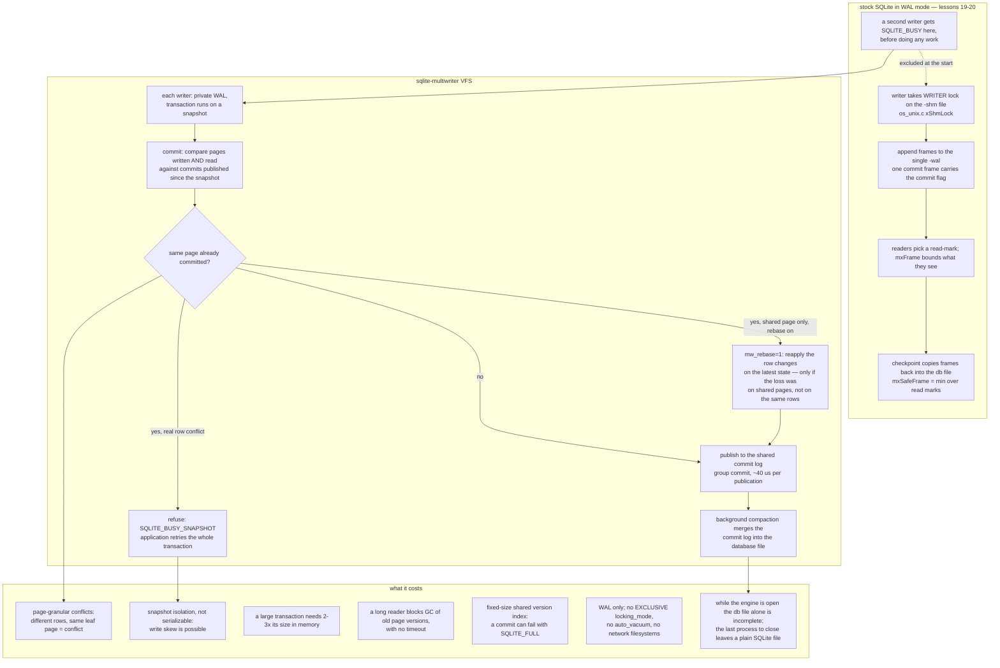

<!--
entry-meta
date: 2026-10-10
type: daily-diff
category: Daily Diff
title: Daily Diff — 2026-10-10
slug: sqlite-insert-update-delete-codegen
-->

# Daily Diff — 2026-10-10

**2026-10-10 · Daily Diff Digest**

## Which Edition This Covers

This digest covers **The Daily Diff, Friday 2026-10-09 (Edition 077)** — 30 numbered items. Yesterday's digest covered the 2026-10-08 edition, so this is the newest edition not yet covered. The 2026-10-10 edition has not published, consistent with the two-day settling window the site documents.

Locating it took a different route than on previous days, and the difference is worth recording because the repository's convention is to say which edition a digest covers and how it was found.

- [`https://tdd.cat/`](https://tdd.cat/) served the literal text **`Hello world.`** on this run. Not a stale edition, not an error page — a two-word body. Previous runs found the front page serving a one- or two-day-old edition; this time it served nothing at all. I did not investigate why and have no theory worth writing down.
- [`https://tdd.cat/2026-10-09.md`](https://tdd.cat/2026-10-09.md), the dated pattern documented in `llms.txt` and used by every previous digest, returned a **client error**. So did `https://tdd.cat/2026-10-10.md`.
- [`https://tdd.cat/llms.txt`](https://tdd.cat/llms.txt) fetched normally and documents more endpoints than this log has been using: *"Every edition is available in Markdown at `https://tdd.cat/{YYYY-MM-DD}.md`"*, plus `https://tdd.cat/md` (latest edition, Markdown), `https://tdd.cat/json` (latest edition, JSON), `https://tdd.cat/llms-full.txt`, `https://tdd.cat/rss.xml`, `https://tdd.cat/archive/` and `https://tdd.cat/stats/`.
- [`https://tdd.cat/md`](https://tdd.cat/md) — the "latest edition" endpoint — served the **2026-10-09** edition in full, 30 items with titles and source links.
- [`https://tdd.cat/archive/`](https://tdd.cat/archive/) corroborated it: the newest five entries are Fri Oct 9 2026 (Edition 077), Thu Oct 8 (076), Wed Oct 7 (075), Tue Oct 6 (074), Mon Oct 5 (073).

**Two practical conclusions for this log.** First, `https://tdd.cat/md` is more robust than the dated pattern, because it is defined relative to the site's own notion of "latest" rather than requiring a date guess to be right. Second, the dated pattern failing for a date the archive index *lists as published* means the two are served by different things, so a future run should treat `/md` plus `/archive/` as the primary pair and the dated `.md` URL as a fallback — the reverse of the convention the root README currently describes.

One accuracy note. The edition's per-item blurbs were read through a summarizing fetch, so the one-line descriptions below are **mine**, not the edition's wording. Titles and URLs are as the edition gives them.

---

## The Edition, Point-Wise

### Databases and storage — eight of thirty, and the strongest cluster

- **Solving SQLite single-writer limitation without modifying core code** — a VFS that lets many threads and processes write one SQLite database concurrently, with per-writer WALs, snapshot isolation and first-committer-wins validation. **Deep-dived below.** [link](https://marcobambini.substack.com/p/we-solved-sqlites-single-writer-limitation)
- **Enabling concurrent writes in unmodified SQLite via custom VFS** — the implementation behind the post above, listed separately in the same edition. **Deep-dived below.** [link](https://github.com/sqliteai/sqlite-multiwriter)
- **Raw PDF document containing compressed flatedecode stream data** — the edition's title is the PDF's own metadata rather than the paper's name; the file is *"B-Trees Are Back"*, a TU Munich paper arguing that B-trees stay competitive with learned indexes once node layouts are redesigned. Directly relevant to lessons 03–12 of this track, and the title mangling is a good reminder that the edition's titles are machine-derived. [link](https://www.cs.cit.tum.de/fileadmin/w00cfj/dis/papers/btrees-are-back.pdf)
- **ClickHouse outcompresses optimized Parquet in massive IoT migrations** — column codecs plus a well-chosen sort key beating Parquet's compression on telemetry data. The sort key is the whole story in these comparisons: Parquet's encodings are competitive per-column, and ClickHouse's advantage is usually that the rows arrive pre-sorted into a shape the delta and double-delta codecs can exploit. [link](https://tomalard.github.io/posts/clickhouse-outcompresses-parquet-surprises-from-our-migration/)
- **Separating keys and values reduces LSM write amplification** — the WiscKey idea (large values moved to a separate log so compaction only rewrites keys) argued concretely. [link](https://tidesdb.com/articles/keys-and-values-dont-always-belong-together/)
- **TidesDB rethinks read trade-offs under demanding OLTP benchmarks** — the same project's TPC-C comparison against InnoDB, attributing its results to that key-value separation. Two items from one project in one edition. [link](https://tidesdb.com/articles/large-tpc-c-analysis-with-mysql-v26-7-0-on-innodb-and-tidesdb/)
- **StackGres overcomes Citus single coordinator limits with query routers** — stateless query routers that separate planning from worker storage in sharded Postgres, removing the single-coordinator bottleneck. The structural parallel with the SQLite item is exact: both take a component that was serialized for simplicity and make it plural. [link](https://stackgres.io/blog/scaling-citus-beyond-one-coordinator-announcing-query-routers-stackgres/)
- **Eventually consistent durable key-value storage for Elixir applications** — an embedded SQLite-backed KV store replicating across BEAM nodes, with opt-in linearizable compare-and-swap. Third SQLite-adjacent item in the edition. [link](https://github.com/chrismccord/ekv)

### Languages, runtimes, packaging

- **Python 3.15 delivers substantial runtime and compiler optimizations** — JIT gains, lazy imports, frame pointers on by default, free-threaded builds. [link](https://www.python.org/downloads/release/python-3150/)
- **Conditional async and await optimize synchronous path execution** — a TypeScript syntax proposal to avoid Promise allocation when an operation completes synchronously; the same shape of optimization as SQLite's `OP_MakeRecord` reusing an already-large buffer rather than reallocating. [link](https://github.com/metawrap-dev/TypeScript/blob/conditional-async-await/CONDITIONAL_ASYNC.md)
- **Nix derivations simplify building deterministic replay debuggers** — hermetic inputs supply exactly what a deterministic replay debugger needs, which is a neat observation: the hard part of record-replay is pinning the environment, and a build system that already does that gives it away. [link](https://fzakaria.com/2026/10/07/nix-wrote-half-of-my-debugger)
- **Ocaml modules provide ideal boundaries for agentic code generation** — write interfaces first, let agents fill bounded implementations, let the type checker verify. [link](https://anil.recoil.org/notes/ocaml-modules-agentic)

### Isolation and sandboxing

- **Layered containment executes untrusted code safely across platforms** — a unified sandboxing layer switching between OS-native and MicroVM backends under one policy engine. [link](https://github.com/microsoft/mxc)
- **Co-designed micro-vm and multikernel architecture enables lightweight sandboxing** — a minimal micro-VM paired with a split guest/host kernel design. [link](https://github.com/nanvix/nanvix)

### Testing, verification, and automated repair

- **Deterministic simulation testing reproduces distributed bugs through controlled event ordering** — a simulator controlling event order under a single seed so timing bugs replay exactly. The technique FoundationDB made famous, written up as a practice rather than a war story. [link](https://celld.dev/docs/engineering/deterministic-simulation-testing/)
- **Automatic fixes risk breaking code without strict safety constraints** — four questions to ask of any automated fix: semantic change, overlapping edits, loops, and confidence. [link](https://alint.org/blog/the-automatic-fix-problem-four-questions/)
- **Hill climbing with evals cuts AI feature error rates** — a large error-rate drop from eval-driven iteration, with the interesting admission that most of the gain came from harness changes rather than prompt or model changes. [link](https://hex.tech/blog/we-used-evals-to-improve-ai-feature/)
- **ACE validates source-level fix for ROCm stream-ordering fault** — an autonomous agent diagnosing and validating a patch for an SDMA race on an AMD GPU, deposited as a Zenodo record. [link](https://zenodo.org/records/23267518)

### Security

- **Unbounded form pointers cause denial of service in Next.js** — quadratic key scanning in server-action `FormData` parsing, freezing a Node.js event loop with a single request. The classic shape: an unbounded input dimension multiplied by a linear scan. [link](https://simonkoeck.com/writeups/react-rsc-formdata-event-loop-dos)
- **Native image parsers expose web applications to remote execution** — crafted uploads reaching native image decoders in common web stacks. [link](https://heif-heist.com)

### Agents, models, inference

- **Rewriting Prime Agent in Rust using autonomous agent swarms** — thousands of subagents constrained by state machines, migrating a TypeScript codebase to Rust. [link](https://www.primeintellect.ai/blog/prime-agent-rust)
- **Hospital team structures make autonomous coding agents reliable** — role-based agent pipelines with strict review, argued to matter more than better prompting for large migrations. [link](https://www.cockroachlabs.com/blog/experiment-running-hospital-code/)
- **Route context retrieval for AI agents by task shape** — pick vector, relational, or live retrieval per query rather than committing to one. [link](https://manveerc.substack.com/p/context-retrieval-ai-agent)
- **Caching KV states to NVMe outperforms recomputing prompt contexts** — loading cached attention blocks from NVMe beating recomputation, with much lower GPU energy. A storage-hierarchy result wearing ML clothes. [link](https://huggingface.co/papers/2610.10845)
- **Tracing a prompt token through six parallelisms in distributed prefill** — one token followed through the cross-GPU communication of six parallelism strategies in a mixture-of-experts model. [link](https://charlesxu.io/tp-cp-sp-ep-dp-pp/)
- **Also:** [adaptive disaggregated inference that hot-swaps prefill/decode roles without reloading weights](https://github.com/athrael-soju/Narwhal); [token-level routing between a small and a large model, each keeping its own KV cache](https://fuvty.github.io/thinking_yard_project_page/projects/tokenrouter/); [fine-tuning a small model with a classification head so it scores fixed choices instead of generating text](https://unsloth.ai/docs/basics/train-your-own-decision-model-with-unsloth); [mapping voice straight to JSON tool calls with a small on-device ONNX model, skipping transcription](https://huggingface.co/neuphonic/neudecide); [clean labels and teacher distillation beating raw scale for e-commerce rerankers](https://zoowork.ai/blog/relevance-is-not-preference-shopranker/).

---

## Deep Dive: A VFS That Gives Every Writer Its Own WAL, and Refuses the Loser at Commit

The edition carries the same project twice — item 8 is the announcement post, item 26 is the repository — so it is unambiguously the edition's lead, and it lands on exactly the layer this track spent lessons 15 through 20 inside.

### The claim, and what it is actually claiming

`sqlite-multiwriter` is a [SQLite VFS](https://github.com/sqliteai/sqlite-multiwriter) that lets many threads and processes write one database at the same time. The README's framing: *"Multi-writer SQLite: many threads and processes write one database at the same time"* and *"your SQLite, your SQL and your database file stay the same."* The announcement post is blunter: it does this *"without modifying a single line of its source code."*

That last claim is the load-bearing one, and it is credible for a specific structural reason this track has already established. Lesson 18 covered `sqlite3_vfs` and `sqlite3_io_methods` as two dispatch tables through which *every* byte of file I/O and *every* lock acquisition passes — including `xShmMap`/`xShmLock`, the shared-memory methods that lesson 19 showed the wal-index is built on. A VFS is not a thin shim over `read()` and `write()`; it is the entire substrate the pager stands on. So "replace SQLite's concurrency model without touching SQLite" is not a paradox. It is what that interface is for.

### The mechanism, as documented

| piece | what the README says | which lesson it displaces |
|---|---|---|
| per-writer log | *"Each writer has its own WAL."* Transactions run against a snapshot. | Lesson 19: **one** `-wal` file, appended under an exclusive write lock on the `-shm` file |
| commit validation | pages written or read are checked against commits published meanwhile; *"If another commit got there first on the same page, the transaction is refused with `SQLITE_BUSY_SNAPSHOT`"* | Lesson 15: write exclusion by lock escalation, so a second writer never gets to commit-time at all |
| commit log + compaction | commits pass through a log with group commit and are merged into the database file in the background | Lesson 20: the checkpoint, moving frames from the single WAL back to the database |
| rebase (`mw_rebase=1`, opt-in) | a transaction that lost only on *shared pages* has its row changes reapplied on the latest state; a real row-level conflict is still refused | nothing — SQLite has no equivalent |
| processes mode (`mw_mp=1`) | processes share a page-version index and a log in `<db>-mw*` files; a killed process's unfinished transaction is discarded | Lesson 18's POSIX advisory locks and `unixInodeInfo`; lesson 17's hot-journal recovery |
| isolation | *"Isolation is snapshot isolation, not serializable: write skew is possible."* The application must retry on `SQLITE_BUSY_SNAPSHOT`. | SQLite's single writer gives serializable by construction |

The granularity detail is the one to hold onto. Conflict detection is on **pages**, not rows. Two transactions updating different rows that happen to share a b-tree leaf page conflict — which is why `mw_rebase` exists at all, and why the README is careful that rebase *"applies only to simple point statements"* and excludes reads (`SELECT`, `WITH`, `VALUES`), DDL, triggers, virtual tables, `AUTOINCREMENT`, non-UTF-8 databases, and connections with a custom `sqlite3_trace_v2`.

### The numbers, and the two rows that reframe them

Self-reported, Apple M5 Pro, SQLite 3.53.4, WAL, `synchronous=FULL`, 8-second runs:

| workload | stock SQLite | multiwriter | ratio |
|---|---|---|---|
| 16 threads, each inserting **its own** rows | 8,630 tx/s | 49,277 tx/s | 5.7× |
| 16 threads, p99.9 commit latency | 157 ms | 2.08 ms | **75× better** |
| 16 processes, each inserting its own rows | 8,636 tx/s | 25,987 tx/s | 3.0× |
| 16 processes, p99.9 latency | 233 ms | 1.54 ms | 151× better |
| 16 threads updating **the same 4 rows** | 13,277 tx/s | 29,976 tx/s | 2.3× |
| **one** writer | 13,746 tx/s | 15,959 tx/s | 1.16× |

Two rows do the real explaining.

**The single-writer row.** 13,746 → 15,959 tx/s, a 16% *improvement* with no concurrency involved. That is not the concurrency mechanism; it is the group-commit path. A commit that publishes into a shared log and lets a background compactor do the file write is a different durability shape than a commit that must fsync a WAL frame itself — and it is where the removed cost largely comes from even in the concurrent cases.

**The same-four-rows row.** 2.3×, with *17 retries per 100 transactions*, and the README says so plainly: true conflicts *"really conflict: the gain is smaller and the retries stay."* The 5.7× headline is for sixteen writers that never touch each other's rows. The post concedes the same: results apply to *"workloads where writers insert their own rows."*

So the honest summary of the benchmark is: the single-writer bottleneck is removed for *disjoint* writers, partially removed for *contending* writers, and the commit path itself got faster for everyone. Three distinct effects, one headline number.

### Why it matters, held against today's lesson

Today's lesson traced one row from `sqlite3Insert`'s register allocation down to `sqlite3BtreeInsert`. The last thing it said about `OP_Insert` is that it assembles a `BtreePayload` and calls the b-tree, and that everything below that is lessons 11–20. This project replaces the bottom of that stack and leaves the top untouched — and today's lesson is what tells you how much of the top that is.

Three specific connections.

**The page is the wrong unit for this workload, and today's lesson shows why.** §5 measured that each index on a table costs exactly one more `OP_MakeRecord` and one more `OP_IdxInsert` per row. Every one of those index inserts lands in a *different* b-tree, so a single logical row insert touches 1 + *n* leaf pages. Under page-granular conflict detection, two writers inserting completely unrelated rows into a table with four indexes have five chances each to collide on a shared leaf page rather than one. The write amplification that today's lesson measured as +0.53 µs per index per row becomes, under this VFS, +1 conflict surface per index per row. `mw_rebase` is aimed at precisely this, and its exclusion list (no DDL, no triggers, no virtual tables, simple point statements only) is narrow enough that it will not cover a lot of real schemas.

**`OPFLAG_APPEND` and `OP_NewRowid` are a contention generator.** §2 established that a rowid-table insert with an auto rowid runs `OP_NewRowid`, which calls `sqlite3BtreeLast()` and adds one. Sixteen concurrent writers all doing that converge on the same rightmost leaf page, by construction. That is the one access pattern page-granular validation handles worst, and it is also the single most common insert shape in SQLite. The benchmark's "each thread inserts its own rows" is almost certainly an `INTEGER PRIMARY KEY` or a per-thread key range; a plain `INSERT INTO log(msg) VALUES(?)` from sixteen threads should behave very differently, and nothing in either the post or the README reports that case.

**The claim "the file format does not change" needs the asterisk the README supplies and the post does not.** The README is precise: the database *"remains an ordinary SQLite database"*, the format is versioned so *"another version of the format is refused, never read wrongly"*, and — crucially — while the engine is open *the file alone is incomplete*, because pending commits sit in the log; *"the last process to close leaves a plain SQLite file."* That is the same structural property as a hot journal (lesson 17) or an un-checkpointed WAL (lesson 20): the database is the file *plus* its sidecars, and reading the file alone with a stock library mid-flight gives you a stale but internally consistent older snapshot. The post's version of this claim — *"Existing SQLite databases must remain compatible. No new database format, no migrations, no special schema"* — is true and also omits the part an operator needs: your backup script copying `app.db` while writers are live copies a database that is missing committed transactions. `<db>-mw*` files are not optional.

### What to be skeptical about

- **Every number is the author's own**, on one machine, on 8-second runs. No independent reproduction, and the repository showed 157 commits with 0 stars and 0 forks at capture time.
- **The README lists its own verification gaps**, which is to its credit and should still be read as a warning: other filesystems, ThreadSanitizer with processes, and hardware power loss are *not verified*. For a layer that reimplements commit and recovery, power-loss testing is not a nice-to-have — it is the whole correctness argument. Lesson 16 established that stock SQLite's atomic-commit guarantee rests on a specific write ordering around the journal magic number, and lesson 17 on the super-journal's deletion being the commit point. Neither argument transfers automatically to a commit log with background compaction.
- **Snapshot isolation is a semantics change, not just a performance change.** Write skew is possible, and the README says so. An application written against single-writer SQLite has been getting serializable isolation for free and may contain invariants that only hold because of it — a read-check-write pattern across two rows is the textbook case. "Drop in a VFS and your SQL stays the same" is true of the SQL text and not of what the SQL guarantees.
- **`SQLITE_BUSY_SNAPSHOT` must be handled, and most SQLite code does not handle `SQLITE_BUSY` well as it is.** The retry has to re-run the *whole transaction*, not the failed statement, which means the application must be structured so that a transaction body is replayable. That is a real refactor in most codebases, and it is the part that will not show up in a benchmark.
- **Fixed-size shared structures fail in production-shaped ways.** The version index has a fixed size and a commit can fail with `SQLITE_FULL`; a long-running reader holds back garbage collection of old page versions *with no timeout*. Both are the kind of limit that is invisible in an 8-second benchmark and arrives at 3 a.m. with an analytics query holding a snapshot open.
- **It is early, and the author says so** — *"still work to do"* on testing, workloads and platforms. The interesting thing here is not whether to adopt it today; it is that the VFS interface is wide enough that someone *could* build this at all, which is a fact about SQLite's architecture that lesson 18 made legible and this project demonstrates.

---

## Sources

- [The Daily Diff — latest edition endpoint](https://tdd.cat/md) — served the **2026-10-09** edition (Edition 077) on this run; 30 numbered items with titles and source links, read as Markdown. This is the edition this digest covers.
- [tdd.cat](https://tdd.cat/) — the front page, which served the literal body `Hello world.` during this run rather than an edition.
- [tdd.cat/llms.txt](https://tdd.cat/llms.txt) — the source for the full endpoint list, including `/md`, `/json`, `/archive/`, `/rss.xml`, `/stats/` and `/llms-full.txt`, and for the documented dated pattern *"Every edition is available in Markdown at `https://tdd.cat/{YYYY-MM-DD}.md`"*.
- [tdd.cat/archive/](https://tdd.cat/archive/) — the archive index, which lists Fri Oct 9 2026 as Edition 077 and corroborates it as the newest published edition.
- [`https://tdd.cat/2026-10-09.md`](https://tdd.cat/2026-10-09.md) — the dated permalink for the covered edition. **Returned a client error on this run**, as did `https://tdd.cat/2026-10-10.md`; recorded because every previous digest in this log used this pattern as its primary fetch path.
- [We Solved SQLite's Single-Writer Limitation](https://marcobambini.substack.com/p/we-solved-sqlites-single-writer-limitation) — the announcement post, deep-dived above. Source for the *"without modifying a single line of its source code"* and *"Existing SQLite databases must remain compatible. No new database format, no migrations, no special schema"* claims, the thread and process benchmark tables including the p99.9 latencies, and the concession that results apply to *"workloads where writers insert their own rows"*.
- [sqliteai/sqlite-multiwriter](https://github.com/sqliteai/sqlite-multiwriter) — the repository README, deep-dived above. Source for the per-writer WAL and `SQLITE_BUSY_SNAPSHOT` validation, the `mw_rebase` and `mw_mp` options and the rebase exclusion list, the *"Isolation is snapshot isolation, not serializable: write skew is possible"* statement, the single-writer and same-four-rows benchmark rows, the ~40 µs commit publication figure, the resource limits (2–3× transaction size in memory, no GC timeout for long readers, fixed-size version index with `SQLITE_FULL`), the WAL-only / no-`auto_vacuum` / no-network-filesystem restrictions, the format-versioning and *"The last process to close leaves a plain SQLite file"* statements, the stated verification gaps, and the Apache-2.0 license.
- Edition item links referenced above, each as the edition gives them: [python.org 3.15.0](https://www.python.org/downloads/release/python-3150/), [microsoft/mxc](https://github.com/microsoft/mxc), [primeintellect.ai](https://www.primeintellect.ai/blog/prime-agent-rust), [cockroachlabs.com](https://www.cockroachlabs.com/blog/experiment-running-hospital-code/), [huggingface.co/papers/2610.10845](https://huggingface.co/papers/2610.10845), [tomalard.github.io](https://tomalard.github.io/posts/clickhouse-outcompresses-parquet-surprises-from-our-migration/), [tidesdb.com keys-and-values](https://tidesdb.com/articles/keys-and-values-dont-always-belong-together/), [zoowork.ai](https://zoowork.ai/blog/relevance-is-not-preference-shopranker/), [simonkoeck.com](https://simonkoeck.com/writeups/react-rsc-formdata-event-loop-dos), [cs.cit.tum.de btrees-are-back.pdf](https://www.cs.cit.tum.de/fileadmin/w00cfj/dis/papers/btrees-are-back.pdf), [stackgres.io](https://stackgres.io/blog/scaling-citus-beyond-one-coordinator-announcing-query-routers-stackgres/), [athrael-soju/Narwhal](https://github.com/athrael-soju/Narwhal), [alint.org](https://alint.org/blog/the-automatic-fix-problem-four-questions/), [manveerc.substack.com](https://manveerc.substack.com/p/context-retrieval-ai-agent), [fzakaria.com](https://fzakaria.com/2026/10/07/nix-wrote-half-of-my-debugger), [anil.recoil.org](https://anil.recoil.org/notes/ocaml-modules-agentic), [hex.tech](https://hex.tech/blog/we-used-evals-to-improve-ai-feature/), [celld.dev](https://celld.dev/docs/engineering/deterministic-simulation-testing/), [heif-heist.com](https://heif-heist.com), [zenodo.org/records/23267518](https://zenodo.org/records/23267518), [tidesdb.com TPC-C](https://tidesdb.com/articles/large-tpc-c-analysis-with-mysql-v26-7-0-on-innodb-and-tidesdb/), [unsloth.ai](https://unsloth.ai/docs/basics/train-your-own-decision-model-with-unsloth), [chrismccord/ekv](https://github.com/chrismccord/ekv), [charlesxu.io](https://charlesxu.io/tp-cp-sp-ep-dp-pp/), [fuvty.github.io tokenrouter](https://fuvty.github.io/thinking_yard_project_page/projects/tokenrouter/), [metawrap-dev TypeScript CONDITIONAL_ASYNC.md](https://github.com/metawrap-dev/TypeScript/blob/conditional-async-await/CONDITIONAL_ASYNC.md), [nanvix/nanvix](https://github.com/nanvix/nanvix), [huggingface.co/neuphonic/neudecide](https://huggingface.co/neuphonic/neudecide). Only the two deep-dive items had their underlying sources fetched and read; the rest are listed as the edition presents them, with one-line descriptions written here rather than quoted.
