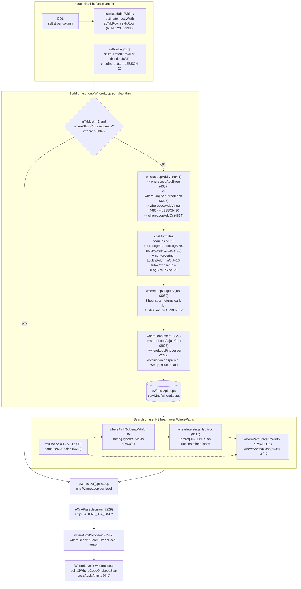

<!--
entry-meta
date: 2026-10-11
type: lesson
track: SQLite
lesson: 26
category: Database Internals
title: The Query Planner — A Cost Model in 10·log2 Units, a Solver That Keeps Twelve Paths, and a Crossover Predictable to the Single Row
slug: sqlite-query-planner-whereloop-path-solver
-->

# The Query Planner — A Cost Model in 10·log2 Units, a Solver That Keeps Twelve Paths, and a Crossover Predictable to the Single Row

**2026-10-11 · SQLite Track · Lesson 26 of 33**

## Where This Fits

- **What lesson 25 established:** the code that *emits* the write path — `regNewData`/`aRegIdx[]`, `OP_MakeRecord`'s two passes, the four flag words, and the ONEPASS decision whose answer it read without opening. It handed this lesson three loose ends by name: `sqlite3WhereOkOnePass()`, the `where.c` affinity-string trimming behind `OP_Affinity p1=2 p2=3 p4='CCB'`, and lesson 24's open `CAST` row. See [lesson 25](../2026-10-10-sqlite-insert-update-delete-codegen/README.md). Lesson 23 established the register file and `allocateCursor()`; lesson 22 established the `Expr`/`Select` trees and name resolution that `whereexpr.c` turns into `WhereTerm`s. See [lesson 23](../2026-10-08-sqlite-vdbe-registers-and-mem-cells/README.md) and [lesson 22](../2026-10-07-sqlite-name-resolution-expr-select-trees/README.md).
- **What this lesson adds:** the decision layer. `WhereLoop` — one object per *algorithm* for one FROM-clause term, carrying `(rSetup, rRun, nOut)`. The `LogEst` arithmetic all three live in, including `estLog()`'s double logarithm. The five closed-form cost formulas in `whereLoopAddBtree`/`whereLoopAddBtreeIndex` and where each magic integer comes from. `whereLoopInsert`/`whereLoopFindLesser`'s three-way domination test and its tie rule. `wherePathSolver` — the N3 beam search, `mxChoice` of 1/5/12/18, and the exact vector comparison that admits or rejects a candidate path. `whereShortCut`, which answers the common case without running any of it. And two closed handoffs.
- **What it sets up:** lesson 27 (`ANALYZE`) inherits every question about *where `aiRowLogEst[]` comes from* — the `sqlite_stat1` format, `decodeIntArray`, `sqlite_stat4` samples, and the four estimator functions this lesson names but does not open (`whereKeyStats`, `whereEqualScanEst`, `whereInScanEst`, `whereRangeScanEst`). It also inherits one specific unresolved claim from §13. Lesson 28 (the sorter) inherits `whereSortingCost`'s *implementation* side — `OP_SorterInsert` versus `OP_IdxInsert` and the external merge this lesson only prices. Lesson 29 inherits `WHERE_ONEPASS_DESIRED`'s caller-side contract. Lesson 30 inherits `whereLoopAddVirtual`, `allocateIndexInfo`, `vtabBestIndex` and the whole `xBestIndex` protocol, which this lesson deliberately leaves untouched.
- **What it deliberately does not re-teach:** b-tree seek and scan mechanics (lessons 08–10), page splits (11–12), the page cache and pager (14–15), WAL (19–20), the parse tree (21–22), register allocation (23), affinity and collation semantics (24), and the write-path opcodes (25). Loop *code generation* — `sqlite3WhereCodeOneLoopStart`, `codeAllEqualityTerms`, the `OP_SeekGE`/`OP_IdxGT` pairs — is `wherecode.c`, which this lesson enters only once, in §14, to settle lesson 25's handoff.

**Version and instrument.** Source line numbers are from trunk commit **`6e35c19f`** (2026-10-10T19:19:12Z). Every measurement is from the `libsqlite3` behind CPython 3.13.16, reporting **3.45.1** — the same environment lesson 25 used, and `PRAGMA compile_options` confirms **`SQLITE_ENABLE_STAT4` is OFF**, which pins exactly one branch of the central cost formula and makes the predictions below sharp.

The planner's internal numbers are normally invisible: `rRun` and `nOut` are printed only by `WHERETRACE`, which needs `SQLITE_DEBUG`. This lesson does not use a debug build. Instead it does something better: it reimplements the cost arithmetic from source in 20 lines of Python, computes what the planner *must* decide, and checks the prediction against `EXPLAIN QUERY PLAN` on a stock library. **Across four orders of magnitude of table size the predicted plan-flip point matches the measured one at the single row, with zero mismatches.** That agreement is the evidence that the formulas below are read correctly.

---

## 1. Three Objects, and Which One Is the Plan

`whereInt.h` defines four structures that are easy to confuse. The distinction the file's own comments draw is worth quoting, because everything else follows from it.

| object | what it is | comment in `whereInt.h` |
|---|---|---|
| `WhereTerm` | one AND-separated subexpression of the WHERE clause, after `whereexpr.c` has analysed it | "Each WHERE clause subexpression is separated from the others by AND operators, usually" (`whereInt.h:224-230`) |
| `WhereLoop` | **one algorithm** for visiting one FROM-clause term, with its cost | "Each instance of this object represents an algorithm for evaluating one term of a join… many terms of the FROM clause will have multiple WhereLoop objects" (`whereInt.h:116-129`) |
| `WherePath` | a sequence of `WhereLoop`s, one per FROM term — a candidate plan | "a WherePath object is a path through the graph that visits some or all of the WhereLoop objects once" (`whereInt.h:196-213`) |
| `WhereLevel` | the **implementation** of one chosen loop: cursor numbers, jump addresses | "Contrast this object with WhereLoop. This object describes the implementation of the loop. WhereLoop describes the algorithm." (`whereInt.h:58-72`) |

So: `WhereLoop` is a *choice*, `WhereLevel` is a *consequence*. The planner builds a bag of `WhereLoop`s, picks one per table by searching over `WherePath`s, and writes the winners into `pWInfo->a[i].pWLoop` — at which point `WhereLevel` takes over and `wherecode.c` emits opcodes.

The cost-bearing fields are three `LogEst`s and they are the whole interface between the two halves of `where.c`:

```c
struct WhereLoop {
  Bitmask prereq;       /* Bitmask of other loops that must run first */
  Bitmask maskSelf;     /* Bitmask identifying table iTab */
  u8 iTab;              /* Position in FROM clause of table for this loop */
  u8 iSortIdx;          /* Sorting index number.  0==None */
  LogEst rSetup;        /* One-time setup cost (ex: create transient index) */
  LogEst rRun;          /* Cost of running each loop */
  LogEst nOut;          /* Estimated number of output rows */
  ...
  u32 wsFlags;          /* WHERE_* flags describing the plan */
  u16 nLTerm;           /* Number of entries in aLTerm[] */
  u16 nSkip;            /* Number of NULL aLTerm[] entries */
  /**** whereLoopXfer() copies fields above ***********************/
```
`whereInt.h:130-176`

Two details in that declaration matter later. `prereq` is a bitmask of *other tables* this loop needs already open — that is how a loop driven by `t2.x = t1.y` records that `t1` must be outer. And the `whereLoopXfer()` comment marks a boundary: `nLSlot` and everything after it is per-object bookkeeping, not part of the value, so `whereLoopXfer` copies exactly `WHERE_LOOP_XFER_SZ = offsetof(WhereLoop,nLSlot)` bytes.

`wsFlags` is a 27-bit vocabulary of plan shapes, `whereInt.h:636-664`. The ones that change cost arithmetic in this lesson:

| flag | value | meaning |
|---|---|---|
| `WHERE_IPK` | `0x00000100` | the "index" is the rowid itself |
| `WHERE_INDEXED` | `0x00000200` | `u.btree.pIndex` is a real index |
| `WHERE_IDX_ONLY` | `0x00000040` | covering: never touch the table |
| `WHERE_COLUMN_EQ` | `0x00000001` | an `x=EXPR` constraint |
| `WHERE_ONEROW` | `0x00001000` | provably at most one row |
| `WHERE_AUTO_INDEX` | `0x00004000` | build a throwaway index first |
| `WHERE_SKIPSCAN` | `0x00008000` | step over distinct values of unconstrained leading columns |
| `WHERE_CONSTRAINT` | `0x0000000f` | mask of the four `WHERE_COLUMN_*` bits |

---

## 2. `LogEst`: Everything Is 10·log₂(x), and `estLog` Logs Twice

A `LogEst` is a `i16` holding approximately `10*log2(x)`. Costs and row counts are both stored this way, which means multiplication is addition and the planner never overflows.

```c
LogEst sqlite3LogEst(u64 x){
  static LogEst a[] = { 0, 2, 3, 5, 6, 7, 8, 9 };
  LogEst y = 40;
  if( x<8 ){
    if( x<2 ) return 0;
    while( x<8 ){  y -= 10; x <<= 1; }
  }else{
    ...
    while( x>255 ){ y += 40; x >>= 4; }
    while( x>15 ){  y += 10; x >>= 1; }
  }
  return a[x&7] + y - 10;
}
```
`util.c:2082-2100`

The eight-entry table `a[]` is the mantissa: after normalising `x` into `[8,16)`, the low three bits select a fractional correction. That is a **3-bit mantissa**, which is why the representation is coarse in a way that matters — see §12.

Addition is a table lookup on the *difference* of the two operands:

```c
LogEst sqlite3LogEstAdd(LogEst a, LogEst b){
  static const unsigned char x[] = {
     10, 10, 9, 9, 8, 8, 7, 7, 7, 6, 6, 6, 5, 5, 5,
      4, 4, 4, 4, 3, 3, 3, 3, 3, 3, 2, 2, 2, 2, 2, 2, 2,
  };
  if( a>=b ){
    if( a>b+49 ) return a;
    if( a>b+31 ) return a+1;
    return a+x[a-b];
  }else{ ... }
}
```
`util.c:2055-2076`

Read that as: `LogEstAdd(a,a) == a+10` (doubling), and once one operand is **more than 49 units larger** (a factor of 2⁴·⁹ ≈ 30) the smaller one is simply discarded. The planner literally cannot see a cost component 31× smaller than another. That is deliberate and it is why cost comparisons below come out as exact integers rather than near-ties.

Then there is `estLog`, which looks like a typo and is not:

```c
static LogEst estLog(LogEst N){
  return N<=10 ? 0 : sqlite3LogEst(N) - 33;
}
```
`where.c:700-702`

It takes a **`LogEst`** and calls `sqlite3LogEst` on it again. Since `N = 10·log₂(rows)` and `33 ≈ 10·log₂(10)`, the result is `10·log₂(N/10) = 10·log₂(log₂(rows))`. In other words `estLog(rSize)` is the `LogEst` of the **b-tree depth**. Measured:

```
   N=       1000  rSize= 99  estLog(rSize)= 33  -> 10 units    log2(N)=10.0
   N=     100000  rSize=166  estLog(rSize)= 40  -> 16 units    log2(N)=16.6
   N=    1000000  rSize=199  estLog(rSize)= 43  -> 20 units    log2(N)=19.9
   N=  100000000  rSize=265  estLog(rSize)= 47  -> 26 units    log2(N)=26.6
```

`rLogSize = estLog(rSize)` (`where.c:3286`) therefore prices **one seek**, and the cost of a seek grows as `log₂` of the table — a b-tree descent. Every index cost formula in §4 starts with it.

Every `assert()` in `where.c` and `build.c` that pins a constant to a `LogEst` value was re-derived from the Python reimplementation and all nine agree:

```
   LogEst(   28) =  48  want  48  OK   solver seed cap
   LogEst(    2) =  10  want  10  OK   auto-index guard
   LogEst(   20) =  43  want  43  OK   auto-index nOut
   LogEst(   18) =  42  want  42  OK   skip-scan floor
   LogEst(   10) =  33  want  33  OK   shortcut: rowid
   LogEst(   15) =  39  want  39  OK   shortcut: unique idx
   LogEst( 1000) =  99  want  99  OK   DefaultRowEst floor
   LogEst(    5) =  23  want  23  OK   DefaultRowEst a[6+]
   LogEst(    1) =   0  want   0  OK   unique a[nKeyCol]
```

And the additive constants decode back to multipliers, which is how to read the TUNING comments:

| `LogEst` delta | multiplier | where it appears |
|---:|---:|---|
| `+1` | 1.072× | one unit; the smallest distinguishable difference |
| `+2` | 1.149× | `rUnsort -= 2`, the no-sort bias |
| `+3` | 1.231× | `rCost = … + 3`, the sorting penalty |
| `+5` | 1.414× | skip-scan fudge factor |
| `+10` | 2.000× | "IS NULL matches twice as many rows" |
| `+16` | 3.031× | the full-table-scan penalty ("3.0") |
| `+28` | 6.964× | automatic-index setup multiplier ("X is 7") |
| `−25` | ÷5.657 | setup discount for views and subqueries |

---

## 3. Where the Input Numbers Come From

The cost formulas need four inputs. Three are set at schema-load time and are fully determined by the DDL; one comes from `ANALYZE`.

**`aiRowLogEst[]`** — `aiRowLogEst[0]` is the number of rows in the index; `aiRowLogEst[k]` for `k≥1` is the number of rows matching any particular combination of the first `k` index columns. Without `ANALYZE` it is filled by `sqlite3DefaultRowEst`:

```c
void sqlite3DefaultRowEst(Index *pIdx){
               /*                10,  9,  8,  7,  6 */
  static const LogEst aVal[] = { 33, 32, 30, 28, 26 };
  ...
  x = pIdx->pTable->nRowLogEst;
  assert( 99==sqlite3LogEst(1000) );
  if( x<99 ){ pIdx->pTable->nRowLogEst = x = 99; }
  if( pIdx->pPartIdxWhere!=0 ){ x -= 10; }
  a[0] = x;
  memcpy(&a[1], aVal, nCopy*sizeof(LogEst));
  for(i=nCopy+1; i<=pIdx->nKeyCol; i++){ a[i] = 23; }
  if( IsUniqueIndex(pIdx) ) a[pIdx->nKeyCol] = 0;
}
```
`build.c:4631-4670`

So the default guesses are: 10 rows per value of column 1, then 9, 8, 7, 6, then 5 forever — and exactly 1 row for the full key of a `UNIQUE` index. The `a[0]` floor of `LogEst 99` (1000 rows) exists because of a 2020-05-27 fix: if some indexes have `stat1` data and others do not, letting the unanalysed ones claim a tiny table would make the planner ignore them entirely.

**`szTabRow` and `szIdxRow`** — average row widths, also `LogEst`, computed once from the declared types:

```c
static void estimateTableWidth(Table *pTab){
  unsigned wTable = 0;
  for(i=pTab->nCol, pTabCol=pTab->aCol; i>0; i--, pTabCol++){ wTable += pTabCol->szEst; }
  if( pTab->iPKey<0 ) wTable++;
  pTab->szTabRow = sqlite3LogEst(wTable*4);
}
static void estimateIndexWidth(Index *pIdx){
  unsigned wIndex = 0;
  for(i=0; i<pIdx->nColumn; i++){
    i16 x = pIdx->aiColumn[i];
    wIndex += x<0 ? 1 : aCol[x].szEst;
  }
  pIdx->szIdxRow = sqlite3LogEst(wIndex*4);
}
```
`build.c:2305-2330`

`Column.szEst` is "scaled so that the size of an integer is 1" (`build.c:1748-1750`): the default is `v=0 → v/4+1 = 1`; a bare `TEXT`/`BLOB`/`CLOB` sets `v=16 → 5` ("approx 20 bytes", `build.c:1763`); `VARCHAR(k)` sets `v=k → k/4+1`. A standard type name whose affinity is `≤ SQLITE_AFF_TEXT` short-circuits to `szEst = 5` at `build.c:1597`.

Note what `estimateIndexWidth` iterates: `pIdx->nColumn`, not `nKeyCol`. For a rowid table that includes the trailing rowid column (`aiColumn[i] < 0`, contributing 1). So for `t(a integer, b text)` with `CREATE INDEX ta ON t(a)`:

```
   szEst: a integer = 1, b text = 5
   szTabRow = LogEst((1+5+1)*4) = LogEst(28) = 48
   szIdxRow = LogEst((1+1)*4)   = LogEst(8)  = 30     (rowid is the 2nd index column)
   15*szIdxRow/szTabRow = 15*30//48 = 9
```

That `9` is an integer division of two logarithms, which is dimensionally meaningless and openly a tuning knob — but it is *deterministic*, and §5 turns it into an exact prediction.

**What this lesson does not open.** The `sqlite_stat1` row format, `decodeIntArray`, the `sqlite_stat4` sample machinery, and the four estimator functions that consult it (`whereKeyStats` at `where.c:1713`, `whereRangeScanEst` at `2087`, `whereEqualScanEst` at `2269`, `whereInScanEst` at `2333`) all belong to lesson 27. Below, `sqlite_stat1` is used only as a **dial**: writing a row into it and reloading the schema sets `aiRowLogEst[]` to a chosen value so the formulas can be tested. How that row is parsed is lesson 27's business.

---

## 4. The Five Cost Formulas

Everything in `whereLoopAddBtree` and `whereLoopAddBtreeIndex` reduces to five closed forms. `rSize = pProbe->aiRowLogEst[0]`, `rLogSize = estLog(rSize)`, and `nOut` is the loop's estimated output row count.

### 4.1 Full table scan — `where.c:4158-4176`

```c
#ifdef SQLITE_ENABLE_STAT4
      pNew->rRun = rSize + 16 - 2*((pTab->tabFlags & TF_HasStat4)!=0);
#else
      pNew->rRun = rSize + 16;
#endif
```

`+16` is the 3.03× penalty. The comment states the reasoning in full and it is worth reading as design, not tuning:

> TUNING: Cost of full table scan is 3.0\*N. The 3.0 factor is an extra cost designed to discourage the use of full table scans, since index lookups have better worst-case performance if our stat guesses are wrong. Reduce the 3.0 penalty slightly (to 2.75) if we have valid STAT4 information for the table. At 2.75, a full table scan is preferred over using an index on a column with just two distinct values where each value has about an equal number of appearances. Without STAT4 data, we still want to use an index in that case, since the constraint might be for the scarcer of the two values, and in that case an index lookup is better.

That penalty is not a model of I/O. It is a **hedge against the statistics being wrong**, paid on every full scan. §13 tests the specific claim in the middle of that paragraph and finds it does not follow from the arithmetic alone.

Two arithmetic notes. `LogEst 16` is `2^1.6 = 3.0314`, and `10*log₂(3) = 15.85` rounds to 16 — so "3.0" is honest. But `LogEst 14` is `2^1.4 = 2.639`, while `10*log₂(2.75) = 14.59` would round to **15**. The code is one unit more aggressive than its own comment says: the STAT4 penalty is 2.64×, not 2.75×.

### 4.2 Index seek with `nEq` equality terms — `where.c:3548-3578`

```c
    if( pProbe->idxType==SQLITE_IDXTYPE_IPK ){
      rCostIdx = pNew->nOut + 16;
    }else{
      rCostIdx = pNew->nOut + 1 + (15*pProbe->szIdxRow)/pSrc->pSTab->szTabRow;
    }
    rCostIdx = sqlite3LogEstAdd(rLogSize, rCostIdx);

    pNew->rRun = rCostIdx;
    if( (pNew->wsFlags & (WHERE_IDX_ONLY|WHERE_IPK|WHERE_EXPRIDX))==0 ){
      pNew->rRun = sqlite3LogEstAdd(pNew->rRun, pNew->nOut + 16);
    }
```

The comment above it names the two components:

> 1. The cost of doing one search-by-key to find the first matching entry
> 2. Stepping forward in the index `pNew->nOut` times to find all additional matching entries

So: `rCostIdx = seek(rLogSize) + scan(nOut × width-ratio)`. Then, **if the index is not covering**, one further term of `nOut + 16` — one 3.03×-penalised table descent per output row. That single conditional is the entire quantitative difference between a covering and a non-covering index:

```
   select b   (covered by tab) : SEARCH t USING COVERING INDEX tab (a=?)
   select d   (not covered)    : SEARCH t USING INDEX tab (a=?)

   szTabRow=LogEst(48)=56   szIdxRow=LogEst(28)=48   15*szIdx//szTab = 12
   covering=True   rCostIdx=195  rRun=195      (full scan = 215)
   covering=False  rCostIdx=195  rRun=207      (full scan = 215)
```

A 12-unit gap — 2.3× — from adding one unindexed column to the select list. Note also that the IPK arm uses `nOut + 16` rather than the width ratio, and says why: `szIdxRow` for the fake rowid index is hard-coded to 3 (`sPk.szIdxRow = 3; /* TUNING: Interior rows of IPK table are very small */`, `where.c:4053`), which models the seek well but would badly under-price the *scan*, because an IPK table's leaves are full-width rows.

### 4.3 Full scan via a covering index — `where.c:4236-4280`

```c
        /* The cost of visiting the index rows is N*K, where K is
        ** between 1.1 and 3.0, depending on the relative sizes of the
        ** index and table rows. */
        pNew->rRun = rSize + 1 + (15*pProbe->szIdxRow)/pTab->szTabRow;
```

Same width ratio, but applied to the whole table instead of `nOut`, and with `+1` instead of `+16` — a full index scan does **not** pay the discouragement penalty, because the hedge it protects against (bad row estimates) does not apply when you are visiting everything anyway. This arm is gated on `pProbe->szIdxRow < pTab->szTabRow`, among other conditions: a covering index that is no narrower than the table is never worth scanning instead of the table.

### 4.4 Automatic index — `where.c:4091-4113`

```c
        pNew->rSetup = rLogSize + rSize;
        if( !IsView(pTab) && (pTab->tabFlags & TF_Ephemeral)==0 ){
          pNew->rSetup += 28;
        }else{
          pNew->rSetup -= 25;
        }
        ...
        pNew->nOut = 43;  assert( 43==sqlite3LogEst(20) );
        pNew->rRun = sqlite3LogEstAdd(rLogSize,pNew->nOut);
```

`rSetup = rLogSize + rSize + 28` is `X·N·log₂(N)` with `X = 2^2.8 = 6.96` ("X is 7 for normal tables"), and `−25` instead of `+28` for views and subqueries — a 39.4× discount, because, as the comment says, "there is no opportunity to add schema indexes on subqueries and views". `nOut` is pinned at 20 rows per lookup, deliberately pessimistic: "more than the usual guess of 10 rows, since we have no way of knowing how selective the index will ultimately be."

`rSetup` is the only non-zero one-time cost the planner models, and it is the only reason `WherePath` needs to track `rUnsort` separately from `rCost`.

### 4.5 `whereShortCut` — `where.c:6398, 6424`

```c
    /* TUNING: Cost of a rowid lookup is 10 */
    pLoop->rRun = 33;  /* 33==sqlite3LogEst(10) */
...
      /* TUNING: Cost of a unique index lookup is 15 */
      pLoop->rRun = 39;  /* 39==sqlite3LogEst(15) */
```

These two are not costs in the same sense. See §10 — they are never compared against anything.

---

## 5. The Crossover, Predicted to the Single Row

The formulas above are closed-form in `rSize`, `nOut`, `szIdxRow`, `szTabRow`. For a single-table query with one equality term, the planner builds exactly two interesting `WhereLoop`s — the full table scan (§4.1) and the index seek (§4.2) — and the winner is whichever has the lower `rRun`. So the point at which `EXPLAIN QUERY PLAN` flips from `SEARCH` to `SCAN` is fully determined, and can be predicted before running anything.

Schema `t(a integer, b text)`, index `ta ON t(a)`, query `SELECT count(b) FROM t WHERE a=1` (non-covering). `sqlite_stat1` is written directly to set `N` and `k` (rows per value of `a`), then `ANALYZE sqlite_master` reloads it. For each `N`, the real crossover was found by bisection on `k`, and the two adjacent values were then checked against the formula:

```
         N         k  nOut rLogSz rCostIdx  rRun  scan predict  measured
------------------------------------------------------------------------
     10000      5631   123     37      133   146   148  SEARCH  SEARCH  OK
     10000      5632   125     37      135   148   148    SCAN  SCAN  OK
    100000     61439   158     40      168   181   182  SEARCH  SEARCH  OK
    100000     61440   159     40      169   182   182    SCAN  SCAN  OK
   1000000    589823   190     43      200   213   215  SEARCH  SEARCH  OK
   1000000    589824   192     43      202   215   215    SCAN  SCAN  OK
  10000000   5767167   223     45      233   246   248  SEARCH  SEARCH  OK
  10000000   5767168   225     45      235   248   248    SCAN  SCAN  OK

mismatches: 0
```

Three things fall out of that table.

**The tie rule.** At every `N`, the last `SEARCH` has `rRun < scan` and the first `SCAN` has `rRun == scan` exactly. Equal cost goes to the full table scan. That is not arbitrary: `whereLoopAddBtree` inserts the IPK/full-scan loop *before* it loops over the real indexes (`where.c:4152-4190` precedes the `else` arm), and `wherePathSolver`'s replacement test (§8) rejects a candidate whose `rCost` merely *equals* the incumbent's. First inserted keeps ties.

**The crossover ratio is about 58%, not a third.** `k/N` at the flip is 0.563, 0.614, 0.590, 0.577. The folk rule that an index stops paying at 10–20% selectivity is not what this cost model implements; the model keeps the index until it expects to return well over half the table. §13 measures what that costs.

**`rLogSize` barely moves.** 37 → 40 → 43 → 45 as `N` grows by 1000×, because it is a double logarithm. The seek term is nearly a constant; the whole decision is driven by `nOut` against `rSize`.

---

## 6. `whereLoopInsert`: A Three-Way Domination Test With No Second Chances

Candidate loops are not all kept. `whereLoopInsert` → `whereLoopFindLesser` applies a partial order over `(prereq, rSetup, rRun, nOut)` and throws away anything dominated.

```c
    if( p->iTab!=pTemplate->iTab || p->iSortIdx!=pTemplate->iSortIdx ){
      continue;
    }
```
`where.c:2743-2748` — loops for different tables, or that produce rows in different sort orders, are never compared. `iSortIdx` is the key subtlety: a loop whose output happens to satisfy an `ORDER BY` is incomparable with one that does not, however much cheaper the latter is, because its value is not in `rRun` at all.

Then the two symmetric tests:

```c
    /* If existing WhereLoop p is better than pTemplate, pTemplate can be
    ** discarded.  WhereLoop p is better if:
    **   (1)  p has no more dependencies than pTemplate, and
    **   (2)  p has an equal or lower cost than pTemplate
    */
    if( (p->prereq & pTemplate->prereq)==p->prereq    /* (1)  */
     && p->rSetup<=pTemplate->rSetup                  /* (2a) */
     && p->rRun<=pTemplate->rRun                      /* (2b) */
     && p->nOut<=pTemplate->nOut                      /* (2c) */
    ){
      return 0;  /* Discard pTemplate */
    }
```
`where.c:2775-2787`. The mirror test at `2789-2798` overwrites `p` with the template. Note the asymmetry: discarding the template checks `rSetup`, while replacing `p` does not — it asserts instead, relying on a documented invariant that `whereLoopAddBtree` always inserts the automatic-index case first, so "compatible candidate WhereLoops never have a larger rSetup. Call this SETUP-INVARIANT" (`where.c:2749-2756`).

There is also a hard-coded preference that bypasses cost entirely:

```c
    /* Any loop using an application-defined index (or PRIMARY KEY or
    ** UNIQUE constraint) with one or more == constraints is better
    ** than an automatic index. Unless it is a skip-scan. */
```
`where.c:2762-2772`. A real index with an equality term always beats building a throwaway one, no matter what the numbers say.

Before any of that, `whereLoopAdjustCost` (`where.c:2698-2722`) nudges costs so that a loop using a strict subset of another's terms is never cheaper than the superset, via `whereLoopCheaperProperSubset`. This keeps the partial order consistent: using *more* constraints must not look worse.

---

## 7. `nOut` Is Adjusted, and Only When It Can Matter

`whereLoopOutputAdjust` (`where.c:3032-3147`) reduces `nOut` for WHERE terms the index does not use. Its three heuristics are stated in the header comment:

- **Heuristic 1** — "Estimate the truth probability as 93.75%. The 93.75% value corresponds to −1 in LogEst notation, so this means decrement the `WhereLoop.nOut` field for every such WHERE clause term." One unit per leftover term.
- **Heuristic 2** — an `x==EXPR` term caps `nOut` at 1/4 of the table (`k = 20`), or 1/2 (`k = 10`) if `EXPR` is the integer −1, 0 or 1, "on the theory that … −1 or 0 or 1 is a common default value".
- **Heuristic 3** — a `LIKE`/`GLOB`/`REGEXP`/`MATCH` with a long constant pattern reduces the search space by the pattern length. The comment dates this one: "This heuristic was added to give better output-row count estimates when preparing queries for the Join-Order Benchmarks. See forum thread 2026-01-30T09:57:54z."

It also sets `WHERE_SELFCULL` when the leftover terms depend only on this table, with a 2022-03-24 restriction that it applies only to NULL-intolerant comparisons or non-outer joins.

The first thing the function does, though, is give up:

```c
  /* Skip all this if the FROM clause of the query is a single table and
  ** there is no ORDER BY. In this case it doesn't matter how accurate
  ** the WhereLoop.nOut values are.  */
  if( pWC->pWInfo->pTabList->nSrc<=1 && pWC->pWInfo->pOrderBy==0 ){
    return;
  }
```
`where.c:3074-3079`

That early return is why §5's predictions needed no adjustment term: a single-table query with no `ORDER BY` uses `nOut` straight from `aiRowLogEst[]`. It is also a real behavioural fork — the same table, same index, same WHERE clause will get a *different* `nOut` the moment it appears in a join, because then `nOut` feeds the next loop's cost and accuracy starts to matter.

---

## 8. `wherePathSolver`: Twelve Paths, One Generation at a Time

Join ordering is NP-hard. SQLite's answer, shipped in 3.8.0 (2013-08-26) and named in the Next Generation Query Planner document, is a beam search: *N Nearest Neighbors*.

> With N3, instead of choosing just one nearest neighbor for each step, the algorithm keeps track of the N bests paths at each step for some small integer N.
> — [queryplanner-ng.html](https://www.sqlite.org/queryplanner-ng.html) §3.4

The published N values and the code agree exactly:

```c
  /* TUNING: mxChoice is the maximum number of possible paths to preserve
  **     nLoop      mxChoice
  **       1            1            // the most common case
  **       2            5
  **       3+        12 or 18        // see computeMxChoice()
  */
  if( nLoop<=1 ){            mxChoice = 1;
  }else if( nLoop==2 ){      mxChoice = 5;
  }else if( pParse->nErr ){  mxChoice = 1;
  }else{                     mxChoice = computeMxChoice(pWInfo); }
```
`where.c:5871-5888`

> The initial implementation of NGQP chooses N=1 for simple queries, N=5 for two-way joins and N=10 for all joins with three or more tables. Later, the N value for joins with three or more tables was raised to 12 or to 18 if the join is against a star-schema.
> — [queryplanner-ng.html](https://www.sqlite.org/queryplanner-ng.html) §3.4

`computeMxChoice` returns `pWInfo->bStarUsed ? 18 : 12` (`where.c:5809`). Its comment is the best-documented heuristic in the file, with its own regression history:

> (aa) Only a five-way or larger join is considered for this optimization. … (cc) A table must have 3 or more dimension tables in order to be considered a fact table. (Was 4 prior to 2026-02-10.)

and the honest retraction of its first design:

> This optimization was first added on 2024-05-09 by check-in 38db9b5c83d. The original optimization reduced the cost and output size estimate for fact tables to help them move to outer loops. But months later (as people started upgrading) performance regression reports started caming in, including: forum post b18ef983e68d06d1 (2024-12-21) forum post 0025389d0860af82 (2025-01-14) forum post d87570a145599033 (2025-01-17). To address these, the criteria for a star-query was tightened … and the affect of star-schema detection was changed to increase the rRun cost on just full table scans of dimension tables, rather than reducing costs in the all access methods of the fact table.

(`where.c:5633-5662`. The typo "caming" is in the source.) The lesson there is a general one: a planner heuristic that *lowers* a cost moves one plan up; one that *raises* a competitor's cost leaves everything else alone. The second is safer.

### 8.1 The generation loop

```c
  aFrom[0].nRow = MIN(pParse->nQueryLoop, 48);  assert( 48==sqlite3LogEst(28) );
  nFrom = 1;
```
`where.c:5929-5932`, under the comment "TUNING: Do not let the number of iterations go above 28. If the cost of computing an automatic index is not paid back within the first 28 rows, then do not use the automatic index."

Then, for each of `nLoop` positions, for each surviving path, for every `WhereLoop`:

```c
        if( (pWLoop->prereq & ~pFrom->maskLoop)!=0 ) continue;
        if( (pWLoop->maskSelf & pFrom->maskLoop)!=0 ) continue;
        if( (pWLoop->wsFlags & WHERE_AUTO_INDEX)!=0 && pFrom->nRow<3 ){
          continue;
        }
        rUnsort = pWLoop->rRun + pFrom->nRow;
        if( pWLoop->rSetup ){
          rUnsort = sqlite3LogEstAdd(pWLoop->rSetup, rUnsort);
        }
        rUnsort = sqlite3LogEstAdd(rUnsort, pFrom->rUnsort);
        nOut = pFrom->nRow + pWLoop->nOut;
```
`where.c:5958-5979`

That is the whole cost composition, and it is four lines. `pWLoop->rRun + pFrom->nRow` is the multiplication that makes nesting expensive: a loop's per-iteration cost times the number of iterations the outer loops produce, in log space. `rSetup` is added *once* (`LogEstAdd`, not `+`), because it is paid once regardless of iteration count. And `nOut` for the path is the product of all the loops' row counts.

Two guards are worth noting. The `prereq`/`maskSelf` pair enforces dependency and no-repeats. The third, `WHERE_AUTO_INDEX && pFrom->nRow<3`, refuses to build a throwaway index for a loop expected to run fewer than 1.25 times — `assert( 10==sqlite3LogEst(2) )` is right above it, and `LogEst 3 = 2^0.3 = 1.23`.

### 8.2 Admission

A candidate is matched against existing best-so-far paths on two keys:

```c
        for(jj=0, pTo=aTo; jj<nTo; jj++, pTo++){
          if( pTo->maskLoop==maskNew
           && ( ((pTo->isOrdered^isOrdered)&0x80)==0 || iLoop==nLoop-1 )
          ){ break; }
        }
```
`where.c:6027-6034`. Same set of tables **and** a compatible `isOrdered` — the comment spells out that `((pTo->isOrdered^isOrdered)&0x80)==0` is a sign-bit trick equivalent to `(pTo->isOrdered==-1)==(isOrdered==-1)`, exploiting that legal values are −1..64. Ordered and unordered paths over the same tables are tracked separately until the last round.

If no match, the candidate competes for a slot:

```c
          if( nTo>=mxChoice
           && (rCost>mxCost || (rCost==mxCost && rUnsort>=mxUnsort))
          ){ ... continue; }
```

If matched, a four-level lexicographic comparison decides:

```c
          /* The conditional is an expanded vector comparison equivalent to:
          **   (pTo->rCost,pTo->nRow,pTo->rUnsort) <= (rCost,nOut,rUnsort)
          */
          if( (pTo->rCost<rCost)
           || (pTo->rCost==rCost && pTo->nRow<nOut)
           || (pTo->rCost==rCost && pTo->nRow==nOut && pTo->rUnsort<rUnsort)
           || (pTo->rCost==rCost && pTo->nRow==nOut && pTo->rUnsort==rUnsort
                  && whereLoopIsNoBetter(pWLoop, pTo->aLoop[iLoop]) )
          ){ ... continue; }
```
`where.c:6071-6085`

So ties break on: fewer output rows, then lower unsorted cost, then — the last resort — `whereLoopIsNoBetter`, which prefers the *narrower index*:

```c
static SQLITE_NOINLINE int whereLoopIsNoBetter(const WhereLoop *pCandidate, const WhereLoop *pBaseline){
  if( (pCandidate->wsFlags & WHERE_INDEXED)==0 ) return 1;
  if( (pBaseline->wsFlags & WHERE_INDEXED)==0 ) return 1;
  if( pCandidate->u.btree.pIndex->szIdxRow < pBaseline->u.btree.pIndex->szIdxRow ) return 0;
  return 1;
}
```
`where.c:5823-5832`

Note the whole comparison is `<`, never `<=`: the incumbent keeps every tie. That is the same rule §5 measured from the outside.

### 8.3 The solver runs twice

```c
    wherePathSolver(pWInfo, 0);
    if( db->mallocFailed ) goto whereBeginError;
    if( pWInfo->pOrderBy ){
       whereInterstageHeuristic(pWInfo);
       wherePathSolver(pWInfo, pWInfo->nRowOut<0 ? 1 : pWInfo->nRowOut+1);
    }
```
`where.c:7115-7121`

The first pass passes `nRowEst=0`, which makes the solver ignore sorting entirely — "the purpose of this call is to estimate the number of rows returned by the overall query" (`where.c:5906-5909`). The second pass feeds that estimate back in so sorting can be priced. Between them sits `whereInterstageHeuristic` (`where.c:6313-6356`), which exists because the second pass can be *worse* than the first; its comment draws the failure:

```
**     First Solver()                      Second Solver()
**       |-- SEARCH t1                       |-- SCAN t2     <--- bad!
**       |-- SEARCH t2                       `-- SEARCH t1
**       `-- SORT USING B-TREE
```

Its fix is blunt: for any table the first pass chose to *search* with an equality/IN/NULL constraint, every unconstrained loop on that table gets `pLoop->prereq = ALLBITS`, making it unselectable in the second pass. The planner disables its own options to stop itself regressing.

---

## 9. Sorting Has a Price, and Not Sorting Has a Discount

```c
  /* TUNING: sorting cost proportional to the number of output columns: */
  nCol = sqlite3LogEst((pWInfo->pSelect->pEList->nExpr+59)/30);
  rSortCost = nRow + nCol;
  if( nSorted>0 ){
    rSortCost += sqlite3LogEst((nOrderBy-nSorted)*100/nOrderBy) - 66;
  }
  if( (pWInfo->wctrlFlags & WHERE_USE_LIMIT)!=0 ){
    rSortCost += 10;       /* TUNING: Extra 2.0x if using LIMIT */
    if( nSorted!=0 ){ rSortCost += 6; }   /* TUNING: Extra 1.5x if also using partial sort */
    if( pWInfo->iLimit<nRow ){ nRow = pWInfo->iLimit; }
  }else if( (pWInfo->wctrlFlags & WHERE_WANT_DISTINCT) ){
    if( nRow>10 ){ nRow -= 10; }
  }
  rSortCost += estLog(nRow);
  return rSortCost;
```
`where.c:5568-5595`

`K·N·log(N)`, with `K` scaled by column count (`(nExpr+59)/30` — one unit per 30 columns, so `nCol` is 0 for up to 1 column, then grows glacially; the comment admits "The algorithm does not currently distinguish between fat columns (BLOBs and TEXTs) and skinny columns (INTs)"). Partial sorting scales by `(X−Y)/X` via `LogEst(pct) − 66`, and `LogEst 66 = 2^6.6 = 97.0 ≈ 100` is the division by 100.

Then the two biases in the solver:

```c
          /* TUNING:  Add a small extra penalty (3) to sorting as an
          ** extra encouragement to the query planner to select a plan
          ** where the rows emerge in the correct order without any sorting
          ** required. */
          rCost = sqlite3LogEstAdd(rUnsort, aSortCost[isOrdered]) + 3;
        }else{
          rCost = rUnsort;
          rUnsort -= 2;  /* TUNING:  Slight bias in favor of no-sort plans */
        }
```
`where.c:5994-6007`

A sorted plan pays `+3` (1.23×) on `rCost`; an already-ordered plan gets `−2` (1.15×) on `rUnsort`, which is the *tiebreaker* field. Two separate thumbs on the same scale, in different fields, so the bias survives both the cost comparison and the tie-break.

---

## 10. `whereShortCut`: The Plan That Skips the Planner

```c
  if( nTabList!=1 || whereShortCut(&sWLB)==0 ){
    rc = whereLoopAddAll(&sWLB);
    ...
    wherePathSolver(pWInfo, 0);
```
`where.c:7089-7115`

For a single-table query with a full equality constraint on the rowid or on a short `UNIQUE` index, **none of §4–§9 runs at all**. `whereShortCut` (`where.c:6362-6454`) builds one `WhereLoop` by hand, writes it straight into `pWInfo->a[0].pWLoop`, sets `nRowOut = 1`, declares the `ORDER BY` satisfied (`pWInfo->nOBSat = pWInfo->pOrderBy->nExpr`) and returns. Its purpose is stated as compile *time*, not run time: "thereby yield faster `sqlite3_prepare()` times for the common case."

The `rRun` values of 33 and 39 it assigns are therefore never compared against a full-scan cost — nothing else is ever built. They exist only so the number is not garbage if later code reads it.

Three preconditions are easy to trip over:
- `pIdx->nKeyCol > ArraySize(pLoop->aLTermSpace)` disqualifies the index (`where.c:6407`), and `aLTermSpace[3]` — so a `UNIQUE` index on **four or more columns** never takes the shortcut, even with all columns equality-constrained.
- `pIdx->pPartIdxWhere != 0` disqualifies partial indexes.
- `opMask = pIdx->uniqNotNull ? (WO_EQ|WO_IS) : WO_EQ` — `IS` counts only if every key column is `NOT NULL`.

---

## 11. The Automatic-Index Boundary, Derived and Then Measured

§4.4 gives `rSetup` and `rRun`; §8.1 gives the composition rule. Together they predict exactly when `EXPLAIN QUERY PLAN` starts saying `AUTOMATIC COVERING INDEX`, with no free parameters.

Setup: `o(x)` and `i(y,z)`, neither indexed, `SELECT o.x, i.z FROM o JOIN i ON i.y = o.x`. `i` is pinned at 1,000,000 rows via `sqlite_stat1`; `o` is varied. Two candidate paths matter:

- **A** — scan `i` outer, reach `o` through an automatic index: `LogEstAdd( LogEstAdd(rSetup_o, rRun_auto + rSize_i), rSize_i + 16 )`
- **B** — scan `o` outer, scan `i` inner: `LogEstAdd( (rSize_i + 16) + rSize_o, rSize_o + 16 )`

```
    o rows rSize(o)  rSetup  rRun  pathA  pathB  predict   measured
         6       26      68    45    246    241    plain   plain  OK
         7       28      71    45    246    243    plain   plain  OK
         8       30      74    45    246    245    plain   plain  OK
         9       32      77    45    246    247     AUTO   AUTO  OK
        10       33      78    45    246    248     AUTO   AUTO  OK
        12       36      83    46    247    251     AUTO   AUTO  OK
```

The boundary is at **exactly 9 rows**, and the arithmetic reproduces it. Path A's cost is flat at 246 across the range because `rSetup` for a 9-row table is 50 units below the 199-unit cost of scanning `i`, and `LogEstAdd` discards anything more than 31 units smaller — the setup cost of indexing a tiny table is literally invisible to the planner. What moves is path B, which pays `rSize_o` once per row of `i`.

And the plan that wins is worth looking at:

```
   o has   8 rows: ['SCAN o', 'SCAN i']
   o has   9 rows: ['SCAN i', 'BLOOM FILTER ON o (x=?)',
                    'SEARCH o USING AUTOMATIC COVERING INDEX (x=?)']
```

The solver did not merely add an index — it **reversed the join order** the FROM clause asked for, put the million-row table in the outer loop, and indexed the small one. That is `mxChoice = 5` for a two-way join doing its job: both orders were kept as paths of length 1, and the one that looked worse after the first loop won after the second. The Bloom filter is a separate pass, `whereCheckIfBloomFilterIsUseful` (`where.c:6634`), which runs after the solver.

For three tables the reordering is more dramatic. With `big` = 10M rows, `mid` = 100k, `small` = 500, all with indexes, and the FROM clause written `FROM big, mid, small`:

```
    SCAN small
    SEARCH mid USING COVERING INDEX mid_p (p=?)
    SEARCH big USING COVERING INDEX big_p (p=?)
```

The order is fully inverted. Adding `CROSS JOIN` pins it back, and the result is the plan the solver rejected:

```
    SCAN big USING COVERING INDEX big_p
    SEARCH mid USING INTEGER PRIMARY KEY (rowid=?)
    BLOOM FILTER ON small (id=?)
    SEARCH small USING INTEGER PRIMARY KEY (rowid=?)
```

10M outer iterations instead of 500. `CROSS JOIN` is documented as an ordering directive — "SQLite treats the CROSS JOIN operator specially, forcing the table to the left to be an outer loop relative to the table on the right" — and the NGQP page's 2024 update is unambiguous about using it: "The query planner has been improved so much over the years that you should never need to use any of the hacks described below."

---

## 12. Skip-Scan Begins at Exactly 18, and 18 Is Not Approximate

```c
  /* Consider using a skip-scan if there are no WHERE clause constraints
  ** available for the left-most terms of the index, and if the average
  ** number of repeats in the left-most terms is at least 18.
  **
  ** The magic number 18 is selected on the basis that scanning 17 rows
  ** is almost always quicker than an index seek ...
  */
  assert( 42==sqlite3LogEst(18) );
  if( saved_nEq==saved_nSkip
   && saved_nEq+1<pProbe->nKeyCol
   && saved_nEq==pNew->nLTerm
   && pProbe->noSkipScan==0
   && pProbe->hasStat1!=0
   && OptimizationEnabled(db, SQLITE_SkipScan)
   && pProbe->aiRowLogEst[saved_nEq+1]>=42  /* TUNING: Minimum for skip-scan */
```
`where.c:3617-3637`

`t(a,b,c)`, index `tab ON t(a,b)`, query `SELECT c FROM t WHERE b=5` — no constraint on the leading column. `sqlite_stat1` set to `1000000 k 1`:

```
   k LogEst(k)  >=42   plan
  14        38 False   SCAN t
  15        39 False   SCAN t
  16        40 False   SCAN t
  17        40 False   SCAN t
  18        42  True   SEARCH t USING INDEX tab (ANY(a) AND b=?)
  19        42  True   SEARCH t USING INDEX tab (ANY(a) AND b=?)
  20        43  True   SEARCH t USING INDEX tab (ANY(a) AND b=?)
```

The boundary is at `k = 18`, exactly. The documentation's hedged wording — "Skip-scan only becomes profitable … when the number of duplicates is about 18 or more" ([optoverview.html §6](https://www.sqlite.org/optoverview.html)) — understates the code: there is no "about" in `aiRowLogEst[1] >= 42`.

What *is* approximate is the representation. `LogEst(16) = LogEst(17) = 40`, then `LogEst(18) = 42`. **There is no integer whose `LogEst` is 41** in that neighbourhood, because of the 3-bit mantissa in §2. The threshold `>= 42` is therefore not a knife edge the data can land on: 17 duplicates and 18 duplicates are two representable states with nothing between them. Several of the planner's integer comparisons have this property, and it is why `LogEst` cost ties are common rather than freak events.

The same `assert( 42==sqlite3LogEst(18) )` governs `hasStat1!=0`: without `ANALYZE`, `sqlite3DefaultRowEst` sets `a[1] = 33` (10 duplicates), which is below 42 — so "a skip-scan is never used on a database that has not been analyzed", and the reason is this one comparison against the default guess, not a separate rule.

Right after the threshold passes, the fudge:

```c
    nIter = pProbe->aiRowLogEst[saved_nEq] - pProbe->aiRowLogEst[saved_nEq+1];
    pNew->nOut -= nIter;
    /* TUNING:  Because uncertainties in the estimates for skip-scan queries,
    ** add a 1.375 fudge factor to make skip-scan slightly less likely. */
    nIter += 5;
```
`where.c:3639-3646`. `LogEst 5 = 2^0.5 = 1.414`, not 1.375 — `10*log₂(1.375) = 4.59`, which rounds to 5. The same rounding slack as the 2.75/2.64 case in §4.1, in the other direction.

---

## 13. Closing Lesson 25's First Handoff: `sqlite3WhereOkOnePass`

Lesson 25 §9 measured all three ONEPASS shapes from the outside and recorded that it read `sqlite3WhereOkOnePass`'s answer without opening it. Opened:

```c
int sqlite3WhereOkOnePass(WhereInfo *pWInfo, int *aiCur){
  memcpy(aiCur, pWInfo->aiCurOnePass, sizeof(int)*2);
  ...
  return pWInfo->eOnePass;
}
```
`where.c:173-183`

It is a getter. There is no decision in it. The decision was taken 60 lines after the solver finished:

```c
  assert( (wctrlFlags & WHERE_ONEPASS_DESIRED)==0 || pWInfo->nLevel==1 );
  if( (wctrlFlags & WHERE_ONEPASS_DESIRED)!=0 ){
    int wsFlags = pWInfo->a[0].pWLoop->wsFlags;
    int bOnerow = (wsFlags & WHERE_ONEROW)!=0;
    if( bOnerow || (
        0!=(wctrlFlags & WHERE_ONEPASS_MULTIROW)
     && !IsVirtual(pTabList->a[0].pSTab)
     && (0==(wsFlags & WHERE_MULTI_OR) || (wctrlFlags & WHERE_DUPLICATES_OK))
     && OptimizationEnabled(db, SQLITE_OnePass)
    )){
      pWInfo->eOnePass = bOnerow ? ONEPASS_SINGLE : ONEPASS_MULTI;
      if( HasRowid(pTabList->a[0].pSTab) && (wsFlags & WHERE_IDX_ONLY) ){
        if( wctrlFlags & WHERE_ONEPASS_MULTIROW ){ bFordelete = OPFLAG_FORDELETE; }
        pWInfo->a[0].pWLoop->wsFlags = (wsFlags & ~WHERE_IDX_ONLY);
      }
    }
  }
```
`where.c:7228-7248`

So the three facts lesson 25 observed are now explained:
- `ONEPASS_SINGLE` is **nothing but `WHERE_ONEROW` on the chosen loop**. It is a property of the plan the cost model picked, not a separate analysis. A `DELETE … WHERE rowid=?` is `ONEPASS_SINGLE` because `whereShortCut` set `WHERE_ONEROW|WHERE_IPK|WHERE_COLUMN_EQ` (§10) — meaning the shortcut planner and the ONEPASS decision are the same decision reached in two places.
- Lesson 25's finding that `bComplex` (a subquery) withholds `WHERE_ONEPASS_MULTIROW` is the caller's side; this is the callee's side, and the two guards are independent. `where.c` additionally refuses `ONEPASS_MULTI` for virtual tables, and for OR-optimised scans unless the caller is a `DELETE` (`WHERE_DUPLICATES_OK`). The comment says exactly why: "an UPDATE statement uses `WhereInfo.aiCurOnePass[1]` to determine whether or not it really can use a one-pass approach, and this is not set accurately for scans that use the OR optimization."
- The last three lines are the interesting ones: when ONEPASS is granted on a rowid table whose chosen loop was **covering**, `WHERE_IDX_ONLY` is *stripped*. The plan the cost model priced as never touching the table is silently converted into one that does — because you cannot delete a row you have not seen. The cost model's winner is revised after the fact, and `rRun` is never updated to match.

`sqlite3WhereOkOnePass` is also where `aiCurOnePass[]` is handed over, filled at `where.c:7288` and `7352` while cursors are being opened. Lesson 29 inherits the caller's half of this contract.

---

## 14. Closing Lesson 25's Second Handoff: `codeApplyAffinity` Trims Both Ends

Lesson 25 §6 ended on an unresolved observation: for a four-column index with four constrained terms, the emitted opcode was `Affinity p1=2 p2=3 p4='CCB'` — three affinity characters for four columns, and a `p1` that did not match the expected base register. It predicted the cause was "the same 'trailing BLOB is a no-op' rule as `sqlite3TableAffinityStr`'s backward loop, or something else."

It is something else. The trimmer is in `wherecode.c`, not `where.c`:

```c
** As an optimization, SQLITE_AFF_BLOB and SQLITE_AFF_NONE entries (which
** are no-ops) at the beginning and end of zAff are ignored.  If all entries
** in zAff are SQLITE_AFF_BLOB or SQLITE_AFF_NONE, then no code gets generated.
*/
static void codeApplyAffinity(Parse *pParse, int base, int n, char *zAff){
  ...
  while( n>0 && zAff[0]<=SQLITE_AFF_BLOB ){ n--; base++; zAff++; }
  while( n>1 && zAff[n-1]<=SQLITE_AFF_BLOB ){ n--; }
  if( n>0 ){
    sqlite3VdbeAddOp4(v, OP_Affinity, base, n, 0, zAff, n);
  }
}
```
`wherecode.c:446-481`

Two ends, not one, and the leading loop **advances `base`** — which is why `p1` looked wrong. `sqlite3TableAffinityStr`'s backward-only loop is a different rule in a different file. The two loops here are also not symmetric: the leading guard is `n>0`, the trailing guard is `n>1`.

Measured on 3.45.1, using the affinity characters lesson 24 established (`A` = BLOB 0x41, `B` = TEXT 0x42, `C` = NUMERIC 0x43) and lesson 25's finding that `computeIndexAffStr` clamps every index affinity into `[BLOB, NUMERIC]`:

| schema | index affinity string | emitted |
|---|---|---|
| `q(w, x numeric, y numeric, z text)` | `ACCB` | `Affinity p1=2 p2=3 p4='CCB'` |
| `q2(w numeric, x numeric, y numeric, z text)` | `CCCB` | `Affinity p1=1 p2=4 p4='CCCB'` |
| `q3(w numeric, x numeric, y numeric, z)` | `CCCA` | `Affinity p1=1 p2=3 p4='CCC'` |
| `q4(w, x, y, z)` | `AAAA` | *no `OP_Affinity` at all* |

Row 1 reproduces lesson 25's exact observation and explains it: the leading `A` was stripped and `base` advanced by one, so `p1` is one past the register the caller passed. Row 3 shows the trailing trim. Row 4 shows the all-no-op case eliding the opcode entirely. The handed-forward question is answered: **four constrained columns emitted three characters because the leading column had BLOB affinity, and `p1` was off by exactly the number of leading characters trimmed.**

The caller is `codeAllEqualityTerms` at `wherecode.c:941`, which takes its string from `sqlite3IndexAffinityStr` — lesson 25's clamped-to-NUMERIC function — and `updateRangeAffinityStr` (`wherecode.c:494-508`) separately rewrites individual characters to BLOB when "the affinity change in zAff is guaranteed not to change the value", which is how range constraints get their own trimming.

---

## 15. The Mechanism, Drawn



---

## Hands-On

Everything below runs on a stock library. No debug build, no recompile.

### 1. Reimplement the cost model and make it predict a plan flip

```bash
cat > logest.py <<'PY'
def LogEst(x):
    a=[0,2,3,5,6,7,8,9]; y=40
    if x<8:
        if x<2: return 0
        while x<8: y-=10; x<<=1
    else:
        while x>255: y+=40; x>>=4
        while x>15:  y+=10; x>>=1
    return a[x&7]+y-10
_X=[10,10,9,9,8,8,7,7,7,6,6,6,5,5,5,4,4,4,4,3,3,3,3,3,3,2,2,2,2,2,2,2]
def LogEstAdd(a,b):
    if a<b: a,b=b,a
    if a>b+49: return a
    if a>b+31: return a+1
    return a+_X[a-b]
def estLog(N): return 0 if N<=10 else LogEst(N)-33
PY

python3 - <<'PY'
import sqlite3
from logest import LogEst, LogEstAdd, estLog
N = 1_000_000
rSize = LogEst(N); rLogSize = estLog(rSize)
# t(a integer, b text), index on (a): szTabRow=LogEst(28)=48, szIdxRow=LogEst(8)=30
WIDTH = (15*30)//48          # == 9
def predict(k):
    nOut = LogEst(k)
    rCostIdx = LogEstAdd(rLogSize, nOut + 1 + WIDTH)
    rRun     = LogEstAdd(rCostIdx, nOut + 16)       # non-covering
    return 'SEARCH' if rRun < rSize + 16 else 'SCAN'
def measure(k):
    c = sqlite3.connect(':memory:')
    c.execute("create table t(a integer, b text)")
    c.execute("create index ta on t(a)")
    c.execute("analyze"); c.execute("delete from sqlite_stat1")
    c.execute("insert into sqlite_stat1 values('t','ta',?)", (f"{N} {k}",))
    c.execute("analyze sqlite_master")
    p = next(c.execute("EXPLAIN QUERY PLAN select count(b) from t where a=1"))[3]
    return 'SCAN' if p.startswith('SCAN') else 'SEARCH'
for k in (589_822, 589_823, 589_824, 589_825):
    print(k, predict(k), measure(k), 'OK' if predict(k)==measure(k) else 'MISMATCH')
PY
```

**What to look for.** The flip lands between `k=589823` and `k=589824` and the prediction agrees on both sides. That is the proof the formulas in §4 were read correctly — a single wrong constant moves the boundary by thousands of rows. Then change `count(b)` to `count(a)`: the index becomes covering, the `nOut+16` term disappears, and the crossover moves far to the right. Change the declared type of `b` from `text` to `integer` and `szTabRow` drops from `LogEst(28)=48` to `LogEst(16)=40`, `WIDTH` rises from 9 to 11, and the boundary moves again — **a plan change caused by a type declaration that affects no stored byte.**

### 2. Watch `whereShortCut` refuse to engage at four columns

```bash
python3 - <<'PY'
import sqlite3
c = sqlite3.connect(':memory:')
for n in (3, 4):
    cols = ','.join(f"c{i}" for i in range(n))
    c.execute(f"create table s{n}({cols}, pad text)")
    c.execute(f"create unique index s{n}i on s{n}({cols})")
    where = ' and '.join(f"c{i}=?" for i in range(n))
    print(n, "cols:", next(c.execute(
        f"EXPLAIN QUERY PLAN select pad from s{n} where {where}", (1,)*n))[3])
PY
```

**What to look for.** Both report `SEARCH … USING INDEX`, because `whereLoopAddBtreeIndex` reaches the same conclusion the shortcut would have. The difference is invisible in `EXPLAIN QUERY PLAN` and visible only in `aLTermSpace[3]` (`whereInt.h:174`): at three columns the shortcut answered, at four the full build-and-solve ran. The point of the exercise is that identical output does not mean identical code path — and that the shortcut is a `prepare()`-time optimization, so if you want to see it, measure `sqlite3_prepare` throughput on `WHERE rowid=?`, not query time.

### 3. Drive the skip-scan threshold across its boundary

```bash
python3 - <<'PY'
import sqlite3
from logest import LogEst
for k in (16, 17, 18, 19):
    c = sqlite3.connect(':memory:')
    c.execute("create table t(a,b,c)"); c.execute("create index tab on t(a,b)")
    c.execute("analyze"); c.execute("delete from sqlite_stat1")
    c.execute("insert into sqlite_stat1 values('t','tab',?)", (f"1000000 {k} 1",))
    c.execute("analyze sqlite_master")
    print(k, f"LogEst={LogEst(k)}", ">=42" if LogEst(k)>=42 else "< 42",
          next(c.execute("EXPLAIN QUERY PLAN select c from t where b=5"))[3])
PY
```

**What to look for.** `ANY(a) AND b=?` appears at exactly 18 and never at 17, and `LogEst(17)==LogEst(16)==40` — the gap in the representation means the threshold cannot be approached gradually. Then delete the `sqlite_stat1` row entirely and re-run: skip-scan vanishes, because `sqlite3DefaultRowEst` writes `a[1]=33` and `hasStat1` is false. This is the mechanism behind the documentation's claim that skip-scan requires `ANALYZE`.

### 4. Catch the solver reversing your FROM clause

```bash
python3 - <<'PY'
import sqlite3
sizes = {'big': 10_000_000, 'mid': 100_000, 'small': 500}
def run(sql):
    c = sqlite3.connect(':memory:')
    for t in sizes: c.execute(f"create table {t}(id integer primary key, p integer, v text)")
    for t in sizes: c.execute(f"create index {t}_p on {t}(p)")
    c.execute("analyze"); c.execute("delete from sqlite_stat1")
    for t, n in sizes.items():
        c.execute("insert into sqlite_stat1 values(?,NULL,?)", (t, str(n)))
        c.execute("insert into sqlite_stat1 values(?,?,?)", (t, f"{t}_p", f"{n} {n//1000}"))
    c.execute("analyze sqlite_master")
    for r in c.execute("EXPLAIN QUERY PLAN " + sql): print("   ", r[3])
base = ("select small.v from big %s mid %s small "
        "where big.p=mid.id and mid.p=small.id and small.v='q'")
print("plain:");      run(base % (',', ','))
print("CROSS JOIN:"); run(base % ('cross join', 'cross join'))
PY
```

**What to look for.** The plain form runs `small → mid → big`, fully inverting the written order; `CROSS JOIN` pins `big → mid → small` and makes the outer loop 10,000,000 iterations instead of 500. Then drop one `sqlite_stat1` row at a time and watch which orders survive: with `big`'s row count missing, `sqlite3DefaultRowEst`'s `LogEst 99` floor makes a 10M-row table look like 1000 rows and the plan collapses.

### 5. See the `nOut` adjustment switch itself on

```bash
python3 - <<'PY'
import sqlite3
c = sqlite3.connect(':memory:')
c.execute("create table t(a,b,c)"); c.execute("create index ta on t(a)")
c.execute("create table u(x)")
for sql in ["select c from t where a=1 and b=2",
            "select c from t where a=1 and b=2 order by c",
            "select c from t, u where a=1 and b=2 and u.x=t.c"]:
    print(sql); 
    for r in c.execute("EXPLAIN QUERY PLAN "+sql): print("     ", r[3])
PY
```

**What to look for.** The first query takes `whereLoopOutputAdjust`'s early return at `where.c:3074` — the unused `b=2` term never reduces `nOut`, because with one table and no `ORDER BY` the value cannot change the outcome. The second and third do not take it, so `b=2` costs `nOut` one unit via Heuristic 1 and the `1/4` cap via Heuristic 2. The plans may well be identical; what differs is whether the planner bothered to compute an accurate row count, and in the join that number propagates into the next loop's cost.

---

## Where This Breaks Down

**The cost model is exactly as good as `aiRowLogEst[]`, and `sqlite_stat1` stores only an average.** A measurement designed to find the real crossover accidentally demonstrated this. 400,000 rows; the fraction of rows matching `a=1` was varied from 5% to 95%, with the remaining rows spread over seven other values:

```
     frac       k  nOut   model   index ms   scan ms  index/scan
     0.05   50000   156  SEARCH        1.6      12.2        0.13
     0.40   50000   156  SEARCH       13.0      14.4        0.90
     0.50   50000   156  SEARCH       16.4      15.2        1.08
     0.80   50000   156  SEARCH       26.0      16.8        1.55
     0.95   50000   156  SEARCH       31.2      19.0        1.64
```

`k` never moved. `sqlite_stat1` records the *average* rows per distinct value — `N/8 = 50000` at every skew — so the planner's input was identical in all seven runs while the right answer changed by 12×. At 95% selectivity it chose the index and paid 1.64×. This is not a cost-model bug; the cost model computed the correct answer to the question it was asked. It is the limit of a one-number-per-column statistic, and it is the entire reason `sqlite_stat4` exists. **Lesson 27.**

**Even with honest statistics, the 58% crossover is far too generous.** Repeating the measurement with a uniform distribution, where `stat1`'s average *is* the truth:

```
   distinct       k  nOut  rRun   model  chosen   idx ms  scan ms  ratio
       1000     400    86   109  SEARCH  SEARCH      0.2     11.7   0.01
        100    4000   119   142  SEARCH  SEARCH      2.4     11.8   0.21
         10   40000   152   175  SEARCH  SEARCH     12.3     13.6   0.90
          4  100000   166   189  SEARCH  SEARCH     26.0     17.0   1.53
          3  133334   170   193  SEARCH  SEARCH     34.2     14.2   2.41
          2  200000   176   199  SEARCH  SEARCH     47.8     14.9   3.20
          1  400000   186   209    SCAN    SCAN     11.7     11.5   1.02
```

The real crossover is at about **10 distinct values** — `k/N ≈ 0.10`, where the ratio reaches 0.90. The model's crossover is at `k/N ≈ 0.58`. In between, the planner picks the index and loses: **3.20× at two distinct values.** The `+16` penalty on full scans is doing this: it is a deliberate 3.03× handicap applied to the only plan whose cost the planner actually knows, in exchange for better worst-case behaviour when the estimates are wrong. On this workload the estimates were right and the hedge was pure loss. On a skewed workload asking for the rare value it would have been a 7× win. You cannot have both from one number.

**The source comment's own claim about `2.75` does not follow from the arithmetic alone.** `where.c:4162-4167` says that at 2.75 "a full table scan is preferred over using an index on a column with just two distinct values where each value has about an equal number of appearances." Substituting `nOut = LogEst(N/2)` into §4.2 and comparing against both penalties:

```
              N rSize  nOut idx rRun  scan@16  scan@14  no-STAT4  STAT4(derived)
          10000   132   122      145      148      146    SEARCH  SEARCH
         400000   186   176      199      202      200    SEARCH  SEARCH
        1000000   199   189      212      215      213    SEARCH  SEARCH
      100000000   265   255      278      281      279    SEARCH  SEARCH
```

`idx rRun` is `rSize + 13` at every `N`, which is below `rSize + 14` as well as `rSize + 16`. The 2-unit reduction does **not** flip the decision; the index still wins by one unit (≈7%). So the comment's claim cannot rest on the penalty change by itself — it must depend on `SQLITE_ENABLE_STAT4` *also* replacing `nOut` through `whereEqualScanEst`, which samples rather than averages. This build has STAT4 off, so that is a derivation, not a measurement, and it is flagged as unresolved rather than asserted. **Lesson 27 inherits it as a Next Step.**

**`mxChoice` is a cliff, and good plans can fall off it.** `computeMxChoice`'s own comment says the star-query heuristic exists because "paths with fact tables in outer loops tend to get pruned by the mxChoice limit on the number of paths, resulting in poor query plans." For a 12-way join there are 12! ≈ 479 million orderings and the solver keeps 12 partial paths per generation. The pruning is by `rCost` at each step, so a plan that is expensive for its first three loops and cheap overall is discarded before it can prove itself — exactly the shape a star schema has. The fix is a heuristic that detects one specific topology. Other topologies with the same property get no such help, and the NGQP page concedes the general point: "There may be an occasional situation where, due to incomplete information, the query planner selects a suboptimal plan."

**The plan the cost model chose is not always the plan that runs.** §13's last three lines strip `WHERE_IDX_ONLY` from the winning loop after ONEPASS is granted. The loop was selected partly *because* it avoided the `nOut+16` table-lookup term, and then that term becomes real and `rRun` is not recomputed. The same thing happens in reverse in `whereInterstageHeuristic`, which sets `prereq = ALLBITS` on loops the first solver pass did not pick, deleting them from consideration to stop the second pass regressing. Both are corrections applied *outside* the cost model, which is a reasonable engineering answer and also a sign that the cost model alone does not get there.

**Integer division of logarithms.** `(15*pProbe->szIdxRow)/pSrc->pSTab->szTabRow` divides one `LogEst` by another. There is no interpretation under which that is a ratio of row widths — `log(a)/log(b)` is not `a/b`. It behaves monotonically in the right direction and it is stable, which is all a tuning parameter needs, but it means the "K is between 1.1 and 3.0" claim at `where.c:4251-4253` is a description of the observed output range, not a derivation.

---

## Further Study

- [The Next Generation Query Planner](https://www.sqlite.org/queryplanner-ng.html) — the design document for §8, and worth reading for the TPC-H Q8 worked example, which is the clearest demonstration anywhere of why `N` matters: nearest-neighbour finds a plan costing 36.92, exhaustive search finds 27.38, N3 with `N=8` finds 29.78 and is "still not optimal", and "N3 finds the optimal solution for TPC-H Q8 when N is 10 or greater." Read §6's checklist beside the 2024 update that retracts half of it: items 6–9 (`likelihood()`, `CROSS JOIN`, unary `+`, `INDEXED BY`) are now preceded by "you should never need to use any of the hacks described below."
- [The SQLite Query Optimizer Overview](https://www.sqlite.org/optoverview.html) — eighteen sections of what the planner recognises, with no cost numbers at all. Read §8.2 ("Range Queries") and §14 ("Automatic Query-Time Indexes") against §4.4 here: the page states the automatic-index rule in asymptotic form — "an automatic index will only be created if SQLite expects that the lookup will be run more than logN times during the course of the SQL statement" — and §11 above shows that this resolves to exactly 9 rows for a 1,000,000-row inner table. The page also notes the default assumption behind it: "In the absence of ANALYZE information, SQLite guesses that N is one million."
- `src/whereInt.h` @ `6e35c19f`, lines 38–222 — the four object definitions with their contrasting comments, read end to end. It is 180 lines and it is the best short description of a query planner's data model in any open-source database.
- `computeMxChoice`'s HISTORICAL NOTES block, `where.c:5633-5662` — three dated forum posts naming performance regressions caused by a planner heuristic, and the redesign that followed. Worth reading as a case study in why a heuristic should raise a competitor's cost rather than lower its favourite's.

## Next Steps

1. **Build with `SQLITE_DEBUG` and `WHERETRACE_ENABLED` and check the predicted `rRun` values directly.** Everything in §4–§5 was validated indirectly, through plan flips. `sqlite3WhereLoopPrint` (`where.c:2444`) prints `rSetup`, `rRun` and `nOut` per loop, and `wherePathSolver`'s `0x4` trace prints every `New`/`Update`/`Skip` decision with its cost vector. Run the §5 crossover under `.wheretrace 0x6` and compare line by line. Prediction: exact agreement, since the plan boundaries already match; the value is in seeing *which* loops were built and discarded, which the current method cannot observe at all.
2. **Settle the `2.75` question with a STAT4 build.** Compile with `-DSQLITE_ENABLE_STAT4`, create the two-distinct-value table from §13, run `ANALYZE`, and record the plan. Prediction: it flips to `SCAN`, but because `whereEqualScanEst` replaced `nOut` with a sampled estimate, not because `rRun` moved by 2. Confirm by dumping `nOut` under `WHERETRACE 0x2`. This is lesson 27's to finish.
3. **Find the real break-even for the `+16` penalty and ask whether it is tunable.** §13 puts the true crossover near 10% selectivity against a modelled 58%. Patch `rSize + 16` down to `rSize + 8` (1.74×) and re-run the uniform sweep plus a skewed sweep asking for the rare value. Prediction: the uniform case improves by up to 3×, the skewed-rare case regresses sharply, and the existing 16 is close to the minimax choice — which would make the 3.03× hedge correct policy, not a mis-tuning.
4. **Measure whether `whereShortCut` still earns its keep.** Its stated purpose is `prepare()` latency. Time 100,000 `sqlite3_prepare_v2` calls on `SELECT * FROM t WHERE rowid=?` against the same query on a table with a 4-column `UNIQUE` index (which §10 shows cannot take the shortcut). Prediction: a measurable gap, since the shortcut skips `whereLoopAddAll` and two solver passes entirely — and the 4-column case is the clean control because nothing else about it differs.
5. **Map the `LogEst` gaps.** §12 found no integer with `LogEst == 41`. Enumerate every `LogEst` value from 0 to 300 and list the unreachable ones, then cross-reference against every integer threshold in `where.c` (`>=42`, `<3`, `>b+31`, `>b+49`). Prediction: several thresholds sit in gaps, meaning they can never be approached from below — this would turn a set of apparently arbitrary constants into a set of deliberately unreachable ones, and is worth knowing before tuning any of them.
6. **Trace `WHERE_IN_SEEKSCAN` against its own inequality.** `where.c:3367-3412` implements `M*log(K) < K*log(N)` with a `+10` safety bias toward the index. Construct an `x IN (...)` with a controlled `K` and `stat1`-controlled `M` and `N`, and find the measured boundary between indexed-IN, seek-scan and plain scan. Prediction: the three-way boundary matches `x = M + logK + 10 - (nIn + rLogSize)` crossing zero, and the `nInMul<2` guard makes seek-scan unreachable for nested IN terms.
7. **Settle lesson 24's `tcol = CAST(icol AS TEXT)` row, now that the affinity trimmer is known.** §14 identified `codeApplyAffinity` and `updateRangeAffinityStr`. `sqlite3ExprNeedsNoAffinityChange` is the function that decides whether a `CAST` makes an affinity application redundant; read it against lesson 24's open case. This has been outstanding since lesson 24 and now has a named place to look.

## Sources

Source line numbers are from trunk commit **`6e35c19f`** ([`6e35c19f170958b1e846e01c55318988f2d192e0`](https://github.com/sqlite/sqlite/commit/6e35c19f170958b1e846e01c55318988f2d192e0), *"Merge branch-3.54 fixes into trunk"*, drh, 2026-10-10T19:19:12Z). Each file below was fetched at that commit and read directly.

- `src/where.c` @ `6e35c19f` — 7924 lines. `sqlite3WhereOkOnePass()` 173–183; `estLog()` 700–702; `whereKeyStats()` 1713, `whereRangeScanEst()` 2087, `whereEqualScanEst()` 2269, `whereInScanEst()` 2333 (named, handed to lesson 27); `sqlite3WhereLoopPrint()` 2444; `whereLoopCheaperProperSubset()` 2652; `whereLoopAdjustCost()` 2698–2722; `whereLoopFindLesser()` 2739–2801 with the SETUP-INVARIANT comment 2749–2756, the auto-index preference 2762–2772, and the two domination tests 2775–2798; `whereLoopInsert()` 2827; `whereLoopOutputAdjust()` 3032–3147 including the three-heuristic header comment 3000–3031 and the single-table early return 3074–3079; `whereLoopAddBtreeIndex()` 3223–3651 — `rLogSize = estLog(rSize)` 3286, the IN-operator cost arm 3335–3412 with `nIn = 46` and the `M*log(K) < K*log(N)` derivation, the `nOut` update 3537–3543, the two-part `rCostIdx` 3548–3578, and the skip-scan block 3617–3646; `whereLoopAddBtree()` 4007–4320 — the fake IPK index `sPk` 4041–4064 with `szIdxRow = 3` at 4053, the automatic-index block 4068–4119, the full-table-scan cost 4158–4176 with the 3.0/2.75 comment, and the full-index-scan arm 4236–4280; `whereLoopAddVirtual()` 4685 (left to lesson 30); `whereLoopAddAll()` 4941; `wherePathSatisfiesOrderBy()` 5150; `whereSortingCost()` 5539–5596; `computeMxChoice()` 5663–5810 with the (aa)–(dd) criteria and the HISTORICAL NOTES block; `whereLoopIsNoBetter()` 5823–5832; `wherePathSolver()` 5846–6270 — `mxChoice` 5871–5888, the `nRowEst==0` note 5906–5909, the 28-row seed 5929–5932, the candidate guards 5958–5968, the cost composition 5970–5979, the `+3`/`−2` biases 5994–6007, the isOrdered-compatibility match 6016–6034, the slot competition 6035–6043 and the four-level replacement test 6066–6085; `whereInterstageHeuristic()` 6313–6356 with its two-pass ASCII diagram; `whereShortCut()` 6362–6454 including `rRun = 33` at 6398 and `rRun = 39` at 6424; `whereOmitNoopJoin()` 6542; `whereCheckIfBloomFilterIsUseful()` 6634; `sqlite3WhereBegin()` 6838–7540 — the shortcut/solver fork 7089, the STAT4 second-pass rebuild 7094–7111, the two solver calls 7115–7121, the DISTINCT `−30` adjustment 7126–7131, and the `eOnePass` decision 7228–7248 with the `WHERE_IDX_ONLY` strip.
- `src/whereInt.h` @ `6e35c19f` — 666 lines. `WhereRightJoin` 50–56; `WhereLevel` 73–114 with the algorithm-versus-implementation comment 58–72; `WhereLoop` 116–176 with the query-planning summary 116–129 and the `WHERE_LOOP_XFER_SZ` boundary 177–179; `WhereOrCost`/`WhereOrSet` and `N_OR_COST 3` 180–196; `WherePath` 198–222 with the N-best-paths description; the `WHERE_*` `wsFlags` block 636–664.
- `src/util.c` @ `6e35c19f` — 2230 lines. `sqlite3LogEstAdd()` 2055–2076 with its 32-entry difference table; `sqlite3LogEst()` 2082–2100 with the 8-entry mantissa table and the `__builtin_clzll` fast path; `sqlite3LogEstFromDouble()` 2105–2117; `sqlite3LogEstToInt()` 2119–2128.
- `src/build.c` @ `6e35c19f` — the `szEst` assignments at 1558, 1597 and 1773 with the "scaled so that the size of an integer is 1" comment 1748–1750 and the `v = v/4 + 1` reduction 1771; `sqlite3AffinityType()` 1710–1776; `estimateTableWidth()` 2305–2317; `estimateIndexWidth()` 2319–2330; the call sites 2864–2866 and 4377–4378; `sqlite3DefaultRowEst()` 4631–4670 with the `aVal[] = {33,32,30,28,26}` table, the `LogEst 99` floor and its 2020-05-27 justification, and the `a[nKeyCol] = 0` unique-index case.
- `src/wherecode.c` @ `6e35c19f` — 3151 lines, fetched to settle one handoff. `codeApplyAffinity()` 446–481 with the both-ends trim comment 447–456 and the asymmetric `n>0`/`n>1` guards 468–476; `updateRangeAffinityStr()` 494–508; the `sqlite3IndexAffinityStr` call site in `codeAllEqualityTerms` at 941; the `updateRangeAffinityStr` call sites at 2183 and 2286.
- `src/analyze.c` @ `6e35c19f` — the `if( !pIdx->hasStat1 ) sqlite3DefaultRowEst(pIdx);` fallback in the stat-loading loop, located by code search ([api.github.com/repositories/176278485/contents/src/analyze.c?ref=6e35c19f…](https://api.github.com/repositories/176278485/contents/src/analyze.c?ref=6e35c19f170958b1e846e01c55318988f2d192e0)). Not read further; it is lesson 27's file.
- [The Next Generation Query Planner](https://www.sqlite.org/queryplanner-ng.html) — fetched for §8. Source for the N3 description, the `O(K*N)` time and `O(N)` storage bounds, the `K!` and `2^K` exhaustive-search bounds, the N = 1/5/12/18 progression (which matches `computeMxChoice` exactly), the 3.8.0 (2013-08-26) ship date, the TPC-H Q8 cost figures quoted in Further Study, the 2024 update retracting checklist items 6–9, and the obsolete-section notice.
- [The SQLite Query Optimizer Overview](https://www.sqlite.org/optoverview.html) — fetched for §12 and Further Study. Source for the skip-scan "about 18 or more" wording and the "average of 10 duplicates" default, the automatic-index `more than logN times` rule and the one-million-row guess, the `CROSS JOIN` ordering statement, and a negative result: the page contains no cost numbers, no `LogEst`, and no description of `mxChoice` — its eighteen sections describe *what* the planner recognises, never *what it costs*.

**Measurement environment.** CPython 3.13.16's bundled `sqlite3`, `sqlite3.sqlite_version == '3.45.1'`, `sqlite_source_id() == '2024-01-30 16:01:20 e876e51a0ed5c5b3126f52e532044363a014bc594cfefa87ffb5b82257ccalt1'`. Linux 6.18.44 x86_64, 2 cores, 8 GB. `PRAGMA compile_options` was read in full; the settings that matter here are **`SQLITE_ENABLE_STAT4` absent** (so `where.c:4172`'s `#else` branch is the live one and `rRun = rSize + 16` unconditionally), `ENABLE_DBSTAT_VTAB`, `ENABLE_STMTVTAB`, `ENABLE_PREUPDATE_HOOK`, `DEFAULT_PAGE_SIZE=4096`, `SECURE_DELETE`, and `THREADSAFE=1`. Timings in "Where This Breaks Down" are best-of-5 on a file-backed database with `cache_size=-200000` (large enough to hold the 400,000-row table), `journal_mode=off`, `synchronous=off`, with a warm-up execution discarded; the forced full scan was obtained with the unary-`+` trick (`WHERE +a=1`), which disqualifies the term from index use without changing its meaning.

---

## Takeaways

- **`WhereLoop` is an algorithm, `WherePath` is a plan, `WhereLevel` is the implementation — and `whereInt.h` says so in as many words.** Keeping those three apart makes the rest of `where.c` readable: the first half of the file manufactures and prunes algorithms, the second half searches over sequences of them, and only then does anything become code.
- **Three `LogEst` numbers are the entire interface between costing and searching.** `rSetup`, `rRun`, `nOut`. Every optimisation in the file either produces a loop with better numbers or disqualifies someone else's loop; nothing else crosses the boundary.
- **`estLog()` applies `LogEst` to a `LogEst` on purpose, and the result is the b-tree depth.** `estLog(rSize) ≈ 10·log₂(log₂(N))`, which moves from 37 to 45 while the table grows a thousandfold. Index seeks are nearly free in this model; the whole decision is `nOut` versus `rSize`.
- **The cost model is closed-form and predictable to the single row.** Four table sizes, crossovers located by bisection, zero mismatches against a 20-line Python reimplementation of §4's formulas. When the planner surprises you, it is not being clever — it is doing arithmetic you can reproduce.
- **Equal cost goes to whoever was inserted first, and the full table scan is always inserted first.** The comparison in `wherePathSolver` is `<` at every one of four tie-break levels, and §5 observed the consequence from outside: the flip happens the instant the index cost *reaches* `rSize+16`, not when it exceeds it.
- **The `+16` full-scan penalty is a hedge against bad statistics, and it is expensive when the statistics are good.** Measured: the model keeps the index until ~58% selectivity, the stopwatch says ~10%, and in between it loses up to 3.2×. The source comment is explicit that this is the trade being made.
- **`sqlite_stat1` stores one average per column prefix, so skew is invisible to the cost model.** Seven workloads whose correct answers differed by 12× produced identical planner inputs. No amount of cost-model refinement fixes that; a different statistic does.
- **`18` means 18, and `41` does not exist.** The skip-scan threshold is `aiRowLogEst[1] >= 42` and it fires at exactly 18 duplicates, never 17 — and the 3-bit `LogEst` mantissa means there is no representable value between them. The documentation's "about 18" is softer than the code.
- **The automatic-index decision is nine rows, and it is derivable.** `rSetup = rLogSize + rSize + 28` composed through the solver's four-line cost rule reproduces the measured boundary exactly, including why `rSetup` is invisible: a tiny table's setup cost is more than 31 `LogEst` units below the competing scan, and `LogEstAdd` discards it.
- **The solver will rewrite your FROM clause, and `CROSS JOIN` is the documented way to stop it.** A three-way join written `big, mid, small` ran `small, mid, big`; pinning the order made the outer loop 20,000× larger. The NGQP document's position on using that lever is that you should not need to.
- **The plan the cost model wins with is not always the plan that runs.** ONEPASS strips `WHERE_IDX_ONLY` from the winner after the fact, and `whereInterstageHeuristic` deletes loops the first solver pass rejected so the second cannot pick them. Both corrections live outside the cost model, which is the clearest admission in the file that the cost model alone does not get there.
