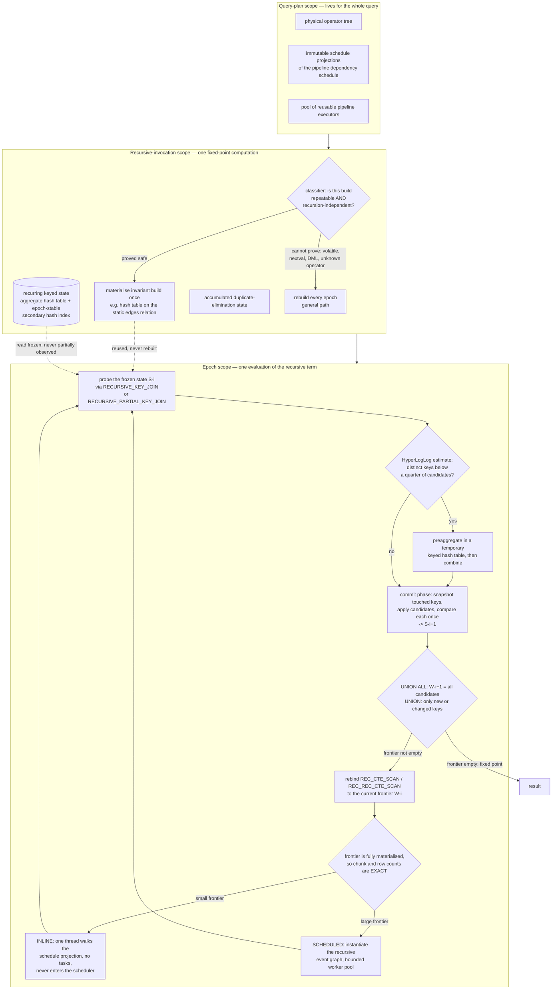

<!--
entry-meta
date: 2026-10-11
type: daily-diff
category: Daily Diff
title: Daily Diff — 2026-10-11
slug: sqlite-query-planner-whereloop-path-solver
-->

# Daily Diff — 2026-10-11

**2026-10-11 · Daily Diff Digest**

## Which Edition, and How It Was Found

**There is no 2026-10-11 edition.** The newest published edition is **2026-10-10**, and this digest covers it. The probing order this log documents was followed, and the endpoints disagreed again — worth recording, because the disagreement is now a pattern rather than an incident:

| endpoint | result |
|---|---|
| [`https://tdd.cat/`](https://tdd.cat/) (front page HTML) | masthead **"Friday, October 9, 2026"**, "30 Stories", closing line "End of Edition — Friday, October 9, 2026". Its only dated asset was `https://tdd-edge.b-cdn.net/pdf/2026-10-09.pdf`. States that editions carry a **"2-day settling window"**. |
| [`https://tdd.cat/md`](https://tdd.cat/md) (documented "latest edition") | edition **2026-10-10**, **26 items**. One day newer than the front page. |
| [`https://tdd.cat/archive/`](https://tdd.cat/archive/) | 78 editions; newest listed **Sat, Oct 10, 2026**. Corroborates `/md`. |
| `https://tdd.cat/2026-10-11.md` | client error — no edition for today. |
| `https://tdd.cat/2026-10-11/`, `https://tdd.cat/2026-10-10/`, `https://tdd.cat/2026-10-10` | all client errors. The trailing-slash HTML edition pages the archive links to could not be fetched at all in this run. |
| [`https://tdd.cat/llms.txt`](https://tdd.cat/llms.txt) | re-read to confirm the endpoint list: `/llms-full.txt`, `/md`, `/json`, `/{YYYY-MM-DD}.md`, `/rss.xml`, `/archive/`, `/stats/`. |

So the HTML front page was **a full day stale** while `/md` and `/archive/` agreed with each other. The 2026-10-09 edition was already covered by [lesson 25's digest](../2026-10-10-sqlite-insert-update-delete-codegen/daily-diff.md), so **2026-10-10 is the newest edition not yet covered** and is the right one for today. Taking the front page at face value would have produced a duplicate of yesterday's digest.

Note also that the two feeds do not merely differ in date: the 2026-10-09 edition carried **30** stories and the 2026-10-10 edition carries **26**. Item counts are per-edition, not fixed.

## The 2026-10-10 Edition, Point-Wise

Twenty-six items, grouped by subject rather than running order.

**Query engines and storage** — the cluster that matters for this track, and an unusually strong one.

- **Async IO significantly accelerates DuckDB 2.0 queries over S3** — asynchronous I/O for remote object storage, the headline change in the 2.0 line. [source](https://motherduck.com/blog/why-duckdb-20-is-faster/)
- **DuckDB speeds up recursive CTEs by retaining runtime state** — today's deep dive. [source](https://duckdb.org/2026/08/25/how-duckdb-runs-recursive-ctes-faster)
- **DuckDB CLI agent mode reduces token consumption for AI agents** — a CLI mode shaped for programmatic callers rather than humans. [source](https://duckdb.org/2026/10/09/agent-mode)
- **SQLite vector extension enables approximate nearest neighbor search** — `vec1`, documented on **sqlite.org's own Fossil tree**, which makes it an SQLite-project artifact rather than a third-party extension. Directly relevant to this track and a candidate for a future entry. [source](https://sqlite.org/vec1/doc/trunk/doc/vec1.md)
- **Enabling concurrent writers in SQLite without code modifications** — the `sqlite-multiwriter` VFS write-up, appearing for the second consecutive edition (it was item 8 of 2026-10-09). A VFS that replaces SQLite's concurrency control with optimistic page-level validation, per-writer WALs and a sidecar commit log. [source](https://marcobambini.substack.com/p/we-solved-sqlites-single-writer-limitation)
- **Versioned filesystems provide transactional state for disposable sandboxes** — copy-on-write snapshots as the unit of sandbox state. [source](https://www.shayon.dev/post/2026/283/versioned-filesystem-for-disposable-sandboxes/)

**Systems, compilers and networking**

- **Silent connection drops happen because AWS never sent FIN** — the most practically useful item in the edition: a class of hang that looks like an application bug and is a missing TCP teardown. [source](https://yeet.cx/blog/youre-not-crazy-they-never-sent-fin)
- **Compiling ARM64 Linux ELF libraries directly into native macOS dylibs** — `machso`, an object-format translator rather than an emulator. [source](https://github.com/kevmo314/machso)
- **Safe Rust enables fast standalone client-side semantic search** — Dropbox's `witchcraft`. [source](https://github.com/dropbox/witchcraft)
- **Tracking Kubernetes accelerator usage per pod with eBPF** — `kubenpu`, per-pod NPU/accelerator accounting. [source](https://github.com/jrzayev/kubenpu)
- **Hierarchical fair-share scheduling balances high-impact workloads and cluster occupancy** — AI2 on scheduling for research clusters, where the objective is not throughput. [source](https://allenai.org/blog/impactful-scheduling)

**Agent engineering and the MCP ecosystem** — six items, and three of them are about the same gap between a specification and its implementations.

- **Claude Code and Codex fail on completely different protocol features** [source](https://m3.sineframe.com/blog/claude-code-vs-codex-mcp) · **MCP hosts enforce conflicting rules beyond the base specification** [source](https://pournasserian.com/writing/what-ai-hosts-require-of-an-mcp-server) · **AI agents obey hidden tool descriptions to withhold information** [source](https://smallprint.dev/blog/one-sentence-four-of-eight-agents) — the third is a security result, not a compatibility one: a single sentence in a tool description changed the behaviour of four of eight agents tested.
- **How to orchestrate autonomous AI agents to decompile software** [source](https://momo5502.com/posts/2026-10-09-game-decompilation/) · **Orchestrating end to end security engagements with autonomous agents** (Vigil) [source](https://github.com/VigilOSS/Vigil) · **Orchestrating parallel agents using subagents and dynamic workflows** [source](https://platform.claude.com/docs/en/managed-agents/multiagent-orchestration) · **LangGraph unifies diverse agents on a single pregel engine** — notable for the claim that the underlying execution model is Pregel, i.e. bulk-synchronous graph iteration. [source](https://www.tamirdresher.com/blog/2026/10/10/what-langgraph-actually-builds)
- **Six controls limit blast radius across three agent attack surfaces** [source](https://blog.gitguardian.com/ai-agent-security-six-controls/)

**Model architecture, serving and quantization**

- **Input compression increases language model costs while reducing accuracy** — a negative result, and the kind that rarely gets published. [source](https://arxiv.org/abs/2606.24083)
- **NVFP4 outperforms MXFP4 in low-batch LLM decode benchmarks** [source](https://cezarcocu.com/blog/nvfp4-vs-mxfp4-decode-bench/) · **VibeSys autonomously optimizes large model serving to outperform SGLang** [source](https://syfi.cs.washington.edu/blog/2026-10-08-qwen35-mi300a/) · **Designing autoregressive model architecture trade-offs from first principles** (Kolibri) [source](https://aleph-alpha.com/en/blog/designing-kolibri-architecture-trade-offs-from-first-principles/) · **Training low-VRAM LoRA adapters using GGUF base models** [source](https://github.com/woct0rdho/transformers5-qwen3.5-recipe)
- **Precomputed slot representations eliminate expensive cross-encoder reranking passes** [source](https://breadbowl.ai/blog/breadbowl-embed/)
- **Models cite legal authorities without actually depending on them** — citations as decoration rather than reasoning, measured. [source](https://arxiv.org/abs/2610.12361)

---

## Deep Dive: DuckDB Hoists Loop-Invariant Work Out of a Recursive CTE

Chosen over the SQLite `vec1` item deliberately. `vec1` is newer news and closer to this track's subject, but this post is about the thing [today's lesson](README.md) is about: a query engine deciding *where work belongs*, and the plan structure that decision produces. It is the clearest worked example of planner-driven optimisation published this edition, and it reports a 42.6× result and a regression in the same breath.

(Its URL is dated 2026/08/25 while the edition is 2026-10-10 — the edition is surfacing it, not announcing it. The post itself describes a **v2.0 preview**.)

### What was wrong

The old operator had the semantics right and the state scoping wrong. The post's own words:

> treated every iteration almost like a new query

> repeatedly paid for pipeline scheduling, operator setup, execution and teardown

> every epoch recreated events and executors, reconstructed operator state and repeated scheduling work

For the canonical reachability query — `reachable` joined against a static `edges` relation, iterated to a fixed point — DuckDB 1.5.5 built a **hash table from the `reachable` frontier on every epoch** and streamed `edges` through as the probe side. `edges` never changes. Scanning it once per epoch for 19,718 epochs is how `operator_rows_scanned` on that relation reached **19,718,328,320** rows on a 1,000,000-edge graph.

### The fix is loop-invariant code motion, applied to an operator tree

The post names the principle directly: "the invariant build belongs outside the epoch loop." Concretely, the planner puts the recursion-independent `edges` relation on the **build** side where it can prove that is valid; epoch 1 builds the hash table; every later epoch rebinds `reachable` as the **probe** input and reuses the table it already has.

The structural work is a three-level state taxonomy, and this is the part worth stealing:

| scope | lifetime | what lives there |
|---|---|---|
| **Query plan** | the whole query | the physical operator tree, immutable "schedule projections" of the pipeline dependency schedule, and a pool of reusable pipeline executors |
| **Recursive invocation** | one complete fixed-point computation | executor checkouts, chunk and collection capacity (reset and reused rather than freed), accumulated duplicate-elimination and keyed state (retained), and any build the classifier proves is repeatable and recursion-independent (materialised once, retained) |
| **Epoch** | one evaluation of the recursive term | only frontier-dependent state: recursive scans rebound to the current recurring state, volatile or unprovable builds rebuilt, candidate output cleared or combined |

Named operators and structures: `REC_CTE_SCAN` (the frontier scan), `REC_REC_CTE_SCAN` (a direct scan of the recurring keyed state), `RECURSIVE_KEY_JOIN`, `RECURSIVE_PARTIAL_KEY_JOIN`, an aggregate hash table holding keyed state, an epoch-stable secondary hash index, a HyperLogLog sketch for candidate-key cardinality, and an event graph for scheduled execution.

### Two things here are more interesting than the hoisting

**Per-epoch adaptive execution.** Because the next frontier is *fully materialised* at every epoch boundary, its exact row and chunk counts are known before the epoch runs — so the engine re-chooses its execution strategy each time around the loop:

- **Inline** — one thread walks the immutable schedule projection and drives operators directly, creating no tasks and never entering the general scheduler.
- **Scheduled** — instantiate the recursive event graph and distribute work across a bounded worker pool.

The policy weighs frontier chunk count, number of recursive references, independent source tasks, configured thread count and which pipelines would actually run. This is adaptive execution with *perfect* cardinality information, which is the thing a cost-based planner almost never has. A recursive CTE is one of the rare places where a materialisation barrier hands you the exact row count for free, and DuckDB is spending it on a scheduling decision rather than throwing it away.

**Frozen keyed state, and a semantics nobody else implements.** Under `USING KEY`, declared key columns identify a row and payloads are maintained by aggregates (`last` by default). Each epoch has three ordered phases — read the frozen state `Sᵢ`, buffer candidates, commit them to get `Sᵢ₊₁` — so probes read a frozen aggregate hash table and never observe a partial update. The old design's failure mode is stated plainly: a state "touching a few keys could still copy or scan a state containing millions of keys."

The next-frontier definitions are given formally:

```
USING KEY ... UNION ALL :  W(i+1) = C(i)                                  -- the raw candidate bag
USING KEY ... UNION     :  W(i+1) = { S(i+1)[k] | k not in keys(S(i))
                                       OR S(i+1)[k] IS DISTINCT FROM S(i)[k] }
```

Both produce the same keyed state; they differ in what reaches the next iteration. The worked example: state `{A:8, B:7}` with candidates `[A:9, A:5, B:7]` commits to `{A:5, B:7}`; `UNION ALL` forwards all three candidates, `UNION` forwards only `A:5`. So `UNION` propagates **new keys and keys whose finalised payload changed**, and nothing else — which is exactly the semi-naive evaluation a Datalog engine would want and which SQL engines generally do not give you. The commit layer earns it by recording prior key existence, snapshotting the pre-epoch payload the first time a key is touched, applying all candidates, then comparing each touched key **once**. The post claims this is, "to our knowledge", the first and only database system to make that distinction.

### The numbers, including the one that got worse

| benchmark | v1.5.5 | v2.0 preview | change |
|---|---|---|---|
| Reachability — 1M edges, 100K nodes, 20K reached | 4.051 s | 0.095 s | **42.6×**; `edges` rows scanned 19,718,328,320 → 1,000,000 |
| Sparse keyed updates — 1M keys, 1,000 active, 20 epochs | 0.401 s | 0.040 s | ~20M recurring-state rows scanned → 20,000 direct probes, **1,000×** fewer |
| LDBC SF100 pathfinding — 21M candidates, 3.7M results | 19.319 s · 3.918 GB peak RSS | 2.948 s · 2.663 GB | **6.55×** and 32% less memory |
| Regression suite, 63 recursive benchmarks | — | — | geometric mean **+5.5%**, 60 of 63 within ±2% |
| Wide workload, 102,400 unique existing-key updates | — | — | **−6% (0.913 ms slower)** |

That last row is the most credible thing in the post. The regression has a stated cause: under `USING KEY ... UNION` the executor must now **prove a value unchanged** before it can drop a key from the next frontier, and when nearly every key genuinely changed, that proof is pure overhead. A 42.6× headline with a named 6% loss and a mechanism for it reads very differently from a 42.6× headline alone.

### Where it does not apply

The limitations are the part a reader should take away, because they define the shape of the optimisation:

- **Repeatability must be provable.** Unseeded samples, volatile expressions like `nextval()`, DML, side-effecting operators and unknown extension operators are rebuilt every epoch. The classifier "rejects retention when it cannot prove safety" — conservative by construction, which means the 42.6× is contingent on the planner recognising your query, not on the feature existing.
- **Streaming producers are not retained**, because a retained pipeline must not hold back partial output — so a downstream `LIMIT` can still stop recursion early.
- **Direct-probe eligibility is narrow.** `RECURSIVE_KEY_JOIN` is selected only for an inner join against a direct recurring-state scan where every declared key is compared with a direct, exactly-typed scalar `=` or `IS NOT DISTINCT FROM`. Residual predicates, wrapped scans, mismatched types, nested keys and non-inner joins all fall back to the general path. And "an ordinary recursive reference denotes the frontier, not the keyed state" — which is a semantic trap worth remembering.
- **Preaggregation is gated twice.** The default `last` aggregate and extension aggregates with no combine callback stay on the direct path; epochs under one vector skip classification entirely; and preaggregation runs only when the estimated distinct-key count is below a quarter of candidates — which is what the HyperLogLog sketch is for.
- **Aggregate-specific shortcuts for `min`/`max` were explicitly rejected** to keep aggregate semantics out of the recursive executor. A deliberate refusal to buy performance with a layering violation, and worth noting as a design decision rather than an omission.

### Why this belongs next to today's lesson

Today's lesson is about a cost model deciding which side of a join to drive from, and a solver searching orderings. This post is the same decision made under a constraint SQLite's planner never faces: the join is inside a loop, so getting the build side wrong costs you once per iteration rather than once per query. DuckDB's answer — hoist the invariant build to an outer scope, then re-decide the *execution strategy* every epoch using exact cardinalities a materialisation barrier handed you for free — is what a planner can do when it stops treating the plan as a single static artifact.

The contrast with SQLite is instructive and goes both ways. SQLite's `whereLoopAddBtree` prices a full table scan at `3.0×N` precisely because it does *not* trust its own row estimates, and `wherePathSolver` commits to one ordering before a single row is read. DuckDB, at an epoch boundary, knows the frontier size exactly. SQLite's conservatism is correct for a planner working from a one-number-per-column statistic; DuckDB's adaptivity is available because its loop structure manufactures ground truth. Neither approach transfers.



## Sources

- [`https://tdd.cat/md`](https://tdd.cat/md) — fetched 2026-10-11. The **2026-10-10 edition**, 26 items; every title and source URL listed above came from it.
- [`https://tdd.cat/archive/`](https://tdd.cat/archive/) — 78 editions, newest listed Sat, Oct 10, 2026. Corroborated `/md`'s date.
- [`https://tdd.cat/`](https://tdd.cat/) — front page, fetched 2026-10-11. Carried the **2026-10-09** edition (30 stories, "End of Edition — Friday, October 9, 2026", PDF at `https://tdd-edge.b-cdn.net/pdf/2026-10-09.pdf`) and the "2-day settling window" note. Recorded as a stale endpoint, not used for content.
- [`https://tdd.cat/llms.txt`](https://tdd.cat/llms.txt) — re-read for the endpoint list: `/llms-full.txt`, `/md`, `/json`, `/{YYYY-MM-DD}.md`, `/rss.xml`, `/archive/`, `/stats/`.
- `https://tdd.cat/2026-10-11.md` and the trailing-slash edition pages `https://tdd.cat/2026-10-11/`, `https://tdd.cat/2026-10-10/` — all returned client errors in this run. The first confirms no edition for today.
- [How DuckDB Runs Recursive CTEs Faster](https://duckdb.org/2026/08/25/how-duckdb-runs-recursive-ctes-faster) — the deep-dive source, fetched and read. Origin of: the three quoted descriptions of the old runtime; the three-scope state taxonomy; the operator names `REC_CTE_SCAN`, `REC_REC_CTE_SCAN`, `RECURSIVE_KEY_JOIN`, `RECURSIVE_PARTIAL_KEY_JOIN`; the aggregate hash table, epoch-stable secondary hash index, HyperLogLog sketch and event graph; the inline-versus-scheduled policy and its inputs; the three-phase frozen-state commit; both `W(i+1)` definitions and the `{A:8,B:7}` worked example; the "to our knowledge" novelty claim; every benchmark figure including the 19,718,328,320-row scan count, the 42.6× / 1,000× / 6.55× results, the 63-benchmark +5.5% geometric mean, and the −6% / 0.913 ms regression with its stated cause; and the full limitations list including the rejected `min`/`max` shortcut.
- [`sqlite.org/vec1`](https://sqlite.org/vec1/doc/trunk/doc/vec1.md) — item 2 of the edition, linked not fetched. Flagged for a future entry: it is hosted on sqlite.org's own Fossil tree, which makes it a first-party SQLite artifact.
- [We solved SQLite's single-writer limitation](https://marcobambini.substack.com/p/we-solved-sqlites-single-writer-limitation) — item 3, carried over from the 2026-10-09 edition. Linked, not fetched; the companion repository is `sqliteai/sqlite-multiwriter`.
- [Lesson 25's digest](../2026-10-10-sqlite-insert-update-delete-codegen/daily-diff.md) — consulted to establish that the 2026-10-09 edition was already covered, which is why this digest takes 2026-10-10.
